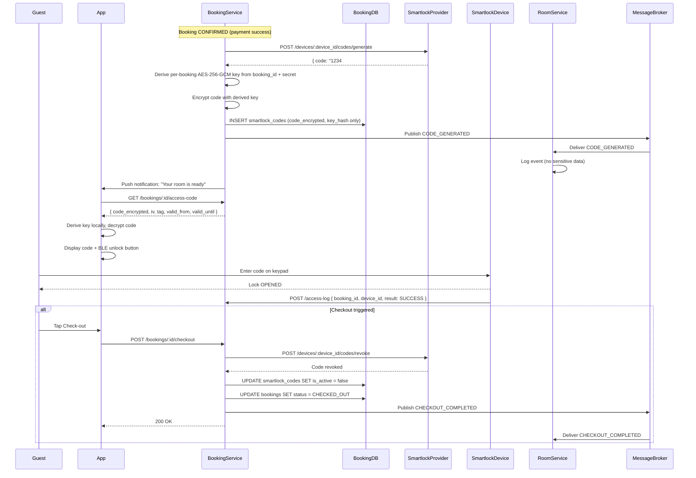
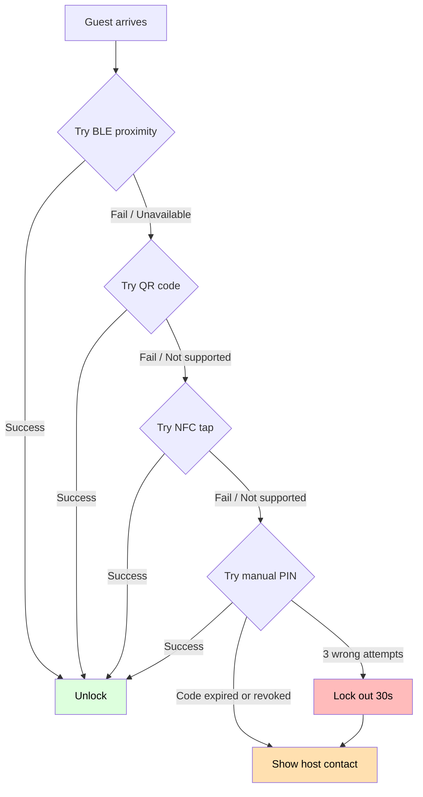
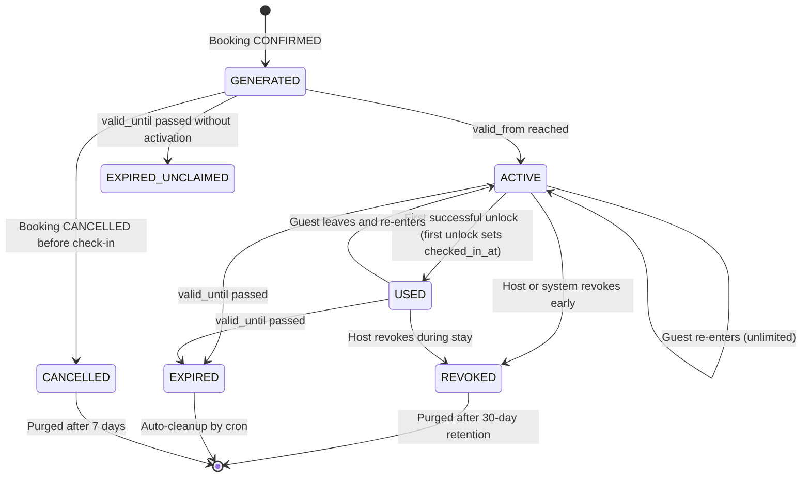

# Auto Check-in Flow for Homestays with Smart Locks

## 1. Overview

**Objective:** Increase renter flexibility and owner convenience by eliminating physical key handovers through automated, secure, time-bound access code delivery.

**Scope:** End-to-end flow from booking confirmation through check-out, covering code generation, encryption, delivery, access, revocation, and audit — all without disclosing lock device information to guests.

**Design principles:**
- `code_plaintext` is never stored in any database
- Decryption key never leaves the guest's device
- Access codes are time-bound and automatically expire
- Lock device IDs are never exposed in client-facing APIs
- All access events are logged for dispute resolution

---

## 2. End-to-End Flow

### 2.1 Flow Diagram



### 2.2 Stage-by-Stage Breakdown

#### Stage 1: Code Generation (on BOOKING_CONFIRMED)

**Trigger:** `BOOKING_CONFIRMED` event arrives from payment webhook.

**Flow:**
1. Booking Service calls Smartlock Provider API: `POST /devices/{device_id}/codes/generate`
   - Payload: `{ booking_id, guest_id, valid_from, valid_until, device_id }`
   - Provider returns a time-limited access code (e.g., `"1847#5923"`)
2. Booking Service derives a per-booking encryption key:
   ```
   derived_key = HMAC-SHA256(booking_id, MASTER_ENCRYPTION_KEY)
   ```
   - `MASTER_ENCRYPTION_KEY` is stored in HashiCorp Vault / AWS KMS
   - Each booking gets a unique derived key — compromise of one key does not expose others
3. Booking Service encrypts the code with **AES-256-GCM**:
   - `iv` = 12 random bytes
   - `tag` = authentication tag (16 bytes)
   - `code_encrypted` = AES-256-GCM(derived_key, iv, code_plaintext)
4. Booking Service stores in `smartlock_codes`:
   - `code_encrypted` (ciphertext)
   - `iv` and `tag` (needed for decryption)
   - `key_hash` = SHA-256(derived_key) — for key rotation lookups, NOT decryption
   - `valid_from` = check-in time
   - `valid_until` = checkout time + buffer_minutes
   - `is_active` = true
5. Booking Service publishes `CODE_GENERATED` event to broker

**What is NOT stored:**
- `code_plaintext` — never leaves the Smartlock Provider's response, exists only in memory during encryption
- `derived_key` — derived at runtime, never persisted
- `MASTER_ENCRYPTION_KEY` — stored only in KMS/Vault

#### Stage 2: Code Delivery

**Trigger:** Guest opens the app after booking is confirmed.

**Flow:**
1. App polls or receives push notification: "Your room is ready — Tap to get access code"
2. App calls: `GET /bookings/:id/access-code`
3. Booking Service validates:
   - Booking is CONFIRMED
   - `valid_from <= now <= valid_until`
   - `is_active = true`
   - Caller's `guest_id` matches booking's `guest_id`
4. Booking Service returns:
   ```json
   {
     "code_encrypted": "a3f8b2c1...",
     "iv": "1a2b3c4d5e6f...",
     "tag": "7e8f9a0b1c2d...",
     "valid_from": "2026-05-20T14:00:00Z",
     "valid_until": "2026-05-21T12:30:00Z",
     "access_method": "BLE_AND_CODE",
     "property_name": "Homi Landmark 81",
     "room_number": "101"
   }
   ```
5. App derives the key locally: `derived_key = HMAC-SHA256(booking_id, MASTER_ENCRYPTION_KEY)`
   - `MASTER_ENCRYPTION_KEY` is provisioned to the app via a secure channel at install/login
   - Key derivation happens entirely on-device
6. App decrypts: `code_plaintext = AES-256-GCM-Decrypt(derived_key, iv, tag, code_encrypted)`
7. App displays: access code + BLE auto-unlock button + QR code

#### Stage 3: Guest Access

**Entry methods (in priority order):**

| Priority | Method | How it works |
|----------|--------|-------------|
| 1 | BLE proximity unlock | App sends BLE signal when guest is within ~5m of smartlock. Device auto-unlocks. |
| 2 | Manual PIN entry | Guest taps keypad on smartlock device. |
| 3 | QR code | Guest scans QR code displayed on app screen. |
| 4 | NFC tap | Guest taps phone on smartlock NFC tag. |
| 5 | Host fallback | App shows host contact if all above fail. |

**Each unlock attempt is logged:**
- `booking_id`, `device_id`, `guest_id`
- `unlock_method` (BLE / PIN / QR / NFC)
- `timestamp`
- `result` (SUCCESS / FAIL)
- `failure_reason` (if applicable)

#### Stage 4: Checkout and Revocation

**Trigger:** Guest taps "Check-out" in app, OR `valid_until` is reached.

**Automatic revocation (time-based):**
- Cron job runs every 5 minutes scanning `smartlock_codes` where `valid_until < now()` and `is_active = true`
- For each expired code:
  1. Call Smartlock Provider: `POST /devices/{device_id}/codes/revoke`
  2. Update DB: `is_active = false`
  3. Publish `CODE_EXPIRED` event

**Manual revocation (guest-initiated):**
1. Guest taps "Check-out" in app
2. Booking Service calls Smartlock Provider: `POST /devices/:device_id/codes/revoke`
3. Booking Service updates DB: `is_active = false`
4. Booking Service publishes `CHECKOUT_COMPLETED`
5. Room Service receives event and transitions slot to CLEANING

---

## 3. Database Schema — Booking Service

### 3.1 `smartlock_codes` Table

| Column | Type | Constraint | Description |
|--------|------|-----------|-------------|
| **id** | UUID | PK | |
| **booking_id** | UUID | FK, UNIQUE | One code per booking |
| **device_id** | VARCHAR(100) | NOT NULL | Smartlock device ID (opaque, from Room Service) |
| **code_encrypted** | TEXT | NOT NULL | AES-256-GCM ciphertext |
| **iv** | VARCHAR(24) | NOT NULL | 12-byte IV, hex-encoded |
| **tag** | VARCHAR(32) | NOT NULL | GCM auth tag, hex-encoded |
| **key_hash** | VARCHAR(64) | NOT NULL | SHA-256(derived_key) for rotation lookup |
| **code_expires_at** | TIMESTAMPTZ | NOT NULL | Hard expiry: checkout_time + buffer_minutes |
| **valid_from** | TIMESTAMPTZ | NOT NULL | Earliest time code can be used |
| **valid_until** | TIMESTAMPTZ | NOT NULL | Latest time code can be used |
| **is_active** | BOOLEAN | NOT NULL, DEFAULT true | False after revocation or expiry |
| **checked_in_at** | TIMESTAMPTZ | NULLABLE | First successful unlock |
| **checked_out_at** | TIMESTAMPTZ | NULLABLE | Check-out timestamp |
| **revoked_at** | TIMESTAMPTZ | NULLABLE | When code was manually revoked |
| **revoked_by** | UUID | NULLABLE | User or system that revoked |
| **created_at** | TIMESTAMPTZ | DEFAULT now() | |

**Indexes:**
- `idx_smartlock_codes_booking_id` ON (booking_id)
- `idx_smartlock_codes_device_expiry` ON (device_id, code_expires_at) WHERE is_active = true

### 3.2 `smartlock_access_logs` Table

| Column | Type | Constraint | Description |
|--------|------|-----------|-------------|
| **id** | UUID | PK | |
| **booking_id** | UUID | FK, NULLABLE | May be null if booking not yet confirmed |
| **device_id** | VARCHAR(100) | NOT NULL | |
| **guest_id** | UUID | NOT NULL | |
| **event_type** | ENUM | NOT NULL | UNLOCK, LOCK, FAILED_ATTEMPT, MANUAL_OVERRIDE |
| **unlock_method** | VARCHAR(20) | NULLABLE | BLE, PIN, QR, NFC |
| **result** | ENUM | NOT NULL | SUCCESS, FAIL, BLOCKED |
| **failure_reason** | VARCHAR(100) | NULLABLE | WRONG_CODE, DEVICE_OFFLINE, CODE_EXPIRED |
| **occurred_at** | TIMESTAMPTZ | NOT NULL | |
| **metadata** | JSONB | NULLABLE | `{ "battery_level": 72, "signal_dbm": -45 }` |

**Indexes:**
- `idx_access_logs_device_time` ON (device_id, occurred_at DESC)
- `idx_access_logs_booking` ON (booking_id, occurred_at DESC)
- `idx_access_logs_alert` ON (device_id, result, occurred_at DESC) WHERE result = 'FAIL'

### 3.3 `smartlock_providers` Table (Multi-Provider Support)

| Column | Type | Constraint | Description |
|--------|------|-----------|-------------|
| **id** | UUID | PK | |
| **name** | VARCHAR(50) | NOT NULL | August, Yale, Nuki, TTLock, SALTO... |
| **api_base_url** | VARCHAR(255) | NOT NULL | |
| **api_key_encrypted** | TEXT | NOT NULL | Encrypted API key |
| **is_active** | BOOLEAN | DEFAULT true | |
| **supports_ble** | BOOLEAN | DEFAULT false | |
| **supports_qr** | BOOLEAN | DEFAULT false | |
| **supports_nfc** | BOOLEAN | DEFAULT false | |
| **max_code_ttl_minutes** | SMALLINT | NOT NULL | Provider's max validity |
| **created_at** | TIMESTAMPTZ | DEFAULT now() | |

### 3.4 `smartlock_devices` Table (Local Registry)

| Column | Type | Constraint | Description |
|--------|------|-----------|-------------|
| **id** | UUID | PK | Internal ID |
| **provider_device_id** | VARCHAR(100) | NOT NULL | ID as known by provider |
| **provider_id** | UUID | FK → smartlock_providers | |
| **property_id** | UUID | NOT NULL | FK → properties |
| **room_id** | UUID | FK → rooms | |
| **is_online** | BOOLEAN | DEFAULT true | |
| **last_seen_at** | TIMESTAMPTZ | NULLABLE | |
| **firmware_version** | VARCHAR(50) | NULLABLE | |
| **created_at** | TIMESTAMPTZ | DEFAULT now() | |

---

## 4. Security Architecture

### 4.1 Encryption Key Hierarchy

```mermaid
flowchart TD
    K1[MASTER_ENCRYPTION_KEY<br/>Stored in AWS KMS / HashiCorp Vault] --> K2[Booking-level derived key<br/>HMAC-SHA256(booking_id, MASTER)]
    K2 --> K3[Code-specific session key<br/>AES-256-GCM per-access]

    subgraph BookingServiceDB[Booking Service DB]
        E1[code_encrypted — stored]
        E2[iv — stored]
        E3[tag — stored]
        E4[key_hash — stored]
    end

    subgraph SmartlockProvider[Smartlock Provider]
        P1[device_id — opaque]
        P2[plaintext code — transient<br/>only in memory during generation]
    end

    subgraph GuestApp[Guest App]
        A1[booking_id — known]
        A2[MASTER key provisioned<br/>via secure channel at login]
    end

    E1 & E2 & E3 & E4 --> K2
    K2 --> E1
    P2 --> K2
    A1 & A2 --> K2

    style K1 fill:#fbb,color:#000
    style P2 fill:#ffe0b0,color:#000
```

### 4.2 No Lock Disclosure Rule

```mermaid
flowchart LR
    subgraph ClientAPI["Client-facing API (Booking Service)"]
        API1[GET /bookings/:id/access-code<br/>Returns: code_encrypted, iv, tag, valid_from, valid_until]
        API2[GET /rooms/:id<br/>Returns: room_number, property_address, check-in instructions]
    end

    subgraph InternalAPI["Internal API (Room Service)"]
        API3[GET /rooms/:id/smartlock<br/>Returns: device_id, provider, encryption_config<br/>Requires: service-to-service auth]
    end

    API3 --> API2
    API1 --> API2

    style API1 fill:#dfd,color:#000
    style API3 fill:#ffe0b0,color:#000

    Note: Guest app NEVER receives device_id, provider name, MAC address,<br/>BLE UUID, or any hardware-level lock identifiers
```

**Rules enforced:**
1. `smartlock_codes` API responses must NEVER include `device_id` or `provider_id`
2. Guest-facing endpoints (`/bookings/:id/access-code`) return only access payload
3. `smartlock_devices.provider_device_id` is stored encrypted at rest
4. BLE UUIDs / MAC addresses are considered PII — logged separately with access log retention policy

### 4.3 Time-Bound Code Enforcement

```mermaid
flowchart TD
    A[Guest arrives at property] --> B{now within [valid_from, valid_until]?}
    B -->|No before valid_from| C[Display: "Check-in opens at HH:MM"]
    B -->|Yes within window| D[Allow decryption + display]
    B -->|No after valid_until| E[Display: "Code expired — Contact host"]
    E --> E2[Auto-revoke via cron: is_active = false]
    E2 --> E3[Call Smartlock Provider revoke API]

    D --> F{is_active = true?}
    F -->|Yes| G[Allow access]
    F -->|No| H[Display: "Access revoked — Contact host"]

    G --> I[Smartlock logs UNLOCK event]
    H --> J[Smartlock logs FAIL event]
    I --> K[Audit trail complete]

    style C fill:#ffe0b0,color:#000
    style E fill:#fbb,color:#000
    style G fill:#dfd,color:#000
    style H fill:#fbb,color:#000
```

---

## 5. Smartlock Provider Integration — Adapter Pattern

### 5.1 Adapter Interface

```typescript
interface SmartlockProviderAdapter {
  generateCode(
    deviceId: string,
    options: { validFrom: Date; validUntil: Date; guestId: string }
  ): Promise<{ code: string; providerCodeId: string }>;

  revokeCode(deviceId: string, providerCodeId: string): Promise<void>;

  getDeviceStatus(deviceId: string): Promise<{ isOnline: boolean; batteryLevel: number }>;

  sendBleUnlock(deviceId: string, guestId: string): Promise<void>;

  getAccessLogs(
    deviceId: string,
    from: Date,
    to: Date
  ): Promise<AccessLogEntry[]>;
}
```

### 5.2 Supported Providers

| Provider | BLE | QR | NFC | Max TTL | Notes |
|----------|-----|----|----|---------|-------|
| **TTLock** | Yes | Yes | No | 24h | Most popular in Vietnam, good API |
| **SALTO KS** | Yes | Yes | Yes | Configurable | Enterprise-grade, global |
| **Nuki** | Yes | No | No | 24h | European market |
| **August** | Yes | No | No | User-defined | US market |
| **Yale Access** | Yes | Yes | Yes | User-defined | Global |
| **igloohome** | Yes | Yes | No | 24h | Asia-Pacific focus |
| **Dormakaba** | Yes | Yes | Yes | Configurable | Hotel chains |

### 5.3 Fallback Chain



---

## 6. Offline Mode

Guests may arrive in areas with no network connectivity. The system must support offline access.

### 6.1 Pre-Download Strategy

```mermaid
flowchart TD
    A[Booking CONFIRMED] --> B[App pre-downloads access payload]
    B --> C[code_encrypted + iv + tag encrypted again<br/>with device-bound key]
    C --> D[Stored in app secure enclave<br/>(iOS Keychain / Android Keystore)]
    D --> E[TTL = valid_until timestamp]
    E --> F[App shows: "Downloaded for offline use"]

    G[Guest arrives offline] --> H{Device time within [valid_from, valid_until]?}
    H -->|Yes| I[Decrypt using locally-stored key material]
    H -->|No| J[Display expiry message]
    I --> K[Display code / BLE unlock]
```

### 6.2 Offline BLE Unlock

For automated properties (`is_automated = true`), BLE unlock uses the device's BLE capability — not the cloud. The app sends the unlock command directly to the smartlock device via BLE, which validates the access code locally against its own stored whitelist.

```
App → BLE → Smartlock Device
              → Validates code against device whitelist
              → UNLOCK
              → Logs event locally for sync when online
```

---

## 7. Access Code State Machine



---

## 8. Cron Jobs

| Cron | Frequency | Action |
|------|----------|--------|
| Expire codes | Every 5 min | `is_active = false` where `valid_until < now()` |
| Revoke at checkout | On trigger | Call provider revoke API + DB update |
| Sync access logs | Every 15 min | Pull from providers that don't push webhooks |
| Audit log rotation | Daily | Move logs > 90 days to archive table |
| Cleanup expired codes | Every hour | Purge `is_active = false` records older than 30 days |

---

## 9. Audit Trail

Every access event is recorded with full context for dispute resolution:

```json
{
  "id": "uuid",
  "booking_id": "uuid",
  "device_id": "device-123",
  "guest_id": "uuid",
  "event_type": "UNLOCK",
  "unlock_method": "BLE",
  "result": "SUCCESS",
  "occurred_at": "2026-05-20T14:05:23Z",
  "metadata": {
    "battery_level": 72,
    "signal_strength_dbm": -38,
    "app_version": "2.4.1",
    "os": "Android 14"
  }
}
```

**Retention policy:**
- Hot storage (PostgreSQL): 90 days
- Archive storage: 2 years (GDPR: exportable on request, auto-purged after 2 years)
- Access logs are immutable — no UPDATE or DELETE allowed (enforced via PostgreSQL rule)

---

## 10. Integration with Existing System

### 10.1 Event Contract

| Event | Emitter | Consumers | Payload |
|-------|---------|-----------|---------|
| `CODE_GENERATED` | Booking Service | Room Service | booking_id, generated_at, valid_from, valid_until |
| `CHECKIN_COMPLETED` | Booking Service | Room Service | booking_id, slot_id, checked_in_at |
| `CHECKOUT_COMPLETED` | Booking Service | Room Service | booking_id, slot_id, checked_out_at |
| `CODE_REVOKED` | Booking Service | Room Service | booking_id, revoked_at, revoked_by |
| `CODE_EXPIRED` | Booking Service | Room Service | booking_id, expired_at |

### 10.2 API Endpoints

| Method | Endpoint | Auth | Description |
|--------|----------|------|-------------|
| GET | `/bookings/:id/access-code` | guest JWT | Get encrypted code for this booking |
| POST | `/bookings/:id/checkout` | guest JWT | Trigger checkout + code revocation |
| GET | `/bookings/:id/access-logs` | guest JWT | Guest's own access history |
| POST | `/access-log/webhook` | provider HMAC | Provider pushes unlock events |
| GET | `/admin/access-logs` | host/admin JWT | Full access log for a room |
| POST | `/admin/smartlock/codes/revoke` | host JWT | Host manually revokes a code |
| GET | `/internal/devices/:id/status` | service auth | Room Service checks device health |

### 10.3 Service-to-Service Communication


Data sharing via events:
- `BOOKING_CONFIRMED` event includes `smartlock_device_id` from Room Service's event payload
- Booking Service stores `device_id` locally (not as FK — eventual consistency)
- Access logs are shared back via `SMARTLOCK_ACCESS_LOGGED` event for Room Service audit

---

## 11. Edge Cases

### 11.1 Guest arrives before valid_from
- Display countdown timer: "Check-in opens in X hours"
- App sends reminder notification at `valid_from - 30 minutes`
- BLE unlock is also blocked — smartlock validates time window

### 11.2 Guest loses phone before check-in
- Guest contacts host via in-app chat
- Host can generate a one-time emergency code from admin panel
- Emergency code is logged with `event_type = MANUAL_OVERRIDE`
- Emergency code is separate from the primary code — both can coexist

### 11.3 Guest tries to extend stay
- If booking is extended, Booking Service calls Smartlock Provider to extend code validity
- `valid_until` is updated to new checkout time + buffer
- Guest receives push notification: "Your access has been extended"

### 11.4 Multiple guests on same booking
- One master code is generated per booking
- Code works for all guests on the same booking
- Access logs capture which device_id unlocked (guests' devices differ)

### 11.5 Smartlock offline during checkout
- If revocation API call fails, retry with exponential backoff (1s, 2s, 4s, 8s, 16s)
- After 5 failures, log to DLQ and alert host
- Physical fallback: host receives notification and can manually disable code from provider's app

---

*Generated: 2026-05-27 — Homi 1.0 Auto Check-in Flow Design*
