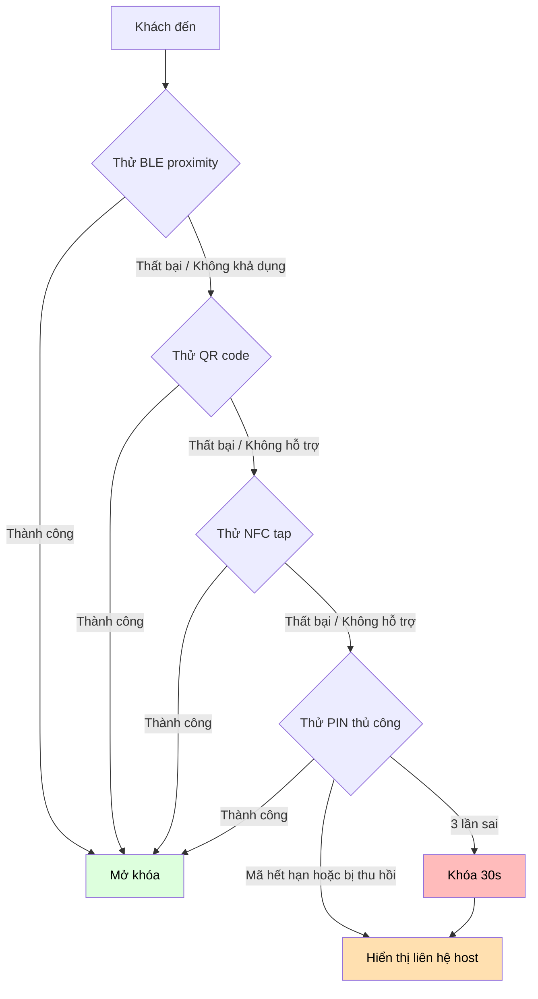
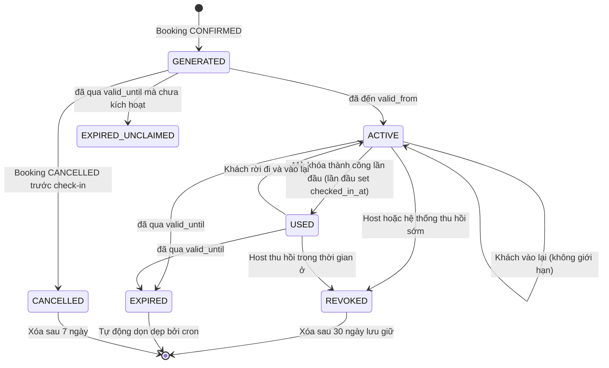
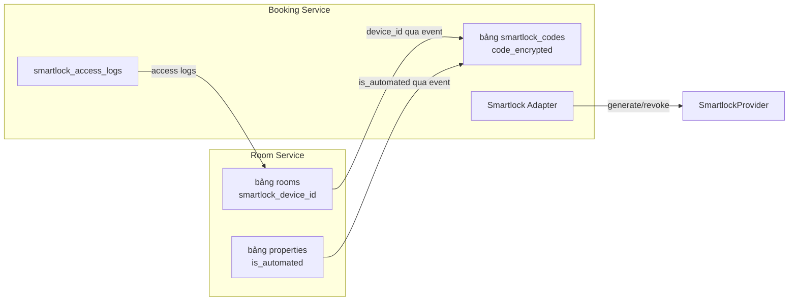

# Luồng Tự Động Check-in cho Homestay có Smart Lock

## 1. Tổng quan

**Mục tiêu:** Tăng tính linh hoạt cho người thuê và sự tiện lợi cho chủ nhà bằng cách loại bỏ việc giao nhận chìa khóa vật lý thông qua việc cung cấp mã truy cập tự động, an toàn và có giới hạn thời gian.

**Phạm vi:** Luồng end-to-end từ xác nhận đặt phòng đến check-out, bao gồm tạo mã, mã hóa, giao mã, truy cập, thu hồi và kiểm tra — tất cả đều không tiết lộ thông tin thiết bị khóa cho khách.

**Nguyên tắc thiết kế:**
- `code_plaintext` không bao giờ được lưu trong bất kỳ database nào
- Khóa giải mã không bao giờ rời khỏi thiết bị của khách
- Mã truy cập có giới hạn thời gian và tự động hết hạn
- ID thiết bị khóa không bao giờ được hiển thị trong API phía client
- Tất cả sự kiện truy cập đều được ghi log để giải quyết tranh chấp

---

## 2. Luồng End-to-End

### 2.1 Sơ đồ luồng


### 2.2 Phân tích theo từng giai đoạn

#### Giai đoạn 1: Tạo mã (khi BOOKING_CONFIRMED)

**Trigger:** Sự kiện `BOOKING_CONFIRMED` đến từ payment webhook.

**Luồng:**
1. Booking Service gọi Smartlock Provider API: `POST /devices/{device_id}/codes/generate`
   - Payload: `{ booking_id, guest_id, valid_from, valid_until, device_id }`
   - Provider trả về mã truy cập có giới hạn thời gian (ví dụ: `"1847#5923"`)
2. Booking Service tạo khóa mã hóa cho từng booking:
   ```
   derived_key = HMAC-SHA256(booking_id, MASTER_ENCRYPTION_KEY)
   ```
   - `MASTER_ENCRYPTION_KEY` được lưu trong HashiCorp Vault / AWS KMS
   - Mỗi booking có một derived key duy nhất — việc lộ một khóa không ảnh hưởng đến các khóa khác
3. Booking Service mã hóa mã bằng **AES-256-GCM**:
   - `iv` = 12 byte ngẫu nhiên
   - `tag` = authentication tag (16 byte)
   - `code_encrypted` = AES-256-GCM(derived_key, iv, code_plaintext)
4. Booking Service lưu trong `smartlock_codes`:
   - `code_encrypted` (ciphertext)
   - `iv` và `tag` (cần thiết cho việc giải mã)
   - `key_hash` = SHA-256(derived_key) — để tra cứu key rotation, KHÔNG dùng để giải mã
   - `valid_from` = thời gian check-in
   - `valid_until` = thời gian checkout + buffer_minutes
   - `is_active` = true
5. Booking Service publish sự kiện `CODE_GENERATED` đến broker

**Những gì KHÔNG được lưu:**
- `code_plaintext` — không bao giờ rời khỏi response của Smartlock Provider, chỉ tồn tại trong bộ nhớ khi mã hóa
- `derived_key` — được tạo tại runtime, không bao giờ được lưu trữ
- `MASTER_ENCRYPTION_KEY` — chỉ được lưu trong KMS/Vault

#### Giai đoạn 2: Giao mã

**Trigger:** Khách mở app sau khi booking được xác nhận.

**Luồng:**
1. App poll hoặc nhận push notification: "Phòng của bạn đã sẵn sàng — Nhấn để nhận mã truy cập"
2. App gọi: `GET /bookings/:id/access-code`
3. Booking Service kiểm tra:
   - Booking đang CONFIRMED
   - `valid_from <= now <= valid_until`
   - `is_active = true`
   - `guest_id` của người gọi khớp với `guest_id` của booking
4. Booking Service trả về:
   ```json
   {
     "code_encrypted": "a3f8b2c1...",
     "iv": "1a2b3c4d5e6f...",
     "tag": "7e8f9a0b1c2d...",
     "valid_from": "2026-05-20T14:00:00Z",
     "valid_until": "2026-05-21T12:30:00Z",
     "access_method": "BLE_AND_CODE",
     "property_name": "Homi Landmark 81",
     "room_number": "101"
   }
   ```
5. App tạo khóa cục bộ: `derived_key = HMAC-SHA256(booking_id, MASTER_ENCRYPTION_KEY)`
   - `MASTER_ENCRYPTION_KEY` được cung cấp cho app qua kênh bảo mật khi cài đặt/đăng nhập
   - Việc tạo khóa diễn ra hoàn toàn trên thiết bị
6. App giải mã: `code_plaintext = AES-256-GCM-Decrypt(derived_key, iv, tag, code_encrypted)`
7. App hiển thị: mã truy cập + nút BLE auto-unlock + QR code

#### Giai đoạn 3: Khách truy cập

**Các phương thức vào phòng (theo thứ tự ưu tiên):**

| Ưu tiên | Phương thức | Cách hoạt động |
|----------|---------|-------------|
| 1 | Mở khóa qua BLE proximity | App gửi tín hiệu BLE khi khách ở trong phạm vi ~5m của smartlock. Thiết bị tự động mở khóa. |
| 2 | Nhập PIN thủ công | Khách nhấn bàn phím trên thiết bị smartlock. |
| 3 | QR code | Khách quét QR code hiển thị trên màn hình app. |
| 4 | NFC tap | Khách chạm điện thoại vào thẻ NFC của smartlock. |
| 5 | Dự phòng qua Host | App hiển thị liên hệ Host nếu tất cả phương thức trên thất bại. |

**Mỗi lần thử mở khóa đều được ghi log:**
- `booking_id`, `device_id`, `guest_id`
- `unlock_method` (BLE / PIN / QR / NFC)
- `timestamp`
- `result` (SUCCESS / FAIL)
- `failure_reason` (nếu có)

#### Giai đoạn 4: Check-out và thu hồi mã

**Trigger:** Khách nhấn "Check-out" trong app, HOẶC đạt đến `valid_until`.

**Thu hồi tự động (theo thời gian):**
- Cron job chạy mỗi 5 phút quét `smartlock_codes` có `valid_until < now()` và `is_active = true`
- Với mỗi mã hết hạn:
  1. Gọi Smartlock Provider: `POST /devices/{device_id}/codes/revoke`
  2. Cập nhật DB: `is_active = false`
  3. Publish sự kiện `CODE_EXPIRED`

**Thu hồi thủ công (do khách khởi tạo):**
1. Khách nhấn "Check-out" trong app
2. Booking Service gọi Smartlock Provider: `POST /devices/:device_id/codes/revoke`
3. Booking Service cập nhật DB: `is_active = false`
4. Booking Service publish `CHECKOUT_COMPLETED`
5. Room Service nhận sự kiện và chuyển slot sang CLEANING

---

## 2b. Mô hình domain: `access_mode` và `self_checkin_enabled`

> Tham chiếu spec: [docs/superpowers/specs/2026-06-04-room-service-availability-access-design.md](../superpowers/specs/2026-06-04-room-service-availability-access-design.md), mục 2 và mục 5.

### 3 trục độc lập

1. `rental_type` — `DAILY` / `HOURLY` / `BOTH`
2. `access_mode` — `MANUAL_HANDOVER` / `OWNER_SHARED_CODE` / `SMARTLOCK_DEVICE`
3. `self_checkin_enabled` — `true` / `false`

3 trục này **không được gộp** vào một enum duy nhất.

### Mapping theo nhóm owner

| Nhóm owner | Access mode khả dụng |
|------------|---------------------|
| Truyền thống | `MANUAL_HANDOVER`, `OWNER_SHARED_CODE` |
| Tự động hóa | `SMARTLOCK_DEVICE` (ưu tiên), fallback `OWNER_SHARED_CODE` |

### Quy tắc domain cốt lõi

1. `self_checkin_enabled = true` không bắt buộc phải có `smartlock_device_id`.
2. `access_mode = SMARTLOCK_DEVICE` **bắt buộc** có `smartlock_device_id`.
3. `access_mode = OWNER_SHARED_CODE` thì app chỉ phân phối thông tin do owner cung cấp, không sinh mã động.
4. `rental_type` và `access_mode` là hai trục độc lập.

### Bảo mật theo `access_mode`

#### `SMARTLOCK_DEVICE`

- `code_plaintext` không được lưu trong DB.
- `MASTER_ENCRYPTION_KEY` chỉ nằm trong KMS/Vault.
- `smartlock_device_id` không lộ trong API client-facing.
- Mã có `valid_from` / `valid_until`, phải revoke được khi checkout/cancel/hết hạn.
- Mọi event mở khóa ghi log cho audit và dispute.

#### `OWNER_SHARED_CODE`

Dù không phải mã động, thông tin này vẫn là secret vận hành:

1. Không lưu plaintext ở trường mô tả công khai của room/property.
2. Lưu trong bảng `room_access_configs` (source) và `booking_access_deliveries` (delivery).
3. Mã hóa at rest bằng application-level encryption hoặc KMS-backed envelope encryption.
4. Chỉ giải mã và trả về cho đúng guest, đúng booking, đúng cửa sổ thời gian.
5. Mọi lần xem phải có audit log trong `access_delivery_audit_logs`.
6. Owner được rotate secret mà không sửa lịch sử booking cũ.

### Phân biệt source secret và delivery secret

- **Source secret**: thông tin owner cấu hình ở cấp room/property (mã lockbox mặc định, hướng dẫn lấy chìa...).
- **Delivery secret**: snapshot thực tế phát hành cho 1 booking cụ thể.

Tách hai lớp giúp:
- rotate source mà không phá audit của booking cũ.
- biết chính xác guest nào đã xem thông tin nào, lúc nào.

### Cửa sổ hiển thị

Mặc định theo `access_mode` + owner override trong khoảng `[0, 24h]`:

- Mặc định `SMARTLOCK_DEVICE` / `OWNER_SHARED_CODE`: `60 phút trước check-in`.
- Mỗi phòng có `access_visible_lead_minutes` (nullable). `null` = dùng mặc định; có giá trị = dùng giá trị đó, **luôn clamp `[0, 1440]`**.
- Backend validate, từ chối kèm `ACCESS_LEAD_MINUTES_OUT_OF_RANGE` nếu vượt khoảng.
- Công thức: `visible_from = check_in_at - lead_minutes`; `visible_until = checkout_at + buffer_minutes`.

### Bất biến bảo mật

> Self check-in không đồng nghĩa với Smartlock.

> `OWNER_SHARED_CODE` là mô hình phân phối secret có kiểm soát, không phải text note công khai của phòng.

> `SMARTLOCK_DEVICE` và `OWNER_SHARED_CODE` phải có cơ chế lưu trữ, hiển thị, audit, và rotation riêng.

---

## 3. Schema Database — Booking Service

### 3.1 Bảng `smartlock_codes`

| Column | Type | Constraint | Description |
|--------|------|-----------|-------------|
| **id** | UUID | PK | |
| **booking_id** | UUID | FK, UNIQUE | Một mã cho mỗi booking |
| **device_id** | VARCHAR(100) | NOT NULL | ID thiết bị Smartlock (opaque, từ Room Service) |
| **code_encrypted** | TEXT | NOT NULL | AES-256-GCM ciphertext |
| **iv** | VARCHAR(24) | NOT NULL | IV 12 byte, mã hóa hex |
| **tag** | VARCHAR(32) | NOT NULL | GCM auth tag, mã hóa hex |
| **key_hash** | VARCHAR(64) | NOT NULL | SHA-256(derived_key) để tra cứu rotation |
| **code_expires_at** | TIMESTAMPTZ | NOT NULL | Hết hạn cứng: checkout_time + buffer_minutes |
| **valid_from** | TIMESTAMPTZ | NOT NULL | Thời gian sớm nhất mã có thể được sử dụng |
| **valid_until** | TIMESTAMPTZ | NOT NULL | Thời gian muộn nhất mã có thể được sử dụng |
| **is_active** | BOOLEAN | NOT NULL, DEFAULT true | False sau khi thu hồi hoặc hết hạn |
| **checked_in_at** | TIMESTAMPTZ | NULLABLE | Lần mở khóa thành công đầu tiên |
| **checked_out_at** | TIMESTAMPTZ | NULLABLE | Thời gian check-out |
| **revoked_at** | TIMESTAMPTZ | NULLABLE | Khi mã bị thu hồi thủ công |
| **revoked_by** | UUID | NULLABLE | User hoặc hệ thống đã thu hồi |
| **created_at** | TIMESTAMPTZ | DEFAULT now() | |

**Indexes:**
- `idx_smartlock_codes_booking_id` ON (booking_id)
- `idx_smartlock_codes_device_expiry` ON (device_id, code_expires_at) WHERE is_active = true

### 3.2 Bảng `smartlock_access_logs`

| Column | Type | Constraint | Description |
|--------|------|-----------|-------------|
| **id** | UUID | PK | |
| **booking_id** | UUID | FK, NULLABLE | Có thể null nếu booking chưa được xác nhận |
| **device_id** | VARCHAR(100) | NOT NULL | |
| **guest_id** | UUID | NOT NULL | |
| **event_type** | ENUM | NOT NULL | UNLOCK, LOCK, FAILED_ATTEMPT, MANUAL_OVERRIDE |
| **unlock_method** | VARCHAR(20) | NULLABLE | BLE, PIN, QR, NFC |
| **result** | ENUM | NOT NULL | SUCCESS, FAIL, BLOCKED |
| **failure_reason** | VARCHAR(100) | NULLABLE | WRONG_CODE, DEVICE_OFFLINE, CODE_EXPIRED |
| **occurred_at** | TIMESTAMPTZ | NOT NULL | |
| **metadata** | JSONB | NULLABLE | `{ "battery_level": 72, "signal_dbm": -45 }` |

**Indexes:**
- `idx_access_logs_device_time` ON (device_id, occurred_at DESC)
- `idx_access_logs_booking` ON (booking_id, occurred_at DESC)
- `idx_access_logs_alert` ON (device_id, result, occurred_at DESC) WHERE result = 'FAIL'

### 3.3 Bảng `smartlock_providers` (Hỗ trợ đa Provider)

| Column | Type | Constraint | Description |
|--------|------|-----------|-------------|
| **id** | UUID | PK | |
| **name** | VARCHAR(50) | NOT NULL | August, Yale, Nuki, TTLock, SALTO... |
| **api_base_url** | VARCHAR(255) | NOT NULL | |
| **api_key_encrypted** | TEXT | NOT NULL | API key đã được mã hóa |
| **is_active** | BOOLEAN | DEFAULT true | |
| **supports_ble** | BOOLEAN | DEFAULT false | |
| **supports_qr** | BOOLEAN | DEFAULT false | |
| **supports_nfc** | BOOLEAN | DEFAULT false | |
| **max_code_ttl_minutes** | SMALLINT | NOT NULL | Thời gian hiệu lực tối đa của provider |
| **created_at** | TIMESTAMPTZ | DEFAULT now() | |

### 3.4 Bảng `smartlock_devices` (Sổ đăng ký cục bộ)

| Column | Type | Constraint | Description |
|--------|------|-----------|-------------|
| **id** | UUID | PK | ID nội bộ |
| **provider_device_id** | VARCHAR(100) | NOT NULL | ID theo cách provider biết |
| **provider_id** | UUID | FK → smartlock_providers | |
| **property_id** | UUID | NOT NULL | FK → properties |
| **room_id** | UUID | FK → rooms | |
| **is_online** | BOOLEAN | DEFAULT true | |
| **last_seen_at** | TIMESTAMPTZ | NULLABLE | |
| **firmware_version** | VARCHAR(50) | NULLABLE | |
| **created_at** | TIMESTAMPTZ | DEFAULT now() | |

---

## 4. Kiến trúc bảo mật

### 4.1 Phân cấp khóa mã hóa

```mermaid
flowchart TD
    K1[MASTER_ENCRYPTION_KEY<br/>Lưu trong AWS KMS / HashiCorp Vault] --> K2[Booking-level derived key<br/>HMAC-SHA256(booking_id, MASTER)]
    K2 --> K3[Code-specific session key<br/>AES-256-GCM per-access]

    subgraph BookingServiceDB[Booking Service DB]
        E1[code_encrypted — đã lưu]
        E2[iv — đã lưu]
        E3[tag — đã lưu]
        E4[key_hash — đã lưu]
    end

    subgraph SmartlockProvider[Smartlock Provider]
        P1[device_id — opaque]
        P2[plaintext code — tạm thời<br/>chỉ trong bộ nhớ khi tạo]
    end

    subgraph GuestApp[Guest App]
        A1[booking_id — đã biết]
        A2[MASTER key được cung cấp<br/>qua kênh bảo mật khi đăng nhập]
    end

    E1 & E2 & E3 & E4 --> K2
    K2 --> E1
    P2 --> K2
    A1 & A2 --> K2

    style K1 fill:#fbb,color:#000
    style P2 fill:#ffe0b0,color:#000
```

### 4.2 Quy tắc không tiết lộ khóa

```mermaid
flowchart LR
    subgraph ClientAPI["Client-facing API (Booking Service)"]
        API1[GET /bookings/:id/access-code<br/>Trả về: code_encrypted, iv, tag, valid_from, valid_until]
        API2[GET /rooms/:id<br/>Trả về: room_number, property_address, check-in instructions]
    end

    subgraph InternalAPI["Internal API (Room Service)"]
        API3[GET /rooms/:id/smartlock<br/>Trả về: device_id, provider, encryption_config<br/>Yêu cầu: service-to-service auth]
    end

    API3 --> API2
    API1 --> API2

    style API1 fill:#dfd,color:#000
    style API3 fill:#ffe0b0,color:#000

    Note: Guest app KHÔNG BAO GIỜ nhận device_id, tên provider, địa chỉ MAC,<br/>BLE UUID, hoặc bất kỳ identifier phần cứng nào của khóa
```

**Các quy tắc được áp dụng:**
1. Response API của `smartlock_codes` KHÔNG BAO GIỜ bao gồm `device_id` hoặc `provider_id`
2. Endpoint phía khách (`/bookings/:id/access-code`) chỉ trả về payload truy cập
3. `smartlock_devices.provider_device_id` được lưu mã hóa khi lưu trữ
4. BLE UUID / địa chỉ MAC được coi là PII — được log riêng với chính sách lưu giữ log truy cập

### 4.3 Thực thi mã có giới hạn thời gian

```mermaid
flowchart TD
    A[Khách đến property] --> B{now nằm trong [valid_from, valid_until]?}
    B -->|Không, trước valid_from| C[Hiển thị: "Check-in mở lúc HH:MM"]
    B -->|Có, trong khoảng thời gian| D[Cho phép giải mã + hiển thị]
    B -->|Không, sau valid_until| E[Hiển thị: "Mã đã hết hạn — Liên hệ host"]
    E --> E2[Auto-revoke qua cron: is_active = false]
    E2 --> E3[Gọi Smartlock Provider revoke API]

    D --> F{is_active = true?}
    F -->|Có| G[Cho phép truy cập]
    F -->|Không| H[Hiển thị: "Quyền truy cập đã bị thu hồi — Liên hệ host"]

    G --> I[Smartlock log sự kiện UNLOCK]
    H --> J[Smartlock log sự kiện FAIL]
    I --> K[Audit trail hoàn tất]

    style C fill:#ffe0b0,color:#000
    style E fill:#fbb,color:#000
    style G fill:#dfd,color:#000
    style H fill:#fbb,color:#000
```

---

## 5. Tích hợp Smartlock Provider — Adapter Pattern

### 5.1 Giao diện Adapter

```typescript
interface SmartlockProviderAdapter {
  generateCode(
    deviceId: string,
    options: { validFrom: Date; validUntil: Date; guestId: string }
  ): Promise<{ code: string; providerCodeId: string }>;

  revokeCode(deviceId: string, providerCodeId: string): Promise<void>;

  getDeviceStatus(deviceId: string): Promise<{ isOnline: boolean; batteryLevel: number }>;

  sendBleUnlock(deviceId: string, guestId: string): Promise<void>;

  getAccessLogs(
    deviceId: string,
    from: Date,
    to: Date
  ): Promise<AccessLogEntry[]>;
}
```

### 5.2 Các Provider được hỗ trợ

| Provider | BLE | QR | NFC | Max TTL | Ghi chú |
|----------|-----|----|----|---------|-------|
| **TTLock** | Có | Có | Không | 24h | Phổ biến nhất tại Việt Nam, API tốt |
| **SALTO KS** | Có | Có | Có | Configurable | Cấp doanh nghiệp, toàn cầu |
| **Nuki** | Có | Không | Không | 24h | Thị trường châu Âu |
| **August** | Có | Không | Không | User-defined | Thị trường Mỹ |
| **Yale Access** | Có | Có | Có | User-defined | Toàn cầu |
| **igloohome** | Có | Có | Không | 24h | Tập trung châu Á - Thái Bình Dương |
| **Dormakaba** | Có | Có | Có | Configurable | Chuỗi khách sạn |

### 5.3 Chuỗi dự phòng



---

## 6. Chế độ Offline

Khách có thể đến những khu vực không có kết nối mạng. Hệ thống phải hỗ trợ truy cập offline.

### 6.1 Chiến lược tải trước

```mermaid
flowchart TD
    A[Booking CONFIRMED] --> B[App tải trước access payload]
    B --> C[code_encrypted + iv + tag được mã hóa lại<br/>với device-bound key]
    C --> D[Lưu trong secure enclave của app<br/>(iOS Keychain / Android Keystore)]
    D --> E[TTL = valid_until timestamp]
    E --> F[App hiển thị: "Đã tải xuống để dùng offline"]

    G[Khách đến offline] --> H{Thời gian thiết bị nằm trong [valid_from, valid_until]?}
    H -->|Có| I[Giải mã bằng key material lưu cục bộ]
    H -->|Không| J[Hiển thị thông báo hết hạn]
    I --> K[Hiển thị mã / BLE unlock]
```

### 6.2 Mở khóa BLE Offline

Với các property tự động (`is_automated = true`), mở khóa BLE sử dụng khả năng BLE của thiết bị — không qua cloud. App gửi lệnh mở khóa trực tiếp đến thiết bị smartlock qua BLE, thiết bị này xác thực mã truy cập cục bộ với whitelist được lưu trữ.

```
App → BLE → Smartlock Device
              → Xác thực mã với whitelist của thiết bị
              → UNLOCK
              → Log sự kiện cục bộ để sync khi online
```

---

## 7. Máy trạng thái mã truy cập



---

## 8. Cron Jobs

| Cron | Tần suất | Hành động |
|------|----------|--------|
| Hết hạn mã | Mỗi 5 phút | `is_active = false` khi `valid_until < now()` |
| Thu hồi khi checkout | Khi trigger | Gọi provider revoke API + cập nhật DB |
| Đồng bộ access logs | Mỗi 15 phút | Pull từ các provider không push webhooks |
| Xoay vòng audit log | Hàng ngày | Chuyển log > 90 ngày sang bảng archive |
| Dọn dẹp mã hết hạn | Mỗi giờ | Xóa các bản ghi `is_active = false` cũ hơn 30 ngày |

---

## 9. Audit Trail

Mỗi sự kiện truy cập đều được ghi lại với đầy đủ ngữ cảnh để giải quyết tranh chấp:

```json
{
  "id": "uuid",
  "booking_id": "uuid",
  "device_id": "device-123",
  "guest_id": "uuid",
  "event_type": "UNLOCK",
  "unlock_method": "BLE",
  "result": "SUCCESS",
  "occurred_at": "2026-05-20T14:05:23Z",
  "metadata": {
    "battery_level": 72,
    "signal_strength_dbm": -38,
    "app_version": "2.4.1",
    "os": "Android 14"
  }
}
```

**Chính sách lưu giữ:**
- Hot storage (PostgreSQL): 90 ngày
- Archive storage: 2 năm (GDPR: có thể xuất theo yêu cầu, tự động xóa sau 2 năm)
- Access log là bất biến — không cho phép UPDATE hoặc DELETE (được thực thi qua PostgreSQL rule)

---

## 10. Tích hợp với hệ thống hiện tại

### 10.1 Hợp đồng sự kiện

| Event | Emitter | Consumers | Payload |
|-------|---------|-----------|---------|
| `CODE_GENERATED` | Booking Service | Room Service | booking_id, generated_at, valid_from, valid_until |
| `CHECKIN_COMPLETED` | Booking Service | Room Service | booking_id, slot_id, checked_in_at |
| `CHECKOUT_COMPLETED` | Booking Service | Room Service | booking_id, slot_id, checked_out_at |
| `CODE_REVOKED` | Booking Service | Room Service | booking_id, revoked_at, revoked_by |
| `CODE_EXPIRED` | Booking Service | Room Service | booking_id, expired_at |

### 10.2 API Endpoints

| Method | Endpoint | Auth | Description |
|--------|----------|------|-------------|
| GET | `/bookings/:id/access-code` | guest JWT | Lấy mã đã mã hóa cho booking này |
| POST | `/bookings/:id/checkout` | guest JWT | Trigger checkout + thu hồi mã |
| GET | `/bookings/:id/access-logs` | guest JWT | Lịch sử truy cập của chính khách |
| POST | `/access-log/webhook` | provider HMAC | Provider push sự kiện mở khóa |
| GET | `/admin/access-logs` | host/admin JWT | Toàn bộ access log của một phòng |
| POST | `/admin/smartlock/codes/revoke` | host JWT | Host thu hồi mã thủ công |
| GET | `/internal/devices/:id/status` | service auth | Room Service kiểm tra sức khỏe thiết bị |

### 10.3 Giao tiếp Service-to-Service



Chia sẻ dữ liệu qua event:
- Event `BOOKING_CONFIRMED` bao gồm `smartlock_device_id` từ event payload của Room Service
- Booking Service lưu `device_id` cục bộ (không phải FK — eventual consistency)
- Access logs được chia sẻ lại qua event `SMARTLOCK_ACCESS_LOGGED` cho audit của Room Service

---

## 11. Các trường hợp đặc biệt

### 11.1 Khách đến trước valid_from
- Hiển thị đồng hồ đếm ngược: "Check-in mở sau X giờ"
- App gửi thông báo nhắc nhở tại `valid_from - 30 phút`
- Mở khóa BLE cũng bị chặn — smartlock xác thực khung thời gian

### 11.2 Khách làm mất điện thoại trước check-in
- Khách liên hệ host qua chat trong app
- Host có thể tạo mã khẩn cấp dùng một lần từ admin panel
- Mã khẩn cấp được log với `event_type = MANUAL_OVERRIDE`
- Mã khẩn cấp tách biệt với mã chính — cả hai có thể cùng tồn tại

### 11.3 Khách muốn gia hạn thời gian ở
- Nếu booking được gia hạn, Booking Service gọi Smartlock Provider để gia hạn hiệu lực mã
- `valid_until` được cập nhật thành checkout time mới + buffer
- Khách nhận push notification: "Quyền truy cập của bạn đã được gia hạn"

### 11.4 Nhiều khách trên cùng một booking
- Một master code được tạo cho mỗi booking
- Mã hoạt động cho tất cả khách trong cùng booking
- Access log ghi lại device_id nào đã mở khóa (thiết bị của các khách khác nhau)

### 11.5 Smartlock offline trong khi checkout
- Nếu revoke API call thất bại, retry với exponential backoff (1s, 2s, 4s, 8s, 16s)
- Sau 5 lần thất bại, log vào DLQ và cảnh báo host
- Dự phòng vật lý: host nhận thông báo và có thể vô hiệu hóa mã thủ công từ app của provider

---

*Ngày tạo: 2026-05-27 — Thiết kế Luồng Tự Động Check-in Homi 1.0*
