# Homi 1.0 — Room Service Database Design

---

## 1. ERD — Microservice Architecture (3 Bounded Contexts)

### 1a. Room Service

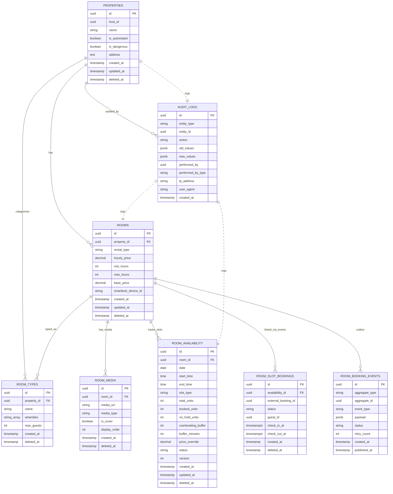

### 1b. Booking Service

```mermaid
erDiagram
    BOOKINGS ||--|| SMARTLOCK_CODES : one_to_one
    BOOKINGS ||--o{ BOOKING_CANCELLATIONS : has
    BOOKINGS ||--o{ BOOKING_STATUS_EVENTS : outbox

    BOOKINGS {
        uuid id PK
        uuid guest_id
        uuid room_id
        uuid availability_slot_id
        string status
        decimal total_amount
        string rental_type
        timestamptz check_in_at
        timestamptz check_out_at
        timestamptz paid_at
        uuid idempotency_key
        timestamp created_at
        timestamp updated_at
        timestamp deleted_at
    }

    SMARTLOCK_CODES {
        uuid id PK
        uuid booking_id FK
        string device_id
        string code_plaintext
        string code_encrypted
        timestamptz code_expires_at
        boolean is_active
        timestamptz checked_in_at
        timestamptz checked_out_at
        timestamp created_at
        timestamp deleted_at
    }

    BOOKING_CANCELLATIONS {
        uuid id PK
        uuid booking_id FK
        string cancelled_by
        text cancellation_reason
        string cancellation_policy
        decimal refund_amount
        string refund_status
        timestamp cancelled_at
        timestamp inventory_restored_at
    }

    BOOKING_STATUS_EVENTS {
        uuid id PK
        uuid booking_id
        string event_type
        jsonb payload
        string status
        int retry_count
        timestamp created_at
    }
```

### 1c. User Service

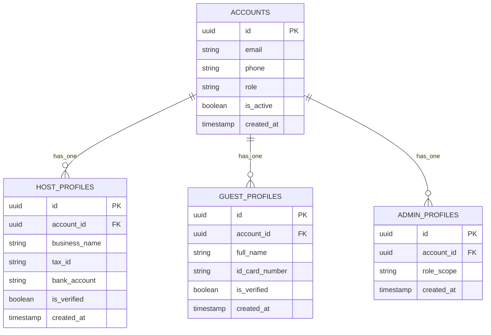

### 1d. Domain Event Contract

| Event Name | Emitter | Consumers | Payload |
|---|---|---|---|
| ROOM_AVAILABILITY_RESERVED | Room Service | Booking Service | slot_id, room_id, check_in, check_out, guest_id |
| ROOM_AVAILABILITY_CONFIRMED | Room Service | Booking Service | slot_id, booking_id |
| ROOM_AVAILABILITY_RELEASED | Room Service | Booking Service | slot_id, reason |
| ROOM_STATUS_CHANGED | Room Service | OTA Sync Service | room_id, old_status, new_status |
| BOOKING_CONFIRMED | Booking Service | Room Service | booking_id, slot_id |
| BOOKING_CANCELLED | Booking Service | Room Service | booking_id, slot_id, refund_status |
| CHECKIN_COMPLETED | Booking Service | Room Service | booking_id, slot_id, checked_in_at |
| CHECKOUT_COMPLETED | Booking Service | Room Service | booking_id, slot_id, checked_out_at |

---

## 2. Booking Flow — 2-Transaction Architecture

### 2a. Stage 1 — Temporary Hold (Room Service)

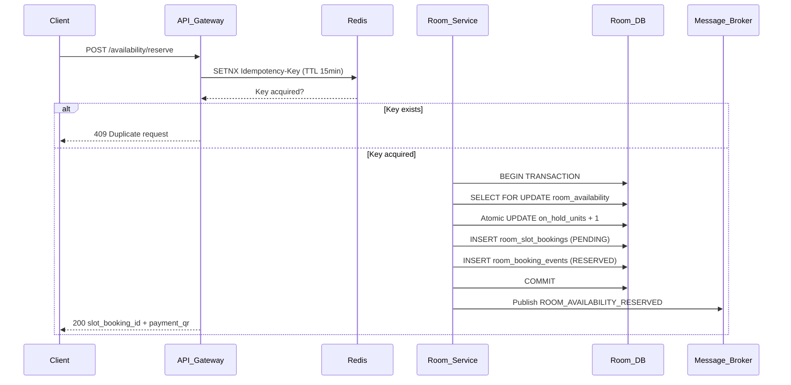

### 2b. Stage 1b — Booking Service Creates Record (Event-Driven)

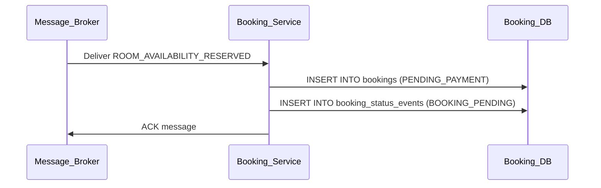

### 2c. Stage 2 — Payment Result via Events

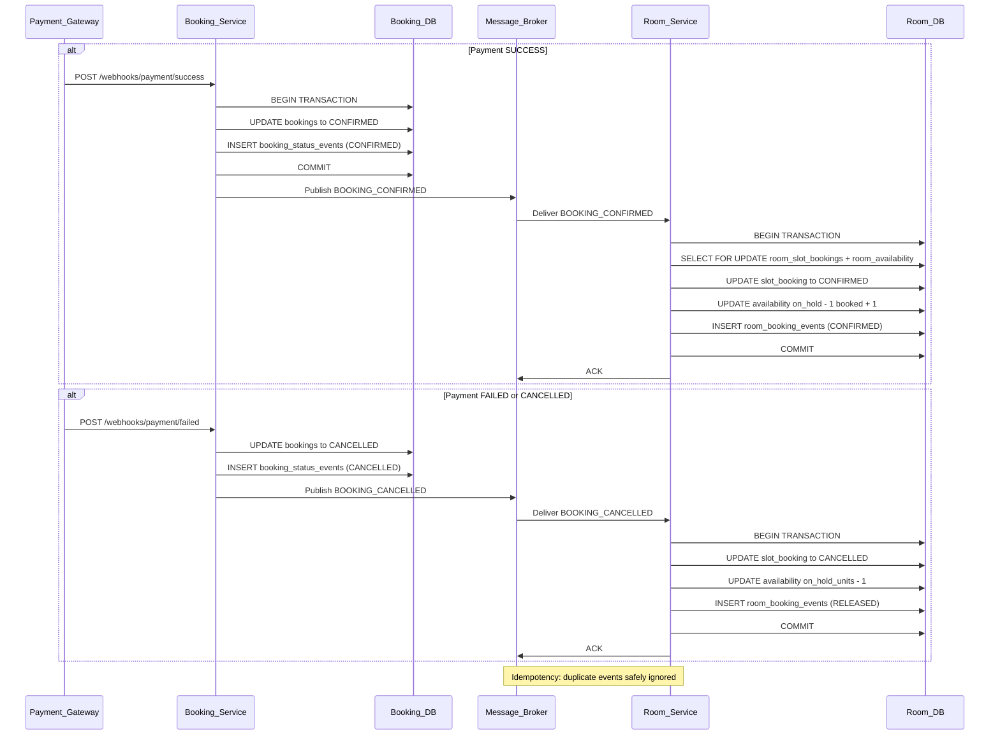

### 2d. Pending Booking Expiration (Cron)

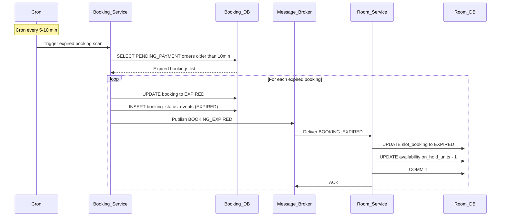

---

## 3. Concurrency Control

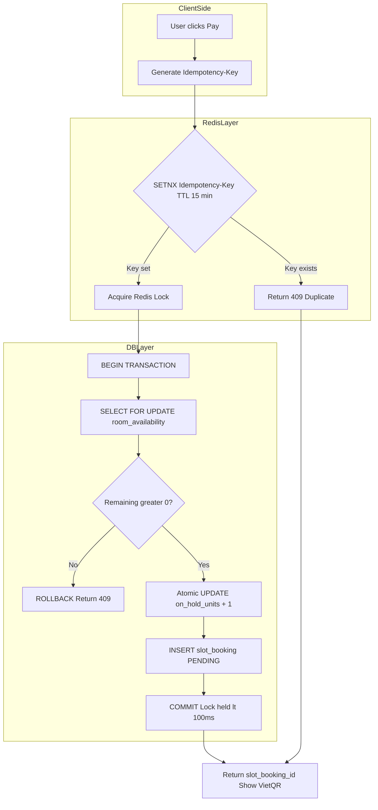

| Scenario | Redis Lock | DB Pessimistic Lock | Combined |
|---|---|---|---|
| 100 users 1 room | 99 rejected fast at Redis | 1 proceeds | Best |
| Redis down | Bypassed | DB lock works alone | Graceful degradation |
| Flash sale 1000 req/s | All non-first rejected instantly | Only winner enters DB | Anti-retry-storm |

---

## 4. Rental Model — DAILY vs HOURLY

### 4a. DAILY Rental Timeline


### 4b. HOURLY Rental Timeline


### 4c. Hourly Slot Generation Logic

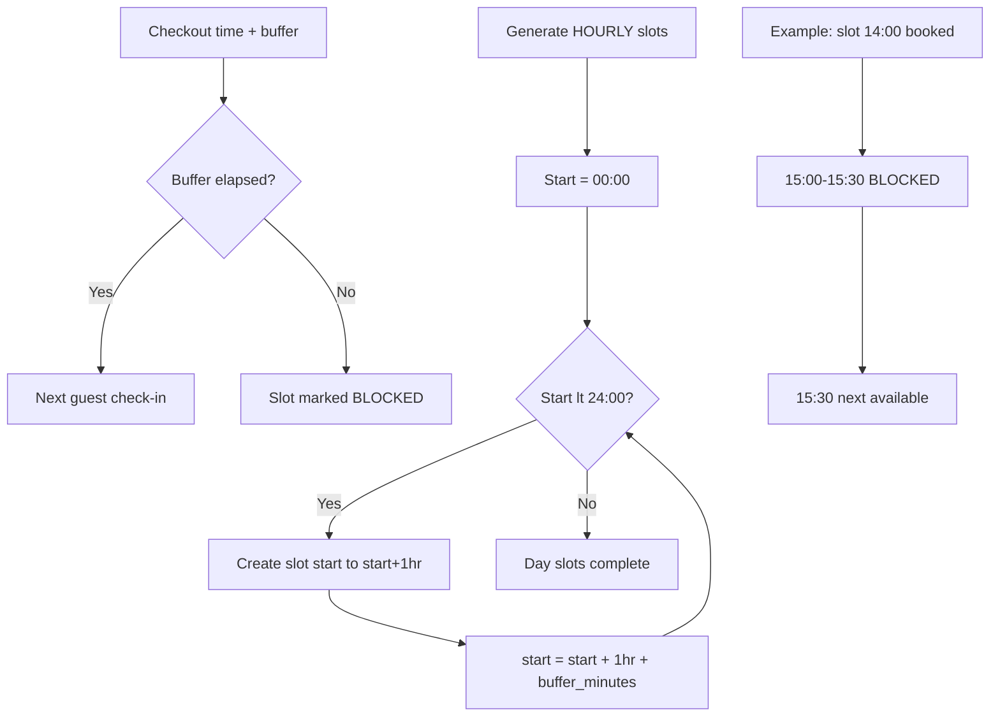

### 4d. Inventory Formula

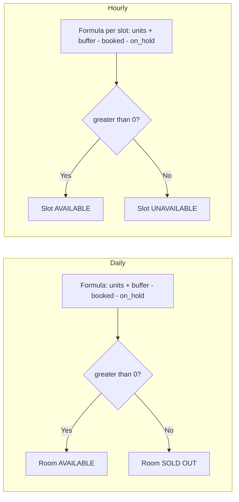

---

## 5. Room Status After Check-out

### 5a. Complete Room Status State Machine (10 States)

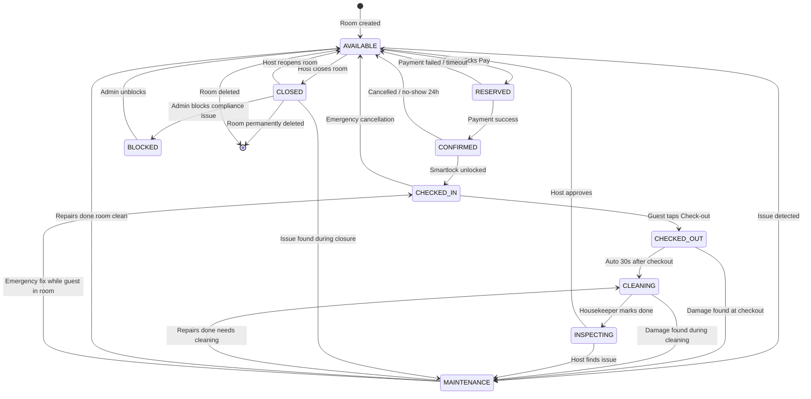

### 5b. DAILY Rental — Check-out Timeline

```mermaid
gantt
    title DAILY Rental: Room Status Timeline
    dateFormat HH:mm
    axisFormat %H:%M

    section Room 101
    "OCCUPIED"   :active, o1, 14:00, 10h
    "CLEANING"   :crit,   c1, after o1, 90m
    "AVAILABLE"  :active, a1, after c1, 8h
```

### 5c. HOURLY Rental — Multi-Booking Day Timeline


### 5d. HOURLY Availability Slot Calculator

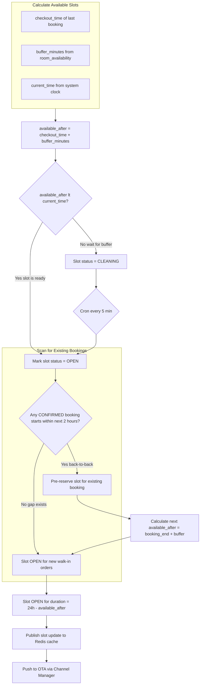

### 5e. Checkout → Cleaning → Available Transition Engine

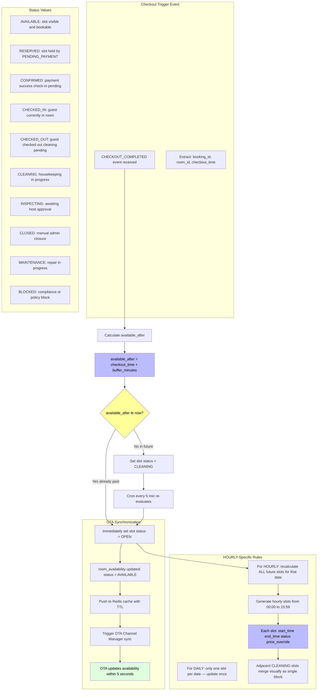

### 5f. State Transition Guard — Admin Status Change

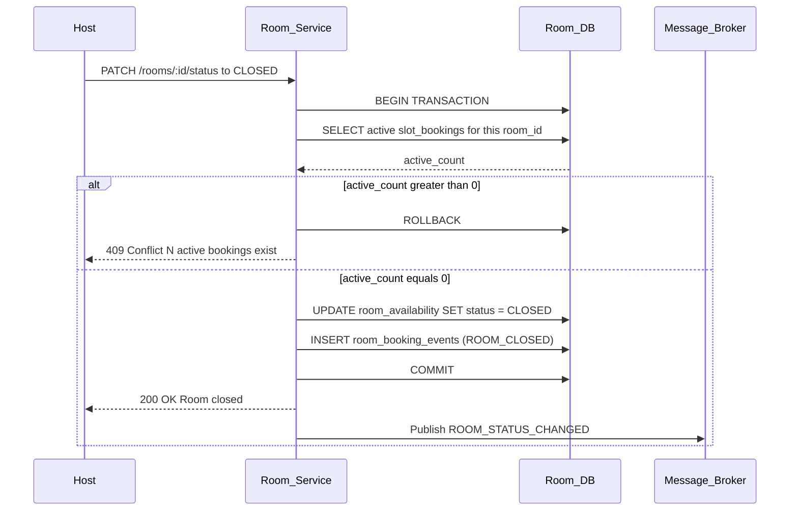

### 5g. HOURLY Edge Cases — Walk-in and Back-to-Back

```mermaid
flowchart TD
    subgraph BackToBack[Edge Case 1: Back-to-Back Booking]
        B1[Guest A CHECKED_OUT at 12:00]
        B2[Guest B already CONFIRMED for 12:00]
        B1 --> B3{checkout_time + buffer le next_booking_start?}
        B3 -->|Yes no buffer needed| B4[Slot immediately = CHECKED_IN for B]
        B3 -->|No gap needed| B5[Insert CLEANING slot 12:00 to 12:30]
    end

    subgraph WalkIn[Edge Case 2: Walk-in During CLEANING]
        W1[Room in CLEANING: 12:00 to 12:30]
        W2[Walk-in arrives 12:15 wants room 12:30 to 16:30]
        W2 --> W3{Is slot at 12:30 still CLEANING?}
        W3 -->|Yes cleaning not done| W4[Show estimated available: 12:30]
        W3 -->|No buffer passed| W5[Slot is AVAILABLE — allow booking]
    end

    subgraph Overlap[Edge Case 3: Overlapping HOURLY Bookings]
        O1[Existing booking: 10:00 to 14:00]
        O2[New booking: 12:00 to 16:00]
        O2 --> O3{Check all existing slots for overlap}
        O3 --> O4[Overlap detected at 12:00 to 14:00]
        O4 --> O5[Reject: slot conflict]
        O4 -->|No overlap| O6[Accept: 14:00 to 16:00 only]
    end

    subgraph Extend[Edge Case 4: Extend Stay]
        E1[Guest in room: booked 10:00 to 12:00]
        E2[Guest wants to extend to 14:00]
        E2 --> E3{Check slots 12:00 to 14:00 available?}
        E3 -->|Available| E4[Extend booking: UPDATE end_time]
        E3 -->|Conflict at 13:00| E5[Show max available: 13:00]
        E5 --> E6[Offer partial extension or next available slot]
    end

    subgraph Overnight[Edge Case 5: Overnight HOURLY]
        ON1[Guest books 22:00 to 06:00 next day]
        ON1 --> ON2[Generate slots spanning midnight boundary]
        ON2 --> ON3[Create slots for date 1: 22:00-24:00]
        ON3 --> ON4[Create slots for date 2: 00:00-06:00]
        ON4 --> ON5[Single booking_id spans 2 date partitions]
        ON5 --> ON6[Price = sum of each slot price_override]
    end

    style B4 fill:#dfd,color:#000
    style W5 fill:#dfd,color:#000
    style O5 fill:#fbb,color:#000
    style E4 fill:#dfd,color:#000
    style ON6 fill:#bbf,color:#000
```

---

## 6. Smartlock Integration Flow

### 6i. Auto Check-in Flow (Full)

> Full Auto Check-in Flow design is documented in [AutoCheckinFlow.md](./AutoCheckinFlow.md).

```mermaid
flowchart TD
    subgraph BookingConfirmed[Booking CONFIRMED]
        BC1[Payment webhook success]
        BC2[Publish BOOKING_CONFIRMED event]
    end

    subgraph CodeGen[Code Generation Pipeline]
        BC2 --> CG1[Get smartlock_device_id from Room Service]
        CG1 --> CG2[Call Smartlock Provider: POST /devices/:id/codes/generate]
        CG2 --> CG3[Receive code plaintext (transient only)]
        CG3 --> CG4[Derive key: HMAC-SHA256(booking_id, MASTER_KEY)]
        CG4 --> CG5[AES-256-GCM encrypt: code_encrypted + iv + tag]
        CG5 --> CG6[Store code_encrypted in smartlock_codes table]
        CG6 --> CG7[Set valid_from = checkin_time, valid_until = checkout_time + buffer]
    end

    subgraph Delivery[Code Delivery]
        CG7 --> D1[Push notification: "Your room is ready"]
        D1 --> D2[App calls GET /bookings/:id/access-code]
        D2 --> D3[Return: code_encrypted, iv, tag, valid_from, valid_until]
        D3 --> D4[App derives key locally from booking_id]
        D4 --> D5[App decrypts code on-device]
        D5 --> D6[Display: PIN + QR + BLE unlock button]
    end

    subgraph Access[Guest Access]
        D6 --> A1[BLE proximity unlock]
        D6 --> A2[Manual PIN entry]
        D6 --> A3[QR code scan]
        A1 --> A4[Smartlock validates + UNLOCKS]
        A2 --> A4
        A3 --> A4
        A4 --> A5[Log access: booking_id, method, result, timestamp]
    end

    subgraph Checkout[Checkout & Revocation]
        A5 --> CO1[Guest taps Check-out OR valid_until reached]
        CO1 --> CO2[Call Smartlock Provider: POST /devices/:id/codes/revoke]
        CO2 --> CO3[UPDATE smartlock_codes is_active = false]
        CO3 --> CO4[Publish CHECKOUT_COMPLETED event]
        CO4 --> CO5[Room Service: slot transitions to CLEANING]
    end

    CG7 -.->|Pre-download for offline| D6
    CO5 -.->|After buffer| RoomAvailable[Room available]

    style BC1 fill:#bbf,color:#000
    style CG6 fill:#bbf,color:#000
    style D5 fill:#dfd,color:#000
    style A4 fill:#dfd,color:#000
    style CO5 fill:#dfd,color:#000
```

### 6j. Encryption Key Hierarchy

```mermaid
flowchart TD
    K1[MASTER_ENCRYPTION_KEY<br/>(AWS KMS / HashiCorp Vault)] --> K2[Derived Key<br/>HMAC-SHA256(booking_id, MASTER_KEY)]
    K2 --> K3[AES-256-GCM per-access encryption]

    subgraph Stored["Stored in smartlock_codes table"]
        S1[code_encrypted]
        S2[iv]
        S3[tag]
        S4[key_hash]
    end

    subgraph Transient["Transient (memory only)"]
        T1[code_plaintext from provider]
    end

    subgraph NeverStored["Never stored"]
        N1[MASTER_ENCRYPTION_KEY]
        N2[derived_key]
        N3[device_id in client response]
    end

    K2 --> S1
    T1 --> K2
    K2 --> K3
    K3 --> S1

    style K1 fill:#fbb,color:#000
    style T1 fill:#ffe0b0,color:#000
    style N1 fill:#fbb,color:#000
    style N2 fill:#fbb,color:#000
    style N3 fill:#fbb,color:#000
```

### 6k. Access Code Lifecycle

```mermaid
stateDiagram-v2
    [*] --> GENERATED: BOOKING_CONFIRMED

    GENERATED --> ACTIVE: valid_from reached
    GENERATED --> EXPIRED_UNCLAIMED: valid_until passed
    GENERATED --> CANCELLED: Booking CANCELLED

    ACTIVE --> ACTIVE: Re-enter (unlimited)
    ACTIVE --> USED: First unlock
    ACTIVE --> REVOKED: Host/system revokes
    ACTIVE --> EXPIRED: valid_until passed

    USED --> ACTIVE: Guest leaves + re-enters
    USED --> REVOKED: Host revokes
    USED --> EXPIRED: valid_until passed

    REVOKED --> [*]: Purged after 30 days
    EXPIRED --> [*]: Cron cleanup
    CANCELLED --> [*]: Purged after 7 days
```

### 6l. Fallback Chain

```mermaid
flowchart TD
    A[Guest arrives] --> B{BLE proximity}
    B -->|Success| Z[Unlock]
    B -->|Fail| C{QR code}
    C -->|Success| Z
    C -->|Fail| D{NFC tap}
    D -->|Success| Z
    D -->|Fail| E{PIN entry}
    E -->|Wrong 3x| F[Lock out 30s]
    E -->|Success| Z
    E -->|Expired / Revoked| G[Contact host]
    F --> G

    style Z fill:#dfd,color:#000
    style G fill:#ffe0b0,color:#000
    style F fill:#fbb,color:#000
```

### 6m. Smartlock Provider Adapter Pattern

```mermaid
flowchart LR
    subgraph HomiCore[Homi Core]
        BS[Booking Service]
        CM[Code Manager]
    end

    subgraph Adapters[Provider Adapters]
        TT[TTLock Adapter]
        SA[SALTO Adapter]
        NU[Nuki Adapter]
        IG[igloohome Adapter]
        YL[Yale Adapter]
    end

    subgraph Devices[Physical Devices]
        TT_D[TTLock Device]
        SA_D[SALTO KS]
        NU_D[Nuki Smart Lock]
        IG_D[igloohome Lock]
        YL_D[Yale Access]
    end

    CM -->|unified interface| TT
    CM -->|unified interface| SA
    CM -->|unified interface| NU
    CM -->|unified interface| IG
    CM -->|unified interface| YL

    TT -->|BLE+Cloud| TT_D
    SA -->|SALTO JustIN| SA_D
    NU -->|BLE+Bridge| NU_D
    IG -->|BLE+Cloud| IG_D
    YL -->|BLE+Cloud| YL_D

    style HomiCore fill:#dfd,color:#000
    style Adapters fill:#ffe0b0,color:#000
```

### 6n. Offline Mode — Pre-Download Strategy

```mermaid
sequenceDiagram
    participant App
    participant BookingService
    participant SecureStorage[App Secure Enclave<br/>iOS Keychain / Android Keystore]

    Note over App: Booking CONFIRMED
    App->>BookingService: GET /bookings/:id/access-code
    BookingService-->>App: { code_encrypted, iv, tag, valid_from, valid_until }
    App->>App: Re-encrypt with device-bound key
    App->>SecureStorage: Store encrypted payload
    Note over App: Stored for offline use

    Note over App: Guest arrives offline
    SecureStorage->>App: Retrieve encrypted payload
    App->>App: Decrypt with device-bound key
    App->>App: Check: valid_from <= now <= valid_until
    App->>App: Decrypt code with HMAC-SHA256(booking_id, MASTER_KEY)
    App->>App: Display PIN / BLE unlock
```

### 6a. Check-in Flow

```mermaid
sequenceDiagram
    participant Guest
    participant App
    participant Booking_Service
    participant Booking_DB
    participant Smartlock_Provider
    participant Message_Broker

    Note over Booking_Service: Booking is CONFIRMED
    Guest->>App: Tap Check-in Now
    App->>Booking_Service: GET /bookings/:id/checkin
    Booking_Service->>Booking_DB: SELECT booking + smartlock_codes

    alt No existing code
        Booking_Service->>Smartlock_Provider: GET /devices/:device_id/code
        Smartlock_Provider-->>Booking_Service: code plaintext
        Booking_Service->>Booking_Service: AES-256-GCM encrypt code
        Booking_Service->>Booking_DB: INSERT smartlock_codes
    else Code already exists
        Booking_Service->>Booking_DB: SELECT existing code_encrypted
    end

    Booking_Service-->>App: code_encrypted
    App->>App: AES-256-GCM decrypt locally

    alt is_automated = true
        App->>Smartlock_Device: BLE auto-unlock
        Smartlock_Device-->>App: Lock OPENED
        App->>Booking_Service: POST /bookings/:id/checkin-log
        Booking_Service->>Booking_DB: UPDATE checked_in_at status = CHECKED_IN
        Booking_Service->>Message_Broker: Publish CHECKIN_COMPLETED
    else is_automated = false
        App->>App: Display decrypted code to Guest
        Guest->>Smartlock_Device: Enter code manually
    end
```

### 6b. Check-out and Code Revocation

```mermaid
sequenceDiagram
    participant Guest
    participant App
    participant Booking_Service
    participant Booking_DB
    participant Smartlock_Provider
    participant Message_Broker
    participant Room_Service

    Guest->>App: Tap Check-out
    App->>Booking_Service: POST /bookings/:id/checkout
    Booking_Service->>Booking_DB: SELECT FOR UPDATE smartlock_codes
    Booking_Service->>Smartlock_Provider: POST /devices/:device_id/revoke
    Smartlock_Provider-->>Booking_Service: Code revoked
    Booking_Service->>Booking_DB: UPDATE smartlock_codes is_active = false
    Booking_Service->>Booking_DB: UPDATE bookings status = CHECKED_OUT
    Booking_Service->>Booking_DB: INSERT booking_status_events (CHECKOUT_COMPLETED)
    Booking_Service->>Message_Broker: Publish CHECKOUT_COMPLETED
    Booking_Service-->>App: 200 OK

    Message_Broker->>Room_Service: Deliver CHECKOUT_COMPLETED
    Room_Service->>Room_Service: Mark slot available
```

### 6c. Smartlock Security Architecture

```mermaid
flowchart TD
    subgraph BookingServiceDB[Booking Service DB]
        B1[bookings table]
        B2[smartlock_codes table]
        B3[code_encrypted field]
        B4[code_plaintext NEVER stored]
    end

    subgraph RoomServiceDB[Room Service DB]
        R1[rooms table smartlock_device_id]
    end

    subgraph SmartlockProvider[Smartlock Provider]
        P1[Device ID]
        P2[Dynamic code]
    end

    R1 -->|device_id| P1
    Booking_Service -->|GET code| P2
    P2 -->|plaintext| B3
    B3 -->|encrypted at rest| B2
    B2 -->|decrypted in App only| App

    style B4 fill:#bbf,color:#000
    style B3 fill:#fbb,color:#000
```

---

## 7. OTA Inventory Sync

### 7a. Three Sync Methods

```mermaid
flowchart TD
    ROOT[Inventory Sync] --> ICAL[iCalendar Sync]
    ROOT --> DAPI[Direct API Integration]
    ROOT --> CM[Channel Manager]

    ICAL --> ICAL_C[Fetch .ics every 15-30 min]
    ICAL_C --> ICAL_P[Parse VEVENT Batch update DB]
    ICAL_C --> ICAL_L[Lag hours]
    ICAL_L --> ICAL_U[Use case small scale]

    DAPI --> PUSH[Push Protocol internal sends POST]
    DAPI --> PULL[Pull Webhook OTA sends webhook]
    PUSH --> PUSH_R[Real-time]
    PULL --> PULL_R[Real-time]
    PUSH_R --> DAPI_U[Use case mid scale]
    PULL_R --> DAPI_U

    CM --> CM_RT[Real-time under 5 seconds]
    CM --> CM_EX[SiteMinder or Channex Single gateway]
    CM --> CM_U[Recommended for large scale]
```

### 7b. iCalendar Sync Flow

```mermaid
flowchart TD
    A[Cron every 15-30 min] --> B[Fetch .ics from OTA URL]
    B --> C[Parse VEVENT blocks UID DTSTART DTEND]
    C --> D{Parse error?}

    D -->|Yes| E[Log error Skip this .ics]
    D -->|No| F[Map iCal event to internal format]

    F --> G[Batch process events]
    G --> H{Event type?}

    H -->|BOOKED| I[UPDATE booked_units + 1 status = CLOSED if full]
    H -->|AVAILABLE| J[UPDATE booked_units - 1 status = OPEN]
    H -->|BLOCKED| K[UPDATE status = BLOCKED]

    I --> L[Write to inventory_sync_log]
    J --> L
    K --> L
    L --> M[End]
    E --> M
```

### 7c. Channel Manager Real-time Sync

```mermaid
sequenceDiagram
    participant OTA
    participant Channel_Manager
    participant Room_Service_API
    participant Room_Service_DB

    Note over OTA,Room_Service_DB: PULL: Room Service polls Channel Manager
    Room_Service_API->>Channel_Manager: GET /availability property_id from to
    Channel_Manager-->>Room_Service_API: rooms and rates JSON
    Room_Service_API->>Room_Service_DB: Batch upsert room_availability
    Room_Service_DB-->>Room_Service_API: Updated

    Note over OTA,Room_Service_DB: PUSH: Real-time booking notification
    OTA->>Channel_Manager: POST /bookings reservation
    Channel_Manager->>Room_Service_API: POST /internal/webhooks/booking
    Room_Service_API->>Room_Service_DB: BEGIN TRANSACTION
    Room_Service_API->>Room_Service_DB: SELECT FOR UPDATE room_availability
    Room_Service_API->>Room_Service_DB: UPDATE booked_units + 1
    Room_Service_API->>Room_Service_DB: INSERT booking record
    Room_Service_API->>Room_Service_DB: COMMIT
    Room_Service_API-->>Channel_Manager: 200 OK
    Channel_Manager-->>OTA: 200 OK
```

---

## 8. Full System Context

```mermaid
flowchart TB
    subgraph External[External Systems]
        OTA1[iCalendar Feed]
        OTA2[Direct API Webhook]
        OTA3[Channel Manager]
        Payment[Payment Gateway VietQR]
        Smartlock[Smartlock Provider]
    end

    subgraph Broker[Message Broker]
        T1[room.availability.reserved]
        T2[room.availability.released]
        T3[booking.confirmed]
        T4[booking.cancelled]
        T5[booking.checkin]
        T6[booking.checkout]
    end

    subgraph RoomService[Room Service]
        RS_API[REST API]
        RS_Cron[OTA iCal Cron]
        RS_Outbox[Outbox Relay]
    end

    subgraph RoomServiceDB[Room Service DB]
        T1b[properties]
        T2b[rooms]
        T3b[room_types]
        T4b[room_media]
        T5b[room_availability]
        T6b[create_room_requests]
        T7b[room_slot_bookings]
        T8b[room_booking_events]
    end

    subgraph BookingService[Booking Service]
        BS_API[REST API]
        BS_Smartlock[Smartlock Service]
        BS_Outbox[Outbox Relay]
    end

    subgraph BookingServiceDB[Booking Service DB]
        B1[bookings]
        B2[smartlock_codes]
        B3[booking_cancellations]
        B4[booking_status_events]
    end

    subgraph UserService[User Service]
        US_API[REST API]
    end

    subgraph UserServiceDB[User Service DB]
        U1[accounts]
        U2[host_profiles]
        U3[guest_profiles]
    end

    subgraph OTASync[OTA Sync Service]
        OTAS_API[OTA Sync API]
    end

    External --> RS_Cron
    RS_Cron --> OTA1
    Payment --> BS_API
    Smartlock --> BS_Smartlock

    RS_API --> T1b & T2b & T3b & T4b & T5b & T6b & T7b & T8b
    RS_Outbox -.->|publish| T1 & T2 & T6
    RS_Outbox -.->|consume| T3 & T4 & T5

    BS_API --> B1 & B2 & B3 & B4
    BS_Outbox -.->|publish| T3 & T4 & T5 & T6
    BS_Outbox -.->|consume| T1 & T2

    T1 -.->|consume| BS_API
    T2 -.->|consume| BS_API
    T3 -.->|consume| RS_API
    T4 -.->|consume| RS_API
    T5 -.->|consume| RS_API
    T6 -.->|consume| RS_API

    RS_API -.->|query UUID| U1
    BS_API -.->|query UUID| U1

    OTAS_API --> T5b
    RS_API --> OTAS_API
```

---

## 9. Atomic Update — Inventory Query Logic

```mermaid
flowchart TD
    A[Incoming booking request] --> B[Atomic UPDATE statement]
    B --> C[UPDATE room_availability]
    B --> D[SET on_hold_units = on_hold_units + 1]
    B --> E[WHERE availability gt 0]
    E --> F{"Rows affected = 1?"}

    F -->|Yes| H[Hold SUCCESS Create PENDING record]
    F -->|No| I[No availability Return 409]

    style H fill:#bbf,color:#000
    style I fill:#fbb,color:#000
```

**Inventory availability query (read-only):**

```sql
SELECT room_id, start_time, end_time
FROM room_availability
WHERE date BETWEEN :checkin AND :checkout
  AND (total_units + overbooking_buffer - booked_units - on_hold_units) > 0
  AND status = 'OPEN'
  AND slot_type = :rental_type
ORDER BY date, start_time;
```

---

## 10. Microservice Design Principles

### 10a. Database per Service

```mermaid
flowchart LR
    subgraph S1[Room Service]
        D1[room_availability<br/>room_slot_bookings<br/>room_booking_events]
    end
    subgraph S2[Booking Service]
        D2[bookings<br/>smartlock_codes<br/>booking_status_events]
    end
    subgraph S3[User Service]
        D3[accounts<br/>host_profiles]
    end
    subgraph B[Message Broker]
        MB[Kafka or RabbitMQ]
    end

    D1 -.-> MB
    D2 -.-> MB
    D3 -.-> MB
```

### 10b. Communication Rules

| Rule | Applied |
|------|---------|
| No DB-level FK across services | UUID only no FK constraints |
| Services communicate via events | All booking state changes via message broker |
| Local data projection | Room Service has room_slot_bookings |
| Outbox pattern | Every service has its own _events outbox |
| Idempotency at consumer | Duplicate events safely ignored |
| API for queries events for state | Reads go through API state changes via events |

### 10c. Data Ownership

| Data | Owner | Consumers |
|------|-------|-----------|
| room_availability | Room Service | Booking Service reads OTA Sync writes |
| room_slot_bookings | Room Service | Booking Service event-driven |
| bookings | Booking Service | Room Service event-driven |
| smartlock_codes | Booking Service | Smartlock Provider App |
| accounts | User Service | Room Service Booking Service reads UUID only |
| properties | Room Service | OTA Sync reads |

### 10d. Saga Pattern

```mermaid
sequenceDiagram
    participant Guest
    participant Room_Service
    participant Message_Broker
    participant Booking_Service
    participant Payment_Gateway

    Guest->>Room_Service: Reserve slot Step 1 of Saga
    Room_Service->>Room_Service: Reserve availability
    Room_Service->>Message_Broker: Publish ROOM_AVAILABILITY_RESERVED
    Room_Service-->>Guest: 200 slot reserved

    Message_Broker->>Booking_Service: Deliver event
    Booking_Service->>Booking_Service: Create booking record + VietQR

    Note over Booking_Service,Payment_Gateway: Compensating transaction on failure
    Payment_Gateway-->>Booking_Service: Payment timeout
    Booking_Service->>Booking_Service: Cancel booking
    Booking_Service->>Message_Broker: Publish BOOKING_CANCELLED
    Message_Broker->>Room_Service: Deliver event
    Room_Service->>Room_Service: Release availability slot
```

---

## 11. Data Integrity — All Mechanisms

### 11a. Integrity Layers Overview

```mermaid
flowchart TB
    subgraph APILayer[API Layer]
        DTO[DTO Validation]
        IDEMPO[Idempotency Key]
        RATE[Rate Limiting]
    end

    subgraph DBConstraint[Database Constraints]
        CHECK[CHECK Constraints]
        UNIQUE[UNIQUE Constraints]
        FK[FK Constraints within service]
        NOTNULL[NOT NULL Constraints]
        PARTIAL[Partial Index]
    end

    subgraph Concurrency[Concurrency Control]
        REDIS[Redis SETNX Lock]
        PG[PostgreSQL SELECT FOR UPDATE]
        ADVISORY[Advisory Locks]
        VERSION[Optimistic Lock version]
    end

    subgraph BusinessRules[Business Rules]
        AVAIL[Atomic Availability Formula]
        BUFFER[buffer_minutes Enforcement]
        TRANSITION[State Transition Guard]
        DOUBLE[Double Booking Prevention]
    end

    subgraph EventIntegrity[Event Integrity]
        OUTBOX[Transactional Outbox]
        IDEMPOTENT[Consumer Idempotency]
        DEAD[Dead Letter Queue]
        REPLAY[Event Replay]
    end

    subgraph AuditTrail[Audit Trail]
        TIMESTAMP[updated_at timestamps]
        SOFT[Soft Delete deleted_at]
        AUDIT[Audit Logs table]
    end

    APILayer --> DBConstraint
    APILayer --> Concurrency
    Concurrency --> BusinessRules
    BusinessRules --> EventIntegrity
    EventIntegrity --> AuditTrail
```

### 11b. Atomic Availability Formula — The Gatekeeper

```mermaid
flowchart TD
    A[Incoming booking: room_id date start_time] --> B[Atomic UPDATE]
    B --> C[UPDATE room_availability]
    B --> D[SET on_hold_units = on_hold_units + 1]
    B --> E[WHERE id = :slot_id]
    B --> F[AND total_units + overbooking_buffer]
    B --> G[ - booked_units - on_hold_units > 0]

    F --> H{"Rows affected = 1?"}
    H -->|Yes| I[INSERT room_slot_bookings PENDING]
    H -->|No| J[INSERT room_booking_events FAILED]
    H -->|No| K[Return 409 No availability]
    I --> L[COMMIT]
    L --> M[Increment version]
    M --> N[Return slot_booking_id]

    style I fill:#bbf,color:#000
    style K fill:#fbb,color:#000
```

### 11c. CHECK Constraints — Database Level Enforcement

```sql
-- Prevent negative inventory values at DB level
ALTER TABLE room_availability ADD CONSTRAINT
    chk_non_negative_units CHECK (
        booked_units >= 0
        AND on_hold_units >= 0
        AND booked_units + on_hold_units <= total_units + overbooking_buffer
    );

-- Prevent invalid rental configurations
ALTER TABLE rooms ADD CONSTRAINT
    chk_rental_config CHECK (
        rental_type IN ('DAILY', 'HOURLY', 'BOTH')
        AND min_hours >= 1
        AND (hourly_price IS NULL OR hourly_price > 0)
        AND base_price > 0
    );

-- Prevent past dates for availability slots
ALTER TABLE room_availability ADD CONSTRAINT
    chk_future_date CHECK (date >= CURRENT_DATE);
```

### 11d. Optimistic Locking — Version Field

```mermaid
sequenceDiagram
    participant App
    participant Room_Service
    participant Room_DB

    App->>Room_Service: PATCH /rooms/:id
    Room_Service->>Room_DB: SELECT * FROM rooms WHERE id = :id
    Room_DB-->>Room_Service: room with version = 5
    Room_Service->>Room_Service: Apply business logic update
    Room_Service->>Room_DB: UPDATE rooms SET version = version + 1 WHERE id = :id AND version = 5
    Room_DB-->>Room_Service: rows_affected = 1

    alt Version mismatch (concurrent update)
        Room_DB-->>Room_Service: rows_affected = 0
        Room_Service-->>App: 409 Conflict: Concurrent modification detected
    else Success
        Room_Service-->>App: 200 OK updated
    end
```

### 11e. Consumer Idempotency — Duplicate Event Handling

```mermaid
flowchart TD
    A[Event arrives from broker] --> B{Event ID in processed_events?}
    B -->|Yes| C[ACK message skip processing]
    B -->|No| D[Begin transaction]
    D --> E[Check event_id in idempotency table]
    E --> F{Already processed?}
    F -->|Yes| G[ACK skip]
    F -->|No| H[Process business logic]
    H --> I[UPDATE idempotency: event_id processed]
    I --> J[COMMIT]
    J --> K[ACK to broker]

    style C fill:#bbf,color:#000
    style G fill:#bbf,color:#000
```

### 11f. Soft Delete Pattern — Protect Data from Accidental Deletion

```mermaid
flowchart LR
    subgraph HardDelete
        HD1[DELETE FROM rooms WHERE id = :id]
        HD2[Room data permanently lost]
        HD3[Related bookings become orphaned]
        HD4[Audit trail completely gone]
        HD1 --> HD2 --> HD3 --> HD4
    end

    subgraph SoftDelete
        SD1[UPDATE rooms SET deleted_at = current_timestamp WHERE id = :id]
        SD2[Room data preserved]
        SD3[Related bookings stay linked]
        SD4[Audit trail intact]
        SD5[Room hidden from queries by default]
        SD1 --> SD2 --> SD3 --> SD4 --> SD5
    end
```

```sql
-- Query pattern: always filter deleted_at
CREATE INDEX idx_rooms_active ON rooms (property_id)
    WHERE deleted_at IS NULL;

-- Restore deleted record
UPDATE rooms SET deleted_at = NULL WHERE id = :id;
```

### 11g. Event Outbox Pattern — Guaranteed Delivery

```mermaid
sequenceDiagram
    participant AppLayer
    participant RoomService
    participant RoomDB
    participant OutboxRelay
    participant Broker

    AppLayer->>RoomService: Booking request
    RoomService->>RoomDB: BEGIN TRANSACTION
    RoomService->>RoomDB: UPDATE room_availability (atomic)
    RoomService->>RoomDB: UPDATE room_slot_bookings
    RoomService->>RoomDB: INSERT room_booking_events (PENDING)
    RoomService->>RoomDB: COMMIT
    Note over RoomDB: DB write + event insert in ONE atomic operation

    loop Every 1 second
        OutboxRelay->>RoomDB: SELECT * FROM room_booking_events WHERE status = PENDING
        RoomDB-->>OutboxRelay: Pending events
        OutboxRelay->>Broker: Publish event
        Broker-->>OutboxRelay: Published OK
        OutboxRelay->>RoomDB: UPDATE status = PUBLISHED
        OutboxRelay->>RoomDB: UPDATE published_at = now()
    end

    Note over OutboxRelay,Broker: If broker fails: retry with backoff. Max 5 retries. Then status = FAILED and alert Admin.
```

### 11h. Dead Letter Queue — Failed Event Handling

```mermaid
flowchart TD
    A[Event published to broker] --> B{Delivered to consumer?}
    B -->|Yes| C[Consumer ACK]
    B -->|No after max retries| D[Move to DLQ topic]
    D --> E[Alert Admin]

    C --> F{Processing successful?}
    F -->|Yes| G[Commit offset]
    F -->|No| H[Consumer NACK]
    H --> B

    E --> I{Manual action needed?}
    I -->|Yes| J[Admin reviews DLQ]
    J --> K[Republish or compensate]
    I -->|No| L[Auto-retry with delay]
    K --> A
    L --> A
```

### 11i. Data Integrity Checklist

| Layer | Mechanism | Protects Against |
|-------|-----------|----------------|
| API | Idempotency key | Duplicate booking requests |
| API | Rate limiting | Flash sale abuse |
| API | DTO validation | Invalid data entering system |
| DB | CHECK constraints | Negative inventory values |
| DB | Partial index | Queries on deleted rows |
| DB | NOT NULL | Missing critical fields |
| DB | Optimistic lock version | Concurrent updates to same row |
| DB | Advisory locks | Multi-room booking conflicts |
| Business | Atomic UPDATE formula | Overbooking |
| Business | State transition guard | Closing room with active orders |
| Business | buffer_minutes enforcement | Overlapping HOURLY bookings |
| Event | Outbox pattern | Event lost if broker down |
| Event | Consumer idempotency | Duplicate event processing |
| Event | DLQ + retry | Silent event failure |
| Audit | updated_at | Cache invalidation |
| Audit | deleted_at | Soft delete protection |
| Audit | AUDIT_LOGS | Full change history |

---

### 6d. Full Automated Check-in Architecture

```mermaid
flowchart TD
    subgraph BookingConfirmed[Booking CONFIRMED Event]
        E1[Booking CONFIRMED via payment webhook]
        E2[Event: BOOKING_CONFIRMED published]
    end

    subgraph AutomationDecision[Automation Gate]
        E1 --> D1{is_automated = true?}
        D1 -->|Yes| D2[Generate access code]
        D1 -->|No| D3[Notify Host to provide code]
    end

    subgraph CodeGeneration[Code Generation Pipeline]
        D2 --> G1[Calculate valid_from = checkin_time]
        G1 --> G2[Calculate valid_until = checkout_time + buffer_minutes]
        G2 --> G3[Generate code via provider API or local RNG]
        G3 --> G4[AES-256-GCM encrypt with room-specific key]
        G4 --> G5[Store code_encrypted in smartlock_codes table]
        G5 --> G6[Publish CODE_GENERATED event to broker]
    end

    subgraph DeliveryLayer[Guest Delivery]
        G6 --> DL1[Push notification: Your room is ready]
        DL1 --> DL2[Code pushed to guest app via FCM/APNs]
        DL2 --> DL3[Code cached locally in app for offline access]
        DL3 --> DL4[Display: Access code + QR code + BLE auto-unlock]
    end

    subgraph AccessLayer[Guest Access]
        DL4 --> A1[Guest arrives at property]
        A1 --> A2{Device connectivity}
        A2 -->|BLE enabled| A3[Proximity auto-unlock via BLE]
        A2 -->|BLE disabled| A4[Manual PIN entry on keypad]
        A2 -->|QR scanner| A5[QR code scanned on smartlock screen]
        A3 --> A6[Smartlock unlocks, event logged]
        A4 --> A6
        A5 --> A6
        A6 --> A7[Audit log: unlock_timestamp + method + success/fail]
    end

    subgraph CheckoutLayer[Check-out & Revocation]
        CL1[Check-out time reached OR guest taps Check-out]
        CL1 --> CL2[Revoke code via provider API]
        CL2 --> CL3[Mark smartlock_codes is_active = false]
        CL3 --> CL4[Publish CHECKOUT_COMPLETED event]
        CL4 --> CL5[Room slot released after buffer_minutes]
    end

    G6 --> CL1
    A7 --> AuditDB[(Audit DB)]
    CL5 --> RoomAvailable[Room available for next booking]

    style D1 fill:#ff9,color:#000
    style G4 fill:#bbf,color:#000
    style A7 fill:#bbf,color:#000
    style AuditDB fill:#f9f,color:#000
```

### 6e. Smartlock Provider Integration — Adapter Pattern

```mermaid
flowchart LR
    subgraph HomiCore[Homi Core System]
        B[Booking Service]
        R[Room Service]
        C[Code Manager Service]
    end

    subgraph AdapterLayer[Smartlock Adapter Layer]
        AA[August Adapter]
        YA[Yale Adapter]
        SC[Schlage Adapter]
        NK[Nuki Adapter]
        LK[Lockly Adapter]
        SA[SALTO Adapter]
        TT[TTLock Adapter]
        DR[Dormakaba Adapter]
    end

    subgraph DeviceLayer[Physical Devices]
        AUG[August Smart Lock]
        YAL[Yale Conexis]
        SCH[Schlage Encode]
        NUK[Nuki Smart Lock]
        LOK[Lockly Secure Pro]
        SAL[SALTO KS]
        TTL[TTLock Padlock]
        DOR[Dormakaba ID.Trusted]
    end

    C -->|unified interface| AA
    C -->|unified interface| YA
    C -->|unified interface| SC
    C -->|unified interface| NK
    C -->|unified interface| LK
    C -->|unified interface| SA
    C -->|unified interface| TT
    C -->|unified interface| DR

    AA -->|HTTPS REST| AUG
    YA -->|Bluetooth LE + Cloud| YAL
    SC -->|Z-Wave + WiFi| SCH
    NK -->|Bluetooth + Bridge| NUK
    LK -->|Bluetooth + WiFi| LOK
    SA -->|SALTO JustIN Mobile| SAL
    TT -->|Bluetooth + Cloud| TTL
    DR -->|RFID + NFC + BLE| DOR

    style HomiCore fill:#dfd,color:#000
    style AdapterLayer fill:#ffe0b0,color:#000
```

### 6f. Access Code State Machine

```mermaid
stateDiagram-v2
    [*] --> GENERATED: Booking CONFIRMED

    GENERATED --> ACTIVE: valid_from timestamp reached
    GENERATED --> EXPIRED: checkout_time + buffer passed without activation
    GENERATED --> CANCELLED: Booking CANCELLED before check-in

    ACTIVE --> ACTIVE: Guest re-enters (unlimited)
    ACTIVE --> USED: First successful unlock
    ACTIVE --> REVOKED: Host or system revokes early
    ACTIVE --> EXPIRED: valid_until timestamp passed

    USED --> [*]: Checkout time reached

    REVOKED --> [*]: Code permanently disabled

    EXPIRED --> [*]: Auto-cleanup by cron

    CANCELLED --> [*]: Code purged
```

### 6g. Offline Mode & Fallback Mechanisms

```mermaid
flowchart TD
    subgraph PreArrival[Pre-Arrival]
        P1[Booking CONFIRMED]
        P1 --> P2[Generate code and encrypt]
        P2 --> P3[Push encrypted code to guest app]
        P3 --> P4[Code stored in app local storage: Encrypted vault]
        P4 --> P5[App downloads code at booking confirmation]
    end

    subgraph Arrival[Guest Arrival]
        P5 --> A1[Guest arrives at door]
        A1 --> A2{Device online?}
        A2 -->|Online| A3[App attempts cloud unlock via provider API]
        A3 --> A4{API responds?}
        A4 -->|Success| A5[Lock opens, success logged]
        A4 -->|Timeout / Error| A6{Retry < 3?}
        A6 -->|Yes| A3
        A6 -->|No| A7{Fallback enabled?}
        A7 -->|Yes| F1[Show offline PIN from encrypted vault]
        F1 --> F2[Guest enters PIN on smartlock keypad]
        F2 --> F3[Smartlock verifies PIN locally, unlocks]
        A2 -->|Offline| A7
    end

    subgraph FallbackChain[Fallback Priority]
        F1 --> F4{Try QR code?}
        F4 -->|Yes| F5[App displays dynamic QR]
        F5 --> F6[Smartlock scans QR via camera]
        F6 --> F7[QR validated against encrypted payload]
        F4 -->|No| F8{Last resort: Contact Host?}
        F8 --> F9[App shows host contact: Call / Chat]
        F9 --> F10[Host unlocks via admin panel or physical key]
        F10 --> F11[Access logged under host account]
    end

    subgraph PostAccess[Post-Access]
        A5 --> POST1[Unlock event logged: timestamp, method, result]
        F3 --> POST1
        F7 --> POST1
        F11 --> POST1
        POST1 --> POST2[Audit trail: BOOKING_ID, ROOM_ID, GUEST_ID, METHOD]
    end

    style P4 fill:#bbf,color:#000
    style F9 fill:#ff9,color:#000
    style POST2 fill:#f9f,color:#000
```

### 6h. Smartlock Access Audit Trail

```mermaid
flowchart LR
    subgraph UnlockAttempt[Unlock Attempt]
        UA1[Unlock attempt detected]
        UA2[Log: timestamp, booking_id, room_id]
        UA3[Log: guest_id, device_fingerprint]
        UA4[Log: unlock_method BLE / PIN / QR / NFC]
        UA5[Log: result SUCCESS / FAIL / BLOCKED]
        UA1 --> UA2 --> UA3 --> UA4 --> UA5
    end

    subgraph AlertLayer[Alerting]
        UA5 --> AL1{Result = FAIL or BLOCKED?}
        AL1 -->|Yes| AL2[Increment fail_count for this booking]
        AL2 --> AL3{fail_count > 3?}
        AL3 -->|Yes| AL4[Alert Host: repeated failed attempts]
        AL3 -->|No| AL5[Log and continue]
        AL1 -->|No| AL6[Reset fail_count to 0]
    end

    subgraph AnalyticsLayer[Analytics]
        UA5 --> AN1[Aggregate: unlock_count per booking]
        AN1 --> AN2[Detect unusual patterns e.g. 3AM unlock]
        AN2 --> AN3[Flag suspicious activity]
        AN3 --> AN4[Notify Host or Admin]
        AN2 -->|Normal| AN5[Update booking check-in analytics]
    end

    subgraph RetentionLayer[Data Retention]
        UA5 --> RET1[Write to smartlock_access_logs table]
        RET1 --> RET2[Retention: 90 days hot, 2 years archive]
        RET2 --> RET3[GDPR: export on request, delete on retention]
    end

    style UA5 fill:#bbf,color:#000
    style AL4 fill:#fbb,color:#000
    style AN3 fill:#ff9,color:#000
```

---

## 10. Dispute Control System

### 10a. Dispute Service — Database Schema

```mermaid
erDiagram
    DISPUTES ||--o{ DISPUTE_MESSAGES : contains
    DISPUTES ||--o{ DISPUTE_EVIDENCE : has
    DISPUTES ||--o{ DISPUTE_ACTIONS : tracks
    DISPUTES ||--o{ DISPUTE_REFUNDS : resolves
    DISPUTES ||--o{ DISPUTE_COMPENSATIONS : compensates
    DISPUTES }o--|| BOOKINGS : relates_to
    DISPUTES }o--|| ACCOUNTS : filed_by
    DISPUTES }o--|| ACCOUNTS : assigned_to
    DISPUTES }o--|| PROPERTIES : involves
    DISPUTES ||--o| CANCELLATION_POLICIES : applies

    DISPUTES {
        uuid id PK
        uuid booking_id FK
        uuid filed_by_user_id UUID
        uuid assigned_to_admin_id UUID
        uuid property_id UUID FK
        string category
        string priority
        string status
        string rental_type
        string filed_by_role
        string respondent_role
        decimal dispute_amount
        decimal approved_refund
        string resolution_type
        timestamptz sla_deadline
        boolean is_auto_resolved
        timestamp created_at
    }

    DISPUTE_MESSAGES {
        uuid id PK
        uuid dispute_id FK
        uuid sender_id UUID
        string sender_role
        text message
        string message_type
        string visibility
        jsonb attachments
        timestamp created_at
    }

    DISPUTE_EVIDENCE {
        uuid id PK
        uuid dispute_id FK
        uuid uploaded_by UUID
        string evidence_type
        string file_url
        string description
        string purpose
        string hash_sha256
        boolean is_authentic
        timestamp created_at
    }

    DISPUTE_ACTIONS {
        uuid id PK
        uuid dispute_id FK
        uuid performed_by UUID
        string action_type
        string old_status
        string new_status
        jsonb action_data
        timestamp created_at
    }

    DISPUTE_REFUNDS {
        uuid id PK
        uuid dispute_id FK
        uuid booking_id FK
        decimal original_booking_amount
        decimal refund_amount_approved
        string refund_type
        string refund_method
        string refund_status
        timestamp created_at
    }

    DISPUTE_COMPENSATIONS {
        uuid id PK
        uuid dispute_id FK
        uuid guest_id UUID
        string compensation_type
        decimal monetary_value
        string voucher_code
        date voucher_valid_until
        string status
        timestamp created_at
    }

    CANCELLATION_POLICIES {
        uuid id PK
        uuid property_id UUID FK
        string rental_type
        string policy_name
        boolean is_default
        timestamp created_at
    }

    CANCELLATION_RULES {
        uuid id PK
        uuid policy_id UUID FK
        int hours_before_checkin
        string refund_type
        decimal refund_percentage
    }
```

### 10b. Dispute State Machine

```mermaid
stateDiagram-v2
    [*] --> CREATED: Guest/Host/SYSTEM files

    CREATED --> OPEN: Priority assigned + SLA
    CREATED --> REJECTED: Invalid dispute
    CREATED --> MERGED: Duplicate

    OPEN --> RESPONDENT_NOTIFIED
    OPEN --> AUTO_RESOLVED: Rule matched
    OPEN --> ESCALATED: CRITICAL

    RESPONDENT_NOTIFIED --> RESPONSE_RECEIVED
    RESPONDENT_NOTIFIED --> RESPONSE_OVERDUE
    RESPONDENT_NOTIFIED --> WITHDRAWN

    RESPONSE_RECEIVED --> MEDIATING: Admin reviews
    RESPONSE_RECEIVED --> AUTO_RESOLVED
    RESPONSE_RECEIVED --> PARTIAL_RESOLUTION

    MEDIATING --> ESCALATED
    MEDIATING --> PARTIAL_RESOLUTION
    MEDIATING --> FULL_RESOLUTION
    MEDIATING --> ADMIN_DECISION

    ESCALATED --> MEDIATING
    ESCALATED --> ADMIN_DECISION

    FULL_RESOLUTION --> RESOLVED
    ADMIN_DECISION --> RESOLVED

    RESOLVED --> CLOSED
    RESOLVED --> APPEALED

    APPEALED --> REOPENED
    APPEALED --> APPEAL_REJECTED
    APPEALED --> CLOSED

    REOPENED --> MEDIATING
    PARTIAL_RESOLUTION --> FULL_RESOLUTION
    PARTIAL_RESOLUTION --> ADMIN_DECISION
    WITHDRAWN --> CLOSED
    AUTO_RESOLVED --> CLOSED
```

### 10c. HOURLY Dispute Flow — Check-in Failure

```mermaid
sequenceDiagram
    participant Guest
    participant App
    participant DisputeService
    participant BookingService
    participant SmartlockService
    participant Admin

    Guest->>App: "Can't access room" → File dispute
    App->>DisputeService: POST /disputes
    DisputeService->>DisputeService: Assign CRITICAL priority, SLA 15min

    DisputeService->>BookingService: GET booking + code status
    BookingService-->>DisputeService: code generated but failed 3x

    alt System fault detected
        DisputeService->>SmartlockService: Force-generate new code
        DisputeService->>DisputeService: AUTO_RESOLVED
        DisputeService->>DisputeService: Issue 100k credit
        DisputeService->>Guest: New code sent
    else Host fault
        DisputeService->>DisputeService: ESCALATE CRITICAL
        Admin->>BookingService: Emergency code
        DisputeService->>Guest: Emergency code + compensation
        DisputeService->>DisputeService: MEDIATING (host accountability)
    else No resolution
        DisputeService->>BookingService: BOOKING_CANCELLED + FULL_REFUND
        DisputeService->>Guest: Full refund issued
        DisputeService->>DisputeService: Host penalty record
    end
```

### 10d. Refund Calculation Flow

```mermaid
flowchart TD
    A[Dispute created] --> B[Fault party determined]
    B --> C{Host fault?}
    B --> D{System fault?}
    B --> E{Guest fault?}
    B --> F{Mutual fault?}

    C --> G[baseRate = 0.8]
    D --> H[baseRate = 1.0]
    E --> I[baseRate = 0.0]
    F --> J[baseRate = 0.5]

    G --> K[Adjust by evidence strength]
    H --> L[Max refund = 95%]
    I --> M[Apply cancellation policy]
    J --> K

    K --> L
    M --> L

    L --> M2{HOURLY model?}
    L --> N2{DAILY model?}

    M2 -->|Yes| N[Subtract hours used<br/>Max deduction = 50%]
    M2 -->|No| O[Apply cancellation rules]

    N --> P[Refund = original × baseRate - deductions]
    O --> P
    N2 --> O

    P --> Q[Execute refund + compensation]
    Q --> R[Mark RESOLVED]
    Q --> S[Notify both parties]

    style H fill:#dfd,color:#000
    style L fill:#bbf,color:#000
    style R fill:#dfd,color:#000
```

### 10e. Auto-Resolution Decision Matrix

```mermaid
flowchart TD
    A[Dispute created] --> B{Gather evidence}
    B --> C{Host fault + guest evidence strong?}
    C -->|Yes + no counter| D[Auto-resolve 70% refund]

    C -->|Has counter-evidence| E[Manual mediation]
    C -->|No evidence| F[Request evidence from guest]

    G{Smartlock system error?}
    G -->|Yes| H[Auto-resolve 100% refund + 100k credit]
    G -->|No| I{Host no-show + no entry log?}

    I -->|Yes| J[Auto-resolve 100% + free night]
    I -->|No| K{Payment duplicate?}

    K -->|Yes| L[Auto-resolve duplicate amount]
    K -->|No| M{Price calc error?}

    M -->|Yes| N[Auto-resolve: refund difference]
    M -->|No| E

    D --> O[Execute refund + compensation]
    H --> O
    J --> O
    L --> O
    N --> O
    E --> P[Assign to Admin queue]

    style H fill:#dfd,color:#000
    style D fill:#bbf,color:#000
    style J fill:#dfd,color:#000
    style E fill:#ffe0b0,color:#000
```

### 10f. Dispute Integration — Event Flow

```mermaid
sequenceDiagram
    participant Guest
    participant PaymentGateway
    participant Smartlock
    participant DisputeService
    participant BookingService
    participant RoomService
    participant Admin

    Smartlock->>DisputeService: SMARTLOCK_ACCESS_FAILED
    DisputeService->>DisputeService: Auto-classify: CHECKIN_FAILURE_SYS
    DisputeService->>DisputeService: Assign CRITICAL + 15min SLA
    DisputeService->>BookingService: GET booking details
    DisputeService->>RoomService: GET smartlock logs
    DisputeService->>Admin: Push notification CRITICAL

    alt System fault confirmed
        DisputeService->>BookingService: Generate emergency code
        DisputeService->>DisputeService: AUTO_RESOLVED
        DisputeService->>DisputeService: Issue COMPENSATION
        DisputeService->>Guest: New code + credit notification
        DisputeService->>Admin: Auto-resolution logged
    end

    PaymentGateway->>DisputeService: PAYMENT_DISPUTE
    DisputeService->>DisputeService: Auto-classify: PAYMENT_DUPLICATE
    DisputeService->>DisputeService: AUTO_RESOLVED
    DisputeService->>BookingService: Initiate refund
    DisputeService->>Guest: Refund issued notification

    Guest->>DisputeService: PROPERTY_MISMATCH dispute
    DisputeService->>Admin: MEDIATING queue
    Admin->>DisputeService: Review + decide
    DisputeService->>BookingService: PROCESS_REFUND
    DisputeService->>Guest: Resolution notification
    DisputeService->>Host: Payout deduction notification
```

### 10g. DAILY vs HOURLY — Dispute Comparison

```mermaid
flowchart LR
    subgraph DAILY["DAILY Model"]
        D1[CRITICAL: 30min response<br/>Full resolution: 4h]
        D2[Refund: per night<br/>Evidence: photos/video]
        D3[Auto-resolve: ~40%]
        D4[Compensation: Free night]
    end

    subgraph HOURLY["HOURLY Model"]
        H1[CRITICAL: 15min response<br/>Full resolution: 2h]
        H2[Refund: per hour used<br/>Evidence: smartlock logs]
        H3[Auto-resolve: ~55%]
        H4[Compensation: Free hours]
    end

    D1 -->|"SLA"| H1
    D2 -->|"Refund calc"| H2
    D3 -->|"Auto-rate"| H3
    D4 -->|"Comp type"| H4

    style H1 fill:#dfd,color:#000
    style H2 fill:#dfd,color:#000
    style H3 fill:#dfd,color:#000
    style H4 fill:#dfd,color:#000
```

---

*Generated: 2026-05-21 — Homi 1.0 Room Service Database Design*
