# Homi 1.0 — Room Service Database Design

---

## 1. ERD — Microservice Architecture (3 Bounded Contexts)

### 1a. Room Service

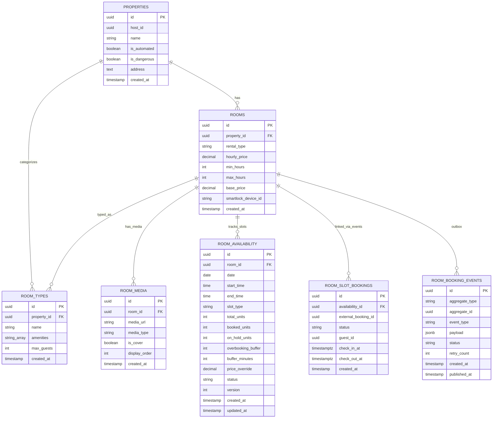
```mermaid
erDiagram
    PROPERTIES ||--o{ ROOMS : has
    PROPERTIES ||--o{ ROOM_TYPES : categorizes
    ROOMS ||--o{ ROOM_TYPES : typed_as
    ROOMS ||--o{ ROOM_MEDIA : has_media
    ROOMS ||--o{ ROOM_AVAILABILITY : tracks_slots
    ROOMS ||--o{ ROOM_SLOT_BOOKINGS : linked_via_events
    ROOMS ||--o{ ROOM_BOOKING_EVENTS : outbox

    PROPERTIES {
        uuid id PK
        uuid host_id
        string name
        boolean is_automated
        boolean is_dangerous
        text address
        timestamp created_at
    }

    ROOMS {
        uuid id PK
        uuid property_id FK
        string rental_type
        decimal hourly_price
        int min_hours
        int max_hours
        decimal base_price
        string smartlock_device_id
        timestamp created_at
    }

    ROOM_TYPES {
        uuid id PK
        uuid property_id FK
        string name
        string_array amenities
        int max_guests
        timestamp created_at
    }

    ROOM_MEDIA {
        uuid id PK
        uuid room_id FK
        string media_url
        string media_type
        boolean is_cover
        int display_order
        timestamp created_at
    }

    ROOM_AVAILABILITY {
        uuid id PK
        uuid room_id FK
        date date
        time start_time
        time end_time
        string slot_type
        int total_units
        int booked_units
        int on_hold_units
        int overbooking_buffer
        int buffer_minutes
        decimal price_override
        string status
        int version
        timestamp created_at
        timestamp updated_at
    }

    ROOM_SLOT_BOOKINGS {
        uuid id PK
        uuid availability_id FK
        uuid external_booking_id
        string status
        uuid guest_id
        timestamptz check_in_at
        timestamptz check_out_at
        timestamp created_at
    }

    ROOM_BOOKING_EVENTS {
        uuid id PK
        string aggregate_type
        uuid aggregate_id
        string event_type
        jsonb payload
        string status
        int retry_count
        timestamp created_at
        timestamp published_at
    }
```

### 1b. Booking Service

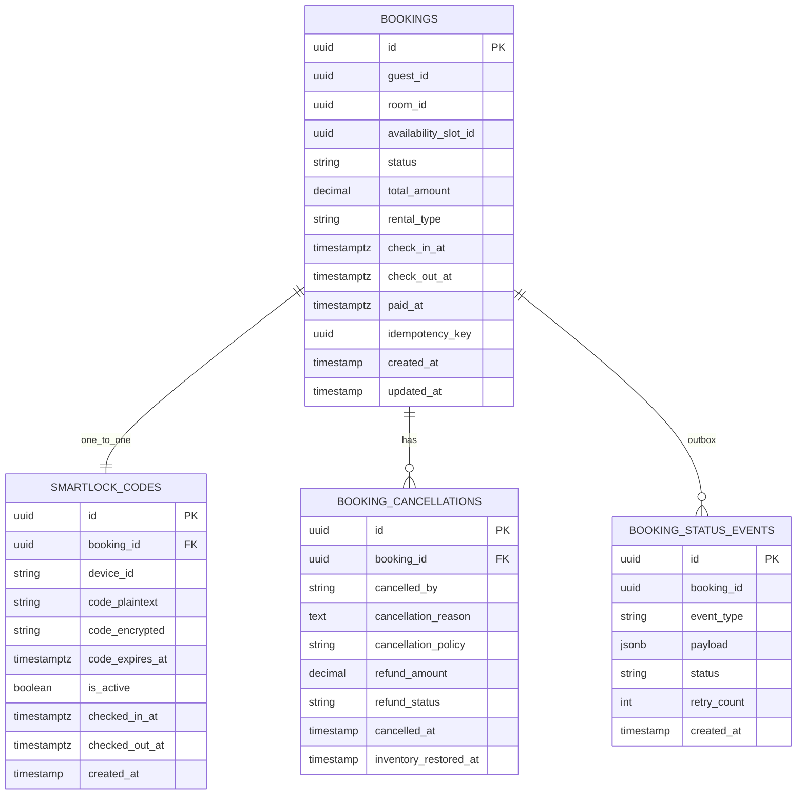
```mermaid
erDiagram
    BOOKINGS ||--|| SMARTLOCK_CODES : one_to_one
    BOOKINGS ||--o{ BOOKING_CANCELLATIONS : has
    BOOKINGS ||--o{ BOOKING_STATUS_EVENTS : outbox

    BOOKINGS {
        uuid id PK
        uuid guest_id
        uuid room_id
        uuid availability_slot_id
        string status
        decimal total_amount
        string rental_type
        timestamptz check_in_at
        timestamptz check_out_at
        timestamptz paid_at
        uuid idempotency_key
        timestamp created_at
        timestamp updated_at
    }

    SMARTLOCK_CODES {
        uuid id PK
        uuid booking_id FK
        string device_id
        string code_plaintext
        string code_encrypted
        timestamptz code_expires_at
        boolean is_active
        timestamptz checked_in_at
        timestamptz checked_out_at
        timestamp created_at
    }

    BOOKING_CANCELLATIONS {
        uuid id PK
        uuid booking_id FK
        string cancelled_by
        text cancellation_reason
        string cancellation_policy
        decimal refund_amount
        string refund_status
        timestamp cancelled_at
        timestamp inventory_restored_at
    }

    BOOKING_STATUS_EVENTS {
        uuid id PK
        uuid booking_id
        string event_type
        jsonb payload
        string status
        int retry_count
        timestamp created_at
    }
```

### 1c. User Service

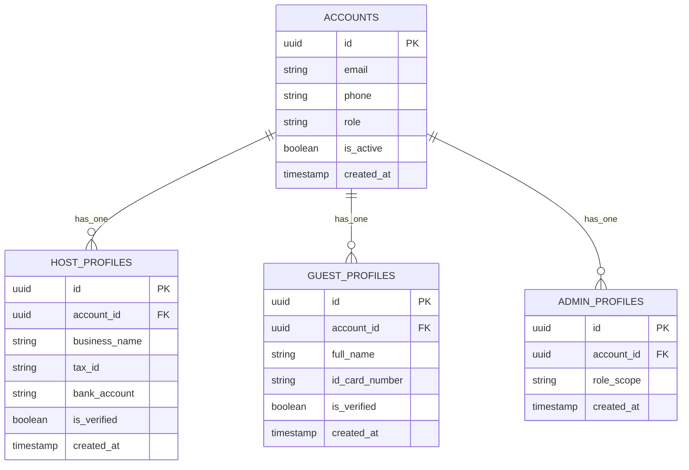
```mermaid
erDiagram
    ACCOUNTS ||--o{ HOST_PROFILES : has_one
    ACCOUNTS ||--o{ GUEST_PROFILES : has_one
    ACCOUNTS ||--o{ ADMIN_PROFILES : has_one

    ACCOUNTS {
        uuid id PK
        string email
        string phone
        string role
        boolean is_active
        timestamp created_at
    }

    HOST_PROFILES {
        uuid id PK
        uuid account_id FK
        string business_name
        string tax_id
        string bank_account
        boolean is_verified
        timestamp created_at
    }

    GUEST_PROFILES {
        uuid id PK
        uuid account_id FK
        string full_name
        string id_card_number
        boolean is_verified
        timestamp created_at
    }

    ADMIN_PROFILES {
        uuid id PK
        uuid account_id FK
        string role_scope
        timestamp created_at
    }
```

### 1d. Domain Event Contract

| Event Name | Emitter | Consumers | Payload |
|---|---|---|---|
| ROOM_AVAILABILITY_RESERVED | Room Service | Booking Service | slot_id, room_id, check_in, check_out, guest_id |
| ROOM_AVAILABILITY_CONFIRMED | Room Service | Booking Service | slot_id, booking_id |
| ROOM_AVAILABILITY_RELEASED | Room Service | Booking Service | slot_id, reason |
| ROOM_STATUS_CHANGED | Room Service | OTA Sync Service | room_id, old_status, new_status |
| BOOKING_CONFIRMED | Booking Service | Room Service | booking_id, slot_id |
| BOOKING_CANCELLED | Booking Service | Room Service | booking_id, slot_id, refund_status |
| CHECKIN_COMPLETED | Booking Service | Room Service | booking_id, slot_id, checked_in_at |
| CHECKOUT_COMPLETED | Booking Service | Room Service | booking_id, slot_id, checked_out_at |

---

## 2. Booking Flow — 2-Transaction Architecture

### 2a. Stage 1 — Temporary Hold (Room Service)

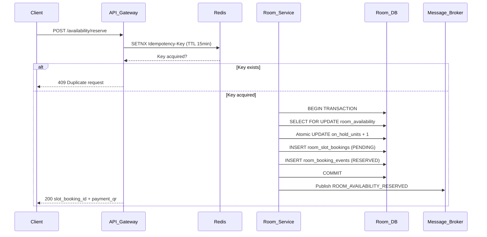
```mermaid
sequenceDiagram
    participant Client
    participant API_Gateway
    participant Redis
    participant Room_Service
    participant Room_DB
    participant Message_Broker

    Client->>API_Gateway: POST /availability/reserve
    API_Gateway->>Redis: SETNX Idempotency-Key (TTL 15min)
    Redis-->>API_Gateway: Key acquired?

    alt Key exists
        API_Gateway-->>Client: 409 Duplicate request
    else Key acquired
        Room_Service->>Room_DB: BEGIN TRANSACTION
        Room_Service->>Room_DB: SELECT FOR UPDATE room_availability
        Room_Service->>Room_DB: Atomic UPDATE on_hold_units + 1
        Room_Service->>Room_DB: INSERT room_slot_bookings (PENDING)
        Room_Service->>Room_DB: INSERT room_booking_events (RESERVED)
        Room_Service->>Room_DB: COMMIT
        Room_Service->>Message_Broker: Publish ROOM_AVAILABILITY_RESERVED
        API_Gateway-->>Client: 200 slot_booking_id + payment_qr
    end
```

### 2b. Stage 1b — Booking Service Creates Record (Event-Driven)

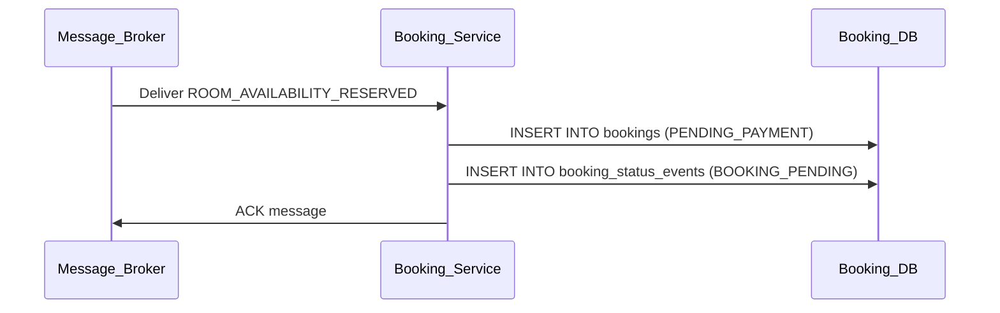
```mermaid
sequenceDiagram
    participant Message_Broker
    participant Booking_Service
    participant Booking_DB

    Message_Broker->>Booking_Service: Deliver ROOM_AVAILABILITY_RESERVED
    Booking_Service->>Booking_DB: INSERT INTO bookings (PENDING_PAYMENT)
    Booking_Service->>Booking_DB: INSERT INTO booking_status_events (BOOKING_PENDING)
    Booking_Service->>Message_Broker: ACK message
```

### 2c. Stage 2 — Payment Result via Events

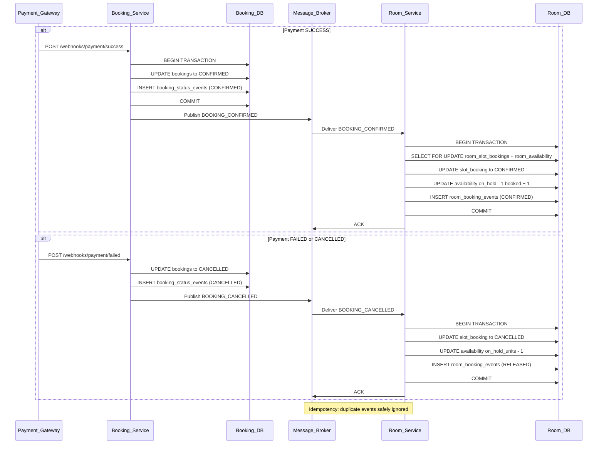
```mermaid
sequenceDiagram
    participant Payment_Gateway
    participant Booking_Service
    participant Booking_DB
    participant Message_Broker
    participant Room_Service
    participant Room_DB

    alt Payment SUCCESS
        Payment_Gateway->>Booking_Service: POST /webhooks/payment/success
        Booking_Service->>Booking_DB: BEGIN TRANSACTION
        Booking_Service->>Booking_DB: UPDATE bookings to CONFIRMED
        Booking_Service->>Booking_DB: INSERT booking_status_events (CONFIRMED)
        Booking_Service->>Booking_DB: COMMIT
        Booking_Service->>Message_Broker: Publish BOOKING_CONFIRMED

        Message_Broker->>Room_Service: Deliver BOOKING_CONFIRMED
        Room_Service->>Room_DB: BEGIN TRANSACTION
        Room_Service->>Room_DB: SELECT FOR UPDATE room_slot_bookings + room_availability
        Room_Service->>Room_DB: UPDATE slot_booking to CONFIRMED
        Room_Service->>Room_DB: UPDATE availability on_hold - 1 booked + 1
        Room_Service->>Room_DB: INSERT room_booking_events (CONFIRMED)
        Room_Service->>Room_DB: COMMIT
        Room_Service->>Message_Broker: ACK
    end

    alt Payment FAILED or CANCELLED
        Payment_Gateway->>Booking_Service: POST /webhooks/payment/failed
        Booking_Service->>Booking_DB: UPDATE bookings to CANCELLED
        Booking_Service->>Booking_DB: INSERT booking_status_events (CANCELLED)
        Booking_Service->>Message_Broker: Publish BOOKING_CANCELLED

        Message_Broker->>Room_Service: Deliver BOOKING_CANCELLED
        Room_Service->>Room_DB: BEGIN TRANSACTION
        Room_Service->>Room_DB: UPDATE slot_booking to CANCELLED
        Room_Service->>Room_DB: UPDATE availability on_hold_units - 1
        Room_Service->>Room_DB: INSERT room_booking_events (RELEASED)
        Room_Service->>Room_DB: COMMIT
        Room_Service->>Message_Broker: ACK
    end

    Note over Message_Broker,Room_Service: Idempotency: duplicate events safely ignored
```

### 2d. Pending Booking Expiration (Cron)

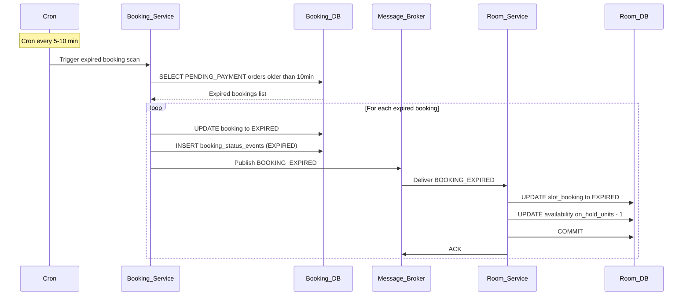
```mermaid
sequenceDiagram
    participant Cron
    participant Booking_Service
    participant Booking_DB
    participant Message_Broker
    participant Room_Service
    participant Room_DB

    Note over Cron: Cron every 5-10 min
    Cron->>Booking_Service: Trigger expired booking scan
    Booking_Service->>Booking_DB: SELECT PENDING_PAYMENT orders older than 10min
    Booking_DB-->>Booking_Service: Expired bookings list

    loop For each expired booking
        Booking_Service->>Booking_DB: UPDATE booking to EXPIRED
        Booking_Service->>Booking_DB: INSERT booking_status_events (EXPIRED)
        Booking_Service->>Message_Broker: Publish BOOKING_EXPIRED
        Message_Broker->>Room_Service: Deliver BOOKING_EXPIRED
        Room_Service->>Room_DB: UPDATE slot_booking to EXPIRED
        Room_Service->>Room_DB: UPDATE availability on_hold_units - 1
        Room_Service->>Room_DB: COMMIT
        Room_Service->>Message_Broker: ACK
    end
```

---

## 3. Concurrency Control

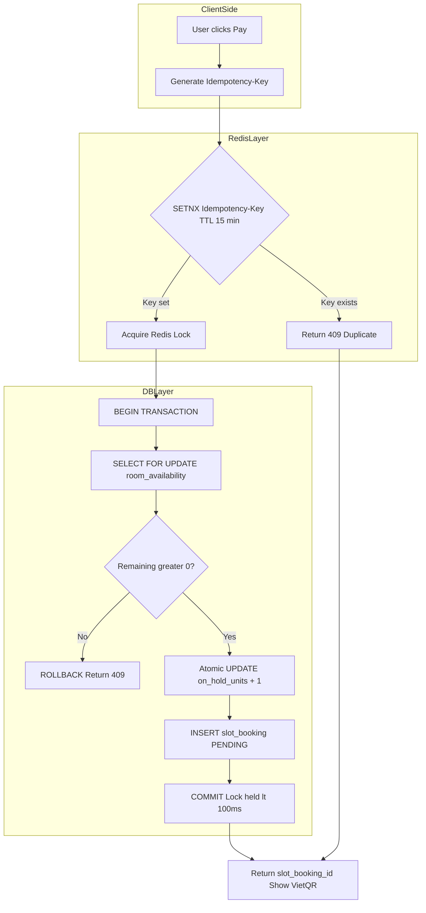
```mermaid
flowchart TB
    subgraph ClientSide
        A1[User clicks Pay] --> A2[Generate Idempotency-Key]
    end

    subgraph RedisLayer
        A2 --> C1{SETNX Idempotency-Key TTL 15 min}
        C1 -->|Key set| D1[Acquire Redis Lock]
        C1 -->|Key exists| E1[Return 409 Duplicate]
    end

    subgraph DBLayer
        D1 --> F1[BEGIN TRANSACTION]
        F1 --> G1[SELECT FOR UPDATE room_availability]
        G1 --> H1{Remaining greater 0?}
        H1 -->|No| I1[ROLLBACK Return 409]
        H1 -->|Yes| J1[Atomic UPDATE on_hold_units + 1]
        J1 --> K1[INSERT slot_booking PENDING]
        K1 --> L1[COMMIT Lock held lt 100ms]
    end

    L1 --> M1[Return slot_booking_id Show VietQR]
    E1 --> M1
```

| Scenario | Redis Lock | DB Pessimistic Lock | Combined |
|---|---|---|---|
| 100 users 1 room | 99 rejected fast at Redis | 1 proceeds | Best |
| Redis down | Bypassed | DB lock works alone | Graceful degradation |
| Flash sale 1000 req/s | All non-first rejected instantly | Only winner enters DB | Anti-retry-storm |

---

## 4. Rental Model — DAILY vs HOURLY

### 4a. DAILY Rental Timeline


```mermaid
gantt
    title DAILY Rental: 1 Room = 1 Day Slot
    dateFormat  YYYY-MM-DD HH:mm
    axisFormat  %H:%M

    section Day 2026-05-20
    Available         :done,    a1, 2026-05-20 00:00, 14h
    CHECKIN_WINDOW    :milestone, m1, 2026-05-20 14:00, 0h
    Booking_A         :active,  a2, 2026-05-20 14:00, 22h
    CHECKOUT_BUFFER  :crit,   a3, 2026-05-20 12:00, 30m
    Available         :done,    a4, 2026-05-20 12:30, 14h

    section Day 2026-05-21
    Available         :done,    b1, 2026-05-21 00:00, 14h
    CHECKIN_WINDOW   :milestone, m2, 2026-05-21 14:00, 0h
    Booking_B         :active,  b2, 2026-05-21 14:00, 22h
```

### 4b. HOURLY Rental Timeline


```mermaid
gantt
    title HOURLY Rental: Multiple Slots Per Day
    dateFormat  YYYY-MM-DD HH:mm
    axisFormat  %H:%M

    section Day 2026-05-20
    Slot_00_to_01    :done,    s1, 2026-05-20 00:00, 1h
    Buffer_cleaning  :crit,    b1, 2026-05-20 01:00, 30m
    Slot_01_to_02    :done,    s2, 2026-05-20 01:30, 1h
    Buffer_cleaning  :crit,    b2, 2026-05-20 02:30, 30m
    Slot_03_to_04    :done,    s3, 2026-05-20 03:00, 1h
    Buffer_cleaning  :crit,    b3, 2026-05-20 04:00, 30m
    Slot_04_to_05    :done,    s4, 2026-05-20 04:30, 1h
    Buffer_cleaning  :crit,    b5, 2026-05-20 05:30, 30m
    Available        :done,    s6, 2026-05-20 06:00, 8h
    Booking_C        :active,  s7, 2026-05-20 14:00, 3h
```

### 4c. Hourly Slot Generation Logic

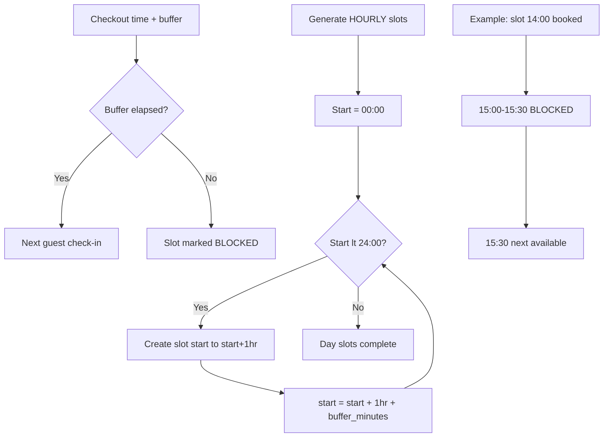
```mermaid
flowchart TD
    A[Checkout time + buffer] --> B{Buffer elapsed?}
    B -->|Yes| C[Next guest check-in]
    B -->|No| D[Slot marked BLOCKED]

    E[Generate HOURLY slots] --> F[Start = 00:00]
    F --> G{Start lt 24:00?}
    G -->|Yes| H[Create slot start to start+1hr]
    H --> I[start = start + 1hr + buffer_minutes]
    I --> G
    G -->|No| J[Day slots complete]

    E2[Example: slot 14:00 booked] --> E2b[15:00-15:30 BLOCKED]
    E2b --> P[15:30 next available]
```

### 4d. Inventory Formula

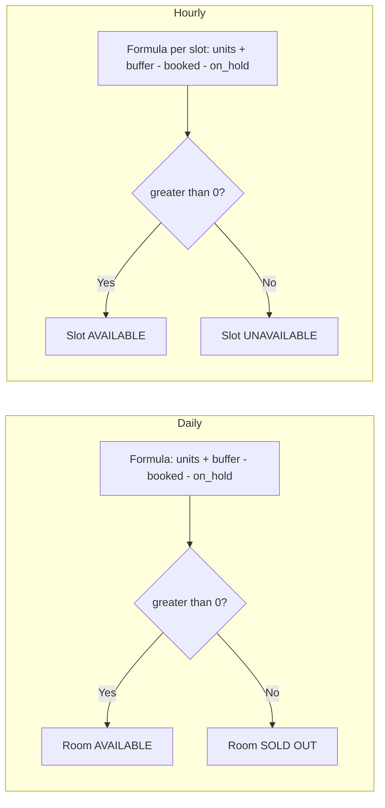
```mermaid
flowchart LR
    subgraph Daily
        D1[Formula: units + buffer - booked - on_hold]
        D2{"greater than 0?"}
        D1 --> D2
        D2 -->|Yes| D3[Room AVAILABLE]
        D2 -->|No| D4[Room SOLD OUT]
    end

    subgraph Hourly
        H1[Formula per slot: units + buffer - booked - on_hold]
        H2{"greater than 0?"}
        H1 --> H2
        H2 -->|Yes| H3[Slot AVAILABLE]
        H2 -->|No| H4[Slot UNAVAILABLE]
    end
```

---

## 5. Room Status After Check-out

### 5a. Daily Model State Machine

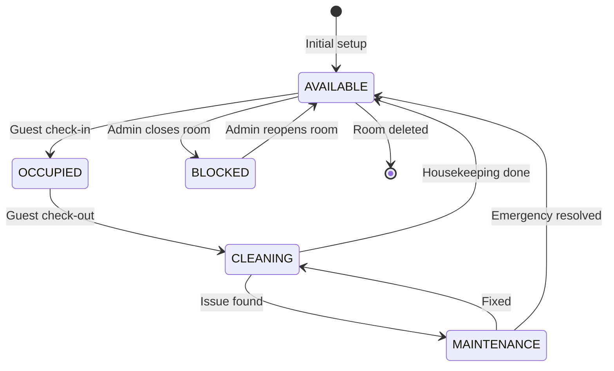
```mermaid
stateDiagram-v2
    [*] --> AVAILABLE: Initial setup
    AVAILABLE --> OCCUPIED: Guest check-in
    OCCUPIED --> CLEANING: Guest check-out
    CLEANING --> AVAILABLE: Housekeeping done
    AVAILABLE --> BLOCKED: Admin closes room
    BLOCKED --> AVAILABLE: Admin reopens room
    AVAILABLE --> [*]: Room deleted
    CLEANING --> MAINTENANCE: Issue found
    MAINTENANCE --> CLEANING: Fixed
    MAINTENANCE --> AVAILABLE: Emergency resolved
```

### 5b. Hourly Model Post Check-out Flow

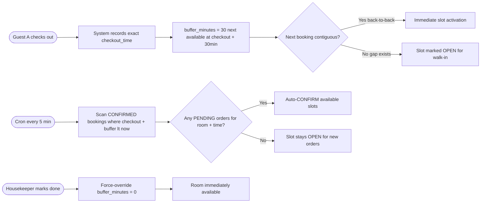
```mermaid
flowchart LR
    A1([Guest A checks out]) --> B1[System records exact checkout_time]
    B1 --> C1[buffer_minutes = 30 next available at checkout + 30min]
    C1 --> D1{Next booking contiguous?}

    D1 -->|Yes back-to-back| E1[Immediate slot activation]
    D1 -->|No gap exists| F1[Slot marked OPEN for walk-in]

    G1([Cron every 5 min]) --> H1[Scan CONFIRMED bookings where checkout + buffer lt now]
    H1 --> I1{Any PENDING orders for room + time?}
    I1 -->|Yes| J1[Auto-CONFIRM available slots]
    I1 -->|No| K1[Slot stays OPEN for new orders]

    L1([Housekeeper marks done]) --> M1[Force-override buffer_minutes = 0]
    M1 --> N1[Room immediately available]
```

### 5c. State Transition Guard

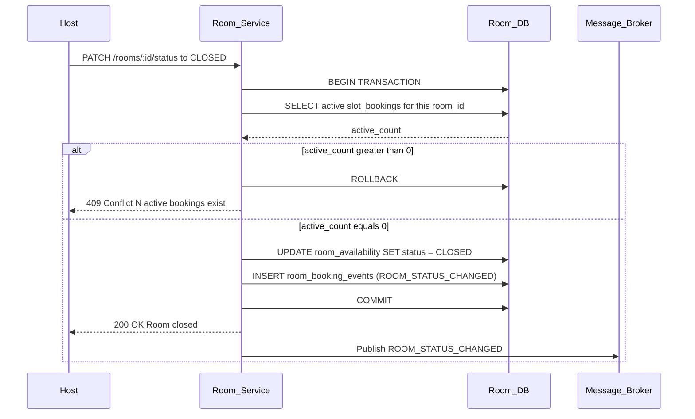
```mermaid
sequenceDiagram
    participant Host
    participant Room_Service
    participant Room_DB

    Host->>Room_Service: PATCH /rooms/:id/status to CLOSED

    Room_Service->>Room_DB: BEGIN TRANSACTION
    Room_Service->>Room_DB: SELECT active slot_bookings for this room_id
    Room_DB-->>Room_Service: active_count

    alt active_count greater than 0
        Room_Service->>Room_DB: ROLLBACK
        Room_Service-->>Host: 409 Conflict N active bookings exist
    else active_count equals 0
        Room_Service->>Room_DB: UPDATE room_availability SET status = CLOSED
        Room_Service->>Room_DB: INSERT room_booking_events (ROOM_STATUS_CHANGED)
        Room_Service->>Room_DB: COMMIT
        Room_Service-->>Host: 200 OK Room closed
        Room_Service->>Message_Broker: Publish ROOM_STATUS_CHANGED
    end
```

---

## 6. Smartlock Integration Flow

### 6a. Check-in Flow

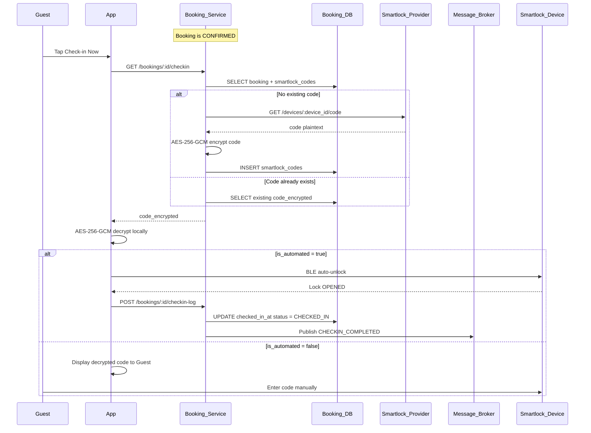
```mermaid
sequenceDiagram
    participant Guest
    participant App
    participant Booking_Service
    participant Booking_DB
    participant Smartlock_Provider
    participant Message_Broker

    Note over Booking_Service: Booking is CONFIRMED
    Guest->>App: Tap Check-in Now
    App->>Booking_Service: GET /bookings/:id/checkin
    Booking_Service->>Booking_DB: SELECT booking + smartlock_codes

    alt No existing code
        Booking_Service->>Smartlock_Provider: GET /devices/:device_id/code
        Smartlock_Provider-->>Booking_Service: code plaintext
        Booking_Service->>Booking_Service: AES-256-GCM encrypt code
        Booking_Service->>Booking_DB: INSERT smartlock_codes
    else Code already exists
        Booking_Service->>Booking_DB: SELECT existing code_encrypted
    end

    Booking_Service-->>App: code_encrypted
    App->>App: AES-256-GCM decrypt locally

    alt is_automated = true
        App->>Smartlock_Device: BLE auto-unlock
        Smartlock_Device-->>App: Lock OPENED
        App->>Booking_Service: POST /bookings/:id/checkin-log
        Booking_Service->>Booking_DB: UPDATE checked_in_at status = CHECKED_IN
        Booking_Service->>Message_Broker: Publish CHECKIN_COMPLETED
    else is_automated = false
        App->>App: Display decrypted code to Guest
        Guest->>Smartlock_Device: Enter code manually
    end
```

### 6b. Check-out and Code Revocation

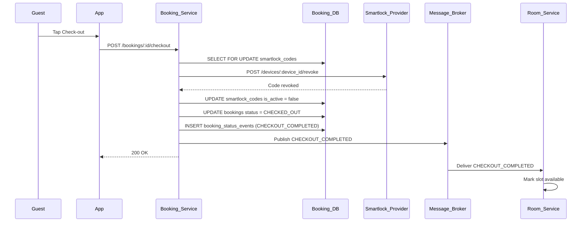
```mermaid
sequenceDiagram
    participant Guest
    participant App
    participant Booking_Service
    participant Booking_DB
    participant Smartlock_Provider
    participant Message_Broker
    participant Room_Service

    Guest->>App: Tap Check-out
    App->>Booking_Service: POST /bookings/:id/checkout
    Booking_Service->>Booking_DB: SELECT FOR UPDATE smartlock_codes
    Booking_Service->>Smartlock_Provider: POST /devices/:device_id/revoke
    Smartlock_Provider-->>Booking_Service: Code revoked
    Booking_Service->>Booking_DB: UPDATE smartlock_codes is_active = false
    Booking_Service->>Booking_DB: UPDATE bookings status = CHECKED_OUT
    Booking_Service->>Booking_DB: INSERT booking_status_events (CHECKOUT_COMPLETED)
    Booking_Service->>Message_Broker: Publish CHECKOUT_COMPLETED
    Booking_Service-->>App: 200 OK

    Message_Broker->>Room_Service: Deliver CHECKOUT_COMPLETED
    Room_Service->>Room_Service: Mark slot available
```

### 6c. Smartlock Security Architecture

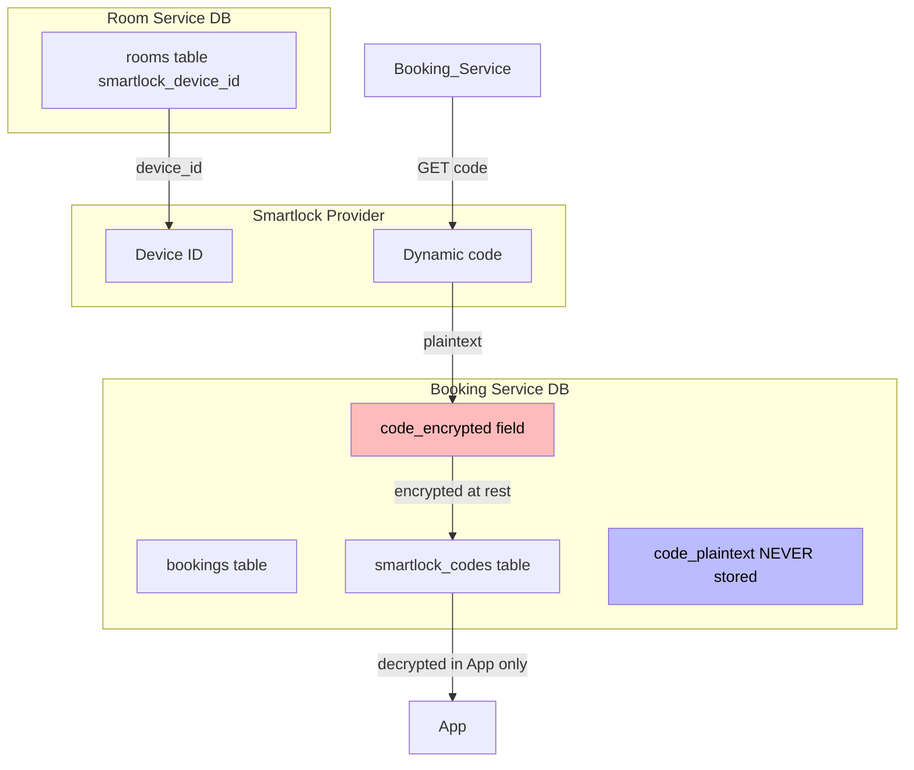
```mermaid
flowchart TD
    subgraph BookingServiceDB[Booking Service DB]
        B1[bookings table]
        B2[smartlock_codes table]
        B3[code_encrypted field]
        B4[code_plaintext NEVER stored]
    end

    subgraph RoomServiceDB[Room Service DB]
        R1[rooms table smartlock_device_id]
    end

    subgraph SmartlockProvider[Smartlock Provider]
        P1[Device ID]
        P2[Dynamic code]
    end

    R1 -->|device_id| P1
    Booking_Service -->|GET code| P2
    P2 -->|plaintext| B3
    B3 -->|encrypted at rest| B2
    B2 -->|decrypted in App only| App

    style B4 fill:#bbf,color:#000
    style B3 fill:#fbb,color:#000
```

---

## 7. OTA Inventory Sync

### 7a. Three Sync Methods

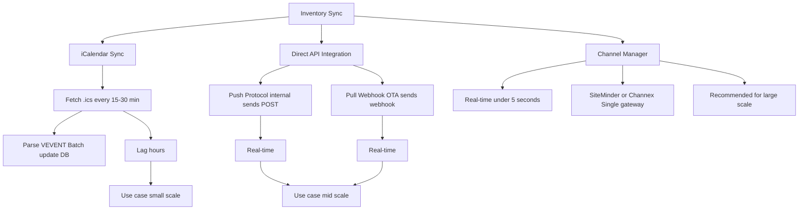
```mermaid
flowchart TD
    ROOT[Inventory Sync] --> ICAL[iCalendar Sync]
    ROOT --> DAPI[Direct API Integration]
    ROOT --> CM[Channel Manager]

    ICAL --> ICAL_C[Fetch .ics every 15-30 min]
    ICAL_C --> ICAL_P[Parse VEVENT Batch update DB]
    ICAL_C --> ICAL_L[Lag hours]
    ICAL_L --> ICAL_U[Use case small scale]

    DAPI --> PUSH[Push Protocol internal sends POST]
    DAPI --> PULL[Pull Webhook OTA sends webhook]
    PUSH --> PUSH_R[Real-time]
    PULL --> PULL_R[Real-time]
    PUSH_R --> DAPI_U[Use case mid scale]
    PULL_R --> DAPI_U

    CM --> CM_RT[Real-time under 5 seconds]
    CM --> CM_EX[SiteMinder or Channex Single gateway]
    CM --> CM_U[Recommended for large scale]
```

### 7b. iCalendar Sync Flow

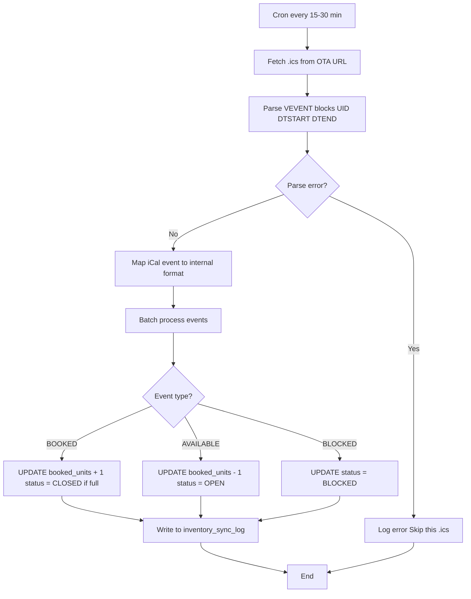
```mermaid
flowchart TD
    A[Cron every 15-30 min] --> B[Fetch .ics from OTA URL]
    B --> C[Parse VEVENT blocks UID DTSTART DTEND]
    C --> D{Parse error?}

    D -->|Yes| E[Log error Skip this .ics]
    D -->|No| F[Map iCal event to internal format]

    F --> G[Batch process events]
    G --> H{Event type?}

    H -->|BOOKED| I[UPDATE booked_units + 1 status = CLOSED if full]
    H -->|AVAILABLE| J[UPDATE booked_units - 1 status = OPEN]
    H -->|BLOCKED| K[UPDATE status = BLOCKED]

    I --> L[Write to inventory_sync_log]
    J --> L
    K --> L
    L --> M[End]
    E --> M
```

### 7c. Channel Manager Real-time Sync

```mermaid
sequenceDiagram
    participant OTA
    participant Channel_Manager
    participant Room_Service_API
    participant Room_Service_DB

    Note over OTA,Room_Service_DB: PULL: Room Service polls Channel Manager
    Room_Service_API->>Channel_Manager: GET /availability property_id from to
    Channel_Manager-->>Room_Service_API: rooms and rates JSON
    Room_Service_API->>Room_Service_DB: Batch upsert room_availability
    Room_Service_DB-->>Room_Service_API: Updated

    Note over OTA,Room_Service_DB: PUSH: Real-time booking notification
    OTA->>Channel_Manager: POST /bookings reservation
    Channel_Manager->>Room_Service_API: POST /internal/webhooks/booking
    Room_Service_API->>Room_Service_DB: BEGIN TRANSACTION
    Room_Service_API->>Room_Service_DB: SELECT FOR UPDATE room_availability
    Room_Service_API->>Room_Service_DB: UPDATE booked_units + 1
    Room_Service_API->>Room_Service_DB: INSERT booking record
    Room_Service_API->>Room_Service_DB: COMMIT
    Room_Service_API-->>Channel_Manager: 200 OK
    Channel_Manager-->>OTA: 200 OK
```

---

## 8. Full System Context

```mermaid
flowchart TB
    subgraph External[External Systems]
        OTA1[iCalendar Feed]
        OTA2[Direct API Webhook]
        OTA3[Channel Manager]
        Payment[Payment Gateway VietQR]
        Smartlock[Smartlock Provider]
    end

    subgraph Broker[Message Broker]
        T1[room.availability.reserved]
        T2[room.availability.released]
        T3[booking.confirmed]
        T4[booking.cancelled]
        T5[booking.checkin]
        T6[booking.checkout]
    end

    subgraph RoomService[Room Service]
        RS_API[REST API]
        RS_Cron[OTA iCal Cron]
        RS_Outbox[Outbox Relay]
    end

    subgraph RoomServiceDB[Room Service DB]
        T1b[properties]
        T2b[rooms]
        T3b[room_types]
        T4b[room_media]
        T5b[room_availability]
        T6b[create_room_requests]
        T7b[room_slot_bookings]
        T8b[room_booking_events]
    end

    subgraph BookingService[Booking Service]
        BS_API[REST API]
        BS_Smartlock[Smartlock Service]
        BS_Outbox[Outbox Relay]
    end

    subgraph BookingServiceDB[Booking Service DB]
        B1[bookings]
        B2[smartlock_codes]
        B3[booking_cancellations]
        B4[booking_status_events]
    end

    subgraph UserService[User Service]
        US_API[REST API]
    end

    subgraph UserServiceDB[User Service DB]
        U1[accounts]
        U2[host_profiles]
        U3[guest_profiles]
    end

    subgraph OTASync[OTA Sync Service]
        OTAS_API[OTA Sync API]
    end

    External --> RS_Cron
    RS_Cron --> OTA1
    Payment --> BS_API
    Smartlock --> BS_Smartlock

    RS_API --> T1b & T2b & T3b & T4b & T5b & T6b & T7b & T8b
    RS_Outbox -.->|publish| T1 & T2 & T6
    RS_Outbox -.->|consume| T3 & T4 & T5

    BS_API --> B1 & B2 & B3 & B4
    BS_Outbox -.->|publish| T3 & T4 & T5 & T6
    BS_Outbox -.->|consume| T1 & T2

    T1 -.->|consume| BS_API
    T2 -.->|consume| BS_API
    T3 -.->|consume| RS_API
    T4 -.->|consume| RS_API
    T5 -.->|consume| RS_API
    T6 -.->|consume| RS_API

    RS_API -.->|query UUID| U1
    BS_API -.->|query UUID| U1

    OTAS_API --> T5b
    RS_API --> OTAS_API
```

---

## 9. Atomic Update — Inventory Query Logic

```mermaid
flowchart TD
    A[Incoming booking request] --> B[Atomic UPDATE statement]
    B --> C[UPDATE room_availability]
    B --> D[SET on_hold_units = on_hold_units + 1]
    B --> E[WHERE availability gt 0]
    E --> F{"Rows affected = 1?"}

    F -->|Yes| H[Hold SUCCESS Create PENDING record]
    F -->|No| I[No availability Return 409]

    style H fill:#bbf,color:#000
    style I fill:#fbb,color:#000
```

**Inventory availability query (read-only):**

```sql
SELECT room_id, start_time, end_time
FROM room_availability
WHERE date BETWEEN :checkin AND :checkout
  AND (total_units + overbooking_buffer - booked_units - on_hold_units) > 0
  AND status = 'OPEN'
  AND slot_type = :rental_type
ORDER BY date, start_time;
```

---

## 10. Microservice Design Principles

### 10a. Database per Service

```mermaid
flowchart LR
    subgraph S1[Room Service]
        D1[room_availability<br/>room_slot_bookings<br/>room_booking_events]
    end
    subgraph S2[Booking Service]
        D2[bookings<br/>smartlock_codes<br/>booking_status_events]
    end
    subgraph S3[User Service]
        D3[accounts<br/>host_profiles]
    end
    subgraph B[Message Broker]
        MB[Kafka or RabbitMQ]
    end

    D1 -.-> MB
    D2 -.-> MB
    D3 -.-> MB
```

### 10b. Communication Rules

| Rule | Applied |
|------|---------|
| No DB-level FK across services | UUID only no FK constraints |
| Services communicate via events | All booking state changes via message broker |
| Local data projection | Room Service has room_slot_bookings |
| Outbox pattern | Every service has its own _events outbox |
| Idempotency at consumer | Duplicate events safely ignored |
| API for queries events for state | Reads go through API state changes via events |

### 10c. Data Ownership

| Data | Owner | Consumers |
|------|-------|-----------|
| room_availability | Room Service | Booking Service reads OTA Sync writes |
| room_slot_bookings | Room Service | Booking Service event-driven |
| bookings | Booking Service | Room Service event-driven |
| smartlock_codes | Booking Service | Smartlock Provider App |
| accounts | User Service | Room Service Booking Service reads UUID only |
| properties | Room Service | OTA Sync reads |

### 10d. Saga Pattern

```mermaid
sequenceDiagram
    participant Guest
    participant Room_Service
    participant Message_Broker
    participant Booking_Service
    participant Payment_Gateway

    Guest->>Room_Service: Reserve slot Step 1 of Saga
    Room_Service->>Room_Service: Reserve availability
    Room_Service->>Message_Broker: Publish ROOM_AVAILABILITY_RESERVED
    Room_Service-->>Guest: 200 slot reserved

    Message_Broker->>Booking_Service: Deliver event
    Booking_Service->>Booking_Service: Create booking record + VietQR

    Note over Booking_Service,Payment_Gateway: Compensating transaction on failure
    Payment_Gateway-->>Booking_Service: Payment timeout
    Booking_Service->>Booking_Service: Cancel booking
    Booking_Service->>Message_Broker: Publish BOOKING_CANCELLED
    Message_Broker->>Room_Service: Deliver event
    Room_Service->>Room_Service: Release availability slot
```

---

*Generated: 2026-05-20 — Homi 1.0 Room Service Database Design*
