# Homi 1.0 — Thiết kế Database Room Service

---

## 1. ERD — Kiến trúc Microservice (3 Bounded Context)

### 1a. Room Service


### 1b. Booking Service

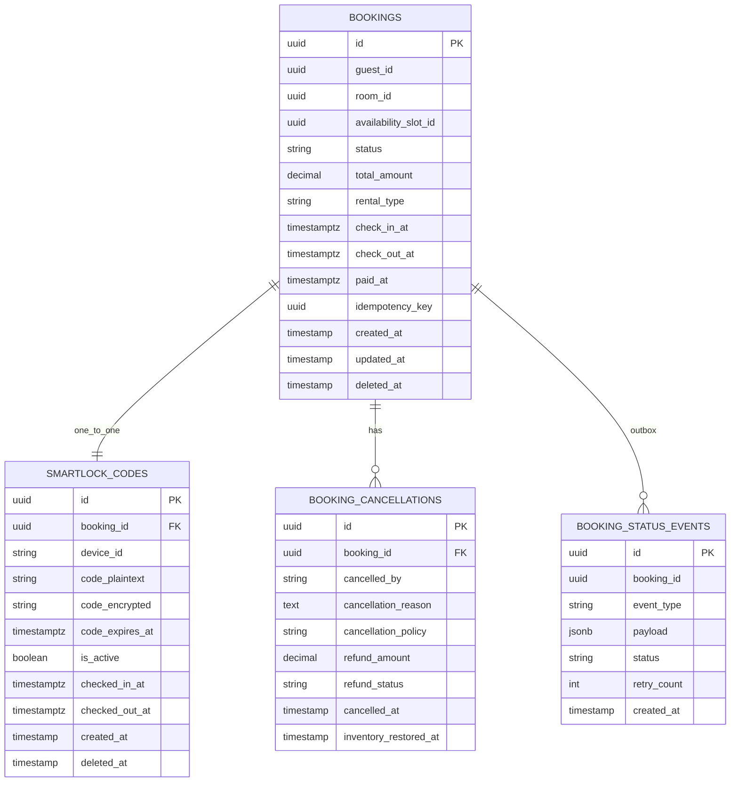

### 1c. User Service

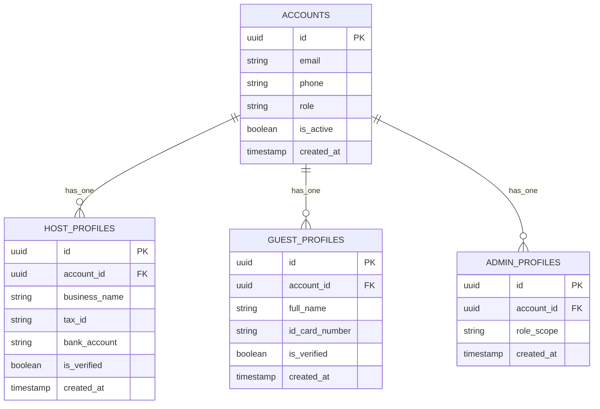

### 1d. Hợp đồng Domain Event

| Event Name | Emitter | Consumers | Payload |
|---|---|---|---|
| ROOM_AVAILABILITY_RESERVED | Room Service | Booking Service | slot_id, room_id, check_in, check_out, guest_id |
| ROOM_AVAILABILITY_CONFIRMED | Room Service | Booking Service | slot_id, booking_id |
| ROOM_AVAILABILITY_RELEASED | Room Service | Booking Service | slot_id, reason |
| ROOM_STATUS_CHANGED | Room Service | OTA Sync Service | room_id, old_status, new_status |
| BOOKING_CONFIRMED | Booking Service | Room Service | booking_id, slot_id |
| BOOKING_CANCELLED | Booking Service | Room Service | booking_id, slot_id, refund_status |
| CHECKIN_COMPLETED | Booking Service | Room Service | booking_id, slot_id, checked_in_at |
| CHECKOUT_COMPLETED | Booking Service | Room Service | booking_id, slot_id, checked_out_at |

---

## 2. Luồng Đặt phòng — Kiến trúc 2-Transaction

### 2a. Giai đoạn 1 — Giữ chỗ tạm thời (Room Service)

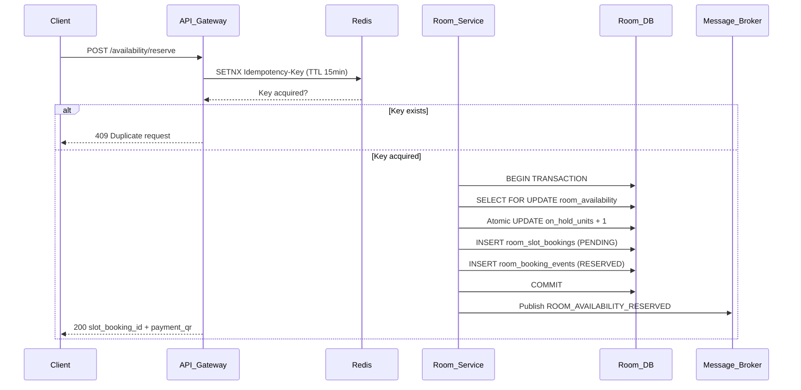

### 2b. Giai đoạn 1b — Booking Service tạo bản ghi (Event-Driven)

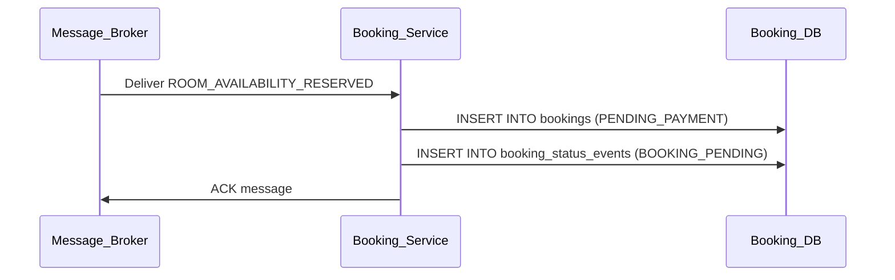

### 2c. Giai đoạn 2 — Kết quả thanh toán qua Events

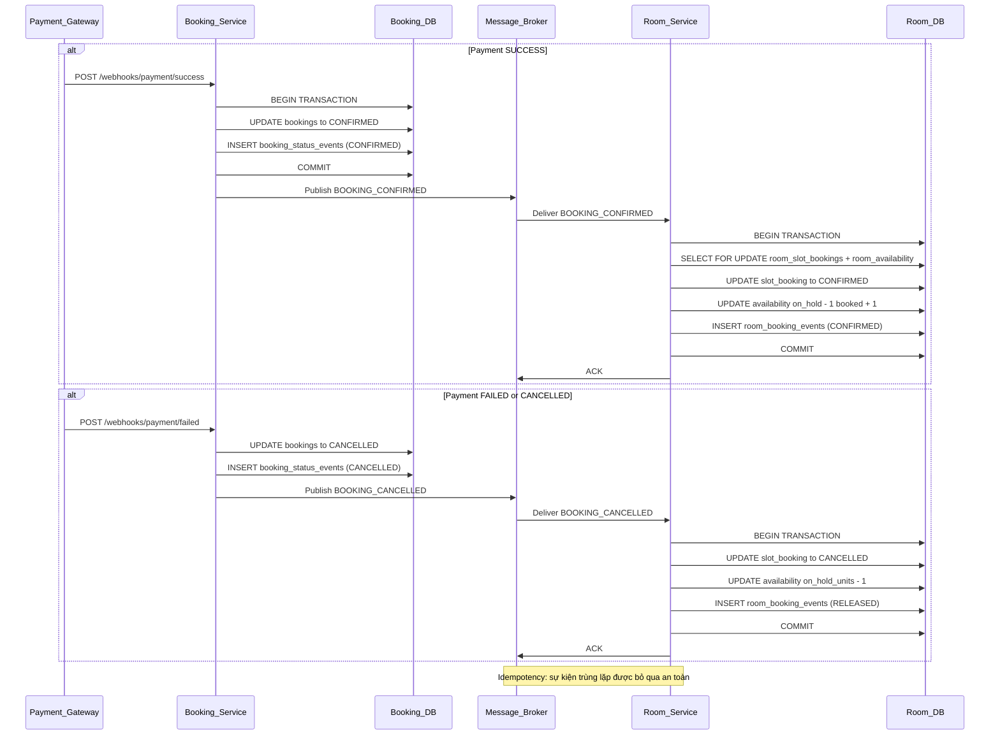

### 2d. Hết hạn Booking đang chờ (Cron)

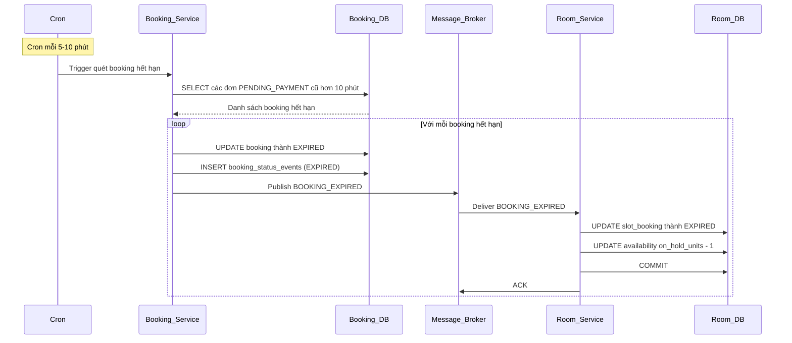

---

## 3. Kiểm soát Concurrency


| Kịch bản | Redis Lock | DB Pessimistic Lock | Kết hợp |
|---|---|---|---|
| 100 users 1 phòng | 99 bị từ chối nhanh tại Redis | 1 tiếp tục | Tốt nhất |
| Redis down | Bị bỏ qua | DB lock hoạt động độc lập | Graceful degradation |
| Flash sale 1000 req/s | Tất cả người không phải đầu tiên bị từ chối ngay | Chỉ người thắng vào DB | Chống retry-storm |

---

## 4. Mô hình thuê — DAILY vs HOURLY

### 4a. Timeline thuê DAILY

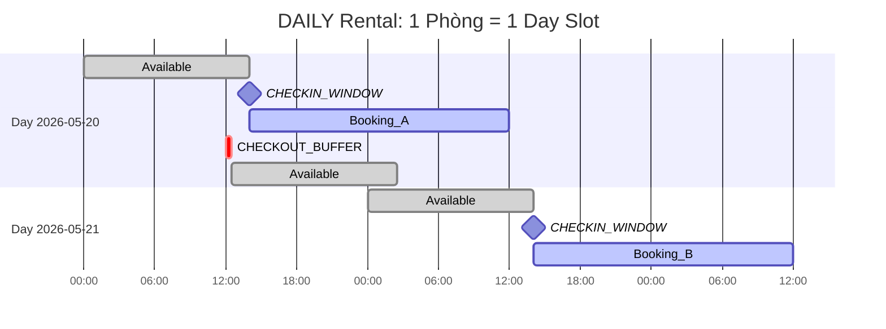

### 4b. Timeline thuê HOURLY

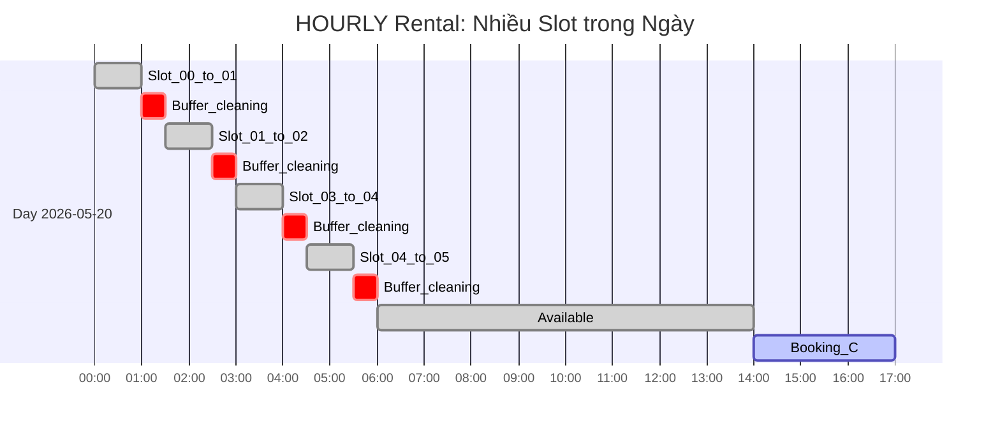

### 4c. Logic sinh Slot theo giờ

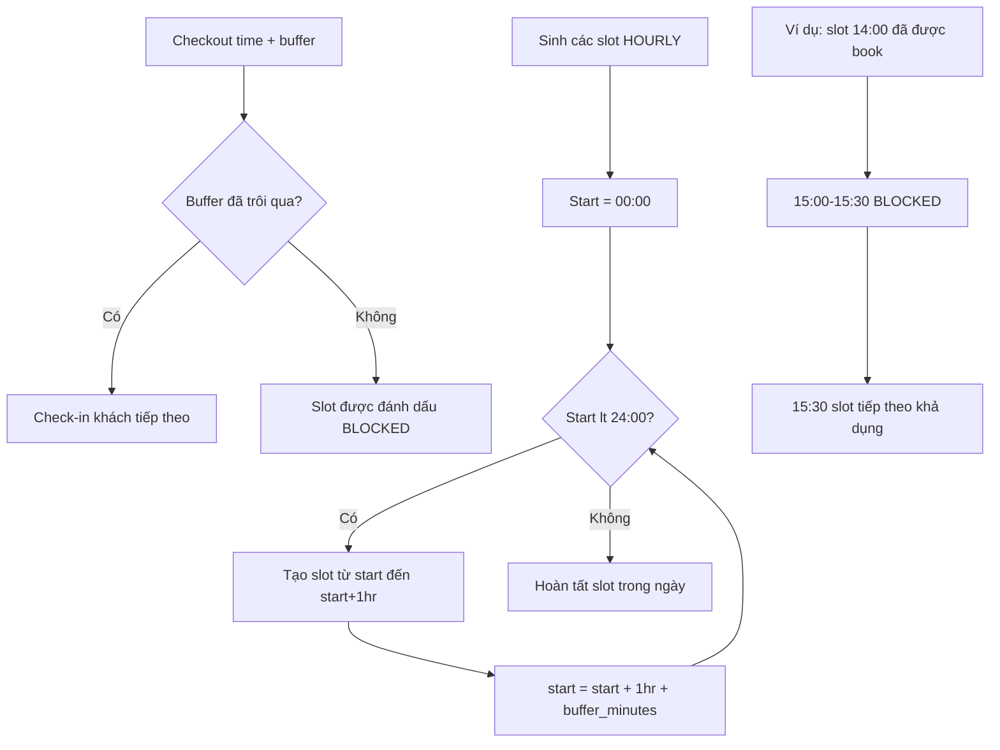

### 4d. Công thức Inventory

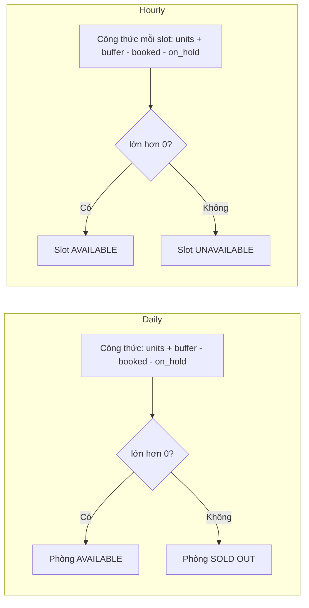

---

## 5. Trạng thái phòng sau Check-out

### 5a. Máy trạng thái hoàn chỉnh của phòng (10 trạng thái)

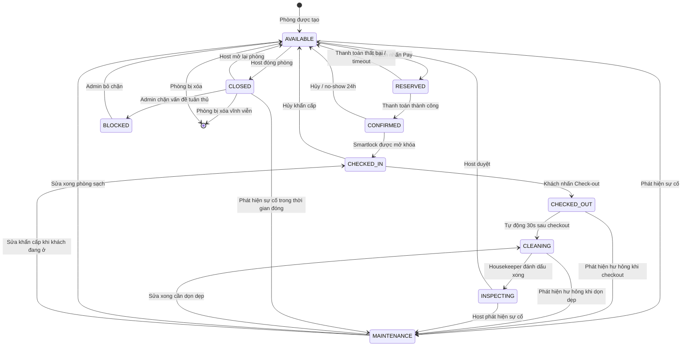

### 5b. Thuê DAILY — Timeline Check-out

```mermaid
gantt
    title DAILY Rental: Timeline trạng thái phòng
    dateFormat HH:mm
    axisFormat %H:%M

    section Room 101
    "OCCUPIED"   :active, o1, 14:00, 10h
    "CLEANING"   :crit,   c1, after o1, 90m
    "AVAILABLE"  :active, a1, after c1, 8h
```

### 5c. Thuê HOURLY — Timeline nhiều booking trong ngày

```mermaid
gantt
    title HOURLY Rental: Nhiều booking trong ngày
    dateFormat HH:mm
    axisFormat %H:%M

    section Room 101
    Booking A  :done, bA1, 08:00, 12h
    Buffer A   :crit, bufA, after bA1, 30m
    Booking B  :done, bB1, 12:30, 04h
    Buffer B   :crit, bufB, after bB1, 30m
    Booking C  :done, bC1, 17:00, 03h
    Buffer C   :crit, bufC, after bC1, 30m
    Walk-in    :milestone, walk, 16:30, 30m
    Walk-in    :milestone, walk2, 20:00, 30m
```

### 5d. Bộ tính Slot khả dụng HOURLY

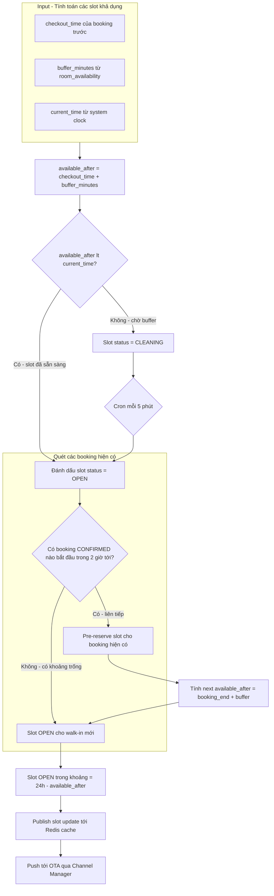

### 5e. Động cơ chuyển trạng thái Checkout → Cleaning → Available

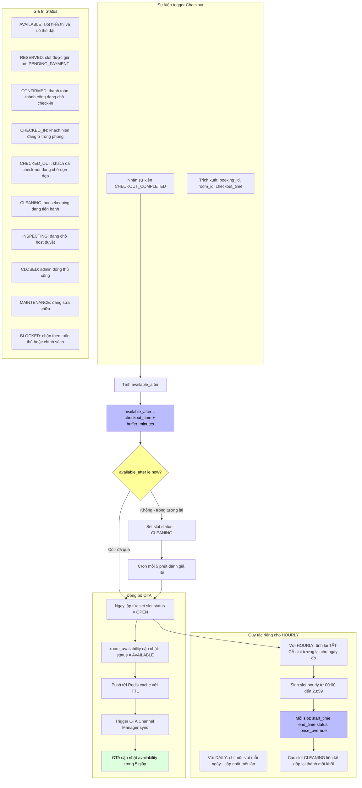

### 5f. Guard chuyển trạng thái — Thay đổi trạng thái bởi Admin

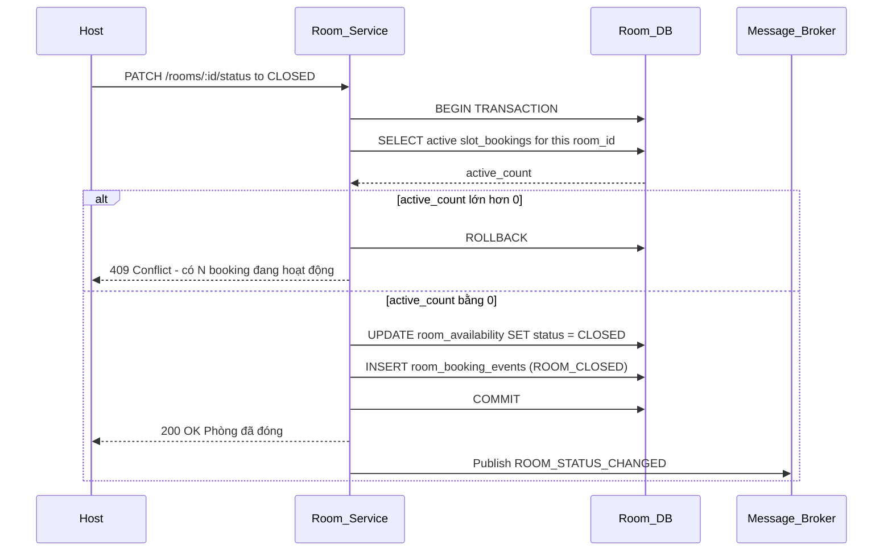

### 5g. Edge case HOURLY — Walk-in và Back-to-Back

```mermaid
flowchart TD
    subgraph BackToBack[Edge case 1: Booking Back-to-Back]
        B1[Khách A CHECKED_OUT lúc 12:00]
        B2[Khách B đã CONFIRMED cho 12:00]
        B1 --> B3{checkout_time + buffer le next_booking_start?}
        B3 -->|Có - không cần buffer| B4[Slot ngay lập tức = CHECKED_IN cho B]
        B3 -->|Không - cần khoảng trống| B5[Chèn slot CLEANING 12:00 đến 12:30]
    end

    subgraph WalkIn[Edge case 2: Walk-in trong khi CLEANING]
        W1[Phòng đang CLEANING: 12:00 đến 12:30]
        W2[Walk-in đến 12:15 muốn phòng 12:30 đến 16:30]
        W2 --> W3{Slot tại 12:30 vẫn đang CLEANING?}
        W3 -->|Có - chưa dọn xong| W4[Hiển thị ước tính khả dụng: 12:30]
        W3 -->|Không - buffer đã trôi qua| W5[Slot là AVAILABLE - cho phép đặt]
    end

    subgraph Overlap[Edge case 3: Booking HOURLY chồng lấn]
        O1[Booking hiện có: 10:00 đến 14:00]
        O2[Booking mới: 12:00 đến 16:00]
        O2 --> O3{Kiểm tra tất cả slot hiện có xem có chồng lấn}
        O3 --> O4[Phát hiện chồng lấn tại 12:00 đến 14:00]
        O4 --> O5[Từ chối: xung đột slot]
        O4 -->|Không chồng lấn| O6[Chấp nhận: 14:00 đến 16:00]
    end

    subgraph Extend[Edge case 4: Gia hạn thời gian ở]
        E1[Khách trong phòng: đã đặt 10:00 đến 12:00]
        E2[Khách muốn gia hạn đến 14:00]
        E2 --> E3{Kiểm tra slot 12:00 đến 14:00 có sẵn?}
        E3 -->|Có sẵn| E4[Gia hạn booking: UPDATE end_time]
        E3 -->|Xung đột tại 13:00| E5[Hiển thị tối đa khả dụng: 13:00]
        E5 --> E6[Đề xuất gia hạn một phần hoặc slot tiếp theo]
    end

    subgraph Overnight[Edge case 5: HOURLY qua đêm]
        ON1[Khách đặt 22:00 đến 06:00 ngày hôm sau]
        ON1 --> ON2[Sinh slot vượt qua ranh giới nửa đêm]
        ON2 --> ON3[Tạo slot cho ngày 1: 22:00-24:00]
        ON3 --> ON4[Tạo slot cho ngày 2: 00:00-06:00]
        ON4 --> ON5[Một booking_id trải qua 2 date partition]
        ON5 --> ON6[Giá = tổng price_override của mỗi slot]
    end

    style B4 fill:#dfd,color:#000
    style W5 fill:#dfd,color:#000
    style O5 fill:#fbb,color:#000
    style E4 fill:#dfd,color:#000
    style ON6 fill:#bbf,color:#000
```

---

## 6. Luồng tích hợp Smartlock

### 6i. Luồng Auto Check-in (Đầy đủ)

> Toàn bộ thiết kế Luồng Auto Check-in được mô tả trong [AutoCheckinFlow.md](./AutoCheckinFlow.md).

```mermaid
flowchart TD
    subgraph BookingConfirmed[Booking CONFIRMED]
        BC1[Payment webhook success]
        BC2[Publish BOOKING_CONFIRMED event]
    end

    subgraph CodeGen[Pipeline tạo mã]
        BC2 --> CG1[Lấy smartlock_device_id từ Room Service]
        CG1 --> CG2[Gọi Smartlock Provider: POST /devices/:id/codes/generate]
        CG2 --> CG3[Nhận code plaintext (chỉ tạm thời)]
        CG3 --> CG4[Derive key: HMAC-SHA256(booking_id, MASTER_KEY)]
        CG4 --> CG5[AES-256-GCM encrypt: code_encrypted + iv + tag]
        CG5 --> CG6[Lưu code_encrypted vào bảng smartlock_codes]
        CG6 --> CG7[Set valid_from = checkin_time, valid_until = checkout_time + buffer]
    end

    subgraph Delivery[Giao mã]
        CG7 --> D1[Push notification: "Phòng của bạn đã sẵn sàng"]
        D1 --> D2[App gọi GET /bookings/:id/access-code]
        D2 --> D3[Trả về: code_encrypted, iv, tag, valid_from, valid_until]
        D3 --> D4[App derive key cục bộ từ booking_id]
        D4 --> D5[App giải mã code trên thiết bị]
        D5 --> D6[Hiển thị: PIN + QR + nút BLE unlock]
    end

    subgraph Access[Truy cập của khách]
        D6 --> A1[BLE proximity unlock]
        D6 --> A2[Nhập PIN thủ công]
        D6 --> A3[Quét QR code]
        A1 --> A4[Smartlock xác thực + UNLOCKS]
        A2 --> A4
        A3 --> A4
        A4 --> A5[Log truy cập: booking_id, method, result, timestamp]
    end

    subgraph Checkout[Check-out & Thu hồi]
        A5 --> CO1[Khách nhấn Check-out HOẶC đạt valid_until]
        CO1 --> CO2[Gọi Smartlock Provider: POST /devices/:id/codes/revoke]
        CO2 --> CO3[UPDATE smartlock_codes is_active = false]
        CO3 --> CO4[Publish CHECKOUT_COMPLETED event]
        CO4 --> CO5[Room Service: slot chuyển sang CLEANING]
    end

    CG7 -.->|Tải trước cho offline| D6
    CO5 -.->|Sau buffer| RoomAvailable[Phòng khả dụng]

    style BC1 fill:#bbf,color:#000
    style CG6 fill:#bbf,color:#000
    style D5 fill:#dfd,color:#000
    style A4 fill:#dfd,color:#000
    style CO5 fill:#dfd,color:#000
```

### 6j. Phân cấp khóa mã hóa

```mermaid
flowchart TD
    K1[MASTER_ENCRYPTION_KEY<br/>(AWS KMS / HashiCorp Vault)] --> K2[Derived Key<br/>HMAC-SHA256(booking_id, MASTER_KEY)]
    K2 --> K3[AES-256-GCM per-access encryption]

    subgraph Stored["Lưu trong bảng smartlock_codes"]
        S1[code_encrypted]
        S2[iv]
        S3[tag]
        S4[key_hash]
    end

    subgraph Transient["Tạm thời (chỉ trong bộ nhớ)"]
        T1[code_plaintext từ provider]
    end

    subgraph NeverStored["Không bao giờ lưu trữ"]
        N1[MASTER_ENCRYPTION_KEY]
        N2[derived_key]
        N3[device_id trong response client]
    end

    K2 --> S1
    T1 --> K2
    K2 --> K3
    K3 --> S1

    style K1 fill:#fbb,color:#000
    style T1 fill:#ffe0b0,color:#000
    style N1 fill:#fbb,color:#000
    style N2 fill:#fbb,color:#000
    style N3 fill:#fbb,color:#000
```

### 6k. Vòng đời mã truy cập

```mermaid
stateDiagram-v2
    [*] --> GENERATED: BOOKING_CONFIRMED

    GENERATED --> ACTIVE: đã đến valid_from
    GENERATED --> EXPIRED_UNCLAIMED: đã qua valid_until
    GENERATED --> CANCELLED: Booking CANCELLED

    ACTIVE --> ACTIVE: Vào lại (không giới hạn)
    ACTIVE --> USED: Lần mở khóa đầu tiên
    ACTIVE --> REVOKED: Host/hệ thống thu hồi
    ACTIVE --> EXPIRED: đã qua valid_until

    USED --> ACTIVE: Khách rời đi + vào lại
    USED --> REVOKED: Host thu hồi
    USED --> EXPIRED: đã qua valid_until

    REVOKED --> [*]: Xóa sau 30 ngày
    EXPIRED --> [*]: Cron cleanup
    CANCELLED --> [*]: Xóa sau 7 ngày
```

### 6l. Chuỗi dự phòng

```mermaid
flowchart TD
    A[Khách đến] --> B{BLE proximity}
    B -->|Thành công| Z[Mở khóa]
    B -->|Thất bại| C{QR code}
    C -->|Thành công| Z
    C -->|Thất bại| D{NFC tap}
    D -->|Thành công| Z
    D -->|Thất bại| E{PIN entry}
    E -->|Sai 3 lần| F[Khóa 30s]
    E -->|Thành công| Z
    E -->|Hết hạn / Bị thu hồi| G[Liên hệ host]
    F --> G

    style Z fill:#dfd,color:#000
    style G fill:#ffe0b0,color:#000
    style F fill:#fbb,color:#000
```

### 6m. Adapter Pattern cho Smartlock Provider

```mermaid
flowchart LR
    subgraph HomiCore[Homi Core]
        BS[Booking Service]
        CM[Code Manager]
    end

    subgraph Adapters[Provider Adapters]
        TT[TTLock Adapter]
        SA[SALTO Adapter]
        NU[Nuki Adapter]
        IG[igloohome Adapter]
        YL[Yale Adapter]
    end

    subgraph Devices[Physical Devices]
        TT_D[TTLock Device]
        SA_D[SALTO KS]
        NU_D[Nuki Smart Lock]
        IG_D[igloohome Lock]
        YL_D[Yale Access]
    end

    CM -->|unified interface| TT
    CM -->|unified interface| SA
    CM -->|unified interface| NU
    CM -->|unified interface| IG
    CM -->|unified interface| YL

    TT -->|BLE+Cloud| TT_D
    SA -->|SALTO JustIN| SA_D
    NU -->|BLE+Bridge| NU_D
    IG -->|BLE+Cloud| IG_D
    YL -->|BLE+Cloud| YL_D

    style HomiCore fill:#dfd,color:#000
    style Adapters fill:#ffe0b0,color:#000
```

### 6n. Chế độ Offline — Chiến lược tải trước

```mermaid
sequenceDiagram
    participant App
    participant BookingService
    participant SecureStorage[App Secure Enclave<br/>iOS Keychain / Android Keystore]

    Note over App: Booking CONFIRMED
    App->>BookingService: GET /bookings/:id/access-code
    BookingService-->>App: { code_encrypted, iv, tag, valid_from, valid_until }
    App->>App: Mã hóa lại với device-bound key
    App->>SecureStorage: Lưu payload đã mã hóa
    Note over App: Đã lưu để dùng offline

    Note over App: Khách đến khi offline
    SecureStorage->>App: Lấy payload đã mã hóa
    App->>App: Giải mã với device-bound key
    App->>App: Kiểm tra: valid_from <= now <= valid_until
    App->>App: Giải mã mã bằng HMAC-SHA256(booking_id, MASTER_KEY)
    App->>App: Hiển thị PIN / BLE unlock
```

### 6a. Luồng Check-in

```mermaid
sequenceDiagram
    participant Guest
    participant App
    participant Booking_Service
    participant Booking_DB
    participant Smartlock_Provider
    participant Message_Broker

    Note over Booking_Service: Booking is CONFIRMED
    Guest->>App: Nhấn Check-in Now
    App->>Booking_Service: GET /bookings/:id/checkin
    Booking_Service->>Booking_DB: SELECT booking + smartlock_codes

    alt Chưa có mã
        Booking_Service->>Smartlock_Provider: GET /devices/:device_id/code
        Smartlock_Provider-->>Booking_Service: code plaintext
        Booking_Service->>Booking_Service: AES-256-GCM encrypt code
        Booking_Service->>Booking_DB: INSERT smartlock_codes
    else Đã có mã
        Booking_Service->>Booking_DB: SELECT code_encrypted hiện có
    end

    Booking_Service-->>App: code_encrypted
    App->>App: AES-256-GCM decrypt cục bộ

    alt is_automated = true
        App->>Smartlock_Device: BLE auto-unlock
        Smartlock_Device-->>App: Lock OPENED
        App->>Booking_Service: POST /bookings/:id/checkin-log
        Booking_Service->>Booking_DB: UPDATE checked_in_at status = CHECKED_IN
        Booking_Service->>Message_Broker: Publish CHECKIN_COMPLETED
    else is_automated = false
        App->>App: Hiển thị mã đã giải mã cho khách
        Guest->>Smartlock_Device: Nhập mã thủ công
    end
```

### 6b. Check-out và thu hồi mã

```mermaid
sequenceDiagram
    participant Guest
    participant App
    participant Booking_Service
    participant Booking_DB
    participant Smartlock_Provider
    participant Message_Broker
    participant Room_Service

    Guest->>App: Nhấn Check-out
    App->>Booking_Service: POST /bookings/:id/checkout
    Booking_Service->>Booking_DB: SELECT FOR UPDATE smartlock_codes
    Booking_Service->>Smartlock_Provider: POST /devices/:device_id/revoke
    Smartlock_Provider-->>Booking_Service: Code revoked
    Booking_Service->>Booking_DB: UPDATE smartlock_codes is_active = false
    Booking_Service->>Booking_DB: UPDATE bookings status = CHECKED_OUT
    Booking_Service->>Booking_DB: INSERT booking_status_events (CHECKOUT_COMPLETED)
    Booking_Service->>Message_Broker: Publish CHECKOUT_COMPLETED
    Booking_Service-->>App: 200 OK

    Message_Broker->>Room_Service: Deliver CHECKOUT_COMPLETED
    Room_Service->>Room_Service: Đánh dấu slot khả dụng
```

### 6c. Kiến trúc bảo mật Smartlock

```mermaid
flowchart TD
    subgraph BookingServiceDB[Booking Service DB]
        B1[bảng bookings]
        B2[bảng smartlock_codes]
        B3[trường code_encrypted]
        B4[code_plaintext KHÔNG BAO GIỜ lưu trữ]
    end

    subgraph RoomServiceDB[Room Service DB]
        R1[bảng rooms - smartlock_device_id]
    end

    subgraph SmartlockProvider[Smartlock Provider]
        P1[Device ID]
        P2[Dynamic code]
    end

    R1 -->|device_id| P1
    Booking_Service -->|GET code| P2
    P2 -->|plaintext| B3
    B3 -->|mã hóa khi lưu trữ| B2
    B2 -->|giải mã chỉ trong App| App

    style B4 fill:#bbf,color:#000
    style B3 fill:#fbb,color:#000
```

---

## 7. Đồng bộ Inventory OTA

### 7a. Ba phương thức đồng bộ

```mermaid
flowchart TD
    ROOT[Đồng bộ Inventory] --> ICAL[Đồng bộ iCalendar]
    ROOT --> DAPI[Tích hợp API trực tiếp]
    ROOT --> CM[Channel Manager]

    ICAL --> ICAL_C[Fetch .ics mỗi 15-30 phút]
    ICAL_C --> ICAL_P[Parse VEVENT - Cập nhật DB theo batch]
    ICAL_C --> ICAL_L[Trễ vài giờ]
    ICAL_L --> ICAL_U[Trường hợp sử dụng quy mô nhỏ]

    DAPI --> PUSH[Giao thức Push - hệ thống nội bộ gửi POST]
    DAPI --> PULL[Pull Webhook - OTA gửi webhook]
    PUSH --> PUSH_R[Real-time]
    PULL --> PULL_R[Real-time]
    PUSH_R --> DAPI_U[Trường hợp sử dụng quy mô trung bình]
    PULL_R --> DAPI_U

    CM --> CM_RT[Real-time dưới 5 giây]
    CM --> CM_EX[SiteMinder hoặc Channex - Cổng đơn lẻ]
    CM --> CM_U[Khuyến nghị cho quy mô lớn]
```

### 7b. Luồng đồng bộ iCalendar

```mermaid
flowchart TD
    A[Cron mỗi 15-30 phút] --> B[Fetch .ics từ URL OTA]
    B --> C[Parse các block VEVENT - UID DTSTART DTEND]
    C --> D{Lỗi parse?}

    D -->|Có| E[Log lỗi - Bỏ qua .ics này]
    D -->|Không| F[Map sự kiện iCal sang định dạng nội bộ]

    F --> G[Xử lý batch các sự kiện]
    G --> H{Loại sự kiện?}

    H -->|BOOKED| I[UPDATE booked_units + 1 - status = CLOSED nếu đầy]
    H -->|AVAILABLE| J[UPDATE booked_units - 1 - status = OPEN]
    H -->|BLOCKED| K[UPDATE status = BLOCKED]

    I --> L[Ghi vào inventory_sync_log]
    J --> L
    K --> L
    L --> M[Kết thúc]
    E --> M
```

### 7c. Đồng bộ Channel Manager Real-time

```mermaid
sequenceDiagram
    participant OTA
    participant Channel_Manager
    participant Room_Service_API
    participant Room_Service_DB

    Note over OTA,Room_Service_DB: PULL: Room Service poll Channel Manager
    Room_Service_API->>Channel_Manager: GET /availability property_id from to
    Channel_Manager-->>Room_Service_API: rooms and rates JSON
    Room_Service_API->>Room_Service_DB: Batch upsert room_availability
    Room_Service_DB-->>Room_Service_API: Đã cập nhật

    Note over OTA,Room_Service_DB: PUSH: Thông báo booking real-time
    OTA->>Channel_Manager: POST /bookings reservation
    Channel_Manager->>Room_Service_API: POST /internal/webhooks/booking
    Room_Service_API->>Room_Service_DB: BEGIN TRANSACTION
    Room_Service_API->>Room_Service_DB: SELECT FOR UPDATE room_availability
    Room_Service_API->>Room_Service_DB: UPDATE booked_units + 1
    Room_Service_API->>Room_Service_DB: INSERT booking record
    Room_Service_API->>Room_Service_DB: COMMIT
    Room_Service_API-->>Channel_Manager: 200 OK
    Channel_Manager-->>OTA: 200 OK
```

---

## 8. Context hệ thống đầy đủ

```mermaid
flowchart TB
    subgraph External[Hệ thống bên ngoài]
        OTA1[iCalendar Feed]
        OTA2[Direct API Webhook]
        OTA3[Channel Manager]
        Payment[Payment Gateway VietQR]
        Smartlock[Smartlock Provider]
    end

    subgraph Broker[Message Broker]
        T1[room.availability.reserved]
        T2[room.availability.released]
        T3[booking.confirmed]
        T4[booking.cancelled]
        T5[booking.checkin]
        T6[booking.checkout]
    end

    subgraph RoomService[Room Service]
        RS_API[REST API]
        RS_Cron[OTA iCal Cron]
        RS_Outbox[Outbox Relay]
    end

    subgraph RoomServiceDB[Room Service DB]
        T1b[properties]
        T2b[rooms]
        T3b[room_types]
        T4b[room_media]
        T5b[room_availability]
        T6b[create_room_requests]
        T7b[room_slot_bookings]
        T8b[room_booking_events]
    end

    subgraph BookingService[Booking Service]
        BS_API[REST API]
        BS_Smartlock[Smartlock Service]
        BS_Outbox[Outbox Relay]
    end

    subgraph BookingServiceDB[Booking Service DB]
        B1[bookings]
        B2[smartlock_codes]
        B3[booking_cancellations]
        B4[booking_status_events]
    end

    subgraph UserService[User Service]
        US_API[REST API]
    end

    subgraph UserServiceDB[User Service DB]
        U1[accounts]
        U2[host_profiles]
        U3[guest_profiles]
    end

    subgraph OTASync[OTA Sync Service]
        OTAS_API[OTA Sync API]
    end

    External --> RS_Cron
    RS_Cron --> OTA1
    Payment --> BS_API
    Smartlock --> BS_Smartlock

    RS_API --> T1b & T2b & T3b & T4b & T5b & T6b & T7b & T8b
    RS_Outbox -.->|publish| T1 & T2 & T6
    RS_Outbox -.->|consume| T3 & T4 & T5

    BS_API --> B1 & B2 & B3 & B4
    BS_Outbox -.->|publish| T3 & T4 & T5 & T6
    BS_Outbox -.->|consume| T1 & T2

    T1 -.->|consume| BS_API
    T2 -.->|consume| BS_API
    T3 -.->|consume| RS_API
    T4 -.->|consume| RS_API
    T5 -.->|consume| RS_API
    T6 -.->|consume| RS_API

    RS_API -.->|query UUID| U1
    BS_API -.->|query UUID| U1

    OTAS_API --> T5b
    RS_API --> OTAS_API
```

---

## 9. Atomic Update — Logic truy vấn Inventory

```mermaid
flowchart TD
    A[Request booking đến] --> B[Câu lệnh Atomic UPDATE]
    B --> C[UPDATE room_availability]
    B --> D[SET on_hold_units = on_hold_units + 1]
    B --> E[WHERE availability gt 0]
    E --> F{"Rows affected = 1?"}

    F -->|Có| H[Hold SUCCESS - Tạo bản ghi PENDING]
    F -->|Không| I[Không có availability - Return 409]

    style H fill:#bbf,color:#000
    style I fill:#fbb,color:#000
```

**Truy vấn availability inventory (chỉ đọc):**

```sql
SELECT room_id, start_time, end_time
FROM room_availability
WHERE date BETWEEN :checkin AND :checkout
  AND (total_units + overbooking_buffer - booked_units - on_hold_units) > 0
  AND status = 'OPEN'
  AND slot_type = :rental_type
ORDER BY date, start_time;
```

---

## 10. Nguyên tắc thiết kế Microservice

### 10a. Database cho mỗi Service

```mermaid
flowchart LR
    subgraph S1[Room Service]
        D1[room_availability<br/>room_slot_bookings<br/>room_booking_events]
    end
    subgraph S2[Booking Service]
        D2[bookings<br/>smartlock_codes<br/>booking_status_events]
    end
    subgraph S3[User Service]
        D3[accounts<br/>host_profiles]
    end
    subgraph B[Message Broker]
        MB[Kafka hoặc RabbitMQ]
    end

    D1 -.-> MB
    D2 -.-> MB
    D3 -.-> MB
```

### 10b. Quy tắc giao tiếp

| Quy tắc | Áp dụng |
|------|---------|
| Không có FK cấp DB giữa các service | Chỉ UUID - không có ràng buộc FK |
| Service giao tiếp qua events | Mọi thay đổi trạng thái booking qua message broker |
| Local data projection | Room Service có room_slot_bookings |
| Outbox pattern | Mỗi service có _events outbox riêng |
| Idempotency ở consumer | Sự kiện trùng lặp được bỏ qua an toàn |
| API cho query - events cho state | Đọc qua API - thay đổi trạng thái qua events |

### 10c. Quyền sở hữu dữ liệu

| Dữ liệu | Owner | Consumers |
|------|-------|-----------|
| room_availability | Room Service | Booking Service đọc - OTA Sync ghi |
| room_slot_bookings | Room Service | Booking Service event-driven |
| bookings | Booking Service | Room Service event-driven |
| smartlock_codes | Booking Service | Smartlock Provider - App |
| accounts | User Service | Room Service - Booking Service chỉ đọc UUID |
| properties | Room Service | OTA Sync đọc |

### 10d. Saga Pattern

```mermaid
sequenceDiagram
    participant Guest
    participant Room_Service
    participant Message_Broker
    participant Booking_Service
    participant Payment_Gateway

    Guest->>Room_Service: Reserve slot - Bước 1 của Saga
    Room_Service->>Room_Service: Reserve availability
    Room_Service->>Message_Broker: Publish ROOM_AVAILABILITY_RESERVED
    Room_Service-->>Guest: 200 slot reserved

    Message_Broker->>Booking_Service: Deliver event
    Booking_Service->>Booking_Service: Tạo bản ghi booking + VietQR

    Note over Booking_Service,Payment_Gateway: Compensating transaction khi thất bại
    Payment_Gateway-->>Booking_Service: Payment timeout
    Booking_Service->>Booking_Service: Hủy booking
    Booking_Service->>Message_Broker: Publish BOOKING_CANCELLED
    Message_Broker->>Room_Service: Deliver event
    Room_Service->>Room_Service: Giải phóng availability slot
```

---

## 11. Toàn vẹn dữ liệu — Tất cả cơ chế

### 11a. Tổng quan các lớp toàn vẹn

```mermaid
flowchart TB
    subgraph APILayer[API Layer]
        DTO[DTO Validation]
        IDEMPO[Idempotency Key]
        RATE[Rate Limiting]
    end

    subgraph DBConstraint[Ràng buộc Database]
        CHECK[CHECK Constraints]
        UNIQUE[UNIQUE Constraints]
        FK[FK Constraints trong service]
        NOTNULL[NOT NULL Constraints]
        PARTIAL[Partial Index]
    end

    subgraph Concurrency[Kiểm soát Concurrency]
        REDIS[Redis SETNX Lock]
        PG[PostgreSQL SELECT FOR UPDATE]
        ADVISORY[Advisory Locks]
        VERSION[Optimistic Lock version]
    end

    subgraph BusinessRules[Quy tắc nghiệp vụ]
        AVAIL[Công thức Atomic Availability]
        BUFFER[Thực thi buffer_minutes]
        TRANSITION[Guard chuyển trạng thái]
        DOUBLE[Ngăn chặn Double Booking]
    end

    subgraph EventIntegrity[Toàn vẹn sự kiện]
        OUTBOX[Transactional Outbox]
        IDEMPOTENT[Consumer Idempotency]
        DEAD[Dead Letter Queue]
        REPLAY[Event Replay]
    end

    subgraph AuditTrail[Audit Trail]
        TIMESTAMP[updated_at timestamps]
        SOFT[Soft Delete deleted_at]
        AUDIT[Bảng Audit Logs]
    end

    APILayer --> DBConstraint
    APILayer --> Concurrency
    Concurrency --> BusinessRules
    BusinessRules --> EventIntegrity
    EventIntegrity --> AuditTrail
```

### 11b. Công thức Atomic Availability — Người gác cổng

```mermaid
flowchart TD
    A[Booking đến: room_id date start_time] --> B[Atomic UPDATE]
    B --> C[UPDATE room_availability]
    B --> D[SET on_hold_units = on_hold_units + 1]
    B --> E[WHERE id = :slot_id]
    B --> F[AND total_units + overbooking_buffer]
    B --> G[ - booked_units - on_hold_units > 0]

    F --> H{"Rows affected = 1?"}
    H -->|Có| I[INSERT room_slot_bookings PENDING]
    H -->|Không| J[INSERT room_booking_events FAILED]
    H -->|Không| K[Return 409 Không có availability]
    I --> L[COMMIT]
    L --> M[Tăng version]
    M --> N[Return slot_booking_id]

    style I fill:#bbf,color:#000
    style K fill:#fbb,color:#000
```

### 11c. CHECK Constraints — Thực thi ở cấp Database

```sql
-- Ngăn giá trị inventory âm ở cấp DB
ALTER TABLE room_availability ADD CONSTRAINT
    chk_non_negative_units CHECK (
        booked_units >= 0
        AND on_hold_units >= 0
        AND booked_units + on_hold_units <= total_units + overbooking_buffer
    );

-- Ngăn cấu hình rental không hợp lệ
ALTER TABLE rooms ADD CONSTRAINT
    chk_rental_config CHECK (
        rental_type IN ('DAILY', 'HOURLY', 'BOTH')
        AND min_hours >= 1
        AND (hourly_price IS NULL OR hourly_price > 0)
        AND base_price > 0
    );

-- Ngăn ngày quá khứ cho slot availability
ALTER TABLE room_availability ADD CONSTRAINT
    chk_future_date CHECK (date >= CURRENT_DATE);
```

### 11d. Optimistic Locking — Trường version

```mermaid
sequenceDiagram
    participant App
    participant Room_Service
    participant Room_DB

    App->>Room_Service: PATCH /rooms/:id
    Room_Service->>Room_DB: SELECT * FROM rooms WHERE id = :id
    Room_DB-->>Room_Service: room với version = 5
    Room_Service->>Room_Service: Áp dụng logic nghiệp vụ
    Room_Service->>Room_DB: UPDATE rooms SET version = version + 1 WHERE id = :id AND version = 5
    Room_DB-->>Room_Service: rows_affected = 1

    alt Không khớp version (cập nhật đồng thời)
        Room_DB-->>Room_Service: rows_affected = 0
        Room_Service-->>App: 409 Conflict: Phát hiện cập nhật đồng thời
    else Thành công
        Room_Service-->>App: 200 OK đã cập nhật
    end
```

### 11e. Consumer Idempotency — Xử lý sự kiện trùng lặp

```mermaid
flowchart TD
    A[Sự kiện đến từ broker] --> B{Event ID trong processed_events?}
    B -->|Có| C[ACK message - bỏ qua xử lý]
    B -->|Không| D[Bắt đầu transaction]
    D --> E[Kiểm tra event_id trong bảng idempotency]
    E --> F{Đã xử lý?}
    F -->|Có| G[ACK - bỏ qua]
    F -->|Không| H[Xử lý logic nghiệp vụ]
    H --> I[UPDATE idempotency: event_id đã xử lý]
    I --> J[COMMIT]
    J --> K[ACK tới broker]

    style C fill:#bbf,color:#000
    style G fill:#bbf,color:#000
```

### 11f. Soft Delete Pattern — Bảo vệ dữ liệu khỏi xóa nhầm

```mermaid
flowchart LR
    subgraph HardDelete
        HD1[DELETE FROM rooms WHERE id = :id]
        HD2[Dữ liệu phòng bị mất vĩnh viễn]
        HD3[Booking liên quan trở thành mồ côi]
        HD4[Audit trail hoàn toàn biến mất]
        HD1 --> HD2 --> HD3 --> HD4
    end

    subgraph SoftDelete
        SD1[UPDATE rooms SET deleted_at = current_timestamp WHERE id = :id]
        SD2[Dữ liệu phòng được bảo toàn]
        SD3[Booking liên quan vẫn liên kết]
        SD4[Audit trail nguyên vẹn]
        SD5[Phòng bị ẩn khỏi truy vấn theo mặc định]
        SD1 --> SD2 --> SD3 --> SD4 --> SD5
    end
```

```sql
-- Mẫu truy vấn: luôn lọc deleted_at
CREATE INDEX idx_rooms_active ON rooms (property_id)
    WHERE deleted_at IS NULL;

-- Khôi phục bản ghi đã xóa
UPDATE rooms SET deleted_at = NULL WHERE id = :id;
```

### 11g. Event Outbox Pattern — Đảm bảo giao hàng

```mermaid
sequenceDiagram
    participant AppLayer
    participant RoomService
    participant RoomDB
    participant OutboxRelay
    participant Broker

    AppLayer->>RoomService: Yêu cầu booking
    RoomService->>RoomDB: BEGIN TRANSACTION
    RoomService->>RoomDB: UPDATE room_availability (atomic)
    RoomService->>RoomDB: UPDATE room_slot_bookings
    RoomService->>RoomDB: INSERT room_booking_events (PENDING)
    RoomService->>RoomDB: COMMIT
    Note over RoomDB: DB write + event insert trong MỘT thao tác atomic

    loop Mỗi 1 giây
        OutboxRelay->>RoomDB: SELECT * FROM room_booking_events WHERE status = PENDING
        RoomDB-->>OutboxRelay: Các sự kiện đang chờ
        OutboxRelay->>Broker: Publish event
        Broker-->>OutboxRelay: Published OK
        OutboxRelay->>RoomDB: UPDATE status = PUBLISHED
        OutboxRelay->>RoomDB: UPDATE published_at = now()
    end

    Note over OutboxRelay,Broker: Nếu broker thất bại: retry với backoff. Tối đa 5 lần. Sau đó status = FAILED và cảnh báo Admin.
```

### 11h. Dead Letter Queue — Xử lý sự kiện thất bại

```mermaid
flowchart TD
    A[Sự kiện publish tới broker] --> B{Đã giao tới consumer?}
    B -->|Có| C[Consumer ACK]
    B -->|Không sau max retries| D[Chuyển sang DLQ topic]
    D --> E[Cảnh báo Admin]

    C --> F{Xử lý thành công?}
    F -->|Có| G[Commit offset]
    F -->|Không| H[Consumer NACK]
    H --> B

    E --> I{Cần hành động thủ công?}
    I -->|Có| J[Admin review DLQ]
    J --> K[Republish hoặc compensate]
    I -->|Không| L[Auto-retry với delay]
    K --> A
    L --> A
```

### 11i. Checklist toàn vẹn dữ liệu

| Lớp | Cơ chế | Bảo vệ chống lại |
|-------|-----------|----------------|
| API | Idempotency key | Request đặt phòng trùng lặp |
| API | Rate limiting | Lạm dụng Flash sale |
| API | DTO validation | Dữ liệu không hợp lệ đi vào hệ thống |
| DB | CHECK constraints | Giá trị inventory âm |
| DB | Partial index | Truy vấn trên các row đã xóa |
| DB | NOT NULL | Thiếu trường quan trọng |
| DB | Optimistic lock version | Cập nhật đồng thời cùng row |
| DB | Advisory locks | Xung đột booking nhiều phòng |
| Business | Công thức Atomic UPDATE | Overbooking |
| Business | Guard chuyển trạng thái | Đóng phòng khi có đơn đang hoạt động |
| Business | Thực thi buffer_minutes | Booking HOURLY chồng lấn |
| Event | Outbox pattern | Sự kiện bị mất nếu broker down |
| Event | Consumer idempotency | Xử lý sự kiện trùng lặp |
| Event | DLQ + retry | Sự kiện thất bại âm thầm |
| Audit | updated_at | Cache invalidation |
| Audit | deleted_at | Bảo vệ soft delete |
| Audit | AUDIT_LOGS | Lịch sử thay đổi đầy đủ |

---

### 6d. Kiến trúc Auto Check-in đầy đủ

```mermaid
flowchart TD
    subgraph BookingConfirmed[Sự kiện Booking CONFIRMED]
        E1[Booking CONFIRMED qua payment webhook]
        E2[Sự kiện: BOOKING_CONFIRMED published]
    end

    subgraph AutomationDecision[Cổng quyết định tự động]
        E1 --> D1{is_automated = true?}
        D1 -->|Có| D2[Tạo mã truy cập]
        D1 -->|Không| D3[Thông báo Host cung cấp mã]
    end

    subgraph CodeGeneration[Pipeline tạo mã]
        D2 --> G1[Tính valid_from = checkin_time]
        G1 --> G2[Tính valid_until = checkout_time + buffer_minutes]
        G2 --> G3[Tạo mã qua provider API hoặc local RNG]
        G3 --> G4[AES-256-GCM encrypt với room-specific key]
        G4 --> G5[Lưu code_encrypted vào bảng smartlock_codes]
        G5 --> G6[Publish sự kiện CODE_GENERATED tới broker]
    end

    subgraph DeliveryLayer[Giao mã cho khách]
        G6 --> DL1[Push notification: Phòng của bạn đã sẵn sàng]
        DL1 --> DL2[Mã được push tới guest app qua FCM/APNs]
        DL2 --> DL3[Mã được cache cục bộ trong app để truy cập offline]
        DL3 --> DL4[Hiển thị: Mã truy cập + QR code + BLE auto-unlock]
    end

    subgraph AccessLayer[Truy cập của khách]
        DL4 --> A1[Khách đến property]
        A1 --> A2{Kết nối thiết bị}
        A2 -->|BLE bật| A3[Auto-unlock qua proximity BLE]
        A2 -->|BLE tắt| A4[Nhập PIN thủ công trên keypad]
        A2 -->|Quét QR| A5[QR code được quét trên màn hình smartlock]
        A3 --> A6[Smartlock mở khóa, sự kiện được log]
        A4 --> A6
        A5 --> A6
        A6 --> A7[Audit log: unlock_timestamp + method + success/fail]
    end

    subgraph CheckoutLayer[Check-out & Thu hồi]
        CL1[Đến thời gian check-out HOẶC khách nhấn Check-out]
        CL1 --> CL2[Thu hồi mã qua provider API]
        CL2 --> CL3[Đánh dấu smartlock_codes is_active = false]
        CL3 --> CL4[Publish sự kiện CHECKOUT_COMPLETED]
        CL4 --> CL5[Room slot được giải phóng sau buffer_minutes]
    end

    G6 --> CL1
    A7 --> AuditDB[(Audit DB)]
    CL5 --> RoomAvailable[Phòng khả dụng cho booking tiếp theo]

    style D1 fill:#ff9,color:#000
    style G4 fill:#bbf,color:#000
    style A7 fill:#bbf,color:#000
    style AuditDB fill:#f9f,color:#000
```

### 6e. Tích hợp Smartlock Provider — Adapter Pattern

```mermaid
flowchart LR
    subgraph HomiCore[Homi Core System]
        B[Booking Service]
        R[Room Service]
        C[Code Manager Service]
    end

    subgraph AdapterLayer[Smartlock Adapter Layer]
        AA[August Adapter]
        YA[Yale Adapter]
        SC[Schlage Adapter]
        NK[Nuki Adapter]
        LK[Lockly Adapter]
        SA[SALTO Adapter]
        TT[TTLock Adapter]
        DR[Dormakaba Adapter]
    end

    subgraph DeviceLayer[Physical Devices]
        AUG[August Smart Lock]
        YAL[Yale Conexis]
        SCH[Schlage Encode]
        NUK[Nuki Smart Lock]
        LOK[Lockly Secure Pro]
        SAL[SALTO KS]
        TTL[TTLock Padlock]
        DOR[Dormakaba ID.Trusted]
    end

    C -->|unified interface| AA
    C -->|unified interface| YA
    C -->|unified interface| SC
    C -->|unified interface| NK
    C -->|unified interface| LK
    C -->|unified interface| SA
    C -->|unified interface| TT
    C -->|unified interface| DR

    AA -->|HTTPS REST| AUG
    YA -->|Bluetooth LE + Cloud| YAL
    SC -->|Z-Wave + WiFi| SCH
    NK -->|Bluetooth + Bridge| NUK
    LK -->|Bluetooth + WiFi| LOK
    SA -->|SALTO JustIN Mobile| SAL
    TT -->|Bluetooth + Cloud| TTL
    DR -->|RFID + NFC + BLE| DOR

    style HomiCore fill:#dfd,color:#000
    style AdapterLayer fill:#ffe0b0,color:#000
```

### 6f. Máy trạng thái mã truy cập

```mermaid
stateDiagram-v2
    [*] --> GENERATED: Booking CONFIRMED

    GENERATED --> ACTIVE: đã đến valid_from
    GENERATED --> EXPIRED: checkout_time + buffer đã qua mà chưa kích hoạt
    GENERATED --> CANCELLED: Booking CANCELLED trước check-in

    ACTIVE --> ACTIVE: Khách vào lại (không giới hạn)
    ACTIVE --> USED: Mở khóa thành công lần đầu
    ACTIVE --> REVOKED: Host hoặc hệ thống thu hồi sớm
    ACTIVE --> EXPIRED: đã qua valid_until

    USED --> [*]: Đã đến thời gian check-out

    REVOKED --> [*]: Mã bị vô hiệu vĩnh viễn

    EXPIRED --> [*]: Tự động dọn dẹp bởi cron

    CANCELLED --> [*]: Mã bị xóa
```

### 6g. Chế độ Offline & Cơ chế dự phòng

```mermaid
flowchart TD
    subgraph PreArrival[Trước khi đến]
        P1[Booking CONFIRMED]
        P1 --> P2[Tạo mã và mã hóa]
        P2 --> P3[Push mã đã mã hóa tới guest app]
        P3 --> P4[Mã được lưu trong local storage của app: Encrypted vault]
        P4 --> P5[App tải mã xuống tại thời điểm xác nhận booking]
    end

    subgraph Arrival[Khách đến]
        P5 --> A1[Khách đến trước cửa]
        A1 --> A2{Thiết bị online?}
        A2 -->|Online| A3[App thử mở khóa cloud qua provider API]
        A3 --> A4{API có phản hồi?}
        A4 -->|Thành công| A5[Khóa mở, thành công được log]
        A4 -->|Timeout / Lỗi| A6{Retry < 3?}
        A6 -->|Có| A3
        A6 -->|Không| A7{Dự phòng được bật?}
        A7 -->|Có| F1[Hiển thị offline PIN từ encrypted vault]
        F1 --> F2[Khách nhập PIN trên keypad của smartlock]
        F2 --> F3[Smartlock xác thực PIN cục bộ, mở khóa]
        A2 -->|Offline| A7
    end

    subgraph FallbackChain[Thứ tự dự phòng]
        F1 --> F4{Thử QR code?}
        F4 -->|Có| F5[App hiển thị QR động]
        F5 --> F6[Smartlock quét QR qua camera]
        F6 --> F7[QR được xác thực với payload đã mã hóa]
        F4 -->|Không| F8{Phương án cuối: Liên hệ Host?}
        F8 --> F9[App hiển thị liên hệ host: Gọi / Chat]
        F9 --> F10[Host mở khóa qua admin panel hoặc chìa khóa vật lý]
        F10 --> F11[Truy cập được log dưới tài khoản host]
    end

    subgraph PostAccess[Sau khi truy cập]
        A5 --> POST1[Sự kiện mở khóa được log: timestamp, method, result]
        F3 --> POST1
        F7 --> POST1
        F11 --> POST1
        POST1 --> POST2[Audit trail: BOOKING_ID, ROOM_ID, GUEST_ID, METHOD]
    end

    style P4 fill:#bbf,color:#000
    style F9 fill:#ff9,color:#000
    style POST2 fill:#f9f,color:#000
```

### 6h. Audit Trail truy cập Smartlock

```mermaid
flowchart LR
    subgraph UnlockAttempt[Lần thử mở khóa]
        UA1[Phát hiện lần thử mở khóa]
        UA2[Log: timestamp, booking_id, room_id]
        UA3[Log: guest_id, device_fingerprint]
        UA4[Log: unlock_method BLE / PIN / QR / NFC]
        UA5[Log: result SUCCESS / FAIL / BLOCKED]
        UA1 --> UA2 --> UA3 --> UA4 --> UA5
    end

    subgraph AlertLayer[Cảnh báo]
        UA5 --> AL1{Result = FAIL hoặc BLOCKED?}
        AL1 -->|Có| AL2[Tăng fail_count cho booking này]
        AL2 --> AL3{fail_count > 3?}
        AL3 -->|Có| AL4[Cảnh báo Host: lần thử thất bại lặp lại]
        AL3 -->|Không| AL5[Log và tiếp tục]
        AL1 -->|Không| AL6[Reset fail_count về 0]
    end

    subgraph AnalyticsLayer[Phân tích]
        UA5 --> AN1[Tổng hợp: unlock_count mỗi booking]
        AN1 --> AN2[Phát hiện pattern bất thường ví dụ mở khóa lúc 3AM]
        AN2 --> AN3[Đánh dấu hoạt động đáng ngờ]
        AN3 --> AN4[Thông báo Host hoặc Admin]
        AN2 -->|Bình thường| AN5[Cập nhật check-in analytics của booking]
    end

    subgraph RetentionLayer[Lưu giữ dữ liệu]
        UA5 --> RET1[Ghi vào bảng smartlock_access_logs]
        RET1 --> RET2[Lưu giữ: 90 ngày hot, 2 năm archive]
        RET2 --> RET3[GDPR: xuất theo yêu cầu, xóa theo retention]
    end

    style UA5 fill:#bbf,color:#000
    style AL4 fill:#fbb,color:#000
    style AN3 fill:#ff9,color:#000
```

---

## 10. Hệ thống kiểm soát tranh chấp

### 10a. Dispute Service — Schema Database

```mermaid
erDiagram
    DISPUTES ||--o{ DISPUTE_MESSAGES : contains
    DISPUTES ||--o{ DISPUTE_EVIDENCE : has
    DISPUTES ||--o{ DISPUTE_ACTIONS : tracks
    DISPUTES ||--o{ DISPUTE_REFUNDS : resolves
    DISPUTES ||--o{ DISPUTE_COMPENSATIONS : compensates
    DISPUTES }o--|| BOOKINGS : relates_to
    DISPUTES }o--|| ACCOUNTS : filed_by
    DISPUTES }o--|| ACCOUNTS : assigned_to
    DISPUTES }o--|| PROPERTIES : involves
    DISPUTES ||--o| CANCELLATION_POLICIES : applies

    DISPUTES {
        uuid id PK
        uuid booking_id FK
        uuid filed_by_user_id UUID
        uuid assigned_to_admin_id UUID
        uuid property_id UUID FK
        string category
        string priority
        string status
        string rental_type
        string filed_by_role
        string respondent_role
        decimal dispute_amount
        decimal approved_refund
        string resolution_type
        timestamptz sla_deadline
        boolean is_auto_resolved
        timestamp created_at
    }

    DISPUTE_MESSAGES {
        uuid id PK
        uuid dispute_id FK
        uuid sender_id UUID
        string sender_role
        text message
        string message_type
        string visibility
        jsonb attachments
        timestamp created_at
    }

    DISPUTE_EVIDENCE {
        uuid id PK
        uuid dispute_id FK
        uuid uploaded_by UUID
        string evidence_type
        string file_url
        string description
        string purpose
        string hash_sha256
        boolean is_authentic
        timestamp created_at
    }

    DISPUTE_ACTIONS {
        uuid id PK
        uuid dispute_id FK
        uuid performed_by UUID
        string action_type
        string old_status
        string new_status
        jsonb action_data
        timestamp created_at
    }

    DISPUTE_REFUNDS {
        uuid id PK
        uuid dispute_id FK
        uuid booking_id FK
        decimal original_booking_amount
        decimal refund_amount_approved
        string refund_type
        string refund_method
        string refund_status
        timestamp created_at
    }

    DISPUTE_COMPENSATIONS {
        uuid id PK
        uuid dispute_id FK
        uuid guest_id UUID
        string compensation_type
        decimal monetary_value
        string voucher_code
        date voucher_valid_until
        string status
        timestamp created_at
    }

    CANCELLATION_POLICIES {
        uuid id PK
        uuid property_id UUID FK
        string rental_type
        string policy_name
        boolean is_default
        timestamp created_at
    }

    CANCELLATION_RULES {
        uuid id PK
        uuid policy_id UUID FK
        int hours_before_checkin
        string refund_type
        decimal refund_percentage
    }
```

### 10b. Máy trạng thái tranh chấp

```mermaid
stateDiagram-v2
    [*] --> CREATED: Guest/Host/SYSTEM nộp

    CREATED --> OPEN: Gán Priority + SLA
    CREATED --> REJECTED: Tranh chấp không hợp lệ
    CREATED --> MERGED: Trùng lặp

    OPEN --> RESPONDENT_NOTIFIED
    OPEN --> AUTO_RESOLVED: Rule matched
    OPEN --> ESCALATED: CRITICAL

    RESPONDENT_NOTIFIED --> RESPONSE_RECEIVED
    RESPONDENT_NOTIFIED --> RESPONSE_OVERDUE
    RESPONDENT_NOTIFIED --> WITHDRAWN

    RESPONSE_RECEIVED --> MEDIATING: Admin xem xét
    RESPONSE_RECEIVED --> AUTO_RESOLVED
    RESPONSE_RECEIVED --> PARTIAL_RESOLUTION

    MEDIATING --> ESCALATED
    MEDIATING --> PARTIAL_RESOLUTION
    MEDIATING --> FULL_RESOLUTION
    MEDIATING --> ADMIN_DECISION

    ESCALATED --> MEDIATING
    ESCALATED --> ADMIN_DECISION

    FULL_RESOLUTION --> RESOLVED
    ADMIN_DECISION --> RESOLVED

    RESOLVED --> CLOSED
    RESOLVED --> APPEALED

    APPEALED --> REOPENED
    APPEALED --> APPEAL_REJECTED
    APPEALED --> CLOSED

    REOPENED --> MEDIATING
    PARTIAL_RESOLUTION --> FULL_RESOLUTION
    PARTIAL_RESOLUTION --> ADMIN_DECISION
    WITHDRAWN --> CLOSED
    AUTO_RESOLVED --> CLOSED
```

### 10c. Luồng tranh chấp HOURLY — Check-in thất bại

```mermaid
sequenceDiagram
    participant Guest
    participant App
    participant DisputeService
    participant BookingService
    participant SmartlockService
    participant Admin

    Guest->>App: "Không vào được phòng" → Nộp tranh chấp
    App->>DisputeService: POST /disputes
    DisputeService->>DisputeService: Gán CRITICAL priority, SLA 15 phút

    DisputeService->>BookingService: GET booking + code status
    BookingService-->>DisputeService: code đã tạo nhưng thất bại 3 lần

    alt Phát hiện lỗi hệ thống
        DisputeService->>SmartlockService: Force-generate mã mới
        DisputeService->>DisputeService: AUTO_RESOLVED
        DisputeService->>DisputeService: Cấp 100k credit
        DisputeService->>Guest: Mã mới đã gửi
    else Lỗi của host
        DisputeService->>DisputeService: ESCALATE CRITICAL
        Admin->>BookingService: Mã khẩn cấp
        DisputeService->>Guest: Mã khẩn cấp + bồi thường
        DisputeService->>DisputeService: MEDIATING (trách nhiệm của host)
    else Không giải quyết được
        DisputeService->>BookingService: BOOKING_CANCELLED + FULL_REFUND
        DisputeService->>Guest: Đã hoàn tiền đầy đủ
        DisputeService->>DisputeService: Bản ghi phạt host
    end
```

### 10d. Luồng tính toán hoàn tiền

```mermaid
flowchart TD
    A[Tranh chấp được tạo] --> B[Xác định bên có lỗi]
    B --> C{Lỗi của host?}
    B --> D{Lỗi hệ thống?}
    B --> E{Lỗi của khách?}
    B --> F{Lỗi chung?}

    C --> G[baseRate = 0.8]
    D --> H[baseRate = 1.0]
    E --> I[baseRate = 0.0]
    F --> J[baseRate = 0.5]

    G --> K[Điều chỉnh theo sức mạnh bằng chứng]
    H --> L[Hoàn tiền tối đa = 95%]
    I --> M[Áp dụng cancellation policy]
    J --> K

    K --> L
    M --> L

    L --> M2{Mô hình HOURLY?}
    L --> N2{Mô hình DAILY?}

    M2 -->|Có| N[Trừ số giờ đã sử dụng<br/>Khấu trừ tối đa = 50%]
    M2 -->|Không| O[Áp dụng cancellation rules]

    N --> P[Refund = original × baseRate - deductions]
    O --> P
    N2 --> O

    P --> Q[Thực hiện refund + compensation]
    Q --> R[Đánh dấu RESOLVED]
    Q --> S[Thông báo cả hai bên]

    style H fill:#dfd,color:#000
    style L fill:#bbf,color:#000
    style R fill:#dfd,color:#000
```

### 10e. Ma trận quyết định Auto-Resolution

```mermaid
flowchart TD
    A[Tranh chấp được tạo] --> B{Thu thập bằng chứng}
    B --> C{Lỗi host + bằng chứng khách mạnh?}
    C -->|Có + không phản bác| D[Auto-resolve 70% refund]

    C -->|Có bằng chứng phản bác| E[Hòa giải thủ công]
    C -->|Không có bằng chứng| F[Yêu cầu bằng chứng từ khách]

    G{Lỗi hệ thống Smartlock?}
    G -->|Có| H[Auto-resolve 100% refund + 100k credit]
    G -->|Không| I{Host no-show + không có entry log?}

    I -->|Có| J[Auto-resolve 100% + free night]
    I -->|Không| K{Thanhtoán trùng lặp?}

    K -->|Có| L[Auto-resolve số tiền trùng lặp]
    K -->|Không| M{Lỗi tính giá?}

    M -->|Có| N[Auto-resolve: hoàn lại chênh lệch]
    M -->|Không| E

    D --> O[Thực hiện refund + compensation]
    H --> O
    J --> O
    L --> O
    N --> O
    E --> P[Gán vào hàng đợi Admin]

    style H fill:#dfd,color:#000
    style D fill:#bbf,color:#000
    style J fill:#dfd,color:#000
    style E fill:#ffe0b0,color:#000
```

### 10f. Tích hợp tranh chấp — Luồng sự kiện

```mermaid
sequenceDiagram
    participant Guest
    participant PaymentGateway
    participant Smartlock
    participant DisputeService
    participant BookingService
    participant RoomService
    participant Admin

    Smartlock->>DisputeService: SMARTLOCK_ACCESS_FAILED
    DisputeService->>DisputeService: Tự động phân loại: CHECKIN_FAILURE_SYS
    DisputeService->>DisputeService: Gán CRITICAL + SLA 15 phút
    DisputeService->>BookingService: GET booking details
    DisputeService->>RoomService: GET smartlock logs
    DisputeService->>Admin: Push notification CRITICAL

    alt Lỗi hệ thống được xác nhận
        DisputeService->>BookingService: Tạo mã khẩn cấp
        DisputeService->>DisputeService: AUTO_RESOLVED
        DisputeService->>DisputeService: Cấp COMPENSATION
        DisputeService->>Guest: Mã mới + thông báo credit
        DisputeService->>Admin: Auto-resolution đã log
    end

    PaymentGateway->>DisputeService: PAYMENT_DISPUTE
    DisputeService->>DisputeService: Tự động phân loại: PAYMENT_DUPLICATE
    DisputeService->>DisputeService: AUTO_RESOLVED
    DisputeService->>BookingService: Khởi tạo refund
    DisputeService->>Guest: Thông báo đã hoàn tiền

    Guest->>DisputeService: Tranh chấp PROPERTY_MISMATCH
    DisputeService->>Admin: Hàng đợi MEDIATING
    Admin->>DisputeService: Xem xét + quyết định
    DisputeService->>BookingService: PROCESS_REFUND
    DisputeService->>Guest: Thông báo giải quyết
    DisputeService->>Host: Thông báo khấu trừ payout
```

### 10g. DAILY vs HOURLY — So sánh tranh chấp

```mermaid
flowchart LR
    subgraph DAILY["Mô hình DAILY"]
        D1[CRITICAL: phản hồi 30 phút<br/>Giải quyết đầy đủ: 4h]
        D2[Refund: theo đêm<br/>Bằng chứng: ảnh/video]
        D3[Auto-resolve: ~40%]
        D4[Compensation: Free night]
    end

    subgraph HOURLY["Mô hình HOURLY"]
        H1[CRITICAL: phản hồi 15 phút<br/>Giải quyết đầy đủ: 2h]
        H2[Refund: theo giờ đã sử dụng<br/>Bằng chứng: smartlock logs]
        H3[Auto-resolve: ~55%]
        H4[Compensation: Free hours]
    end

    D1 -->|"SLA"| H1
    D2 -->|"Tính refund"| H2
    D3 -->|"Auto-rate"| H3
    D4 -->|"Loại comp"| H4

    style H1 fill:#dfd,color:#000
    style H2 fill:#dfd,color:#000
    style H3 fill:#dfd,color:#000
    style H4 fill:#dfd,color:#000
```

---

*Ngày tạo: 2026-05-21 — Thiết kế Database Room Service Homi 1.0*

## Phụ lục A — State Diagram: HOURLY Turnover Window

> Mục đích: minh họa bất biến "không public AVAILABLE khi đã có booking kế tiếp hợp lệ".

```mermaid
stateDiagram-v2
    [*] --> CHECKED_IN: Booking A start
    CHECKED_IN --> CHECKED_OUT: A checkout
    CHECKED_OUT --> TURNOVER_INTERNAL: cleaning/inspecting

    state "Có booking B nối tiếp hợp lệ?" as Decision1

    TURNOVER_INTERNAL --> Decision1
    Decision1 --> READY_FOR_NEXT_BOOKING: có (CONFIRMED/PENDING_PAYMENT còn hiệu lực)
    Decision1 --> AVAILABLE: không
    READY_FOR_NEXT_BOOKING --> CHECKED_IN: B bắt đầu
    AVAILABLE --> CHECKED_IN: walk-in B
```

## Phụ lục B — Flowchart: 3 mức đóng phòng

```mermaid
flowchart TD
    Start([Host/Admin yêu cầu đóng phòng]) --> PreCheck{5 guard pre-check pass?}

    PreCheck -- có guard fail --> ImmediateDenied[Từ chối<br/>trả mã lỗi tương ứng]
    ImmediateDenied --> End1([Kết thúc])

    PreCheck -- pass --> Choice{Chọn mức đóng}

    Choice -- IMMEDIATE --> ImmediateOK[Update rooms.status +<br/>room_availability.status<br/>trong final transaction/lock]
    ImmediateOK --> End2([Kết thúc])

    Choice -- SCHEDULED --> Scheduled[Insert room_status_change_requests<br/>effective_after_booking_id<br/>hoặc effective_from_datetime]
    Scheduled --> CronApply[Cron mỗi 5 phút áp dụng<br/>khi đến hạn + guard pass]
    CronApply --> End3([Kết thúc])

    Choice -- EMERGENCY_OVERRIDE --> Override[Admin override<br/>+ override_reason_code]
    Override --> Workflow[Mở workflow hậu quả:<br/>refund/đổi phòng/dispute<br/>+ audit log]
    Workflow --> End4([Kết thúc])
```
