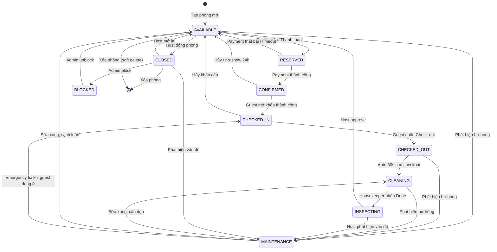
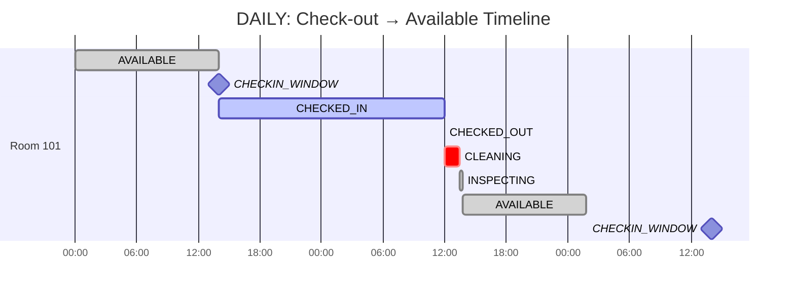
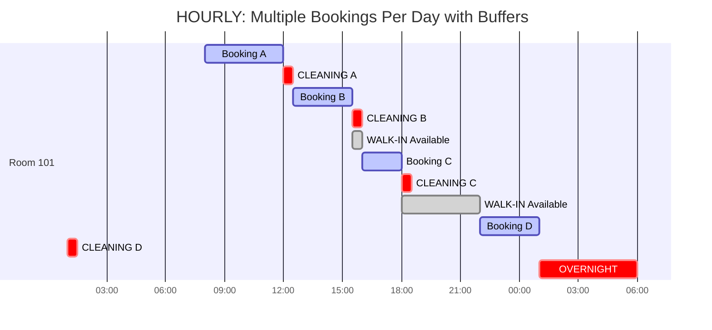
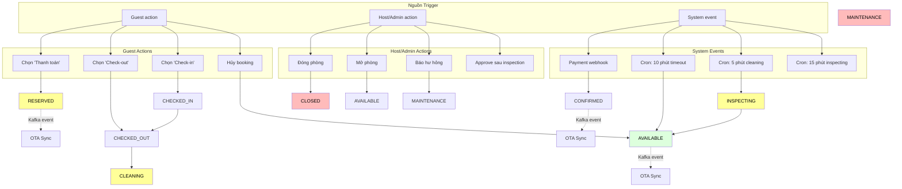

# Room Availability Logic — Trạng thái Phòng & Tính sẵn sàng

Tài liệu này tập trung vào **cơ chế quản lý trạng thái phòng** — đảm bảo trạng thái phòng luôn phản ánh đúng thực tế (who is in the room, when checkout happens, when cleaning finishes).

---

## 1. Bảng 10 Trạng thái Phòng

Mở rộng từ 7 trạng thái cơ bản lên **10 trạng thái chi tiết**, phân tách rõ ràng giữa trạng thái **booking** và trạng thái **vật lý của phòng**.

| Mã | Tên | Mô tả | Ai trigger | Visible guest |
|-----|------|--------|------------|---------------|
| `AVAILABLE` | Sẵn sàng | Phòng trống, sạch sẽ, có thể đặt | Hệ thống tự chuyển khi cleaning xong | ✅ Hiển thị |
| `RESERVED` | Đã giữ chỗ | Guest đã nhấn "Thanh toán", đang chờ VietQR | Guest click Pay | ❌ |
| `CONFIRMED` | Đã xác nhận | Thanh toán thành công, chưa check-in | Payment gateway | ❌ |
| `CHECKED_IN` | Đã nhận phòng | Guest đã mở khóa vào phòng | Smartlock unlock event | ❌ |
| `CHECKED_OUT` | Đã trả phòng | Guest đã nhấn check-out, chưa cleaning xong | Guest tap Check-out | ❌ |
| `CLEANING` | Đang dọn dẹp | Check-out xong, chờ housekeeping | CHECKED_OUT event | ❌ |
| `INSPECTING` | Đang kiểm tra | Housekeeping xong, Admin/Host kiểm tra lần cuối | Housekeeper mark done | ❌ |
| `CLOSED` | Đóng cửa | Admin/Host đóng phòng thủ công | Host/Admin action | ❌ |
| `MAINTENANCE` | Bảo trì | Phát hiện hư hỏng, cần sửa chữa | Host/Admin hoặc System | ❌ |
| `BLOCKED` | Bị khóa | Vi phạm chính sách hoặc lý do pháp lý | Admin action | ❌ |

> **Quy tắc vàng:** Chỉ `AVAILABLE` mới hiển thị cho guest và nhận booking mới.

### 1a. Quan hệ: Booking Status ↔ Room Status

Trạng thái phòng và trạng thái booking đi **song song** nhưng **độc lập**:

```
Booking Status (bookings table)
    PENDING_PAYMENT  ──────────────────────────────→ Room = RESERVED
    CONFIRMED        ──────────────────────────────→ Room = CONFIRMED
    CHECKED_IN       ──────────────────────────────→ Room = CHECKED_IN
    CHECKED_OUT      ──────────────────────────────→ Room = CHECKED_OUT
    CANCELLED / EXPIRED ────────────────────────────→ Room = AVAILABLE

Room Status (room_availability table)
    CHECKED_OUT → CLEANING → INSPECTING → AVAILABLE
```

---

## 2. Ma Trận Chuyển Đổi Trạng Thái

Mỗi ô `[from → to]` có 4 thông tin: **Trigger**, **Điều kiện**, **Action**, **Event**.

```
┌─────────────┬────────────┬──────────────────────────────┬────────────────────────────┬────────────────────────┬──────────────────┐
│    FROM     │     TO     │          TRIGGER              │       ĐIỀU KIỆN            │        ACTION          │     EVENT        │
├─────────────┼────────────┼──────────────────────────────┼────────────────────────────┼────────────────────────┼──────────────────┤
│ AVAILABLE   │ RESERVED   │ Guest nhấn "Thanh toán"      │ Slot còn trống             │ on_hold_units + 1      │ SLOT_RESERVED    │
│ AVAILABLE   │ CLOSED     │ Host/Admin đóng phòng        │ Không có booking active     │ status = CLOSED        │ ROOM_CLOSED      │
│ AVAILABLE   │ MAINTENANCE│ Phát hiện hư hỏng           │ Không có guest trong phòng │ status = MAINTENANCE  │ ROOM_FLAGGED     │
│ RESERVED    │ CONFIRMED  │ Payment webhook success       │ Payment verified            │ booked_units + 1       │ BOOKING_CONFIRMED│
│ RESERVED    │ AVAILABLE  │ Payment fail / timeout 10m    │ —                          │ on_hold_units - 1      │ SLOT_RELEASED    │
│ CONFIRMED   │ CHECKED_IN │ Smartlock unlock thành công  │ check_in_time <= now        │ status = CHECKED_IN    │ CHECKIN_COMPLETED│
│ CONFIRMED   │ AVAILABLE  │ Cancel hoặc 24h no-show      │ —                          │ booked_units - 1       │ BOOKING_CANCELLED│
│ CHECKED_IN  │ CHECKED_OUT│ Guest nhấn "Check-out"       │ —                          │ status = CHECKED_OUT   │ CHECKOUT_STARTED │
│ CHECKED_OUT │ CLEANING   │ CHECKOUT_STARTED event       │ Auto 30 giây sau checkout   │ status = CLEANING     │ CLEANING_STARTED │
│ CLEANING    │ INSPECTING │ Housekeeper nhấn "Done"       │ Cleaning hoàn tất          │ status = INSPECTING    │ CLEANING_DONE    │
│ INSPECTING  │ AVAILABLE  │ Host/Admin nhấn "Approve"    │ Phòng đạt chuẩn           │ status = AVAILABLE     │ ROOM_READY      │
│ INSPECTING  │ MAINTENANCE│ Host/Admin phát hiện vấn đề  │ Cần sửa chữa               │ status = MAINTENANCE  │ MAINTENANCE_START│
│ CLEANING    │ MAINTENANCE│ Phát hiện hư hỏng khi dọn   │ Cần sửa chữa               │ status = MAINTENANCE  │ MAINTENANCE_START│
│ MAINTENANCE │ CLEANING   │ Sửa chữa xong, cần dọn dẹp  │ —                          │ status = CLEANING     │ CLEANING_STARTED │
│ MAINTENANCE │ AVAILABLE  │ Sửa chữa xong, phòng sạch    │ Host approve               │ status = AVAILABLE    │ ROOM_READY      │
│ CLOSED      │ AVAILABLE  │ Host/Admin mở lại phòng      │ Không có booking active     │ status = AVAILABLE    │ ROOM_REOPENED    │
│ CLOSED      │ MAINTENANCE│ Phát hiện vấn đề khi đóng   │ —                          │ status = MAINTENANCE  │ MAINTENANCE_START│
│ CLOSED      │ BLOCKED    │ Admin block property         │ Compliance issue            │ status = BLOCKED       │ ROOM_BLOCKED     │
│ BLOCKED     │ AVAILABLE  │ Admin unblock                │ Issue resolved             │ status = AVAILABLE    │ ROOM_UNBLOCKED   │
└─────────────┴────────────┴──────────────────────────────┴────────────────────────────┴────────────────────────┴──────────────────┘
```

---

## 3. Sơ đồ Trạng thái (State Machine)



---

## 4. Timeline — DAILY vs HOURLY

### 4a. DAILY — Check-out Timeline

Mô hình thuê theo ngày: **1 phòng = 1 booking/ngày**. Chu kỳ đơn giản và tuyến tính.



**Công thức tính:**
```
available_time = checkout_time + buffer_minutes + inspecting_minutes
              = 12:00 + 90 phút + 15 phút
              = 13:45
```

**Đặc điểm:**
- Sau `CHECKED_OUT`, phòng tự động vào `CLEANING` (sau 30s grace period)
- Cron mỗi 5 phút kiểm tra `CLEANING → INSPECTING → AVAILABLE`
- Ngày tiếp theo bắt đầu từ 00:00 nhưng guest check-in từ 14:00

### 4b. HOURLY — Check-out Timeline

Mô hình thuê theo giờ: **1 phòng = N booking/ngày**. Phức tạp hơn nhiều vì các buffer có thể chồng lấn.



**Đặc điểm:**
- Mỗi booking tạo một buffer riêng sau checkout
- Buffer có thể **chồng lấn** nếu checkout sớm hơn dự kiến
- Guest B có thể check-in **ngay khi** Booking A checkout (back-to-back, không cần đợi buffer)
- Walk-in có thể đặt khoảng trống giữa bookings (15:30-16:00)
- Booking D bắt đầu 22:00 → kết thúc 01:00 (qua đêm) → tạo partition trên 2 ngày

---

## 5. Giải thuật Tính Slot Trống (HOURLY)

Đây là phần phức tạp nhất. Mỗi khi có checkout, hệ thống phải **tính lại tất cả slot trống** trong ngày.

```typescript
interface HourlySlot {
  startTime: string;       // "2026-05-20 08:00:00"
  endTime: string;         // "2026-05-20 12:00:00"
  status: RoomStatus;      // AVAILABLE | BOOKED | CLEANING | INSPECTING
  bookingId?: string;
  price?: number;
}

function calculateHourlySlots(
  roomId: string,
  date: string,
  bookings: Booking[],
  bufferMinutes: number = 30,
): HourlySlot[] {

  // 1. Sắp xếp bookings theo check_in_time
  const sorted = bookings
    .filter(b => b.checkOutDate === date || b.checkInDate === date)
    .sort((a, b) => a.checkInTime.localeCompare(b.checkInTime));

  const slots: HourlySlot[] = [];
  const dayStart = `${date} 00:00:00`;
  const dayEnd = `${date} 23:59:59`;

  // 2. Nếu không có booking nào → cả ngày AVAILABLE
  if (sorted.length === 0) {
    return [{ startTime: dayStart, endTime: dayEnd, status: 'AVAILABLE' }];
  }

  // 3. Tạo slot từ 00:00 → first booking
  const firstCheckin = sorted[0].checkInTime;
  const firstCleanEnd = subtractMinutes(firstCheckin, bufferMinutes);
  if (firstCleanEnd > dayStart) {
    slots.push({
      startTime: dayStart,
      endTime: firstCleanEnd,
      status: 'AVAILABLE',
    });
  }

  // 4. Duyệt từng booking → tạo slot + buffer
  for (let i = 0; i < sorted.length; i++) {
    const booking = sorted[i];
    const nextBooking = sorted[i + 1];

    // 4a. Slot BOOKED (thời gian guest ở)
    slots.push({
      startTime: booking.checkInTime,
      endTime: booking.checkOutTime,
      status: 'CHECKED_IN',
      bookingId: booking.id,
      price: booking.hourlyPrice,
    });

    // 4b. Slot CLEANING (sau checkout, trước buffer)
    const bufferEnd = addMinutes(booking.checkOutTime, bufferMinutes);
    slots.push({
      startTime: booking.checkOutTime,
      endTime: bufferEnd,
      status: 'CLEANING',
      bookingId: booking.id,
    });

    // 4c. Tính khoảng trống AVAILABLE giữa 2 bookings
    if (nextBooking) {
      const nextCleanEnd = subtractMinutes(nextBooking.checkInTime, bufferMinutes);
      // Back-to-back: nếu booking tiếp theo bắt đầu sau khi buffer kết thúc
      if (bufferEnd < nextCleanEnd) {
        slots.push({
          startTime: bufferEnd,
          endTime: nextCleanEnd,
          status: 'AVAILABLE',
        });
      }
    }
  }

  // 5. Sau booking cuối → AVAILABLE đến 23:59
  const lastBooking = sorted[sorted.length - 1];
  const lastBufferEnd = addMinutes(lastBooking.checkOutTime, bufferMinutes);
  if (lastBufferEnd < dayEnd) {
    slots.push({
      startTime: lastBufferEnd,
      endTime: dayEnd,
      status: 'AVAILABLE',
    });
  }

  return slots;
}

// Helper functions
function addMinutes(dateTime: string, minutes: number): string {
  const d = new Date(dateTime);
  d.setMinutes(d.getMinutes() + minutes);
  return d.toISOString().slice(0, 19).replace('T', ' ');
}

function subtractMinutes(dateTime: string, minutes: number): string {
  return addMinutes(dateTime, -minutes);
}
```

---

## 6. 4 Edge Cases Đặc biệt (HOURLY)

### 6a. Back-to-Back — Không cần đợi buffer

```
Booking A: 10:00 → 12:00
Booking B: 12:00 → 14:00 (đã đặt trước khi A checkout)
```

```
Logic: checkout_A + buffer <= checkin_B
       12:00 + 30 phút <= 12:00  → FALSE

→ Không tạo AVAILABLE slot. Booking B vào OCCUPIED ngay 12:00.
→ Tránh lãng phí thời gian chờ buffer khi đã biết có guest tiếp theo.
```

### 6b. Walk-in trong thời gian CLEANING

```
Đang CLEANING: 12:00 → 12:30
Walk-in đến: 12:15, muốn đặt 12:30
```

```
Logic:
  if now >= buffer_start_time:
    → Cho phép booking từ thời điểm hiện tại
    → Slot 12:15 trở đi = AVAILABLE

Kết quả:
  12:00 → 12:15  : CLEANING (không cho booking)
  12:15 → ...    : AVAILABLE (walk-in được đặt)
```

### 6c. Overlapping Booking — Đặt trùng giờ

```
Đã có: Booking 10:00 → 14:00
Guest mới: Muốn đặt 12:00 → 16:00
```

```
Logic: Kiểm tra tất cả slots trong khoảng 12:00 → 16:00

  12:00-13:59 → CHECKED_IN (trùng)
  14:00-14:59 → AVAILABLE (sau booking cũ, trước booking mới muốn)
  15:00-15:59 → AVAILABLE

→ Reject: 12:00-13:59 bị giữ bởi booking khác
→ Offer: 14:00 → 16:00 (nếu 14:00-16:00 trống)
```

### 6d. Extend Stay — Kéo dài thời gian ở

```
Guest đặt: 10:00 → 12:00, đang ở
Muốn kéo dài: → 14:00
```

```
Logic:
  1. Kiểm tra slots 12:00 → 14:00
  2. Nếu slot 13:00 bị booking khác giữ:
     → Chỉ offer đến 13:00 (hoặc đến khi booking冲突 bắt đầu)
  3. Tính giá thêm: (14:00 - 12:00) × hourly_price
  4. UPDATE booking: check_out_time = 14:00
```

---

## 7. Trigger & Cron — Tự Động Chuyển Trạng thái

### 7a. Database Trigger — Chuyển CHECKED_OUT → CLEANING

```sql
CREATE OR REPLACE FUNCTION fn_on_checkout()
RETURNS TRIGGER AS $$
BEGIN
  -- Khi bookings.status = CHECKED_OUT
  IF NEW.status = 'CHECKED_OUT' AND OLD.status = 'CHECKED_IN' THEN
    -- Cập nhật room_availability
    UPDATE room_availability
    SET status = 'CLEANING',
        updated_at = now()
    WHERE room_id = NEW.room_id
      AND date = NEW.check_out_date
      AND start_time <= NEW.check_out_time
      AND end_time >= NEW.check_out_time;

    -- Đặt timer cho INSPECTING tự động (buffer_minutes sau checkout)
    -- Dùng pg_background hoặc pg_cron để schedule
    PERFORM pg_background_launch(
      'UPDATE room_availability SET status = ''INSPECTING''
       WHERE room_id = $1 AND date = $2 AND status = ''CLEANING''
       AND now() >= check_out_time + (buffer_minutes || '' minutes'')::interval',
      NEW.room_id, NEW.check_out_date
    );
  END IF;

  RETURN NEW;
END;
$$ LANGUAGE plpgsql;

CREATE TRIGGER trg_on_booking_checkout
AFTER UPDATE ON bookings
FOR EACH ROW
EXECUTE FUNCTION fn_on_checkout();
```

### 7b. Cron — CLEANING → AVAILABLE (Every 5 minutes)

```typescript
@Cron(CronExpression.EVERY_5_MINUTES)
async processCleaningSlots() {
  const now = new Date();

  // 1. CLEANING → INSPECTING: buffer đã hết
  const cleaningDone = await this.prisma.$queryRaw<Slot[]>`
    SELECT ra.*, sb.check_out_at
    FROM room_availability ra
    JOIN slot_bookings sb ON sb.availability_slot_id = ra.id
    WHERE ra.status = 'CLEANING'
      AND sb.check_out_at + (ra.buffer_minutes || ' minutes')::interval <= ${now}
  `;

  // 2. INSPECTING → AVAILABLE: quá 15 phút không approve
  const inspectingExpired = await this.prisma.$queryRaw<Slot[]>`
    SELECT ra.*
    FROM room_availability ra
    WHERE ra.status = 'INSPECTING'
      AND ra.updated_at < ${subtractMinutes(now, 15)}
  `;

  for (const slot of [...cleaningDone, ...inspectingExpired]) {
    await this.prisma.$transaction(async (tx) => {
      await tx.roomAvailability.update({
        where: { id: slot.id },
        data: { status: 'AVAILABLE', updatedAt: now },
      });

      await tx.roomBookingEvents.create({
        data: {
          eventType: 'ROOM_STATUS_CHANGED',
          aggregateType: 'availability',
          aggregateId: slot.id,
          payload: { roomId: slot.roomId, newStatus: 'AVAILABLE', slotDate: slot.date },
          status: 'PENDING',
        },
      });
    });

    // Push to Redis + OTA Channel Manager
    await this.cache.del(`availability:${slot.roomId}:${slot.date}`);
    await this.otaSync.pushSlotUpdate(slot.roomId, slot.date);
  }
}
```

---

## 8. REST API Endpoints

```typescript
// GET /rooms/:id/availability/hourly?date=2026-05-20
// Trả về danh sách slots trong ngày cho chế độ HOURLY
interface HourlyAvailabilityResponse {
  roomId: string;
  date: string;
  slots: HourlySlot[];
  totalAvailableMinutes: number;
  lowestPricePerHour: number;
}

// GET /rooms/:id/availability/daily?from=2026-05-20&to=2026-05-30
// Trả về availability của các ngày cho chế độ DAILY
interface DailyAvailabilityResponse {
  roomId: string;
  dates: DailySlot[];
}

interface DailySlot {
  date: string;
  status: RoomStatus;
  checkInTime: string;     // "14:00"
  checkOutTime: string;    // "12:00 next day"
  price: number;
  available: boolean;
}

// PATCH /rooms/:id/status
// Admin/Host thay đổi trạng thái phòng
interface UpdateRoomStatusRequest {
  status: 'CLOSED' | 'MAINTENANCE' | 'BLOCKED' | 'AVAILABLE';
  reason?: string;
}

// POST /rooms/:id/availability/slots
// Tạo HOURLY slots cho một ngày (cron hoặc manual)
interface CreateHourlySlotsRequest {
  date: string;
  bookings: { checkInTime: string; checkOutTime: string; bookingId: string }[];
}
```

---

## 9. Sơ đồ Event-Driven Flow



---

## 10. Checklist Trạng thái Phòng

| # | Kiểm tra | DAILY | HOURLY | Priority |
|---|----------|-------|--------|----------|
| 1 | Checkout → CLEANING tự động sau 30s | ✅ | ✅ | Cao |
| 2 | CLEANING → INSPECTING khi buffer hết | ✅ | ✅ | Cao |
| 3 | INSPECTING → AVAILABLE khi Host approve | ✅ | ✅ | Trung |
| 4 | Back-to-back: không tạo buffer thừa | — | ✅ | Cao |
| 5 | Walk-in trong CLEANING: cho phép từ thời điểm hiện tại | — | ✅ | Cao |
| 6 | Overlap check: reject booking trùng giờ | — | ✅ | Cao |
| 7 | Extend stay: tính lại slots + giá | — | ✅ | Trung |
| 8 | Overnight: partition trên 2 ngày | — | ✅ | Trung |
| 9 | CLOSED: kiểm tra không có booking active | ✅ | ✅ | Cao |
| 10 | Cron 5 phút: phát hiện buffer đã hết | ✅ | ✅ | Cao |
| 11 | OTA sync: push khi status = AVAILABLE | ✅ | ✅ | Cao |
| 12 | Redis cache invalidate khi status đổi | ✅ | ✅ | Trung |
| 13 | MAINTENANCE: auto close nếu có guest đang ở | ✅ | ✅ | Thấp |
| 14 | INSPECTING timeout: auto available sau 15m | ✅ | ✅ | Trung |

---

*Generated: 2026-05-23 — Homi 1.0 Room Availability Logic*
