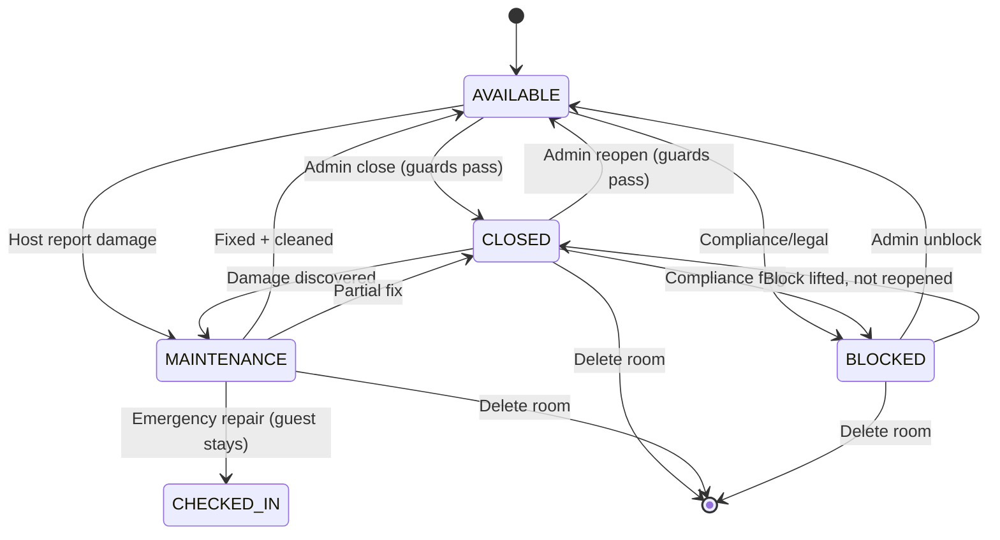

# Research and Design of Synchronized Booking System

**Purpose:** Ensure room status is always synchronized with payment and booking state. When Host/Admin changes room status manually, the system must prevent unsafe transitions that would leave paid guests stranded.

**Generated:** 2026-05-23 — Homi 1.0

---

## 1. The 3-Layer Synchronization Model

The system has **three independent but synchronized layers**. All three must be consistent at all times.

```
┌─────────────────────────────────────────────────────┐
│                    LAYER 1                          │
│                 rooms table                         │
│  Room configuration and manual status control       │
│  (AVAILABLE, CLOSED, MAINTENANCE, BLOCKED)          │
└─────────────────────┬───────────────────────────────┘
                      │ drives
┌─────────────────────▼───────────────────────────────┐
│                    LAYER 2                          │
│            room_availability table                  │
│  Daily/hourly inventory slots with real-time count  │
│  (OPEN, CLOSED, BLOCKED + booked/on_hold units)     │
└─────────────────────┬───────────────────────────────┘
                      │ used by
┌─────────────────────▼───────────────────────────────┐
│                    LAYER 3                          │
│               bookings table                        │
│  Individual guest reservations with payment state   │
│  (PENDING_PAYMENT, CONFIRMED, CHECKED_IN, etc.)     │
└─────────────────────────────────────────────────────┘
```

**Golden rule:** Layer 1 is the source of truth for room-level control. Layers 2 and 3 are derived from Layer 1 and guest actions.

### Layer 1 — `rooms` table: The Gatekeeper

```sql
CREATE TABLE rooms (
    id            UUID PRIMARY KEY,
    property_id   UUID NOT NULL,
    rental_type   rental_type_enum NOT NULL DEFAULT 'DAILY',
    base_price    DECIMAL(12,2) NOT NULL,
    hourly_price  DECIMAL(12,2),
    status        room_status_enum NOT NULL DEFAULT 'AVAILABLE',
    -- status = AVAILABLE | CLOSED | MAINTENANCE | BLOCKED
    updated_at    TIMESTAMPTZ DEFAULT now()
);
```

Layer 1 controls the **physical availability** of the room. Changing it affects future bookings only — it does NOT automatically cancel existing bookings.

### Layer 2 — `room_availability` table: The Inventory

```sql
CREATE TABLE room_availability (
    id             UUID PRIMARY KEY DEFAULT gen_random_uuid(),
    room_id        UUID NOT NULL REFERENCES rooms(id),
    date           DATE NOT NULL,
    start_time     TIME NOT NULL DEFAULT '00:00:00',
    end_time       TIME NOT NULL DEFAULT '23:59:59',
    slot_type      slot_type_enum NOT NULL,  -- DAILY | HOURLY
    total_units    SMALLINT NOT NULL DEFAULT 1,
    booked_units   SMALLINT NOT NULL DEFAULT 0,
    on_hold_units  SMALLINT NOT NULL DEFAULT 0,
    overbooking_buffer  SMALLINT NOT NULL DEFAULT 0,
    status         availability_status_enum NOT NULL DEFAULT 'OPEN',
    -- status = OPEN | CLOSED | BLOCKED
    price_override DECIMAL(12,2),
    buffer_minutes SMALLINT NOT NULL DEFAULT 30,
    created_at     TIMESTAMPTZ DEFAULT now()
);
```

Layer 2 tracks **per-day and per-hour slot inventory**. The `status` here mirrors `rooms.status` but is per-slot.

### Layer 3 — `bookings` table: The Guest Intent

```sql
CREATE TABLE bookings (
    id               UUID PRIMARY KEY,
    room_id          UUID NOT NULL REFERENCES rooms(id),
    guest_id         UUID NOT NULL,
    check_in_date    DATE NOT NULL,
    check_in_time    TIME NOT NULL,
    check_out_date   DATE NOT NULL,
    check_out_time   TIME NOT NULL,
    status           booking_status_enum NOT NULL DEFAULT 'PENDING_PAYMENT',
    payment_id       UUID,
    payment_status   payment_status_enum,
    created_at       TIMESTAMPTZ DEFAULT now(),
    updated_at       TIMESTAMPTZ DEFAULT now()
);
```

Layer 3 represents **actual guest reservations**. Changing Layer 1 must never break Layer 3 consistency.

---

## 2. The Synchronization Matrix

Each layer's status maps to the others. This matrix is the **contract** the system must maintain.

```
┌──────────────────────────────────────────────────────────────────────────┐
│                    SYNCHRONIZATION MATRIX                                │
│                                                                          │
│  rooms.status         room_availability.status   bookings.status         │
│  ─────────────────────────────────────────────────────────────────────   │
│  AVAILABLE           OPEN                        Any (including future)  │
│  CLOSED              CLOSED                      Only: CANCELLED/        │
│                                                    EXPIRED/COMPLETED     │
│  MAINTENANCE         CLOSED                      Same as CLOSED          │
│  BLOCKED             BLOCKED                     Same as CLOSED          │
│                                                                          │
│  INVARIANT: If rooms.status != AVAILABLE                                 │
│             → room_availability.status == CLOSED or BLOCKED              │
│             → bookings.status can only be terminal states                │
└──────────────────────────────────────────────────────────────────────────┘
```

### Detailed Status Mapping

| rooms.status | room_availability.status | bookings.status allowed | Bookable? |
|---|---|---|---|
| `AVAILABLE` | `OPEN` | Any | ✅ Yes |
| `CLOSED` | `CLOSED` | `CANCELLED`, `EXPIRED`, `COMPLETED` | ❌ No |
| `MAINTENANCE` | `CLOSED` | `CANCELLED`, `EXPIRED`, `COMPLETED` | ❌ No |
| `BLOCKED` | `BLOCKED` | `CANCELLED`, `EXPIRED`, `COMPLETED` | ❌ No |

**Rule:** When `rooms.status` becomes non-AVAILABLE, the system must ensure all non-terminal bookings are either cancelled (with refund) or completed before the status change takes effect.

---

## 3. Guard Conditions — Before Changing Room Status

This is the **most critical section**. Any manual status change must pass these guards.

### 3a. Closing a Room (AVAILABLE → CLOSED)

```sql
-- GUARD QUERIES — ALL must return 0 active bookings

-- Check 1: No PENDING_PAYMENT bookings
SELECT COUNT(*) FROM bookings
WHERE room_id = :roomId
  AND status = 'PENDING_PAYMENT';

-- Check 2: No CONFIRMED future bookings
SELECT COUNT(*) FROM bookings
WHERE room_id = :roomId
  AND status = 'CONFIRMED'
  AND (check_in_date > :today OR (check_in_date = :today AND check_in_time > :now));

-- Check 3: No CHECKED_IN (guest currently inside)
SELECT COUNT(*) FROM bookings
WHERE room_id = :roomId
  AND status = 'CHECKED_IN';

-- Check 4: No RESERVED (PENDING_PAYMENT) on any future slot
SELECT COUNT(*) FROM room_availability ra
JOIN bookings b ON b.room_id = ra.room_id
WHERE ra.room_id = :roomId
  AND ra.date >= :today
  AND b.status = 'PENDING_PAYMENT';

-- Check 5: room_availability slots are free
SELECT COUNT(*) FROM room_availability
WHERE room_id = :roomId
  AND date >= :today
  AND (booked_units > 0 OR on_hold_units > 0);
```

**All 5 guards must pass (count = 0).** If any guard fails, the status change is REJECTED with a detailed error.

### 3b. Reopening a Room (CLOSED/MAINTENANCE/BLOCKED → AVAILABLE)

```sql
-- GUARD QUERIES — ALL must return 0 terminal conflicts

-- Check 1: No active bookings blocking reopening
SELECT COUNT(*) FROM bookings
WHERE room_id = :roomId
  AND status NOT IN ('CANCELLED', 'EXPIRED', 'COMPLETED');

-- Reopening is simpler — just ensure no active bookings
-- room_availability slots will be re-opened automatically
```

No active booking = safe to reopen.

### 3c. Putting Room into MAINTENANCE

```sql
-- Special case: MAINTENANCE allows guest to stay until natural checkout
-- But prevents NEW bookings from being confirmed

-- Check 1: Forbid new CONFIRMED bookings (prevent future commitments)
SELECT COUNT(*) FROM bookings
WHERE room_id = :roomId
  AND status = 'CONFIRMED'
  AND check_in_date >= :today;

-- Check 2: MAINTENANCE does NOT require CHECKED_IN to be empty
-- (guest can stay until checkout, then room goes to MAINTENANCE)
-- BUT: cannot transition to MAINTENANCE if MAJOR damage
-- requiring immediate evacuation — handled by emergency flow

-- Action: Also cancel all PENDING_PAYMENT and future CONFIRMED
UPDATE bookings
SET status = 'CANCELLED',
    cancellation_reason = 'MAINTENANCE',
    updated_at = now()
WHERE room_id = :roomId
  AND status IN ('PENDING_PAYMENT', 'CONFIRMED')
  AND check_in_date >= :today;
```

### 3d. Blocking a Room (AVAILABLE → BLOCKED)

```sql
-- BLOCKED: Compliance/legal reason — most restrictive

-- ALL non-terminal bookings must be cancelled
SELECT COUNT(*) FROM bookings
WHERE room_id = :roomId
  AND status NOT IN ('CANCELLED', 'EXPIRED', 'COMPLETED');

-- BLOCKED is irreversible until Admin resolves the compliance issue
-- Refund logic triggered for all cancelled bookings
```

---

## 4. Atomic Status Change Procedure

All status changes must be executed in a **single database transaction** with row-level locking.

### 4a. Close Room — Complete Procedure

```typescript
async function closeRoom(roomId: string, reason: string): Promise<Result> {
  return await this.prisma.$transaction(async (tx) => {

    // Step 1: Lock the room row
    const room = await tx.$queryRaw<Room>`
      SELECT * FROM rooms WHERE id = ${roomId} FOR UPDATE
    `;
    if (!room) throw new NotFoundError('Room not found');

    // Step 2: Run all guard checks
    const [pendingPayment, confirmedFuture, checkedIn, activeSlots]
      = await Promise.all([
        tx.booking.count({
          where: { roomId, status: 'PENDING_PAYMENT' }
        }),
        tx.booking.count({
          where: {
            roomId,
            status: 'CONFIRMED',
            checkInDate: { gte: today },
          }
        }),
        tx.booking.count({
          where: { roomId, status: 'CHECKED_IN' }
        }),
        tx.roomAvailability.count({
          where: {
            roomId,
            date: { gte: today },
            OR: [
              { bookedUnits: { gt: 0 } },
              { onHoldUnits: { gt: 0 } },
            ],
          },
        }),
      ]);

    if (pendingPayment > 0)
      throw new GuardFailed('PENDING_PAYMENT bookings exist', pendingPayment);
    if (confirmedFuture > 0)
      throw new GuardFailed('CONFIRMED future bookings exist', confirmedFuture);
    if (checkedIn > 0)
      throw new GuardFailed('Guest is currently CHECKED_IN', checkedIn);
    if (activeSlots > 0)
      throw new GuardFailed('Active availability slots exist', activeSlots);

    // Step 3: Update rooms.status
    await tx.room.update({
      where: { id: roomId },
      data: { status: 'CLOSED', updatedAt: new Date() },
    });

    // Step 4: Close all future availability slots
    await tx.roomAvailability.updateMany({
      where: {
        roomId,
        date: { gte: today },
      },
      data: { status: 'CLOSED', updatedAt: new Date() },
    });

    // Step 5: Create audit event
    await tx.roomStatusEvents.create({
      data: {
        eventType: 'ROOM_CLOSED',
        aggregateType: 'room',
        aggregateId: roomId,
        payload: {
          previousStatus: 'AVAILABLE',
          newStatus: 'CLOSED',
          reason,
          guardChecks: {
            pendingPayment,
            confirmedFuture,
            checkedIn,
            activeSlots,
          },
        },
        status: 'PENDING',
      },
    });

    return { success: true, newStatus: 'CLOSED' };
  }, {
    isolationLevel: 'SERIALIZABLE',  // Strongest isolation for critical operation
  });
}
```

**Why SERIALIZABLE?** This operation touches multiple tables. `READ COMMITTED` could allow a race condition where a booking is confirmed between the guard check and the update. `SERIALIZABLE` makes the transaction retry if any concurrent change invalidates the guards.

### 4b. Reopen Room — Complete Procedure

```typescript
async function reopenRoom(roomId: string, reason: string): Promise<Result> {
  return await this.prisma.$transaction(async (tx) => {

    const room = await tx.$queryRaw<Room>`
      SELECT * FROM rooms WHERE id = ${roomId} FOR UPDATE
    `;

    // Guard: No active bookings
    const activeBookings = await tx.booking.count({
      where: {
        roomId,
        status: { notIn: ['CANCELLED', 'EXPIRED', 'COMPLETED'] },
      },
    });
    if (activeBookings > 0)
      throw new GuardFailed('Active bookings prevent reopening', activeBookings);

    // Update room status
    await tx.room.update({
      where: { id: roomId },
      data: { status: 'AVAILABLE', updatedAt: new Date() },
    });

    // Reopen availability slots
    await tx.roomAvailability.updateMany({
      where: { roomId, date: { gte: today }, status: 'CLOSED' },
      data: { status: 'OPEN', updatedAt: new Date() },
    });

    // Audit event
    await tx.roomStatusEvents.create({
      data: {
        eventType: 'ROOM_REOPENED',
        aggregateType: 'room',
        aggregateId: roomId,
        payload: {
          previousStatus: room.status,
          newStatus: 'AVAILABLE',
          reason,
        },
        status: 'PENDING',
      },
    });

    // Push to Redis cache
    await this.cache.del(`room:${roomId}:status`);

    // Trigger OTA sync
    await this.otaSync.pushRoomUpdate(roomId);

    return { success: true, newStatus: 'AVAILABLE' };
  });
}
```

---

## 5. Event-Driven Synchronization

When any of the three layers changes, the other two must be notified. This prevents drift.

```
┌──────────────┐     Kafka Event      ┌──────────────────┐
│  bookings    │ ──────────────────▶ │ room_availability │
│   table      │                      │   reconciliation │
└──────────────┘                      └──────────────────┘
       │                                       │
       │ Kafka Event                          │
       ▼                                       ▼
┌──────────────┐                       ┌──────────────────┐
│ rooms.status │                       │  Redis cache     │
│  changed     │                       │  invalidation    │
└──────────────┘                       └──────────────────┘
```

### 5a. Booking Status → Room Availability Sync

```typescript
// Trigger: booking status changes (PENDING→CONFIRMED→CHECKED_IN→CHECKED_OUT)

async function onBookingStatusChange(
  booking: Booking,
  previousStatus: BookingStatus,
  newStatus: BookingStatus
) {
  switch (newStatus) {
    case 'PENDING_PAYMENT':
      // Reserve inventory slot
      await atomicIncrementHold(booking.roomId, booking.checkInDate,
                                booking.checkInTime, booking.checkOutTime);
      break;

    case 'CONFIRMED':
      // Convert hold → confirmed booking
      await atomicConfirmBooking(booking.roomId, booking.checkInDate,
                                 booking.checkInTime);
      // Invalidate cache
      await cache.del(`availability:${booking.roomId}:${booking.checkInDate}`);
      break;

    case 'CANCELLED':
    case 'EXPIRED':
      // Release hold
      await atomicReleaseHold(booking.roomId, booking.checkInDate,
                              booking.checkInTime);
      // Invalidate cache
      await cache.del(`availability:${booking.roomId}:${booking.checkInDate}`);
      break;

    case 'CHECKED_IN':
      // Mark slot as occupied
      await roomAvailability.update({
        where: {
          roomId_date_startTime: {
            roomId: booking.roomId,
            date: booking.checkInDate,
            startTime: booking.checkInTime,
          }
        },
        data: { status: 'OCCUPIED' },
      });
      break;

    case 'CHECKED_OUT':
      // Trigger cleaning queue
      await roomAvailability.update({
        where: { id: booking.availabilitySlotId },
        data: { status: 'CLEANING', updatedAt: new Date() },
      });
      break;
  }

  // Push event to Kafka for OTA sync
  await kafka.produce({
    topic: 'booking.status.changed',
    value: { bookingId: booking.id, previousStatus, newStatus, roomId: booking.roomId },
  });
}
```

### 5b. Room Status → Availability Slots Sync

```typescript
// Trigger: Admin changes rooms.status manually

async function onRoomStatusChange(
  roomId: string,
  previousStatus: RoomStatus,
  newStatus: RoomStatus
) {
  if (previousStatus === newStatus) return;

  // Map room status → availability status
  const availabilityStatus = {
    'AVAILABLE':  'OPEN',
    'CLOSED':    'CLOSED',
    'MAINTENANCE': 'CLOSED',
    'BLOCKED':   'BLOCKED',
  }[newStatus];

  // Update all future slots atomically
  await roomAvailability.updateMany({
    where: {
      roomId,
      date: { gte: today },
    },
    data: { status: availabilityStatus, updatedAt: new Date() },
  });

  // Invalidate Redis cache
  await cache.del(`room:${roomId}:status`);
  await cache.del(`availability:${roomId}:*`);  // Pattern delete

  // Push to all OTAs via Channel Manager
  await channelManager.pushRoomStatusUpdate(roomId, newStatus);

  // Emit room status event
  await kafka.produce({
    topic: 'room.status.changed',
    value: { roomId, previousStatus, newStatus, timestamp: new Date() },
  });
}
```

### 5c. Reconciliation Cron — Detect Drift

Even with event-driven sync, drift can happen (network failure, bugs, manual DB edits). A reconciliation job runs hourly to detect and fix drift.

```typescript
@Cron(CronExpression.EVERY_HOUR)
async reconcileRoomStatus() {
  // Find rooms where status doesn't match availability slots
  const drift = await this.prisma.$queryRaw<DriftReport[]>`
    SELECT
      r.id         AS room_id,
      r.status     AS room_status,
      ra.status    AS slot_status,
      COUNT(*)     AS conflicting_slots
    FROM rooms r
    JOIN room_availability ra ON ra.room_id = r.id
    WHERE r.status = 'AVAILABLE'   AND ra.status != 'OPEN'
       OR r.status = 'CLOSED'      AND ra.status != 'CLOSED'
       OR r.status = 'MAINTENANCE' AND ra.status != 'CLOSED'
       OR r.status = 'BLOCKED'     AND ra.status != 'BLOCKED'
      AND ra.date >= ${today}
    GROUP BY r.id, r.status, ra.status
  `;

  for (const row of drift) {
    await this.alertService.send(
      `Room status drift detected: room=${row.room_id} ` +
      `rooms.status=${row.room_status} != slot.status=${row.slot_status}`
    );
    // Auto-fix: reconcile to rooms.status
    await this.onRoomStatusChange(row.room_id, row.slot_status, row.room_status);
  }
}
```

---

## 6. REST API Endpoints

### 6a. Manual Room Status Change

```typescript
// PATCH /rooms/:id/status
// Host/Admin changes room status

interface UpdateRoomStatusRequest {
  status: 'AVAILABLE' | 'CLOSED' | 'MAINTENANCE' | 'BLOCKED';
  reason: string;  // Required for CLOSED, MAINTENANCE, BLOCKED
  refundAction?: 'AUTO_REFUND' | 'MANUAL_REVIEW';  // Only for BLOCKED
}

interface UpdateRoomStatusResponse {
  success: boolean;
  newStatus: RoomStatus;
  impactedBookings?: {
    bookingId: string;
    guestEmail: string;
    status: BookingStatus;
    action: 'CANCELLED' | 'REFUNDED' | 'COMPLETED';
  }[];
  guardResults?: {
    check: string;
    passed: boolean;
    count: number;
    message: string;
  }[];
  error?: {
    code: 'GUARD_FAILED' | 'ROOM_NOT_FOUND' | 'INVALID_TRANSITION';
    failedChecks: string[];
  };
}
```

**Success response** (all guards passed):
```json
{
  "success": true,
  "newStatus": "CLOSED",
  "impactedBookings": []
}
```

**Error response** (guard failed):
```json
{
  "success": false,
  "error": {
    "code": "GUARD_FAILED",
    "failedChecks": ["confirmedFuture", "activeSlots"],
    "message": "Cannot close room with active bookings"
  },
  "guardResults": [
    { "check": "pendingPayment", "passed": true, "count": 0 },
    { "check": "confirmedFuture", "passed": false, "count": 3, "message": "3 CONFIRMED bookings in June" },
    { "check": "checkedIn", "passed": true, "count": 0 },
    { "check": "activeSlots", "passed": false, "count": 2, "message": "2 slots with bookings" }
  ]
}
```

### 6b. Get Room Sync Status

```typescript
// GET /rooms/:id/sync-status
// Returns the current state of all 3 layers

interface RoomSyncStatusResponse {
  roomId: string;
  layers: {
    room: {
      status: RoomStatus;
      updatedAt: string;
    };
    availability: {
      totalSlots: number;
      openSlots: number;
      closedSlots: number;
      pendingSlots: number;
    };
    bookings: {
      totalActive: number;
      pendingPayment: number;
      confirmed: number;
      checkedIn: number;
      checkedOut: number;
    };
  };
  isConsistent: boolean;
  driftDetails?: {
    layer: string;
    expected: string;
    actual: string;
  }[];
}
```

### 6c. Force Sync (Admin only)

```typescript
// POST /rooms/:id/sync/force
// Force reconciliation — use when drift is detected but auto-fix fails

interface ForceSyncRequest {
  targetLayer: 'rooms' | 'availability' | 'bookings';
  targetStatus?: RoomStatus;  // Only for rooms.status
}
```

---

## 7. State Transition Diagram (All 3 Layers)



```
GUARD RULES per transition:
  AVAILABLE → CLOSED   : No PENDING, CONFIRMED, CHECKED_IN bookings
  CLOSED    → AVAILABLE: No active (non-terminal) bookings
  AVAILABLE → MAINTENANCE: No CHECKED_IN bookings
  AVAILABLE → BLOCKED   : All non-terminal bookings must be CANCELLED + refunded
```

---

## 8. Edge Cases

### 8a. Guest Paid → Admin Closes Room 30 Seconds Later

```
Timeline:
  10:00:00  Guest clicks "Pay" → PENDING_PAYMENT
  10:00:01  Payment confirmed  → CONFIRMED
  10:00:30  Admin clicks "Close Room"

  Guard check: CONFIRMED bookings = 1 → REJECTED
  Admin sees: "Cannot close — guest has paid booking on this room"
```

✅ Correct: Guard blocks the close. Admin must cancel the booking (with refund) first.

### 8b. Guest is CHECKED_IN → Admin Wants to Close Room

```
Timeline:
  Day 1 14:00  Guest CHECKED_IN
  Day 1 15:00  Admin discovers issue, wants to close

  Guard check: CHECKED_IN = 1 → REJECTED
  Admin options:
    1. Wait until guest CHECKED_OUT → then CLEANING → then CLOSED
    2. Emergency: contact guest, arrange alternative accommodation
    3. Force close (super-admin only): cancels booking, triggers refund, evacuates guest
```

### 8c. Room Closed with Existing Future Booking

```
Guard check: CONFIRMED future = 1 → REJECTED

Admin must:
  1. Cancel the booking → status becomes CANCELLED
  2. Process refund if already paid
  3. Then close room (guards pass now)

Automated flow: If admin selects "Close + Auto-cancel", system:
  - Cancels all future bookings
  - Triggers refund via payment gateway
  - Sends notification to all affected guests
  - Then closes room
```

### 8d. Concurrent Close Attempt (Race Condition)

```
Thread A: Guard check → pending=0 → passes
Thread B: Guard check → pending=0 → passes
Thread A: UPDATE rooms.status = 'CLOSED'
Thread B: UPDATE rooms.status = 'CLOSED'

Both threads pass because SERIALIZABLE isolation
ensures Thread B sees Thread A's committed change
when it tries to update.

Result: Both attempt the close. First wins.
        Second gets: "Room is already CLOSED"
```

### 8e. Partial Availability Slots

```
Room has 3 units of the same type.
2 units are booked, 1 is still available.

Admin tries to close the room.

Guard check: booked_units > 0 → REJECTED

System can offer:
  - "Close 2 units only, keep 1 available" (partial close)
  - Or require all units to be free before full close
```

---

## 9. Database Constraints and Triggers

### 9a. Hard Constraint — Prevent Invalid Booking

```sql
-- Prevent new bookings on non-AVAILABLE rooms at INSERT time
CREATE OR REPLACE FUNCTION fn_prevent_booking_on_closed_room()
RETURNS TRIGGER AS $$
BEGIN
  IF EXISTS (
    SELECT 1 FROM rooms
    WHERE id = NEW.room_id
      AND status != 'AVAILABLE'
  ) THEN
    RAISE EXCEPTION 'Cannot create booking: room is not available (status: %)',
      (SELECT status FROM rooms WHERE id = NEW.room_id)
      USING ERRCODE = 'P0001';
  END IF;
  RETURN NEW;
END;
$$ LANGUAGE plpgsql;

CREATE TRIGGER trg_prevent_booking_on_closed_room
BEFORE INSERT ON bookings
FOR EACH ROW
EXECUTE FUNCTION fn_prevent_booking_on_closed_room();
```

### 9b. Trigger — Sync Availability on Room Status Change

```sql
CREATE OR REPLACE FUNCTION fn_sync_availability_on_room_status()
RETURNS TRIGGER AS $$
BEGIN
  IF OLD.status IS DISTINCT FROM NEW.status THEN
    -- Map room status to availability status
    UPDATE room_availability
    SET status = CASE NEW.status
                   WHEN 'AVAILABLE'  THEN 'OPEN'
                   WHEN 'CLOSED'     THEN 'CLOSED'
                   WHEN 'MAINTENANCE'THEN 'CLOSED'
                   WHEN 'BLOCKED'    THEN 'BLOCKED'
                   ELSE status
                 END,
        updated_at = now()
    WHERE room_id = NEW.id
      AND date >= CURRENT_DATE;

    -- Log the event
    INSERT INTO room_status_events (
      event_type, aggregate_type, aggregate_id, payload, status
    ) VALUES (
      'ROOM_STATUS_CHANGED',
      'room',
      NEW.id,
      jsonb_build_object(
        'roomId', NEW.id,
        'previousStatus', OLD.status,
        'newStatus', NEW.status,
        'changedAt', now()
      ),
      'PENDING'
    );
  END IF;
  RETURN NEW;
END;
$$ LANGUAGE plpgsql;

CREATE TRIGGER trg_sync_availability_on_room_status
AFTER UPDATE OF status ON rooms
FOR EACH ROW
EXECUTE FUNCTION fn_sync_availability_on_room_status();
```

### 9c. Trigger — Update Availability on Booking Status Change

```sql
CREATE OR REPLACE FUNCTION fn_sync_availability_on_booking_change()
RETURNS TRIGGER AS $$
BEGIN
  -- PENDING_PAYMENT → hold slot
  IF NEW.status = 'PENDING_PAYMENT' AND OLD.status != 'PENDING_PAYMENT' THEN
    UPDATE room_availability
    SET on_hold_units = on_hold_units + 1,
        updated_at = now()
    WHERE room_id = NEW.room_id
      AND date = NEW.check_in_date
      AND start_time <= NEW.check_in_time
      AND end_time >= NEW.check_in_time;
  END IF;

  -- CONFIRMED → convert hold to confirmed
  IF NEW.status = 'CONFIRMED' AND OLD.status = 'PENDING_PAYMENT' THEN
    UPDATE room_availability
    SET on_hold_units = on_hold_units - 1,
        booked_units = booked_units + 1,
        updated_at = now()
    WHERE room_id = NEW.room_id
      AND date = NEW.check_in_date
      AND start_time <= NEW.check_in_time
      AND end_time >= NEW.check_in_time;
  END IF;

  -- CANCELLED/EXPIRED → release hold
  IF NEW.status IN ('CANCELLED', 'EXPIRED')
     AND OLD.status IN ('PENDING_PAYMENT', 'CONFIRMED') THEN
    UPDATE room_availability
    SET
      on_hold_units = GREATEST(on_hold_units - 1, 0),
      booked_units  = GREATEST(booked_units  - 1, 0),
      updated_at = now()
    WHERE room_id = NEW.room_id
      AND date = NEW.check_in_date
      AND start_time <= NEW.check_in_time
      AND end_time >= NEW.check_in_time;
  END IF;

  -- CHECKED_OUT → trigger cleaning
  IF NEW.status = 'CHECKED_OUT' AND OLD.status = 'CHECKED_IN' THEN
    UPDATE room_availability
    SET status = 'CLEANING',
        updated_at = now()
    WHERE room_id = NEW.room_id
      AND date = NEW.check_out_date
      AND start_time <= NEW.check_out_time
      AND end_time >= NEW.check_out_time;
  END IF;

  RETURN NEW;
END;
$$ LANGUAGE plpgsql;

CREATE TRIGGER trg_sync_availability_on_booking_change
AFTER UPDATE OF status ON bookings
FOR EACH ROW
EXECUTE FUNCTION fn_sync_availability_on_booking_change();
```

---

## 10. Checklist

| # | Check | When | Layer | Priority |
|---|-------|------|-------|----------|
| 1 | Room close blocked when PENDING_PAYMENT exists | Close room | Guard | 🔴 Critical |
| 2 | Room close blocked when CONFIRMED future exists | Close room | Guard | 🔴 Critical |
| 3 | Room close blocked when CHECKED_IN exists | Close room | Guard | 🔴 Critical |
| 4 | Availability slots closed when room closed | Room status change | Trigger | 🔴 Critical |
| 5 | New booking rejected when room not AVAILABLE | Insert booking | Trigger | 🔴 Critical |
| 6 | on_hold_units incremented on PENDING_PAYMENT | Booking status | Trigger | 🔴 Critical |
| 7 | booked_units incremented on CONFIRMED | Booking status | Trigger | 🔴 Critical |
| 8 | on_hold/booked released on CANCELLED/EXPIRED | Booking status | Trigger | 🔴 Critical |
| 9 | CLEANING triggered on CHECKED_OUT | Booking status | Trigger | 🔴 Critical |
| 10 | Room reopen allowed only when no active bookings | Reopen room | Guard | 🔴 Critical |
| 11 | Audit event created on every status change | Any status change | API | 🟡 High |
| 12 | Redis cache invalidated on status change | Any status change | Event | 🟡 High |
| 13 | OTA Channel Manager notified on change | Any status change | Event | 🟡 High |
| 14 | Reconciliation cron detects drift hourly | Drift detection | Cron | 🟡 High |
| 15 | Super-admin force close triggers guest notification | Force close | API | 🟠 Medium |
| 16 | Refund triggered when BLOCKED cancels paid bookings | Block room | API | 🟠 Medium |
| 17 | Partial close (per unit) supported for multi-unit rooms | Close room | API | 🟢 Low |
| 18 | MAINTENANCE allows CHECKED_IN guest to stay | Maintenance | Guard | 🟠 Medium |

---

*Generated: 2026-05-23 — Homi 1.0 Synchronized Booking System*
