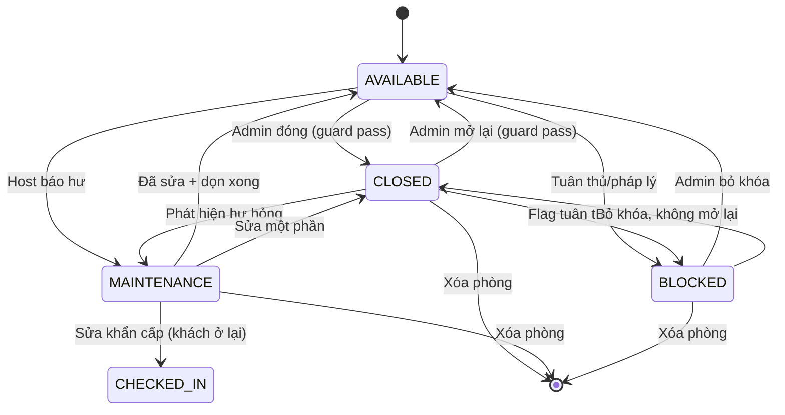

# Nghiên Cứu và Thiết Kế Hệ Thống Đồng Bộ Đặt Phòng

**Mục đích:** Đảm bảo trạng thái phòng luôn đồng bộ với trạng thái thanh toán và booking. Khi Host/Admin thay đổi trạng thái phòng thủ công từ Sẵn sàng sang Đóng hoặc ngược lại, hệ thống phải ngăn chặn các chuyển đổi không an toàn khiến khách đã thanh toán bị mất phòng.

**Ngày tạo:** 2026-05-23 — Homi 1.0

---

## 1. Mô Hình Đồng Bộ 3 Tầng

Hệ thống có **3 tầng độc lập nhưng phải đồng bộ với nhau**. Cả 3 tầng phải luôn nhất quán tại mọi thời điểm.

```
┌─────────────────────────────────────────────────────┐
│                    TẦNG 1                           │
│                 Bảng rooms                          │
│  Cấu hình phòng và kiểm soát trạng thái thủ công    │
│  (AVAILABLE, CLOSED, MAINTENANCE, BLOCKED)          │
└─────────────────────┬───────────────────────────────┘
                      │ driving
┌─────────────────────▼───────────────────────────────┐
│                    TẦNG 2                           │
│              Bảng room_availability                 │
│  Inventory slot theo ngày/giờ với số lượng thực     │
│  (OPEN, CLOSED, BLOCKED + booked/on_hold units)     │
└─────────────────────┬───────────────────────────────┘
                      │ used by
┌─────────────────────▼───────────────────────────────┐
│                    TẦNG 3                           │
│               Bảng bookings                         │
│  Đặt phòng của từng khách với trạng thái thanh toán │
│  (PENDING_PAYMENT, CONFIRMED, CHECKED_IN, v.v.)     │
└─────────────────────────────────────────────────────┘
```

**Quy tắc vàng:** Tầng 1 là nguồn chân lý cho kiểm soát cấp phòng. Tầng 2 và 3 được suy ra từ Tầng 1 và hành động của khách.

### Tầng 1 — Bảng `rooms`: Người gác cổng

```sql
CREATE TABLE rooms (
    id            UUID PRIMARY KEY,
    property_id   UUID NOT NULL,
    rental_type   rental_type_enum NOT NULL DEFAULT 'DAILY',
    base_price    DECIMAL(12,2) NOT NULL,
    hourly_price  DECIMAL(12,2),
    status        room_status_enum NOT NULL DEFAULT 'AVAILABLE',
    -- status = AVAILABLE | CLOSED | MAINTENANCE | BLOCKED
    updated_at    TIMESTAMPTZ DEFAULT now()
);
```

Tầng 1 kiểm soát **tính khả dụng vật lý** của phòng. Thay đổi Tầng 1 chỉ ảnh hưởng đến các booking tương lai — nó **KHÔNG** tự động hủy các booking hiện có.

### Tầng 2 — Bảng `room_availability`: Kho inventory

```sql
CREATE TABLE room_availability (
    id             UUID PRIMARY KEY DEFAULT gen_random_uuid(),
    room_id        UUID NOT NULL REFERENCES rooms(id),
    date           DATE NOT NULL,
    start_time     TIME NOT NULL DEFAULT '00:00:00',
    end_time       TIME NOT NULL DEFAULT '23:59:59',
    slot_type      slot_type_enum NOT NULL,  -- DAILY | HOURLY
    total_units    SMALLINT NOT NULL DEFAULT 1,
    booked_units   SMALLINT NOT NULL DEFAULT 0,
    on_hold_units  SMALLINT NOT NULL DEFAULT 0,
    overbooking_buffer  SMALLINT NOT NULL DEFAULT 0,
    status         availability_status_enum NOT NULL DEFAULT 'OPEN',
    -- status = OPEN | CLOSED | BLOCKED
    price_override DECIMAL(12,2),
    buffer_minutes SMALLINT NOT NULL DEFAULT 30,
    created_at     TIMESTAMPTZ DEFAULT now()
);
```

Tầng 2 theo dõi **inventory slot theo ngày và theo giờ**. Trạng thái `status` ở đây phản chiếu `rooms.status` nhưng theo từng slot.

### Tầng 3 — Bảng `bookings`: Ý định của khách

```sql
CREATE TABLE bookings (
    id               UUID PRIMARY KEY,
    room_id          UUID NOT NULL REFERENCES rooms(id),
    guest_id         UUID NOT NULL,
    check_in_date    DATE NOT NULL,
    check_in_time    TIME NOT NULL,
    check_out_date   DATE NOT NULL,
    check_out_time   TIME NOT NULL,
    status           booking_status_enum NOT NULL DEFAULT 'PENDING_PAYMENT',
    payment_id       UUID,
    payment_status   payment_status_enum,
    created_at       TIMESTAMPTZ DEFAULT now(),
    updated_at       TIMESTAMPTZ DEFAULT now()
);
```

Tầng 3 đại diện cho **đặt phòng thực tế của khách**. Thay đổi Tầng 1 không được phép phá vỡ tính nhất quán của Tầng 3.

---

## 2. Ma Trận Đồng Bộ

Trạng thái giữa các tầng ánh xạ vào nhau. Ma trận này là **hợp đồng** mà hệ thống phải duy trì.

```
┌──────────────────────────────────────────────────────────────────────────┐
│                    MA TRẬN ĐỒNG BỘ                                       │
│                                                                          │
│  rooms.status           room_availability.status    bookings.status      │
│  ─────────────────────────────────────────────────────────────────────   │
│  AVAILABLE             OPEN                      Bất kỳ (kể cả tương lai)│
│  CLOSED                CLOSED                       Chỉ: CANCELLED/      │
│                                                       EXPIRED/COMPLETED  │
│  MAINTENANCE          CLOSED                       Như CLOSED            │
│  BLOCKED              BLOCKED                      Như CLOSED            │
│                                                                          │
│  BẤT BIẾN: Nếu rooms.status != AVAILABLE                                 │
│            → room_availability.status == CLOSED hoặc BLOCKED             │
│            → bookings.status chỉ có thể là trạng thái kết thúc           │
└──────────────────────────────────────────────────────────────────────────┘
```

### Bảng ánh xạ chi tiết

| rooms.status | room_availability.status | bookings.status cho phép | Có thể đặt? |
|---|---|---|---|
| `AVAILABLE` | `OPEN` | Bất kỳ | ✅ Có |
| `CLOSED` | `CLOSED` | `CANCELLED`, `EXPIRED`, `COMPLETED` | ❌ Không |
| `MAINTENANCE` | `CLOSED` | `CANCELLED`, `EXPIRED`, `COMPLETED` | ❌ Không |
| `BLOCKED` | `BLOCKED` | `CANCELLED`, `EXPIRED`, `COMPLETED` | ❌ Không |

**Quy tắc:** Khi `rooms.status` trở thành không phải AVAILABLE, hệ thống phải đảm bảo tất cả booking không phải trạng thái kết thúc phải được hủy (kèm hoàn tiền) hoặc hoàn thành trước khi thay đổi trạng thái có hiệu lực.

---

## 3. Điều Kiện Guard — Trước Khi Thay Đổi Trạng Thái Phòng

Đây là **phần quan trọng nhất**. Bất kỳ thay đổi trạng thái thủ công nào cũng phải vượt qua các guard này.

### 3a. Đóng Phòng (AVAILABLE → CLOSED)

```sql
-- CÂU TRUY VẤN GUARD — TẤT CẢ phải trả về 0 booking đang hoạt động

-- Kiểm tra 1: Không có booking PENDING_PAYMENT
SELECT COUNT(*) FROM bookings
WHERE room_id = :roomId
  AND status = 'PENDING_PAYMENT';

-- Kiểm tra 2: Không có booking CONFIRMED trong tương lai
SELECT COUNT(*) FROM bookings
WHERE room_id = :roomId
  AND status = 'CONFIRMED'
  AND (check_in_date > :today OR (check_in_date = :today AND check_in_time > :now));

-- Kiểm tra 3: Không có CHECKED_IN (khách đang ở trong phòng)
SELECT COUNT(*) FROM bookings
WHERE room_id = :roomId
  AND status = 'CHECKED_IN';

-- Kiểm tra 4: Không có PENDING_PAYMENT trên bất kỳ slot nào trong tương lai
SELECT COUNT(*) FROM room_availability ra
JOIN bookings b ON b.room_id = ra.room_id
WHERE ra.room_id = :roomId
  AND ra.date >= :today
  AND b.status = 'PENDING_PAYMENT';

-- Kiểm tra 5: Các slot trong room_availability đang trống
SELECT COUNT(*) FROM room_availability
WHERE room_id = :roomId
  AND date >= :today
  AND (booked_units > 0 OR on_hold_units > 0);
```

**Tất cả 5 guard phải pass (count = 0).** Nếu bất kỳ guard nào fail, thay đổi trạng thái sẽ bị TỪ CHỐI kèm lỗi chi tiết.

### 3b. Mở Lại Phòng (CLOSED/MAINTENANCE/BLOCKED → AVAILABLE)

```sql
-- CÂU TRUY VẤN GUARD — TẤT CẢ phải trả về 0 xung đột

-- Kiểm tra 1: Không có booking đang hoạt động chặn việc mở lại
SELECT COUNT(*) FROM bookings
WHERE room_id = :roomId
  AND status NOT IN ('CANCELLED', 'EXPIRED', 'COMPLETED');

-- Mở lại đơn giản hơn — chỉ cần đảm bảo không có booking đang hoạt động
-- Các slot trong room_availability sẽ được mở lại tự động
```

Không có booking đang hoạt động = an toàn để mở lại.

### 3c. Đưa Phòng Vào MAINTENANCE

```sql
-- Trường hợp đặc biệt: MAINTENANCE cho phép khách đang ở tiếp tục ở đến khi checkout tự nhiên
-- Nhưng ngăn chặn booking MỚI được CONFIRMED

-- Kiểm tra 1: Cấm booking CONFIRMED mới (ngăn chặn cam kết trong tương lai)
SELECT COUNT(*) FROM bookings
WHERE room_id = :roomId
  AND status = 'CONFIRMED'
  AND check_in_date >= :today;

-- Kiểm tra 2: MAINTENANCE KHÔNG yêu cầu CHECKED_IN phải rỗng
-- (khách có thể ở đến khi checkout, sau đó phòng vào MAINTENANCE)
-- NHƯNG: không thể chuyển sang MAINTENANCE nếu có hư hỏng nghiêm trọng
-- cần sơ tán ngay lập tức — xử lý bằng luồng khẩn cấp

-- Hành động: Hủy tất cả PENDING_PAYMENT và CONFIRMED tương lai
UPDATE bookings
SET status = 'CANCELLED',
    cancellation_reason = 'MAINTENANCE',
    updated_at = now()
WHERE room_id = :roomId
  AND status IN ('PENDING_PAYMENT', 'CONFIRMED')
  AND check_in_date >= :today;
```

### 3d. Khóa Phòng (AVAILABLE → BLOCKED)

```sql
-- BLOCKED: Lý do tuân thủ/pháp lý — hạn chế nhất

-- TẤT CẢ booking không phải trạng thái kết thúc phải được hủy
SELECT COUNT(*) FROM bookings
WHERE room_id = :roomId
  AND status NOT IN ('CANCELLED', 'EXPIRED', 'COMPLETED');

-- BLOCKED không thể đảo ngược cho đến khi Admin giải quyết vấn đề tuân thủ
-- Logic hoàn tiền được kích hoạt cho tất cả booking bị hủy
```

---

## 4. Thủ Tục Thay Đổi Trạng Thái Nguyên Tử

Tất cả thay đổi trạng thái phải được thực thi trong **một giao dịch database duy nhất** với row-level locking.

### 4a. Đóng Phòng — Thủ Tục Hoàn Chỉnh

```typescript
async function closeRoom(roomId: string, reason: string): Promise<Result> {
  return await this.prisma.$transaction(async (tx) => {

    // Bước 1: Khóa row của phòng
    const room = await tx.$queryRaw<Room>`
      SELECT * FROM rooms WHERE id = ${roomId} FOR UPDATE
    `;
    if (!room) throw new NotFoundError('Room not found');

    // Bước 2: Chạy tất cả guard checks
    const [pendingPayment, confirmedFuture, checkedIn, activeSlots]
      = await Promise.all([
        tx.booking.count({
          where: { roomId, status: 'PENDING_PAYMENT' }
        }),
        tx.booking.count({
          where: {
            roomId,
            status: 'CONFIRMED',
            checkInDate: { gte: today },
          }
        }),
        tx.booking.count({
          where: { roomId, status: 'CHECKED_IN' }
        }),
        tx.roomAvailability.count({
          where: {
            roomId,
            date: { gte: today },
            OR: [
              { bookedUnits: { gt: 0 } },
              { onHoldUnits: { gt: 0 } },
            ],
          },
        }),
      ]);

    if (pendingPayment > 0)
      throw new GuardFailed('Tồn tại booking PENDING_PAYMENT', pendingPayment);
    if (confirmedFuture > 0)
      throw new GuardFailed('Tồn tại booking CONFIRMED trong tương lai', confirmedFuture);
    if (checkedIn > 0)
      throw new GuardFailed('Khách đang CHECKED_IN', checkedIn);
    if (activeSlots > 0)
      throw new GuardFailed('Tồn tại slot đang có booking', activeSlots);

    // Bước 3: Cập nhật rooms.status
    await tx.room.update({
      where: { id: roomId },
      data: { status: 'CLOSED', updatedAt: new Date() },
    });

    // Bước 4: Đóng tất cả slot trong tương lai
    await tx.roomAvailability.updateMany({
      where: {
        roomId,
        date: { gte: today },
      },
      data: { status: 'CLOSED', updatedAt: new Date() },
    });

    // Bước 5: Tạo audit event
    await tx.roomStatusEvents.create({
      data: {
        eventType: 'ROOM_CLOSED',
        aggregateType: 'room',
        aggregateId: roomId,
        payload: {
          previousStatus: 'AVAILABLE',
          newStatus: 'CLOSED',
          reason,
          guardChecks: {
            pendingPayment,
            confirmedFuture,
            checkedIn,
            activeSlots,
          },
        },
        status: 'PENDING',
      },
    });

    return { success: true, newStatus: 'CLOSED' };
  }, {
    isolationLevel: 'SERIALIZABLE',
  });
}
```

**Tại sao SERIALIZABLE?** Thao tác này touch nhiều bảng. `READ COMMITTED` có thể cho phép race condition khi booking được confirm giữa guard check và update. `SERIALIZABLE` khiến transaction retry nếu bất kỳ thay đổi đồng thời nào làm guard không hợp lệ.

### 4b. Mở Lại Phòng — Thủ Tục Hoàn Chỉnh

```typescript
async function reopenRoom(roomId: string, reason: string): Promise<Result> {
  return await this.prisma.$transaction(async (tx) => {

    const room = await tx.$queryRaw<Room>`
      SELECT * FROM rooms WHERE id = ${roomId} FOR UPDATE
    `;

    // Guard: Không có booking đang hoạt động
    const activeBookings = await tx.booking.count({
      where: {
        roomId,
        status: { notIn: ['CANCELLED', 'EXPIRED', 'COMPLETED'] },
      },
    });
    if (activeBookings > 0)
      throw new GuardFailed('Booking đang hoạt động ngăn cản việc mở lại', activeBookings);

    // Cập nhật trạng thái phòng
    await tx.room.update({
      where: { id: roomId },
      data: { status: 'AVAILABLE', updatedAt: new Date() },
    });

    // Mở lại các slot
    await tx.roomAvailability.updateMany({
      where: { roomId, date: { gte: today }, status: 'CLOSED' },
      data: { status: 'OPEN', updatedAt: new Date() },
    });

    // Audit event
    await tx.roomStatusEvents.create({
      data: {
        eventType: 'ROOM_REOPENED',
        aggregateType: 'room',
        aggregateId: roomId,
        payload: {
          previousStatus: room.status,
          newStatus: 'AVAILABLE',
          reason,
        },
        status: 'PENDING',
      },
    });

    // Xóa Redis cache
    await this.cache.del(`room:${roomId}:status`);

    // Kích hoạt OTA sync
    await this.otaSync.pushRoomUpdate(roomId);

    return { success: true, newStatus: 'AVAILABLE' };
  });
}
```

---

## 5. Đồng Bộ Theo Sự Kiện

Khi bất kỳ tầng nào thay đổi, hai tầng còn lại phải được thông báo. Điều này ngăn chặn sự drift (lệch pha).

```
┌──────────────┐     Kafka Event      ┌──────────────────┐
│   bookings   │ ──────────────────▶ │ room_availability │
│    table     │                      │  reconciliation  │
└──────────────┘                      └──────────────────┘
       │                                      │
       │ Kafka Event                          │
       ▼                                      ▼
┌──────────────┐                       ┌──────────────────┐
│rooms.status  │                       │  Redis cache     │
│   changed    │                       │  invalidation    │
└──────────────┘                       └──────────────────┘
```

### 5a. Đồng Bộ Từ Booking Status → Room Availability

```typescript
// Trigger: booking status thay đổi (PENDING→CONFIRMED→CHECKED_IN→CHECKED_OUT)

async function onBookingStatusChange(
  booking: Booking,
  previousStatus: BookingStatus,
  newStatus: BookingStatus
) {
  switch (newStatus) {
    case 'PENDING_PAYMENT':
      // Giữ slot inventory
      await atomicIncrementHold(booking.roomId, booking.checkInDate,
                                booking.checkInTime, booking.checkOutTime);
      break;

    case 'CONFIRMED':
      // Chuyển hold → booking đã xác nhận
      await atomicConfirmBooking(booking.roomId, booking.checkInDate,
                                 booking.checkInTime);
      // Xóa cache
      await cache.del(`availability:${booking.roomId}:${booking.checkInDate}`);
      break;

    case 'CANCELLED':
    case 'EXPIRED':
      // Giải phóng hold
      await atomicReleaseHold(booking.roomId, booking.checkInDate,
                              booking.checkInTime);
      // Xóa cache
      await cache.del(`availability:${booking.roomId}:${booking.checkInDate}`);
      break;

    case 'CHECKED_IN':
      // Đánh dấu slot là occupied
      await roomAvailability.update({
        where: {
          roomId_date_startTime: {
            roomId: booking.roomId,
            date: booking.checkInDate,
            startTime: booking.checkInTime,
          }
        },
        data: { status: 'OCCUPIED' },
      });
      break;

    case 'CHECKED_OUT':
      // Kích hoạt cleaning queue
      await roomAvailability.update({
        where: { id: booking.availabilitySlotId },
        data: { status: 'CLEANING', updatedAt: new Date() },
      });
      break;
  }

  // Push event lên Kafka cho OTA sync
  await kafka.produce({
    topic: 'booking.status.changed',
    value: { bookingId: booking.id, previousStatus, newStatus, roomId: booking.roomId },
  });
}
```

### 5b. Đồng Bộ Từ Room Status → Availability Slots

```typescript
// Trigger: Admin thay đổi rooms.status thủ công

async function onRoomStatusChange(
  roomId: string,
  previousStatus: RoomStatus,
  newStatus: RoomStatus
) {
  if (previousStatus === newStatus) return;

  // Ánh xạ room status → availability status
  const availabilityStatus = {
    'AVAILABLE':   'OPEN',
    'CLOSED':     'CLOSED',
    'MAINTENANCE':'CLOSED',
    'BLOCKED':    'BLOCKED',
  }[newStatus];

  // Cập nhật tất cả slot tương lai nguyên tử
  await roomAvailability.updateMany({
    where: {
      roomId,
      date: { gte: today },
    },
    data: { status: availabilityStatus, updatedAt: new Date() },
  });

  // Xóa Redis cache
  await cache.del(`room:${roomId}:status`);
  await cache.del(`availability:${roomId}:*`);

  // Push lên tất cả OTA qua Channel Manager
  await channelManager.pushRoomStatusUpdate(roomId, newStatus);

  // Emit room status event
  await kafka.produce({
    topic: 'room.status.changed',
    value: { roomId, previousStatus, newStatus, timestamp: new Date() },
  });
}
```

### 5c. Cron Đối Soát — Phát Hiện Drift

Ngay cả với đồng bộ theo sự kiện, drift vẫn có thể xảy ra (lỗi mạng, bug, chỉnh sửa thủ công DB). Job đối soát chạy mỗi giờ để phát hiện và sửa drift.

```typescript
@Cron(CronExpression.EVERY_HOUR)
async reconcileRoomStatus() {
  // Tìm phòng có trạng thái không khớp với availability slots
  const drift = await this.prisma.$queryRaw<DriftReport[]>`
    SELECT
      r.id         AS room_id,
      r.status     AS room_status,
      ra.status    AS slot_status,
      COUNT(*)     AS conflicting_slots
    FROM rooms r
    JOIN room_availability ra ON ra.room_id = r.id
    WHERE r.status = 'AVAILABLE'   AND ra.status != 'OPEN'
       OR r.status = 'CLOSED'      AND ra.status != 'CLOSED'
       OR r.status = 'MAINTENANCE' AND ra.status != 'CLOSED'
       OR r.status = 'BLOCKED'     AND ra.status != 'BLOCKED'
      AND ra.date >= ${today}
    GROUP BY r.id, r.status, ra.status
  `;

  for (const row of drift) {
    await this.alertService.send(
      `Phát hiện drift trạng thái phòng: room=${row.room_id} ` +
      `rooms.status=${row.room_status} != slot.status=${row.slot_status}`
    );
    // Tự động sửa: đồng bộ về rooms.status
    await this.onRoomStatusChange(row.room_id, row.slot_status, row.room_status);
  }
}
```

---

## 6. REST API Endpoints

### 6a. Thay Đổi Trạng Thái Phòng Thủ Công

```typescript
// PATCH /rooms/:id/status
// Host/Admin thay đổi trạng thái phòng

interface UpdateRoomStatusRequest {
  status: 'AVAILABLE' | 'CLOSED' | 'MAINTENANCE' | 'BLOCKED';
  reason: string;  // Bắt buộc cho CLOSED, MAINTENANCE, BLOCKED
  refundAction?: 'AUTO_REFUND' | 'MANUAL_REVIEW';  // Chỉ cho BLOCKED
}

interface UpdateRoomStatusResponse {
  success: boolean;
  newStatus: RoomStatus;
  impactedBookings?: {
    bookingId: string;
    guestEmail: string;
    status: BookingStatus;
    action: 'CANCELLED' | 'REFUNDED' | 'COMPLETED';
  }[];
  guardResults?: {
    check: string;
    passed: boolean;
    count: number;
    message: string;
  }[];
  error?: {
    code: 'GUARD_FAILED' | 'ROOM_NOT_FOUND' | 'INVALID_TRANSITION';
    failedChecks: string[];
  };
}
```

**Phản hồi thành công** (tất cả guard pass):
```json
{
  "success": true,
  "newStatus": "CLOSED",
  "impactedBookings": []
}
```

**Phản hồi lỗi** (guard fail):
```json
{
  "success": false,
  "error": {
    "code": "GUARD_FAILED",
    "failedChecks": ["confirmedFuture", "activeSlots"],
    "message": "Không thể đóng phòng khi có booking đang hoạt động"
  },
  "guardResults": [
    { "check": "pendingPayment", "passed": true, "count": 0, "message": "Không có booking đang chờ" },
    { "check": "confirmedFuture", "passed": false, "count": 3, "message": "3 booking CONFIRMED vào tháng 6" },
    { "check": "checkedIn", "passed": true, "count": 0, "message": "Không có khách đang ở" },
    { "check": "activeSlots", "passed": false, "count": 2, "message": "2 slot đang có booking" }
  ]
}
```

### 6b. Lấy Trạng Thái Đồng Bộ Của Phòng

```typescript
// GET /rooms/:id/sync-status
// Trả về trạng thái hiện tại của cả 3 tầng

interface RoomSyncStatusResponse {
  roomId: string;
  layers: {
    room: {
      status: RoomStatus;
      updatedAt: string;
    };
    availability: {
      totalSlots: number;
      openSlots: number;
      closedSlots: number;
      pendingSlots: number;
    };
    bookings: {
      totalActive: number;
      pendingPayment: number;
      confirmed: number;
      checkedIn: number;
      checkedOut: number;
    };
  };
  isConsistent: boolean;
  driftDetails?: {
    layer: string;
    expected: string;
    actual: string;
  }[];
}
```

### 6c. Force Sync (Chỉ Admin)

```typescript
// POST /rooms/:id/sync/force
// Cưỡng chế đối soát — dùng khi phát hiện drift nhưng auto-fix thất bại

interface ForceSyncRequest {
  targetLayer: 'rooms' | 'availability' | 'bookings';
  targetStatus?: RoomStatus;  // Chỉ cho rooms.status
}
```

---

## 7. Sơ Đồ Chuyển Trạng Thái (Cả 3 Tầng)



```
QUY TẮC GUARD theo từng chuyển đổi:
  AVAILABLE → CLOSED   : Không có booking PENDING, CONFIRMED, CHECKED_IN
  CLOSED    → AVAILABLE: Không có booking đang hoạt động (không phải trạng thái kết thúc)
  AVAILABLE → MAINTENANCE: Không có booking CHECKED_IN
  AVAILABLE → BLOCKED   : Tất cả booking không phải trạng thái kết thúc phải CANCELLED + hoàn tiền
```

---

## 8. Các Trường Hợp Đặc Biệt

### 8a. Khách Thanh Toán → Admin Đóng Phòng 30 Giây Sau

```
Timeline:
  10:00:00  Khách nhấn "Thanh toán" → PENDING_PAYMENT
  10:00:01  Thanh toán thành công → CONFIRMED
  10:00:30  Admin nhấn "Đóng Phòng"

  Guard check: CONFIRMED bookings = 1 → TỪ CHỐI
  Admin thấy: "Không thể đóng — có khách đã thanh toán booking này"
```

✅ Đúng: Guard chặn việc đóng. Admin phải hủy booking (kèm hoàn tiền) trước.

### 8b. Khách Đang CHECKED_IN → Admin Muốn Đóng Phòng

```
Timeline:
  Ngày 1 14:00  Khách CHECKED_IN
  Ngày 1 15:00  Admin phát hiện vấn đề, muốn đóng phòng

  Guard check: CHECKED_IN = 1 → TỪ CHỐI
  Tùy chọn của Admin:
    1. Đợi khách CHECKED_OUT → rồi CLEANING → rồi CLOSED
    2. Khẩn cấp: liên hệ khách, sắp xếp chỗ ở thay thế
    3. Force close (super-admin only): hủy booking, kích hoạt hoàn tiền, sơ tán khách
```

### 8c. Đóng Phòng Có Booking Tương Lai Đang Tồn Tại

```
Guard check: CONFIRMED future = 1 → TỪ CHỐI

Admin phải:
  1. Hủy booking → trạng thái thành CANCELLED
  2. Xử lý hoàn tiền nếu đã thanh toán
  3. Sau đó mới đóng phòng (guard pass)

Luồng tự động: Nếu admin chọn "Đóng + Tự động hủy", hệ thống:
  - Hủy tất cả booking tương lai
  - Kích hoạt hoàn tiền qua payment gateway
  - Gửi thông báo đến tất cả khách bị ảnh hưởng
  - Sau đó mới đóng phòng
```

### 8d. Hai Thread Cùng Đóng Phòng Đồng Thời (Race Condition)

```
Thread A: Guard check → pending=0 → pass
Thread B: Guard check → pending=0 → pass
Thread A: UPDATE rooms.status = 'CLOSED'
Thread B: UPDATE rooms.status = 'CLOSED'

Cả hai thread đều pass vì SERIALIZABLE isolation
đảm bảo Thread B thấy thay đổi đã commit của Thread A
khi nó cố gắng update.

Kết quả: Thread đầu tiên thành công.
         Thread thứ hai nhận: "Phòng đã ở trạng thái CLOSED"
```

### 8e. Slot Availability Một Phần

```
Phòng có 3 units cùng loại.
2 units đã được book, 1 vẫn còn trống.

Admin cố gắng đóng phòng.

Guard check: booked_units > 0 → TỪ CHỐI

Hệ thống có thể đề xuất:
  - "Chỉ đóng 2 units, giữ 1 available" (đóng một phần)
  - Hoặc yêu cầu tất cả units phải trống trước khi đóng toàn bộ
```

---

## 9. Ràng Buộc Database và Trigger

### 9a. Ràng Buộc Cứng — Ngăn Booking Không Hợp Lệ

```sql
-- Ngăn tạo booking mới trên phòng không AVAILABLE tại thời điểm INSERT
CREATE OR REPLACE FUNCTION fn_prevent_booking_on_closed_room()
RETURNS TRIGGER AS $$
BEGIN
  IF EXISTS (
    SELECT 1 FROM rooms
    WHERE id = NEW.room_id
      AND status != 'AVAILABLE'
  ) THEN
    RAISE EXCEPTION 'Không thể tạo booking: phòng không khả dụng (status: %)',
      (SELECT status FROM rooms WHERE id = NEW.room_id)
      USING ERRCODE = 'P0001';
  END IF;
  RETURN NEW;
END;
$$ LANGUAGE plpgsql;

CREATE TRIGGER trg_prevent_booking_on_closed_room
BEFORE INSERT ON bookings
FOR EACH ROW
EXECUTE FUNCTION fn_prevent_booking_on_closed_room();
```

### 9b. Trigger — Đồng Bộ Availability Khi Room Status Thay Đổi

```sql
CREATE OR REPLACE FUNCTION fn_sync_availability_on_room_status()
RETURNS TRIGGER AS $$
BEGIN
  IF OLD.status IS DISTINCT FROM NEW.status THEN
    -- Ánh xạ room status sang availability status
    UPDATE room_availability
    SET status = CASE NEW.status
                   WHEN 'AVAILABLE'   THEN 'OPEN'
                   WHEN 'CLOSED'      THEN 'CLOSED'
                   WHEN 'MAINTENANCE' THEN 'CLOSED'
                   WHEN 'BLOCKED'     THEN 'BLOCKED'
                   ELSE status
                 END,
        updated_at = now()
    WHERE room_id = NEW.id
      AND date >= CURRENT_DATE;

    -- Ghi log sự kiện
    INSERT INTO room_status_events (
      event_type, aggregate_type, aggregate_id, payload, status
    ) VALUES (
      'ROOM_STATUS_CHANGED',
      'room',
      NEW.id,
      jsonb_build_object(
        'roomId', NEW.id,
        'previousStatus', OLD.status,
        'newStatus', NEW.status,
        'changedAt', now()
      ),
      'PENDING'
    );
  END IF;
  RETURN NEW;
END;
$$ LANGUAGE plpgsql;

CREATE TRIGGER trg_sync_availability_on_room_status
AFTER UPDATE OF status ON rooms
FOR EACH ROW
EXECUTE FUNCTION fn_sync_availability_on_room_status();
```

### 9c. Trigger — Cập Nhật Availability Khi Booking Status Thay Đổi

```sql
CREATE OR REPLACE FUNCTION fn_sync_availability_on_booking_change()
RETURNS TRIGGER AS $$
BEGIN
  -- PENDING_PAYMENT → giữ slot
  IF NEW.status = 'PENDING_PAYMENT' AND OLD.status != 'PENDING_PAYMENT' THEN
    UPDATE room_availability
    SET on_hold_units = on_hold_units + 1,
        updated_at = now()
    WHERE room_id = NEW.room_id
      AND date = NEW.check_in_date
      AND start_time <= NEW.check_in_time
      AND end_time >= NEW.check_in_time;
  END IF;

  -- CONFIRMED → chuyển hold sang confirmed
  IF NEW.status = 'CONFIRMED' AND OLD.status = 'PENDING_PAYMENT' THEN
    UPDATE room_availability
    SET on_hold_units = on_hold_units - 1,
        booked_units = booked_units + 1,
        updated_at = now()
    WHERE room_id = NEW.room_id
      AND date = NEW.check_in_date
      AND start_time <= NEW.check_in_time
      AND end_time >= NEW.check_in_time;
  END IF;

  -- CANCELLED/EXPIRED → giải phóng hold
  IF NEW.status IN ('CANCELLED', 'EXPIRED')
     AND OLD.status IN ('PENDING_PAYMENT', 'CONFIRMED') THEN
    UPDATE room_availability
    SET
      on_hold_units = GREATEST(on_hold_units - 1, 0),
      booked_units  = GREATEST(booked_units  - 1, 0),
      updated_at = now()
    WHERE room_id = NEW.room_id
      AND date = NEW.check_in_date
      AND start_time <= NEW.check_in_time
      AND end_time >= NEW.check_in_time;
  END IF;

  -- CHECKED_OUT → kích hoạt cleaning
  IF NEW.status = 'CHECKED_OUT' AND OLD.status = 'CHECKED_IN' THEN
    UPDATE room_availability
    SET status = 'CLEANING',
        updated_at = now()
    WHERE room_id = NEW.room_id
      AND date = NEW.check_out_date
      AND start_time <= NEW.check_out_time
      AND end_time >= NEW.check_out_time;
  END IF;

  RETURN NEW;
END;
$$ LANGUAGE plpgsql;

CREATE TRIGGER trg_sync_availability_on_booking_change
AFTER UPDATE OF status ON bookings
FOR EACH ROW
EXECUTE FUNCTION fn_sync_availability_on_booking_change();
```

---

## 10. Checklist

| # | Kiểm tra | Khi nào | Tầng | Ưu tiên |
|---|----------|---------|------|---------|
| 1 | Đóng phòng bị chặn khi tồn tại PENDING_PAYMENT | Đóng phòng | Guard | 🔴 Quan trọng |
| 2 | Đóng phòng bị chặn khi tồn tại CONFIRMED tương lai | Đóng phòng | Guard | 🔴 Quan trọng |
| 3 | Đóng phòng bị chặn khi có CHECKED_IN | Đóng phòng | Guard | 🔴 Quan trọng |
| 4 | Slot đồng bộ đóng khi phòng đóng | Thay đổi room status | Trigger | 🔴 Quan trọng |
| 5 | Booking mới bị từ chối khi phòng không AVAILABLE | Tạo booking | Trigger | 🔴 Quan trọng |
| 6 | on_hold_units tăng khi PENDING_PAYMENT | Booking status | Trigger | 🔴 Quan trọng |
| 7 | booked_units tăng khi CONFIRMED | Booking status | Trigger | 🔴 Quan trọng |
| 8 | on_hold/booked được giải phóng khi CANCELLED/EXPIRED | Booking status | Trigger | 🔴 Quan trọng |
| 9 | CLEANING được kích hoạt khi CHECKED_OUT | Booking status | Trigger | 🔴 Quan trọng |
| 10 | Mở phòng chỉ khi không có booking đang hoạt động | Mở phòng | Guard | 🔴 Quan trọng |
| 11 | Audit event được tạo mỗi khi trạng thái thay đổi | Thay đổi trạng thái | API | 🟡 Cao |
| 12 | Redis cache bị xóa khi trạng thái thay đổi | Thay đổi trạng thái | Event | 🟡 Cao |
| 13 | OTA Channel Manager được thông báo khi thay đổi | Thay đổi trạng thái | Event | 🟡 Cao |
| 14 | Cron đối soát phát hiện drift mỗi giờ | Phát hiện drift | Cron | 🟡 Cao |
| 15 | Force close của super-admin kích hoạt thông báo khách | Force close | API | 🟠 Trung |
| 16 | Hoàn tiền được kích hoạt khi BLOCKED hủy booking đã thanh toán | Khóa phòng | API | 🟠 Trung |
| 17 | Đóng một phần (theo unit) được hỗ trợ cho phòng nhiều units | Đóng phòng | API | 🟢 Thấp |
| 18 | MAINTENANCE cho phép khách CHECKED_IN ở lại | Bảo trì | Guard | 🟠 Trung |

---

*Ngày tạo: 2026-05-23 — Homi 1.0 Synchronized Booking System*
