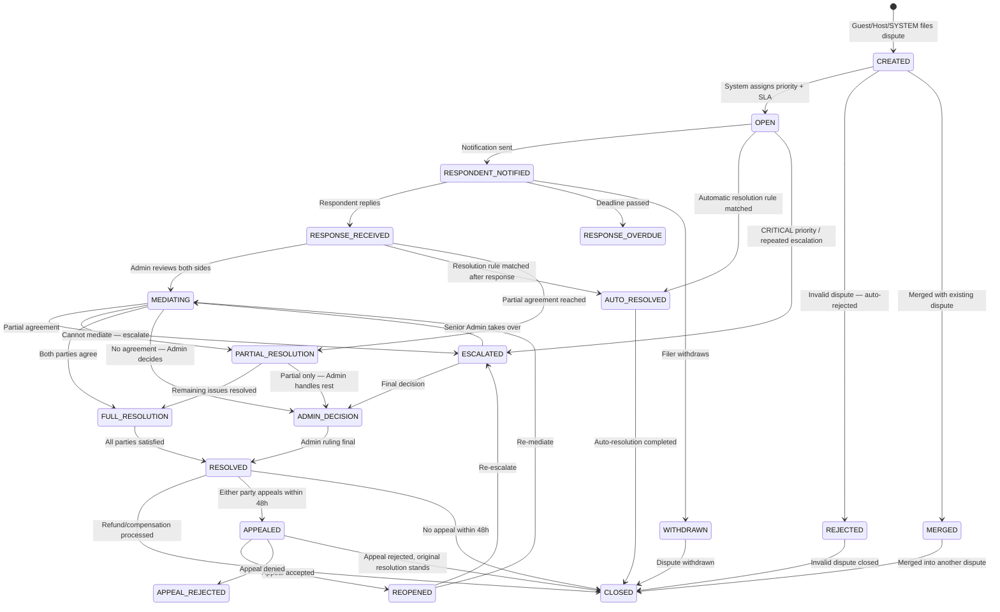
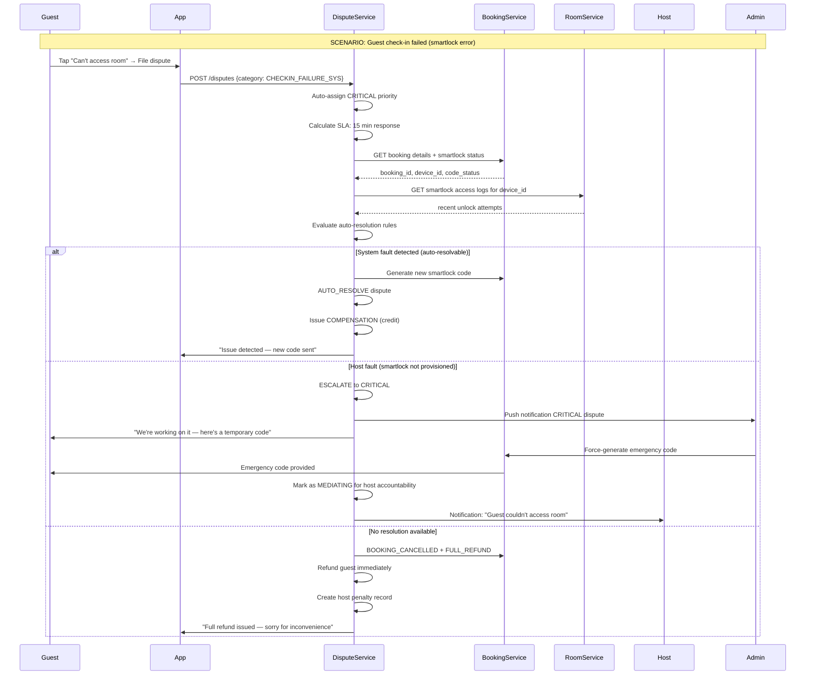
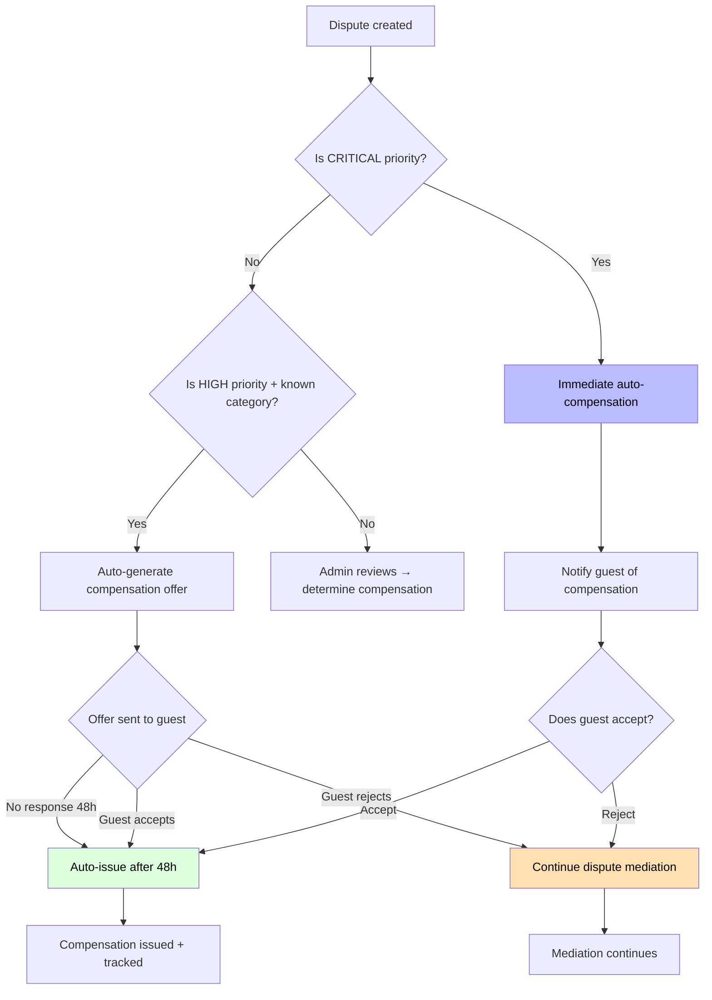
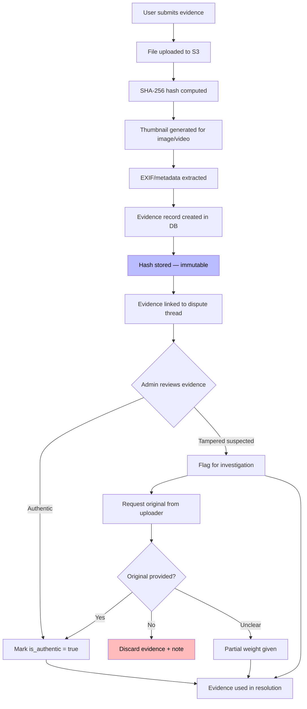
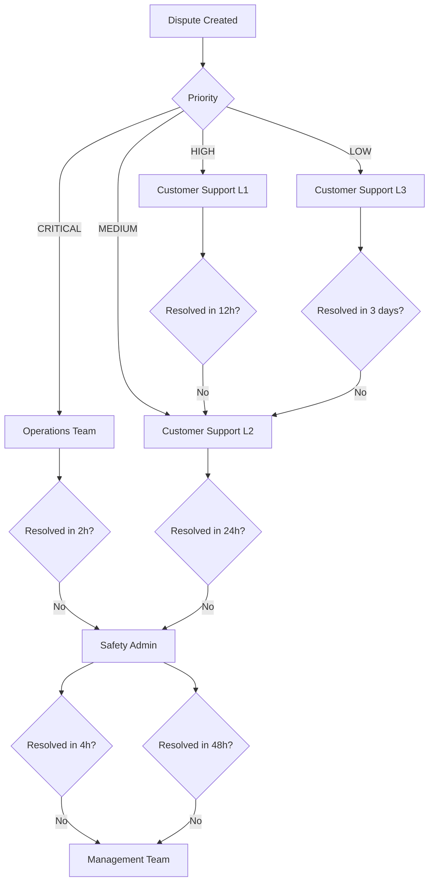
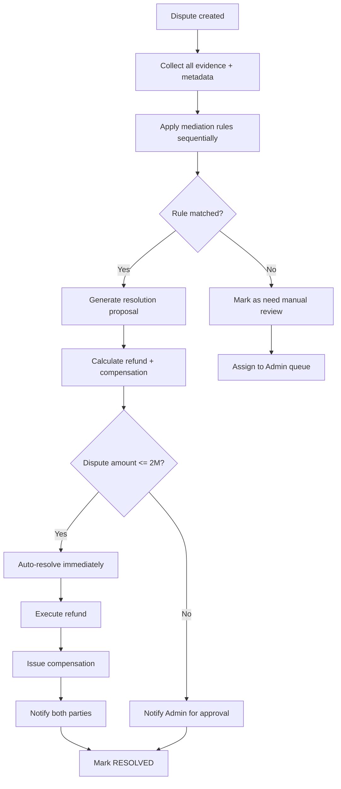
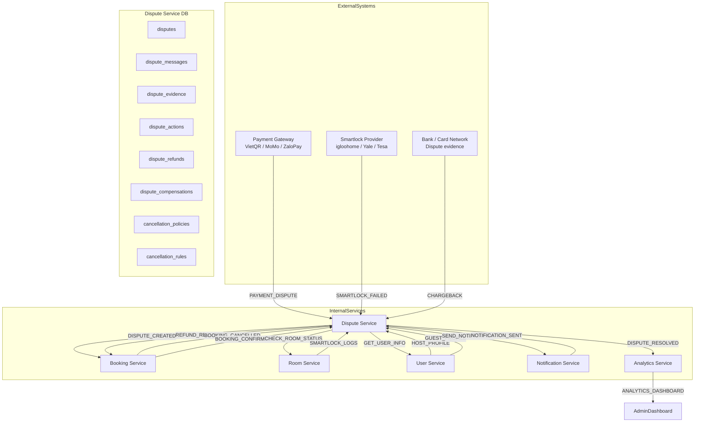

# Homi 1.0 — Dispute Control Mechanisms

---

## Mục lục

1. [Tổng quan Dispute Control](#1-tổng-quan-dispute-control)
2. [Phân loại Dispute (Dispute Categories)](#2-phân-loại-dispute-dispute-categories)
3. [Database Schema cho Dispute System](#3-database-schema-cho-dispute-system)
4. [Dispute Workflow — Vòng đời Xử lý Tranh chấp](#4-dispute-workflow--vòng-đời-xử-lý-tranh-chấp)
5. [Refund Engine — Công cụ Tính hoàn tiền](#5-refund-engine--công-cụ-tính-hoàn-tiền)
6. [Compensation Rules Engine](#6-compensation-rules-engine)
7. [Evidence Management — Quản lý Bằng chứng](#7-evidence-management--quản-lý-bằng-chứng)
8. [Mediation & Resolution Flow](#8-mediation--resolution-flow)
9. [Escalation Logic — Quy tắc Esclate](#9-escalation-logic--quy-tắc-escalate)
10. [Automatic Resolution Rules](#10-automatic-resolution-rules)
11. [Notification System cho Dispute](#11-notification-system-cho-dispute)
12. [Reporting & Analytics cho Host & Admin](#12-reporting--analytics-cho-host--admin)
13. [Integration với các Service khác](#13-integration-với-các-service-khác)

---

## 1. Tổng quan Dispute Control

### 1.1 Mục tiêu

Hệ thống Dispute Control của Homi 1.0 phục vụ **3 nhóm người dùng** trên cả **DAILY** và **HOURLY** rental model:

| Nhóm | Nhu cầu |
|------|---------|
| **Guest** | Khiếu nại khi phòng không đúng mô tả, không thể check-in, hủy không đúng chính sách, hoàn tiền |
| **Host** | Báo cáo khách gây hư hỏng, khiếu nại thanh toán, phản đối refund request, tố cáo hành vi gian lận |
| **Admin** | Xem xét tranh chấp, đưa ra quyết định cuối cùng, quản lý refund/compensation, phân tích trend dispute |

### 1.2 Các vấn đề Dispute giải quyết

```
┌─────────────────────────────────────────────────────────────┐
│                    DISPUTE CONTROL COVERS                   │
├─────────────────────────────────────────────────────────────┤
│  1. Overbooking dispute     — Phòng bị bán 2 lần            │
│  2. Property mismatch       — Thực tế khác mô tả            │
│  3. Check-in failure        — Không thể nhận phòng          │
│  4. Cancellation conflict   — Hủy không đúng policy         │
│  5. Payment dispute         — Thanh toán bị tranh chấp      │
│  6. Damage claim            — Hư hỏng tài sản               │
│  7. No-show accusation      — Khách không đến / Host vắng   │
│  8. Early checkout demand   — Yêu cầu trả phòng sớm         │
│  9. Price dispute           — Tính giá sai cho HOURLY       │
│ 10. Cleaning dispute        — Phòng không sạch khi nhận     │
└─────────────────────────────────────────────────────────────┘
```

### 1.3 Design Principles

| Nguyên tắc | Mô tả |
|-----------|--------|
| **Audit-first** | Mọi action trong dispute đều được ghi log. Không xóa, chỉ đóng trạng thái. |
| **Event-driven** | Dispute được tạo/kết thúc qua event từ Booking Service. Đảm bảo eventual consistency. |
| **Immutable evidence** | Bằng chứng (hình ảnh, video, log) không bao giờ bị sửa sau khi upload. |
| **Fair sequencing** | Cả guest VÀ host đều có quyền trình bày. Không bias về một phía. |
| **Automatic first** | Càng nhiều dispute được resolve tự động, workload Admin càng giảm. |

---

## 2. Phân loại Dispute (Dispute Categories)

### 2.1 Category Taxonomy

```typescript
enum DisputeCategory {
  // Booking Issues
  OVERBOOKING           = 'OVERBOOKING',           // Phòng bị đặt 2 lần
  PROPERTY_MISMATCH     = 'PROPERTY_MISMATCH',     // Thực tế ≠ mô tả
  CHECKIN_FAILURE_HOST  = 'CHECKIN_FAILURE_HOST', // Host không có mặt / không cấp mã
  CHECKIN_FAILURE_SYS   = 'CHECKIN_FAILURE_SYS',  // Smartlock/system lỗi
  CLEANLINESS_ISSUE     = 'CLEANLINESS_ISSUE',     // Phòng không sạch

  // Payment Issues
  PAYMENT_DUPLICATE     = 'PAYMENT_DUPLICATE',     // Thanh toán trùng lặp
  PAYMENT_FAILED        = 'PAYMENT_FAILED',        // Thanh toán thất bại nhưng bị trừ tiền
  PRICE_CALCULATION     = 'PRICE_CALCULATION',     // Tính giá HOURLY sai
  OVERCHARGE            = 'OVERCHARGE',            // Tính phí quá mức

  // Cancellation Issues
  CANCEL_POLICY_DISPUTE = 'CANCEL_POLICY_DISPUTE', // Bất đồng về chính sách hủy
  EARLY_CHECKOUT_FORCE  = 'EARLY_CHECKOUT_FORCE', // Host yêu cầu trả phòng sớm
  REFUND_AMOUNT         = 'REFUND_AMOUNT',         // Số tiền hoàn không đồng ý

  // Damage & Behavior
  PROPERTY_DAMAGE       = 'PROPERTY_DAMAGE',       // Khách gây hư hỏng
  GUEST_MISCONDUCT     = 'GUEST_MISCONDUCT',      // Khách vi phạm nội quy
  HOST_MISCONDUCT       = 'HOST_MISCONDUCT',       // Host vi phạm cam kết
  NO_SHOW_GUEST        = 'NO_SHOW_GUEST',         // Khách không đến
  NO_SHOW_HOST         = 'NO_SHOW_HOST',          // Host không chuẩn bị

  // Smartlock & Access
  SMARTLOCK_CODE_WRONG  = 'SMARTLOCK_CODE_WRONG',  // Mã khóa sai
  SMARTLOCK_OFFLINE     = 'SMARTLOCK_OFFLINE',     // Smartlock mất kết nối
  ACCESS_REVOKED_WRONG  = 'ACCESS_REVOKED_WRONG', // Mã bị thu hồi sai

  // Other
  OTHER                 = 'OTHER',
}
```

### 2.2 Priority Levels

```typescript
enum DisputePriority {
  CRITICAL = 1,  // Có người đang ở trong phòng nhưng không vào được / bị đuổi
  HIGH     = 2,  // Overbooking, check-in failure, payment issue
  MEDIUM   = 3,  // Property mismatch, cleanliness, cancellation dispute
  LOW      = 4,  // Price calculation, minor complaints
}
```

### 2.3 SLA Timeline (DAILY vs HOURLY)

| Priority | HOURLY — Phản hồi ban đầu | HOURLY — Kết luận | DAILY — Phản hồi ban đầu | DAILY — Kết luận |
|---------|---------------------------|-------------------|---------------------------|-------------------|
| CRITICAL | 15 phút | 2 giờ | 30 phút | 4 giờ |
| HIGH | 2 giờ | 12 giờ | 4 giờ | 24 giờ |
| MEDIUM | 12 giờ | 3 ngày | 24 giờ | 7 ngày |
| LOW | 24 giờ | 7 ngày | 48 giờ | 14 ngày |

**Lý do HOURLY cần phản hồi nhanh hơn:** Khách HOURLY có thể đang đứng trước cửa hoặc đã vào phòng. Mỗi phút trễ = thiệt hại trải nghiệm thực tế.

---

## 3. Database Schema cho Dispute System

### 3.1 Bảng `disputes` — Core Dispute Record

```mermaid
erDiagram
    DISPUTES ||--o{ DISPUTE_MESSAGES : contains
    DISPUTES ||--o{ DISPUTE_EVIDENCE : has
    DISPUTES ||--o{ DISPUTE_ACTIONS : tracks
    DISPUTES ||--o{ DISPUTE_REFUNDS : resolves
    DISPUTES ||--o{ DISPUTE_COMPENSATIONS : compensates
    DISPUTES ||--o{ DISPUTE_AUDIT_LOGS : audited_by
    DISPUTES ||--o{ DISPUTE_NOTIFICATIONS : notifies
    DISPUTES }o--|| BOOKINGS : relates_to
    DISPUTES }o--|| ACCOUNTS : filed_by
    DISPUTES }o--|| ACCOUNTS : assigned_to
    DISPUTES }o--|| PROPERTIES : involves
    DISPUTES }o--|| ROOMS : involves

    DISPUTES {
        uuid id PK
        uuid booking_id FK "nullable — không phải dispute nào cũng có booking"
        uuid filed_by_user_id UUID "Người tạo dispute"
        uuid assigned_to_admin_id UUID "Admin phụ trách"
        uuid property_id UUID FK
        uuid room_id UUID FK
        string category "DisputeCategory enum"
        string priority "CRITICAL|HIGH|MEDIUM|LOW"
        string status "OPEN|MEDIATING|RESOLVED|ESCALATED|CLOSED"
        string rental_type "DAILY|HOURLY"
        string filed_by_role "GUEST|HOST|ADMIN|SYSTEM"
        string respondent_role "GUEST|HOST|ADMIN"
        decimal dispute_amount "Số tiền tranh chấp"
        decimal proposed_refund "Số tiền guest yêu cầu hoàn"
        decimal approved_refund "Số tiền được approve hoàn"
        decimal host_payout_affected "Số tiền ảnh hưởng đến host payout"
        jsonb metadata "Dữ liệu nghiệp vụ bổ sung"
        timestamptz filed_at "Thời điểm tạo dispute"
        timestamptz resolved_at "Thời điểm resolve"
        timestamptz sla_deadline "Hạn SLA"
        timestamptz sla_breached_at "Thời điểm breach SLA"
        string resolution_type "FULL_REFUND|PARTIAL_REFUND|COMPENSATION|DENIED|WITHDRAWN|SPLIT"
        string resolution_note "Ghi chú resolution từ Admin"
        int response_days_allowed "Số ngày respondent có để phản hồi"
        timestamptz response_deadline "Hạn phản hồi của bên respondent"
        boolean is_auto_resolved "True = resolved bởi hệ thống tự động"
        timestamp created_at
        timestamp updated_at
        timestamp deleted_at
    }
```

### 3.2 Bảng `dispute_messages` — Threaded Conversation

```mermaid
erDiagram
    DISPUTES ||--o{ DISPUTE_MESSAGES : contains

    DISPUTE_MESSAGES {
        uuid id PK
        uuid dispute_id FK
        uuid sender_id UUID "User gửi"
        string sender_role "GUEST|HOST|ADMIN|SYSTEM"
        string sender_type "USER|BOT"
        text message "Nội dung tin nhắn"
        string message_type "TEXT|IMAGE|VIDEO|DOCUMENT|SYSTEM|AUTO_REPLY"
        string visibility "ALL|GUEST_ONLY|HOST_ONLY|ADMIN_ONLY"
        boolean is_edited boolean default false
        uuid reply_to_message_id UUID FK "Nullable — reply đến message nào"
        jsonb attachments "URLs đến file đính kèm"
        timestamptz read_at "Thời điểm đối phương đọc"
        timestamp created_at
    }
```

### 3.3 Bảng `dispute_evidence` — Immutable Evidence Store

```mermaid
erDiagram
    DISPUTES ||--o{ DISPUTE_EVIDENCE : has

    DISPUTE_EVIDENCE {
        uuid id PK
        uuid dispute_id FK
        uuid uploaded_by UUID
        string uploaded_by_role "GUEST|HOST|ADMIN"
        string evidence_type "PHOTO|VIDEO|SCREENSHOT|DOCUMENT|AUDIO|LOG_EXTRACT|SMARTLOCK_LOG"
        string file_url "URL trên S3 — không bao giờ sửa sau khi upload"
        string file_type "MIME type"
        bigint file_size_bytes
        string thumbnail_url "Thumbnail nếu là hình ảnh/video"
        string description "Mô tả bằng chứng"
        string purpose "SUPPORT_CLAIM|REBUTTAL|PROOF_OF_DAMAGE|PROOF_OF_CONDITION|TIMESTAMP_PROOF"
        jsonb metadata "EXIF data, duration, resolution, hash SHA-256"
        string hash_sha256 "Xác minh file không bị sửa"
        boolean is_authentic boolean default true "Đã được xác minh authenticity"
        string authenticity_note "Ghi chú từ Admin/System về authenticity"
        timestamp created_at
    }
```

### 3.4 Bảng `dispute_actions` — Action Audit Trail

```mermaid
erDiagram
    DISPUTES ||--o{ DISPUTE_ACTIONS : tracks

    DISPUTE_ACTIONS {
        uuid id PK
        uuid dispute_id FK
        uuid performed_by UUID
        string performed_by_role "GUEST|HOST|ADMIN|SYSTEM"
        string action_type
        "CREATE_DISPUTE|ADD_EVIDENCE|ADD_MESSAGE|RESPONSE_REQUIRED"
        "|RESPONSE_RECEIVED|REFUND_APPROVED|REFUND_REJECTED"
        "|ESCALATE|AUTO_RESOLVE|MANUAL_RESOLVE|WITHDRAW|ASSIGN"
        "|SLA_WARNING|SLA_BREACH|PRIORITY_CHANGE|CATEGORY_CHANGE"
        "|COMPENSATION_APPROVED|COMPENSATION_REJECTED"
        string old_status
        string new_status
        jsonb action_data "Chi tiết action — số tiền, lý do,..."
        string ip_address
        string user_agent
        timestamp created_at
    }
```

### 3.5 Bảng `dispute_refunds` — Refund Records

```mermaid
erDiagram
    DISPUTES ||--o| DISPUTE_REFUNDS : has
    DISPUTES ||--o| BOOKING_CANCELLATIONS : linked_to

    DISPUTE_REFUNDS {
        uuid id PK
        uuid dispute_id FK
        uuid booking_id FK "Booking liên quan"
        uuid cancellation_id FK "Cancellation record nếu có"
        decimal original_booking_amount
        decimal amount_paid_by_guest
        decimal refund_amount_requested
        decimal refund_amount_approved
        decimal platform_fee_refunded "Phần platform fee được hoàn"
        decimal host_payout_deducted "Số tiền trừ vào host payout"
        string refund_type "FULL|PARTIAL|PERCENTAGE|CUSTOM"
        decimal refund_percentage "Nếu type = PERCENTAGE"
        string refund_method "ORIGINAL_PAYMENT|WALLET|CREDIT|VOUCHER|BANK_TRANSFER"
        string refund_reason_code "NO-show|HOST_FAULT|SYSTEM_FAULT|MUTUAL_AGREEMENT|Policy"
        string payment_transaction_id "Transaction refund trên cổng thanh toán"
        string refund_status "PENDING|PROCESSING|COMPLETED|FAILED|CANCELLED"
        timestamptz refund_initiated_at
        timestamptz refund_completed_at
        string failure_reason
        string approved_by UUID "Admin approve refund"
        jsonb calculation_breakdown "Chi tiết cách tính refund"
        timestamp created_at
    }
```

### 3.6 Bảng `dispute_compensations` — Non-Refund Compensation

```mermaid
erDiagram
    DISPUTES ||--o| DISPUTE_COMPENSATIONS : has

    DISPUTE_COMPENSATIONS {
        uuid id PK
        uuid dispute_id FK
        uuid guest_id UUID
        uuid host_id UUID
        string compensation_type "CREDIT|VOUCHER|FREE_NIGHT|DISCOUNT|FUTURE_BOOKING|APOLOGY"
        string target_user_type "GUEST|HOST"
        decimal monetary_value "Giá trị quy đổi ra tiền (VNĐ)"
        string voucher_code VARCHAR(50) "Mã voucher nếu type = VOUCHER"
        string voucher_description
        date voucher_valid_from
        date voucher_valid_until
        int voucher_max_uses
        int voucher_uses_count default 0
        string status "ISSUED|CLAIMED|EXPIRED|CANCELLED|USED"
        string reason "Tại sao compensate"
        string approved_by UUID
        timestamp created_at
        timestamp claimed_at
        timestamp expired_at
    }
```

### 3.7 Bảng `cancellation_policies` — Chính sách Hủy Chi tiết

```mermaid
erDiagram
    PROPERTIES ||--o{ CANCELLATION_POLICIES : has
    CANCELLATION_POLICIES ||--o{ CANCELLATION_RULES : defines

    CANCELLATION_POLICIES {
        uuid id PK
        uuid property_id FK
        string rental_type "DAILY|HOURLY|BOTH"
        string policy_name "Flexible|Moderate|Strict|Custom"
        boolean is_default boolean default false
        boolean is_guest_friendly boolean default false
        text description "Mô tả chính sách hiển thị cho guest"
        timestamp created_at
    }

    CANCELLATION_RULES {
        uuid id PK
        uuid policy_id FK
        int hours_before_checkin "âm = sau khi check-in"
        string refund_type "FULL|PERCENTAGE|FIRST_NIGHT|NO_REFUND"
        decimal refund_percentage "0-100"
        boolean requires_evidence boolean default false
        string note "VD: 'Chỉ hoàn 50% nếu hủy trong 24h'"
    }
```

---

## 4. Dispute Workflow — Vòng đời Xử lý Tranh chấp

### 4.1 Full Dispute State Machine



### 4.2 HOURLY-Specific Dispute Flow

Với HOURLY model, thời gian là yếu tố tới hạn. Workflow được thiết kế để **không blocking guest** trong khi dispute đang xử lý.



### 4.3 DAILY-Specific Dispute Flow

Với DAILY model, dispute thường nặng về **refund amount** và **property condition**.

```mermaid
sequenceDiagram
    participant Guest
    participant DisputeService
    participant BookingService
    participant SmartlockService
    participant Host
    participant Admin

    Note over Guest,Admin: SCENARIO: Property Mismatch — room not as described
    Guest->>DisputeService: POST /disputes
        category: PROPERTY_MISMATCH
        evidence: [photo1, photo2]
        requested_refund: 70%
    DisputeService->>BookingService: GET booking + property data
    BookingService-->>DisputeService: booking details, original amount

    DisputeService->>DisputeService: Check cancellation_policy for this property
    DisputeService->>DisputeService: Calculate max_refund_based_on_policy

    DisputeService->>Host: Notify — "Guest filed dispute"
    Host->>DisputeService: Response + evidence (counter-photos)
    DisputeService->>DisputeService: Link host response to dispute thread

    alt Evidence clearly favors guest
        DisputeService->>DisputeService: AUTO_RESOLVE: partial refund
        DisputeService->>Admin: Review auto-resolution
        Admin-->>DisputeService: Approve
        DisputeService->>BookingService: PROCESS_REFUND
        DisputeService->>DisputeService: RESOLVED
    else Evidence unclear / partial mismatch
        DisputeService->>Admin: ESCALATE for manual review
        Admin->>DisputeService: Review both evidence sets
        Admin->>DisputeService: ADMIN_DECISION: 50% refund
        DisputeService->>BookingService: PROCESS_PARTIAL_REFUND
        DisputeService->>Host: Notify host of decision
        DisputeService->>Guest: Notify guest of decision
        DisputeService->>DisputeService: RESOLVED
    end
```

---

## 5. Refund Engine — Công cụ Tính hoàn tiền

### 5.1 Refund Calculation Algorithm

```typescript
interface RefundCalculationInput {
  bookingId: string;
  rentalType: 'DAILY' | 'HOURLY';
  originalAmount: number;        // Tổng tiền guest trả
  platformFee: number;          // Phí platform (VD: 10%)
  hostPayout: number;           // Số tiền host nhận (sau trừ fee)
  cancellationPolicy: CancellationPolicy;
  checkInTime: Date;
  checkOutTime: Date;
  actualCheckInTime?: Date;      // Thời gian guest thực tế check-in
  actualCheckOutTime?: Date;     // Thời gian guest thực tế check-out
  hoursUsed?: number;            // Với HOURLY: số giờ đã dùng
  disputeCategory: DisputeCategory;
  faultParty: 'GUEST' | 'HOST' | 'SYSTEM';
  evidenceStrength: number;      // 0.0 - 1.0, độ mạnh bằng chứng
}

interface RefundCalculationOutput {
  refundType: 'FULL' | 'PARTIAL' | 'NONE';
  guestRefundAmount: number;
  hostPayoutDeduction: number;
  platformFeeAdjustment: number;
  breakdown: {
    baseRefund: number;
    timeUsedDeduction: number;
    evidenceAdjustment: number;
    policyAdjustment: number;
  };
  explanation: string;
}
```

### 5.2 Refund Calculation Logic

```typescript
function calculateRefund(input: RefundCalculationInput): RefundCalculationOutput {
  const {
    originalAmount, platformFee, hostPayout,
    cancellationPolicy, checkInTime, checkOutTime,
    actualCheckInTime, actualCheckOutTime,
    hoursUsed, disputeCategory, faultParty, evidenceStrength,
  } = input;

  let refundAmount = 0;
  const breakdown = { baseRefund: 0, timeUsedDeduction: 0, evidenceAdjustment: 0, policyAdjustment: 0 };

  // === STEP 1: Xác định fault party và refund rate tương ứng ===
  const faultRefundRates: Record<string, number> = {
    SYSTEM_FAULT: 1.0,              // Luôn hoàn 100%
    HOST_FAULT: 0.8,                // Mặc định hoàn 80%, điều chỉnh theo evidence
    GUEST_FAULT: 0.0,               // Không hoàn, trừ vào policy
    MUTUAL_FAULT: 0.5,              // Chia đều
    NO_FAULT: 0.0,                  // Không lỗi = không hoàn
  };

  let baseRate = faultRefundRates[faultParty] ?? 0;

  // === STEP 2: Điều chỉnh theo evidence strength ===
  // evidenceStrength 0.0-1.0: yếu → mạnh
  if (faultParty === 'HOST_FAULT') {
    // Host lỗi + evidence mạnh → hoàn nhiều hơn
    baseRate = Math.min(1.0, baseRate + (evidenceStrength * 0.2));
  } else if (faultParty === 'MUTUAL_FAULT') {
    // Mutual: evidence strength skews toward one side
    baseRate = 0.5 + ((evidenceStrength - 0.5) * 0.3);
    baseRate = Math.max(0.2, Math.min(0.8, baseRate));
  }

  breakdown.evidenceAdjustment = Math.round((baseRate - (faultRefundRates[faultParty] ?? 0)) * originalAmount);

  // === STEP 3: HOURLY-specific — trừ tiền theo giờ đã dùng ===
  if (input.rentalType === 'HOURLY') {
    const totalBookedHours = (checkOutTime.getTime() - checkInTime.getTime()) / 3600000;
    const hoursUsedDeduction = hoursUsed
      ? (hoursUsed / totalBookedHours) * originalAmount * baseRate
      : 0;

    breakdown.timeUsedDeduction = Math.round(hoursUsedDeduction);
    refundAmount = originalAmount * baseRate - hoursUsedDeduction;

    // Nếu guest đã check-in và ở trong phòng, tính tiền theo giờ đã dùng
    if (hoursUsed && hoursUsed > 0 && faultParty !== 'SYSTEM_FAULT') {
      // Trừ tiền giờ đã dùng, nhưng không quá 50% tổng tiền
      const maxTimeDeduction = originalAmount * 0.5;
      breakdown.timeUsedDeduction = Math.min(hoursUsedDeduction, maxTimeDeduction);
    }
  } else {
    // === STEP 4: DAILY — kiểm tra cancellation policy ===
    const hoursBeforeCheckIn = (checkInTime.getTime() - Date.now()) / 3600000;
    const applicableRule = cancellationPolicy.rules
      .filter(r => r.hours_before_checkin <= hoursBeforeCheckIn)
      .sort((a, b) => b.hours_before_checkin - a.hours_before_checkin)[0];

    if (applicableRule) {
      switch (applicableRule.refund_type) {
        case 'FULL':
          refundAmount = originalAmount;
          break;
        case 'PERCENTAGE':
          refundAmount = originalAmount * (applicableRule.refund_percentage / 100);
          break;
        case 'FIRST_NIGHT':
          refundAmount = originalAmount - (originalAmount / Math.ceil(
            (checkOutTime.getTime() - checkInTime.getTime()) / 86400000
          ));
          break;
        case 'NO_REFUND':
          refundAmount = 0;
          break;
      }
      breakdown.policyAdjustment = refundAmount - (originalAmount * baseRate);
    } else {
      refundAmount = originalAmount * baseRate;
    }
  }

  // === STEP 5: Áp dụng min/max cap ===
  refundAmount = Math.max(0, Math.round(refundAmount));
  const maxRefund = originalAmount * 0.95; // Platform giữ 5% fee
  refundAmount = Math.min(refundAmount, maxRefund);

  const hostDeduction = faultParty === 'HOST_FAULT' || faultParty === 'SYSTEM_FAULT'
    ? refundAmount
    : 0;

  return {
    refundType: refundAmount === originalAmount ? 'FULL' : refundAmount > 0 ? 'PARTIAL' : 'NONE',
    guestRefundAmount: refundAmount,
    hostPayoutDeduction: hostDeduction,
    platformFeeAdjustment: refundAmount > 0 ? -(refundAmount * (platformFee / originalAmount)) : 0,
    breakdown,
    explanation: generateRefundExplanation(input, refundAmount),
  };
}
```

### 5.3 HOURLY Refund Edge Cases

```typescript
// HOURLY edge cases
const hourlyRefundScenarios = [
  {
    scenario: 'Guest check-in 2 giờ, muốn hủy 2 giờ còn lại',
    calculation: 'hourly_price × 2 hours = deduction. Remaining = refund.',
  },
  {
    scenario: 'Host yêu cầu trả phòng sớm (early checkout demand)',
    calculation: 'Guest được hoàn tiền cho giờ không dùng + compensation = 1 giờ bồi thường',
  },
  {
    scenario: 'Smartlock lỗi sau 1 giờ → guest ở 2 giờ miễn phí',
    calculation: 'hoursUsed = 1. Refund = total - 1 hour. COMPENSATION: 1 hour free credit.',
  },
  {
    scenario: 'Overbooking HOURLY — guest được đặt sang phòng khác',
    calculation: 'Full refund + upgrade compensation. Original room charge = 0.',
  },
];
```

### 5.4 DAILY Refund Timeline

```
Ngày đặt ────►│◄── 48h ──►│◄──── 24h ────►│◄── 0h ──►│─── Check-in ────►│─── Check-out ────►
              │            │              │          │
              │ FREE CANCEL │MODERATE REFUND│ STRICT  │    FAULT-BASED REFUND
              │   100%      │    50%        │  0%     │    (Host/System fault)
```

---

## 6. Compensation Rules Engine

### 6.1 Compensation Types

| Type | Mô tả | Giá trị max |
|------|--------|------------|
| `CREDIT` | Credits trong ví Homi | Không giới hạn |
| `VOUCHER` | Mã giảm giá cho booking tiếp theo | 30% giá trị booking |
| `FREE_NIGHT` | 1 đêm miễn phí (DAILY) | Giá trị avg room price |
| `FREE_HOURS` | Giờ miễn phí (HOURLY) | 4 giờ |
| `DISCOUNT` | Giảm giá % cho booking tiếp | 20% |
| `APOLOGY` | Không quy đổi tiền | — |
| `UPGRADE` | Upgrade phòng miễn phí lần sau | Upgrade 1 tier |

### 6.2 Pre-defined Compensation Slabs

```typescript
const compensationSlabs = [
  // CRITICAL priority — immediate compensation
  {
    trigger: { priority: 'CRITICAL', category: 'CHECKIN_FAILURE_SYS' },
    autoCompensation: { type: 'CREDIT', minAmount: 50000, maxAmount: 200000 },
    escalate: true,
    slaMinutes: 15,
  },
  {
    trigger: { priority: 'CRITICAL', category: 'OVERBOOKING' },
    autoCompensation: { type: 'VOUCHER', percentage: 30, maxAmount: 500000 },
    escalate: true,
    slaMinutes: 30,
  },
  // HIGH priority
  {
    trigger: { priority: 'HIGH', category: 'PROPERTY_MISMATCH' },
    autoCompensation: { type: 'CREDIT', minAmount: 100000, maxAmount: 500000 },
    escalate: false,
    slaMinutes: 120,
  },
  {
    trigger: { priority: 'HIGH', category: 'CHECKIN_FAILURE_HOST' },
    autoCompensation: { type: 'CREDIT', minAmount: 100000, maxAmount: 300000 },
    escalate: true,
    slaMinutes: 60,
  },
  {
    trigger: { priority: 'HIGH', category: 'SMARTLOCK_OFFLINE' },
    autoCompensation: { type: 'FREE_HOURS', hours: 1 },
    escalate: true,
    slaMinutes: 30,
  },
  // MEDIUM priority
  {
    trigger: { priority: 'MEDIUM', category: 'CLEANLINESS_ISSUE' },
    autoCompensation: { type: 'CREDIT', minAmount: 50000, maxAmount: 150000 },
    escalate: false,
    slaMinutes: 720,
  },
  {
    trigger: { priority: 'MEDIUM', category: 'PRICE_CALCULATION' },
    autoCompensation: { type: 'CREDIT', minAmount: 10000, maxAmount: 100000 },
    escalate: false,
    slaMinutes: 360,
  },
];
```

### 6.3 Compensation Decision Flow



---

## 7. Evidence Management — Quản lý Bằng chứng

### 7.1 Evidence Submission Flow



### 7.2 Evidence Types by Dispute Category

| Dispute Category | Required Evidence | Optional Evidence |
|-----------------|-------------------|-------------------|
| `PROPERTY_MISMATCH` | 3+ photos of actual condition | Video walkthrough, timestamp |
| `CHECKIN_FAILURE_SYS` | App screenshots, error codes | Smartlock access logs |
| `CHECKIN_FAILURE_HOST` | Screenshots of contact attempts | Witness messages |
| `PROPERTY_DAMAGE` | Before/after photos | Video at check-in, inventory list |
| `CLEANLINESS_ISSUE` | 3+ photos of dirty areas | Video showing dirty condition |
| `SMARTLOCK_CODE_WRONG` | Screenshots of wrong code received | App logs |
| `PAYMENT_DUPLICATE` | Bank statement / payment proof | App payment history screenshot |
| `OVERCHARGE` | Invoice / receipt screenshots | Comparison with quoted price |
| `NO_SHOW_GUEST` | Smartlock logs (no entry detected) | Host photos at door |
| `NO_SHOW_HOST` | Guest arrival photos | Messaging attempts to host |

### 7.3 Smartlock Evidence — Auto-Generated

Hệ thống tự động gắn bằng chứng từ smartlock logs vào dispute liên quan:

```typescript
async function attachSmartlockEvidence(disputeId: string, bookingId: string) {
  const smartlockLogs = await this.smartlockService.getAccessLogs(bookingId);

  for (const log of smartlockLogs) {
    await this.prisma.disputeEvidence.create({
      data: {
        dispute_id: disputeId,
        uploaded_by: 'SYSTEM',
        uploaded_by_role: 'SYSTEM',
        evidence_type: 'SMARTLOCK_LOG',
        file_url: log.url,           // Log export từ smartlock provider
        description: `Smartlock event: ${log.event_type} at ${log.occurred_at}`,
        purpose: 'TIMESTAMP_PROOF',
        metadata: {
          event_type: log.event_type,
          unlock_method: log.unlock_method,
          occurred_at: log.occurred_at,
          device_id: log.device_id,
        },
        hash_sha256: await computeHash(log.rawData),
      },
    });
  }
}
```

### 7.4 Evidence Weight Scoring

```typescript
interface EvidenceWeight {
  source: 'GUEST' | 'HOST' | 'SYSTEM' | 'ADMIN';
  type: string;
  authenticity: number;     // 0.0-1.0
  relevance: number;         // 0.0-1.0
  timeliness: number;         // 0.0-1.0 (thời gian gần check-in check-out)
  corroboration: number;    // 0.0-1.0 (có bằng chứng đối phương không)
}

function calculateEvidenceWeight(evidence: EvidenceWeight): number {
  // System-generated evidence (smartlock logs) có weight cao nhất
  const sourceMultiplier = {
    SYSTEM: 1.0,
    ADMIN: 0.95,
    GUEST: 0.7,
    HOST: 0.7,
  };

  const score =
    sourceMultiplier[evidence.source] *
    evidence.authenticity *
    evidence.relevance *
    evidence.timeliness *
    evidence.corroboration;

  return Math.round(score * 100) / 100;
}
```

---

## 8. Mediation & Resolution Flow

### 8.1 Automated Mediation Rules

```typescript
const mediationRules = [
  // Rule 1: Guest claim matches smartlock evidence
  {
    condition: (d, evidence) =>
      d.category === 'CHECKIN_FAILURE_SYS' &&
      evidence.some(e => e.type === 'SMARTLOCK_LOG' && e.event_type === 'FAILED_ATTEMPT'),
    action: 'AUTO_RESOLVE',
    decision: { refundPercentage: 100, compensation: { type: 'CREDIT', amount: 100000 } },
    reason: 'Smartlock failure confirmed — full refund + compensation',
  },
  // Rule 2: Property mismatch with clear photo evidence
  {
    condition: (d, evidence) =>
      d.category === 'PROPERTY_MISMATCH' &&
      evidence.filter(e => e.type === 'PHOTO' && e.uploaded_by_role === 'GUEST').length >= 3 &&
      !evidence.some(e => e.type === 'PHOTO' && e.uploaded_by_role === 'HOST'),
    action: 'AUTO_RESOLVE',
    decision: { refundPercentage: 70, compensation: null },
    reason: 'Clear photo evidence from guest, no counter-evidence',
  },
  // Rule 3: Host no-show with smartlock log proving no entry
  {
    condition: (d, evidence) =>
      d.category === 'NO_SHOW_HOST' &&
      evidence.some(e => e.type === 'SMARTLOCK_LOG' && e.event_type === 'NO_ENTRY'),
    action: 'AUTO_RESOLVE',
    decision: { refundPercentage: 100, compensation: { type: 'FREE_NIGHT', value: d.bookingAmount } },
    reason: 'Host no-show confirmed — full refund + free night',
  },
  // Rule 4: Price calculation error (system fault)
  {
    condition: (d, evidence) =>
      d.category === 'PRICE_CALCULATION' &&
      evidence.some(e => e.metadata?.originalPrice !== e.metadata?.chargedPrice),
    action: 'AUTO_RESOLVE',
    decision: { refundPercentage: 'DIFFERENCE', compensation: null },
    reason: 'System price error — refund difference',
  },
  // Rule 5: Both parties have evidence — manual mediation needed
  {
    condition: (d, evidence) =>
      evidence.filter(e => e.uploaded_by_role === 'GUEST').length > 0 &&
      evidence.filter(e => e.uploaded_by_role === 'HOST').length > 0,
    action: 'ESCALATE',
    reason: 'Conflicting evidence — requires manual review',
  },
];
```

### 8.2 Admin Resolution Interface

```mermaid
sequenceDiagram
    participant Admin
    participant DisputeService
    participant Guest
    participant Host
    participant BookingService

    Admin->>DisputeService: Open dispute #1234
    DisputeService-->>Admin: Dispute details + all evidence
    Admin->>DisputeService: Fetch booking timeline
    DisputeService-->>Admin: Check-in: 14:05, Checkout: 12:00, paid: 800k

    Admin->>Guest: "Please share your experience"
    Guest-->>Admin: [Photos of dirty bathroom, mold on walls]
    Admin->>Host: "Please respond to guest's claim"
    Host-->>Admin: [Photos of clean room before check-in, housekeeper receipt]

    Admin->>Admin: Compare evidence: guest photos show mold — real issue
    Admin->>Admin: Calculate: Host at fault, 60% refund appropriate

    Admin->>DisputeService: RESOLVE
        refundPercentage: 60
        compensation: CREDIT 150k
        note: "Host responsible for cleanliness"
    DisputeService->>BookingService: PROCESS_REFUND 480k
    BookingService-->>DisputeService: Refund initiated
    DisputeService->>Guest: Notification: "Dispute resolved — 480k refund"
    DisputeService->>Host: Notification: "Dispute resolved — 480k deducted"
    DisputeService->>Guest: Compensation voucher: 150k
    DisputeService->>DisputeService: Mark RESOLVED
```

---

## 9. Escalation Logic — Quy tắc Escalate

### 9.1 Auto-Escalation Triggers

```typescript
const escalationRules = [
  {
    trigger: 'CRITICAL priority + no response in 15 min',
    escalateTo: 'SENIOR_ADMIN',
    action: 'IMMEDIATE_NOTIFICATION',
  },
  {
    trigger: 'SLA breach warning at 80% deadline',
    escalateTo: 'SUPERVISOR',
    action: 'WARNING_NOTIFICATION',
  },
  {
    trigger: 'SLA breach — actual breach',
    escalateTo: 'SENIOR_ADMIN',
    action: 'URGENT_NOTIFICATION + auto-escalate',
  },
  {
    trigger: 'Priority = CRITICAL + involves physical safety',
    escalateTo: 'SAFETY_TEAM',
    action: 'SAFE_REPORT + URGENT',
  },
  {
    trigger: 'Same host has 3+ disputes in 30 days',
    escalateTo: 'TRUST_SAFETY_TEAM',
    action: 'HOST_REVIEW_FLAG',
  },
  {
    trigger: 'Same guest has 3+ disputes in 30 days',
    escalateTo: 'TRUST_SAFETY_TEAM',
    action: 'GUEST_REVIEW_FLAG',
  },
  {
    trigger: 'Dispute amount > 10M VND',
    escalateTo: 'FINANCE_TEAM',
    action: 'FINANCE_REVIEW_REQUIRED',
  },
  {
    trigger: 'HOURLY dispute + guest currently in room',
    escalateTo: 'OPERATIONS_TEAM',
    action: 'IMMEDIATE_RESOLUTION_REQUIRED',
  },
];
```

### 9.2 Escalation Path



---

## 10. Automatic Resolution Rules

### 10.1 Auto-Resolution Matrix

| Điều kiện | Action | Refund | Compensation |
|-----------|--------|--------|-------------|
| Smartlock system error confirmed | Auto-resolve | 100% | 100k credit |
| Property photos ≠ actual (guest photo evidence) | Auto-resolve | 70% | 50k credit |
| Host no-show (smartlock log: no entry) | Auto-resolve | 100% | Free night voucher |
| Payment duplicate (bank proof) | Auto-resolve | Duplicate amount | None |
| Guest no-show (smartlock log: no entry + 24h) | Auto-resolve | 0% | None |
| Price calculation error (system fault) | Auto-resolve | Difference | None |
| Cancellation within refund window | Auto-resolve | Per policy | None |
| Mutual evidence conflicting | Manual | — | — |
| Damage claim > 2M VND | Manual | — | — |
| Repeated offender (host/guest) | Manual | — | — |

### 10.2 Auto-Resolution Workflow



---

## 11. Notification System cho Dispute

### 11.1 Notification Triggers

```typescript
const notificationTriggers = [
  // To Guest
  { event: 'DISPUTE_CREATED', to: 'GUEST', channel: 'APP_PUSH|SMS|EMAIL' },
  { event: 'HOST_RESPONSE_RECEIVED', to: 'GUEST', channel: 'APP_PUSH' },
  { event: 'EVIDENCE_ADDED_BY_HOST', to: 'GUEST', channel: 'APP_PUSH' },
  { event: 'AUTO_RESOLUTION_READY', to: 'GUEST', channel: 'APP_PUSH|EMAIL' },
  { event: 'DISPUTE_RESOLVED', to: 'GUEST', channel: 'APP_PUSH|EMAIL' },
  { event: 'REFUND_ISSUED', to: 'GUEST', channel: 'APP_PUSH|SMS' },
  { event: 'COMPENSATION_ISSUED', to: 'GUEST', channel: 'APP_PUSH' },
  { event: 'SLA_WARNING', to: 'GUEST', channel: 'APP_PUSH' },

  // To Host
  { event: 'DISPUTE_CREATED', to: 'HOST', channel: 'APP_PUSH|EMAIL|SMS' },
  { event: 'RESPONSE_REQUESTED', to: 'HOST', channel: 'APP_PUSH|SMS' },
  { event: 'EVIDENCE_ADDED_BY_GUEST', to: 'HOST', channel: 'APP_PUSH' },
  { event: 'ESCALATION_WARNING', to: 'HOST', channel: 'APP_PUSH|SMS' },
  { event: 'ADMIN_DECISION_MADE', to: 'HOST', channel: 'APP_PUSH|EMAIL' },
  { event: 'PAYOUT_DEDUCTED', to: 'HOST', channel: 'APP_PUSH|EMAIL' },
  { event: 'RESPONSE_OVERDUE', to: 'HOST', channel: 'SMS' },

  // To Admin
  { event: 'CRITICAL_DISPUTE_CREATED', to: 'ADMIN', channel: 'SLACK|WEBHOOK' },
  { event: 'SLA_BREACH', to: 'ADMIN', channel: 'SLACK|WEBHOOK' },
  { event: 'ESCALATION_TRIGGERED', to: 'ADMIN', channel: 'SLACK|WEBHOOK' },
  { event: 'AUTO_RESOLUTION_APPROVED', to: 'ADMIN', channel: 'DASHBOARD' },
  { event: 'HOST_DISPUTE_THRESHOLD_REACHED', to: 'ADMIN', channel: 'SLACK' },
];
```

### 11.2 HOURLY-Specific Notifications

Vì HOURLY disputes cần phản hồi nhanh, có notification đặc biệt:

```typescript
const hourlyNotifications = [
  {
    category: 'CHECKIN_FAILURE_SYS',
    priority: 'CRITICAL',
    guestMessage: 'We detected a smartlock issue with your booking. Our team is working on it right now.',
    guestMessageVn: 'Chúng tôi phát hiện lỗi smartlock với phòng bạn. Đội ngũ đang xử lý ngay.',
    guestMessageEscalation: 'A new access code has been sent to your app. We apologize for the inconvenience.',
    hostMessage: '[URGENT] Guest cannot access room at {address}. Please respond within 15 minutes or we will issue a refund.',
  },
  {
    category: 'OVERBOOKING',
    priority: 'CRITICAL',
    guestMessage: 'We apologize — this slot was double-booked. We\'ve moved you to {alternative_room} at no extra cost, or full refund available.',
    hostMessage: '[CRITICAL] Your room was overbooked. We\'ve relocated the guest. Please review your availability settings.',
  },
];
```

---

## 12. Reporting & Analytics cho Host & Admin

### 12.1 Host Dashboard — Dispute Metrics

```typescript
interface HostDisputeDashboard {
  // Tổng quan
  totalDisputes: number;
  disputeRate: number;              // disputes / bookings (%)
  avgResolutionTime: number;        // giờ
  winRate: number;                   // % disputes resolved in host's favor

  // Chi tiết theo category
  byCategory: {
    category: string;
    count: number;
    avgResolutionHours: number;
    totalPayoutDeducted: number;
    refundRate: number;
  }[];

  // Trend
  monthlyTrend: { month: string; disputes: number; payoutImpact: number }[];

  // Top issues
  topDisputeReasons: string[];
  guestSatisfactionAfterDispute: number;  // NPS survey

  // Preventive insights
  recommendations: string[];  // VD: "Upload more photos", "Improve cleaning checklist"
}
```

### 12.2 Admin Dashboard — Operational Metrics

```typescript
interface AdminDisputeDashboard {
  // Queue overview
  openDisputes: number;
  byPriority: Record<string, number>;
  slaAtRisk: number;           // Số dispute sắp breach SLA
  slaBreached: number;          // Số dispute đã breach

  // Resolution stats
  autoResolvedRate: number;     // % auto-resolved
  avgResolutionTimeByPriority: Record<string, number>;
  avgResolutionTimeByCategory: Record<string, number>;

  // Financial impact
  totalRefundsIssued: number;
  totalCompensationIssued: number;
  refundRateByCategory: Record<string, number>;

  // Team performance
  disputesPerAgent: Record<string, number>;
  resolutionRatePerAgent: Record<string, number>;

  // Quality
  appealRate: number;           // % disputes bị appeal
  appealSuccessRate: number;    // % appeal thành công

  // Trend
  weeklyTrend: { week: string; filed: number; resolved: number; pending: number }[];

  // Fraud detection
  suspiciousPatterns: SuspiciousPattern[];
}
```

### 12.3 Guest Analytics View

Guest có thể xem **chỉ số công khai** của property trước khi đặt:

```typescript
interface PropertyTrustScore {
  propertyId: string;
  disputeRate: number;             // disputes / bookings (%)
  avgResolutionTime: number;      // giờ
  cleanlinessComplaintRate: number;
  checkinFailureRate: number;
  hostResponseRate: number;        // % dispute có host phản hồi
  overallTrustScore: number;       // 0-100

  // Displayed as: "This property has a 97/100 trust score (2 disputes in 6 months)"
  recentDisputeExamples: string[];  // Anonymous descriptions: "Check-in issue 2 weeks ago — resolved same day"
}
```

### 12.4 Analytics Query Patterns

```sql
-- Host: Dispute rate by property (last 90 days)
SELECT
    p.id,
    p.name,
    COUNT(DISTINCT d.id) as dispute_count,
    COUNT(DISTINCT b.id) as booking_count,
    ROUND(COUNT(DISTINCT d.id)::NUMERIC / COUNT(DISTINCT b.id) * 100, 2) as dispute_rate_pct,
    AVG(EXTRACT(EPOCH FROM (d.resolved_at - d.filed_at)) / 3600) as avg_resolution_hours,
    SUM(d.approved_refund) as total_refund_impact
FROM properties p
LEFT JOIN disputes d ON d.property_id = p.id AND d.filed_at > NOW() - INTERVAL '90 days'
LEFT JOIN bookings b ON b.property_id = p.id AND b.created_at > NOW() - INTERVAL '90 days'
WHERE p.host_id = :host_id AND p.deleted_at IS NULL
GROUP BY p.id, p.name
ORDER BY dispute_rate_pct DESC;

-- Admin: HOURLY vs DAILY dispute distribution
SELECT
    rental_type,
    category,
    COUNT(*) as count,
    AVG(EXTRACT(EPOCH FROM (resolved_at - filed_at)) / 3600) as avg_hours_to_resolve,
    SUM(CASE WHEN resolution_type = 'FULL_REFUND' THEN 1 ELSE 0 END)::FLOAT / COUNT(*) * 100 as full_refund_rate
FROM disputes
WHERE filed_at > NOW() - INTERVAL '30 days'
GROUP BY rental_type, category
ORDER BY count DESC;

-- System: Auto-resolution accuracy
SELECT
    COUNT(*) FILTER (WHERE is_auto_resolved) as auto_resolved,
    COUNT(*) FILTER (WHERE is_auto_resolved AND resolution_type != 'DENIED') as auto_accurate,
    ROUND(
        COUNT(*) FILTER (WHERE is_auto_resolved AND resolution_type != 'DENIED')::NUMERIC /
        NULLIF(COUNT(*) FILTER (WHERE is_auto_resolved), 0) * 100, 2
    ) as auto_accuracy_pct
FROM disputes
WHERE filed_at > NOW() - INTERVAL '30 days';

-- SLA compliance
SELECT
    priority,
    COUNT(*) as total,
    COUNT(*) FILTER (WHERE sla_breached_at IS NOT NULL) as breached,
    ROUND(
        (COUNT(*) - COUNT(*) FILTER (WHERE sla_breached_at IS NOT NULL))::NUMERIC /
        COUNT(*) * 100, 2
    ) as sla_compliance_pct
FROM disputes
WHERE filed_at > NOW() - INTERVAL '30 days'
GROUP BY priority;
```

---

## 13. Integration với các Service khác

### 13.1 Event Contract — Dispute Events

```typescript
// Events emitted BY Dispute Service
interface DisputeCreatedEvent {
  event_type: 'DISPUTE_CREATED';
  dispute_id: string;
  booking_id?: string;
  category: DisputeCategory;
  priority: DisputePriority;
  rental_type: 'DAILY' | 'HOURLY';
  filed_by: string;
  respondent: string;
  dispute_amount: number;
  filed_at: string;       // ISO timestamp
  sla_deadline: string;
}

interface DisputeResolvedEvent {
  event_type: 'DISPUTE_RESOLVED';
  dispute_id: string;
  booking_id?: string;
  resolution_type: string;
  guest_refund_amount: number;
  host_payout_deduction: number;
  compensation_type?: string;
  compensation_value?: number;
  is_auto_resolved: boolean;
  resolved_by: string;    // admin_id hoặc 'SYSTEM'
  resolved_at: string;
}

// Events consumed BY Dispute Service
interface BookingCancelledEvent {
  event_type: 'BOOKING_CANCELLED';
  booking_id: string;
  cancelled_by: 'GUEST' | 'HOST' | 'ADMIN' | 'SYSTEM';
  cancellation_reason?: string;
  refund_amount?: number;
}

interface BookingConfirmedEvent {
  event_type: 'BOOKING_CONFIRMED';
  booking_id: string;
  room_id: string;
  guest_id: string;
  host_id: string;
}

interface SmartlockAccessFailedEvent {
  event_type: 'SMARTLOCK_ACCESS_FAILED';
  booking_id: string;
  device_id: string;
  attempt_count: number;
  failed_at: string;
}

interface PaymentDisputeEvent {
  event_type: 'PAYMENT_DISPUTE';
  booking_id: string;
  guest_id: string;
  dispute_reason: string;
  disputed_amount: number;
  payment_gateway_ref: string;
}
```

### 13.2 Integration Diagram



### 13.3 Cross-Service Consistency

```typescript
// Khi dispute resolved với refund, đảm bảo consistency:
// 1. Booking Service cập nhật booking status
// 2. Payment Service xử lý refund transaction
// 3. User Service cập nhật wallet/credits
// 4. Room Service đánh dấu dispute flag trên property

async function resolveDisputeWithRefund(disputeId: string) {
  const dispute = await this.getDispute(disputeId);

  await this.prisma.$transaction(async (tx) => {
    // 1. Update dispute
    await tx.disputes.update({
      where: { id: disputeId },
      data: {
        status: 'RESOLVED',
        resolved_at: new Date(),
        approved_refund: dispute.refundAmount,
      },
    });

    // 2. Create refund record
    await tx.dispute_refunds.create({
      data: {
        dispute_id: disputeId,
        booking_id: dispute.bookingId,
        refund_amount_approved: dispute.refundAmount,
        refund_status: 'PENDING',
        approved_by: dispute.assignedToAdminId,
      },
    });

    // 3. Create compensation if any
    if (dispute.compensation) {
      await tx.dispute_compensations.create({
        data: {
          dispute_id: disputeId,
          guest_id: dispute.filedBy,
          compensation_type: dispute.compensation.type,
          monetary_value: dispute.compensation.value,
          status: 'ISSUED',
        },
      });
    }

    // 4. Insert audit action
    await tx.dispute_actions.create({
      data: {
        dispute_id: disputeId,
        performed_by: dispute.assignedToAdminId,
        performed_by_role: 'ADMIN',
        action_type: 'MANUAL_RESOLVE',
        new_status: 'RESOLVED',
        action_data: {
          refund_amount: dispute.refundAmount,
          compensation: dispute.compensation,
        },
      },
    });
  });

  // 5. Emit events (outside transaction — eventual consistency)
  await this.eventBus.publish({
    event_type: 'DISPUTE_RESOLVED',
    dispute_id: disputeId,
    booking_id: dispute.bookingId,
    guest_refund_amount: dispute.refundAmount,
    is_auto_resolved: dispute.isAutoResolved,
  });

  // 6. Trigger payment refund asynchronously
  await this.paymentService.initiateRefund(dispute.bookingId, dispute.refundAmount);

  // 7. Notify both parties
  await this.notificationService.notifyDisputeResolved(disputeId);
}
```

---

## 14. Indexing & Performance

### 14.1 Critical Indexes for Dispute Queries

```sql
-- Dispute lookup by booking
CREATE INDEX idx_disputes_booking ON disputes (booking_id)
    WHERE booking_id IS NOT NULL;

-- Queue: open disputes by priority + SLA deadline
CREATE INDEX idx_disputes_open_queue
    ON disputes (priority, sla_deadline)
    WHERE status IN ('OPEN', 'MEDIATING');

-- Admin workload distribution
CREATE INDEX idx_disputes_by_assignee
    ON disputes (assigned_to_admin_id, status, priority)
    WHERE assigned_to_admin_id IS NOT NULL
      AND status NOT IN ('RESOLVED', 'CLOSED');

-- Evidence lookup by dispute
CREATE INDEX idx_dispute_evidence_dispute
    ON dispute_evidence (dispute_id, created_at);

-- Evidence hash lookup (integrity verification)
CREATE INDEX idx_dispute_evidence_hash
    ON dispute_evidence (hash_sha256);

-- Message thread by dispute + visibility
CREATE INDEX idx_dispute_messages_dispute
    ON dispute_messages (dispute_id, created_at)
    WHERE visibility = 'ALL';

-- Refund tracking by booking
CREATE INDEX idx_dispute_refunds_booking
    ON dispute_refunds (booking_id)
    WHERE booking_id IS NOT NULL;

-- Audit log by dispute
CREATE INDEX idx_dispute_actions_dispute
    ON dispute_actions (dispute_id, created_at);

-- SLA monitoring: at-risk disputes
CREATE INDEX idx_disputes_sla_at_risk
    ON disputes (sla_deadline)
    WHERE status NOT IN ('RESOLVED', 'CLOSED')
      AND sla_breached_at IS NULL;

-- Analytics: dispute rate by property
CREATE INDEX idx_disputes_property_date
    ON disputes (property_id, filed_at DESC);

-- HOURLY dispute optimization: check for in-room guest
CREATE INDEX idx_disputes_hourly_active
    ON disputes (rental_type, status, priority)
    WHERE rental_type = 'HOURLY'
      AND status NOT IN ('RESOLVED', 'CLOSED');
```

### 14.2 Partitioning Strategy

```sql
-- Partition disputes by month (hot data = current year)
CREATE TABLE disputes (
    id UUID,
    booking_id UUID,
    status VARCHAR(20),
    priority VARCHAR(10),
    filed_at TIMESTAMPTZ,
    -- ... other columns
) PARTITION BY RANGE (filed_at);

-- Auto-create partitions: current + next 2 months
CREATE TABLE disputes_2026_05 PARTITION OF disputes
    FOR VALUES FROM ('2026-05-01') TO ('2026-06-01');

CREATE TABLE disputes_2026_06 PARTITION OF disputes
    FOR VALUES FROM ('2026-06-01') TO ('2026-07-01');

CREATE TABLE disputes_2026_07 PARTITION OF disputes
    FOR VALUES FROM ('2026-07-01') TO ('2026-08-01');
```

---

## 15. Security & Privacy

### 15.1 Data Protection

| Data | Protection | Rationale |
|------|-----------|-----------|
| Guest personal info in dispute | Redacted from Host view | Host chỉ thấy booking context, không thấy CMND/địa chỉ |
| Host financial data | Redacted from Guest view | Guest không thấy host payout, chỉ thấy refund amount |
| Smartlock logs | System-only, Admin only | Không hiển thị guest location/behavior patterns |
| Evidence files | Pre-signed S3 URL, 24h TTL | Không public link, có expiry |
| Dispute messages | Role-based visibility | Admin thấy tất cả; guest/host chỉ thấy phần của mình |

### 15.2 Immutable Audit

```typescript
// Mọi action trong dispute đều ghi vào dispute_actions
// Không DELETE — chỉ SET deleted_at = now() khi merge duplicate disputes
// Hash SHA-256 trên evidence đảm bảo file không bị sửa sau khi upload
```

---

## 16. DAILY vs HOURLY — Dispute Control So sánh

| Tiêu chí | DAILY | HOURLY |
|-----------|-------|--------|
| **SLA phản hồi** | 30 phút – 48 giờ | 15 phút – 12 giờ |
| **Refund tính theo** | Đêm đã đặt | Giờ đã dùng |
| **Evidence chính** | Photos, video walkthrough | Smartlock logs, app screenshots |
| **Auto-resolve rate** | ~40% | ~55% (smartlock = data-driven) |
| **Compensation phổ biến** | Free night | Free hours credit |
| **HOURLY-specific issues** | — | Back-to-back slot dispute, extend stay billing |
| **DAILY-specific issues** | — | Overnight booking price, multi-night calculation |
| **In-room guest dispute** | Guest đã ở 1+ đêm | Guest đang trong phòng ngay lúc đó |
| **Priority CRITICAL** | Property không tồn tại | Smartlock failure + guest đang đứng cửa |

---

## 17. Retry & Recovery

### 17.1 Refund Retry Logic

```typescript
async function processRefundWithRetry(refundId: string, maxRetries = 3) {
  const refund = await this.getRefund(refundId);

  for (let attempt = 1; attempt <= maxRetries; attempt++) {
    try {
      const result = await this.paymentGateway.refund({
        transactionRef: refund.payment_transaction_id,
        amount: refund.refund_amount_approved,
        reason: `Dispute resolution: ${refund.dispute_id}`,
      });

      await this.prisma.dispute_refunds.update({
        where: { id: refundId },
        data: {
          refund_status: 'COMPLETED',
          payment_transaction_id: result.refund_transaction_id,
          refund_completed_at: new Date(),
        },
      });

      return result;
    } catch (error) {
      if (attempt === maxRetries) {
        await this.prisma.dispute_refunds.update({
          where: { id: refundId },
          data: {
            refund_status: 'FAILED',
            failure_reason: error.message,
          },
        });
        // Alert Admin — manual intervention needed
        await this.alertService.alert(`Refund failed after ${maxRetries} retries: ${refundId}`);
        throw error;
      }
      // Exponential backoff: 1s, 2s, 4s
      await this.delay(Math.pow(2, attempt - 1) * 1000);
    }
  }
}
```

---

*Generated: 2026-05-25 — Homi 1.0 Dispute Control Mechanisms Design*
