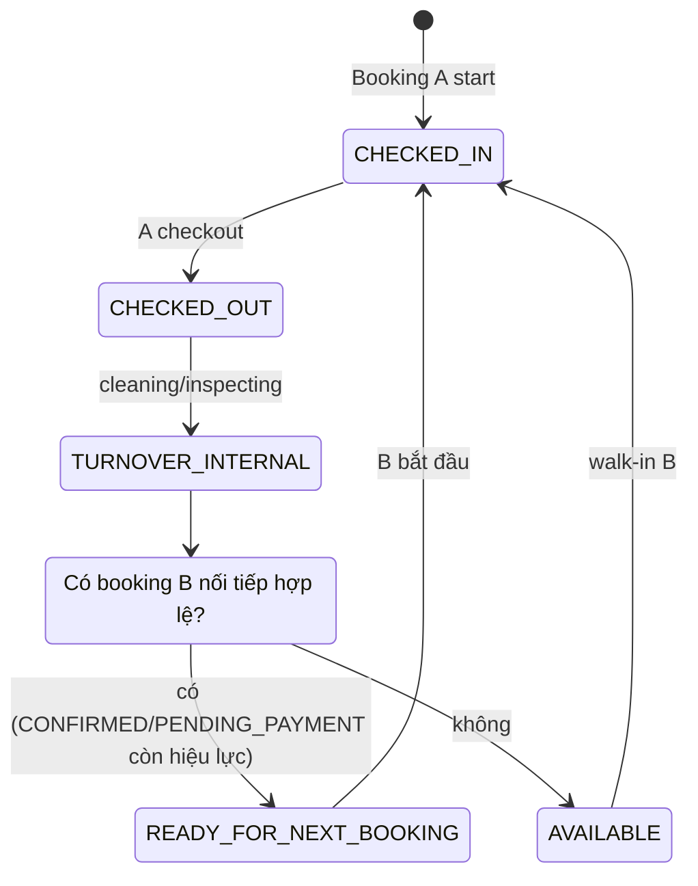
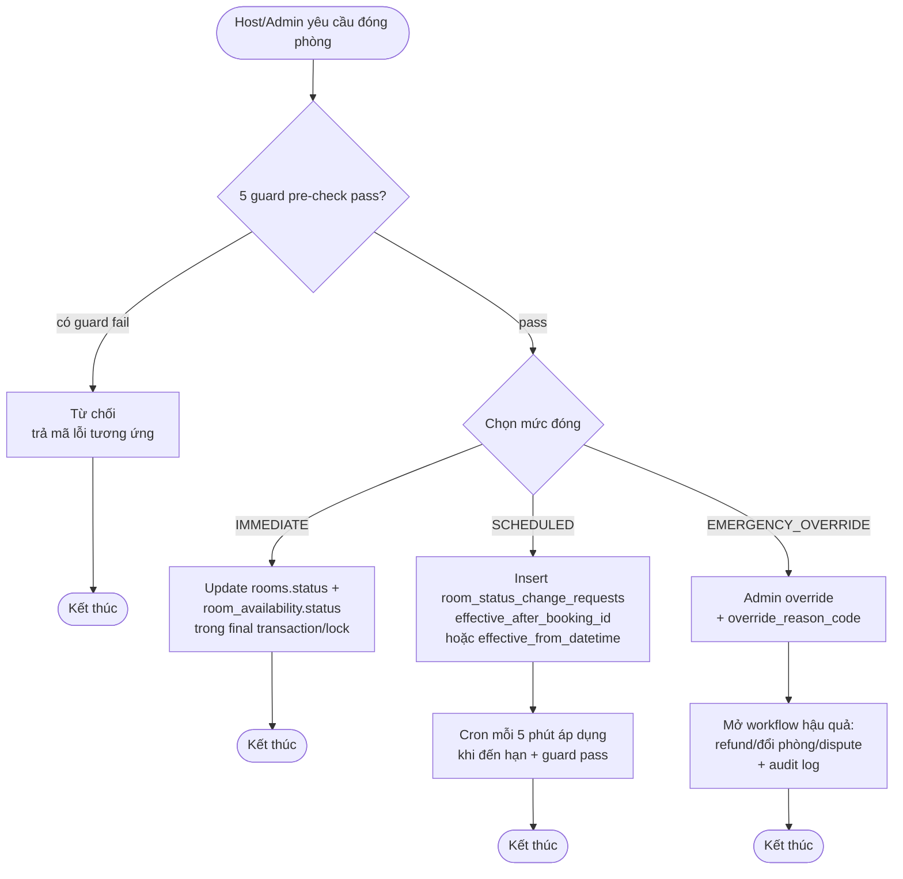

# Room Service — Availability theo giờ, Guard đóng phòng, Access Delivery Implementation Plan

> **For agentic workers:** REQUIRED SUB-SKILL: Use superpowers:subagent-driven-development (recommended) or superpowers:executing-plans to implement this plan task-by-task. Steps use checkbox (`- [ ]`) syntax for tracking.

**Goal:** Cập nhật tài liệu Room Service, thêm SQL schema minh họa, mermaid ERD và state machine mới, để 4 nghiệp vụ trong spec được mô tả nhất quán: (1) `HOURLY` không tạo khoảng trống giả khi turnover, (2) guard 5 bước cho `OPEN/AVAILABLE -> CLOSED`, (3) `access_mode` tách khỏi `self_checkin_enabled` và `SMARTLOCK_DEVICE`, (4) bảo mật `OWNER_SHARED_CODE` như secret thật.

**Architecture:** Repo hiện chỉ chứa tài liệu Markdown. Plan này **không tạo code service**, **không tạo test**, **không phụ thuộc ORM**. Mọi thay đổi là tài liệu + SQL schema (DDL) + mermaid ERD/state diagram, đặt tại các file `.md` hiện có và 1 file SQL mới.

**Tech Stack:** Markdown, SQL (PostgreSQL dialect), Mermaid.

**Spec tham chiếu:** [docs/superpowers/specs/2026-06-04-room-service-availability-access-design.md](../specs/2026-06-04-room-service-availability-access-design.md)

**Quy tắc chung cho mọi task:**
- Giữ nguyên code block SQL/mermaid/TypeScript hiện có; chỉ thêm, không xóa trừ khi task yêu cầu.
- Khi thêm cột/bảng mới, đặt comment `-- MINH HOA, KHONG PHAI MIGRATION CHOT` ngay sau dòng định nghĩa.
- Không đổi ngôn ngữ tiếng Việt sang tiếng Anh và ngược lại ở phần mô tả.
- Mỗi task kết thúc bằng 1 commit, theo format `git commit -m "<type>: <pham vi>"`.

---

## File Structure

Các file sẽ tạo mới hoặc sửa:

| File | Trách nhiệm |
|---|---|
| `docs/superpowers/specs/2026-06-04-room-service-availability-access-design.md` | Spec đã được duyệt (giữ nguyên, không sửa) |
| `docs/superpowers/plans/2026-06-04-room-service-availability-access.md` | Plan này |
| `db/schema/2026-06-04-room-service-availability-access.sql` | SQL DDL minh họa cho schema bổ sung (mới) |
| `db/erd/room-service-availability-access.mmd` | Mermaid ERD mới cho access delivery |
| `RoomAvailable.md` | Bổ sung rule DAILY/HOURLY, turnover window, bất biến |
| `SynchronizedBookingSystem.md` | Bổ sung guard 5 bước, 3 mức close, final-check trong transaction |
| `AutoCheckinFlow.md` | Bổ sung `access_mode`, `self_checkin_enabled`, security model cho owner-provided secret |
| `Mermaid.md` | Thêm state diagram HOURLY turnover và 3 mức close |

Các file chỉ đọc tham khảo:
- `CLAUDE.md` (đã chứa tổng quan schema)
- `Readme.md` (mục lục tổng)

---

## Task 1: Tạo thư mục và file placeholder cho output

**Files:**
- Create: `db/schema/.gitkeep`
- Create: `db/erd/.gitkeep`

- [ ] **Step 1: Tạo thư mục**

```bash
cd d:/taiLieuHoc/databaseHomi
mkdir -p db/schema db/erd
touch db/schema/.gitkeep db/erd/.gitkeep
```

- [ ] **Step 2: Commit**

```bash
cd d:/taiLieuHoc/databaseHomi
git add db/schema/.gitkeep db/erd/.gitkeep
git commit -m "chore: scaffold db/schema and db/erd directories"
```

---

## Task 2: Tạo file SQL schema minh họa

**Files:**
- Create: `db/schema/2026-06-04-room-service-availability-access.sql`

- [ ] **Step 1: Tạo file với nội dung sau**

```sql
-- File: db/schema/2026-06-04-room-service-availability-access.sql
-- Muc dich: Minh hoa schema bo sung theo spec
--           docs/superpowers/specs/2026-06-04-room-service-availability-access-design.md
-- LUU Y: File nay la minh hoa, KHONG PHAI migration that.
--        Moi block CREATE TABLE/ALTER TABLE deu co comment
--        "-- MINH HOA, KHONG PHAI MIGRATION CHOT" ngay sau dinh nghia.

BEGIN;

-- =============================================================
-- 1) Bo sung cot vao rooms
-- =============================================================
-- MINH HOA, KHONG PHAI MIGRATION CHOT
ALTER TABLE rooms
ADD COLUMN IF NOT EXISTS access_mode access_mode_enum
    NOT NULL DEFAULT 'MANUAL_HANDOVER',
ADD COLUMN IF NOT EXISTS self_checkin_enabled BOOLEAN
    NOT NULL DEFAULT false,
ADD COLUMN IF NOT EXISTS access_visible_lead_minutes SMALLINT
    NULL,
ADD CONSTRAINT rooms_access_lead_range_chk
    CHECK (access_visible_lead_minutes IS NULL
           OR access_visible_lead_minutes BETWEEN 0 AND 1440);

-- MINH HOA, KHONG PHAI MIGRATION CHOT
COMMENT ON COLUMN rooms.access_mode IS
    'MANUAL_HANDOVER | OWNER_SHARED_CODE | SMARTLOCK_DEVICE';
COMMENT ON COLUMN rooms.self_checkin_enabled IS
    'Co cho phep guest tu nhan phong qua app';
COMMENT ON COLUMN rooms.access_visible_lead_minutes IS
    'Cua so hien thi secret (phut). NULL = dung mac dinh theo access_mode. Clamp [0, 1440]';

-- =============================================================
-- 2) Bang room_access_configs
--    Luu source secret do owner/host cau hinh o cap room
-- =============================================================
-- MINH HOA, KHONG PHAI MIGRATION CHOT
CREATE TABLE room_access_configs (
    id                       UUID PRIMARY KEY DEFAULT gen_random_uuid(),
    room_id                  UUID NOT NULL REFERENCES rooms(id) ON DELETE CASCADE,
    access_mode              access_mode_enum NOT NULL,
    -- Source secret (ciphertext) cho OWNER_SHARED_CODE
    source_secret_encrypted  TEXT NULL,
    source_secret_iv         VARCHAR(24) NULL,
    source_secret_tag        VARCHAR(32) NULL,
    source_secret_version    INT NOT NULL DEFAULT 1,
    -- Huong dan nhan phong (public)
    public_checkin_guide     TEXT NULL,
    -- Vi tri lockbox/key safe (co the encrypt)
    pickup_location_encrypted TEXT NULL,
    pickup_location_iv       VARCHAR(24) NULL,
    pickup_location_tag      VARCHAR(32) NULL,
    -- Smartlock device (chi dung khi access_mode = SMARTLOCK_DEVICE)
    smartlock_device_id      VARCHAR(100) NULL,
    smartlock_provider       VARCHAR(50) NULL,
    -- Audit
    created_at               TIMESTAMPTZ NOT NULL DEFAULT now(),
    updated_at               TIMESTAMPTZ NOT NULL DEFAULT now(),
    created_by               UUID NULL,
    updated_by               UUID NULL,
    CONSTRAINT room_access_configs_one_per_room UNIQUE (room_id)
);

-- MINH HOA, KHONG PHAI MIGRATION CHOT
COMMENT ON TABLE room_access_configs IS
    'Cau hinh nguon truy cap phong. Tach khoi metadata cong khai cua phong.';

-- MINH HOA, KHONG PHAI MIGRATION CHOT
CREATE INDEX idx_room_access_configs_mode
    ON room_access_configs (access_mode)
    WHERE access_mode IN ('OWNER_SHARED_CODE', 'SMARTLOCK_DEVICE');

-- =============================================================
-- 3) Bang booking_access_deliveries
--    Luu snapshot delivery da phat hanh cho guest theo booking
-- =============================================================
-- MINH HOA, KHONG PHAI MIGRATION CHOT
CREATE TABLE booking_access_deliveries (
    id                        UUID PRIMARY KEY DEFAULT gen_random_uuid(),
    booking_id                UUID NOT NULL REFERENCES bookings(id) ON DELETE CASCADE,
    room_access_config_id     UUID NOT NULL REFERENCES room_access_configs(id),
    access_mode               access_mode_enum NOT NULL,
    -- Delivery secret (ciphertext) cho OWNER_SHARED_CODE
    delivery_secret_encrypted TEXT NULL,
    delivery_secret_iv        VARCHAR(24) NULL,
    delivery_secret_tag       VARCHAR(32) NULL,
    -- Source version tai thoi diem phat hanh
    source_secret_version     INT NOT NULL,
    -- Cua so hien thi
    visible_from              TIMESTAMPTZ NOT NULL,
    visible_until             TIMESTAMPTZ NOT NULL,
    -- Trang thai phat hanh
    is_revoked                BOOLEAN NOT NULL DEFAULT false,
    revoked_at                TIMESTAMPTZ NULL,
    revoked_reason            VARCHAR(100) NULL,
    -- Audit
    first_viewed_at           TIMESTAMPTZ NULL,
    view_count                INT NOT NULL DEFAULT 0,
    created_at                TIMESTAMPTZ NOT NULL DEFAULT now(),
    CONSTRAINT booking_access_deliveries_one_per_booking UNIQUE (booking_id)
);

-- MINH HOA, KHONG PHAI MIGRATION CHOT
COMMENT ON TABLE booking_access_deliveries IS
    'Snapshot delivery secret da phat hanh cho 1 booking cu the.';

-- MINH HOA, KHONG PHAI MIGRATION CHOT
CREATE INDEX idx_booking_access_deliveries_window
    ON booking_access_deliveries (visible_from, visible_until)
    WHERE is_revoked = false;

-- =============================================================
-- 4) Bang access_delivery_audit_logs
--    Log moi lan guest app/doc server xem/truy cap
-- =============================================================
-- MINH HOA, KHONG PHAI MIGRATION CHOT
CREATE TABLE access_delivery_audit_logs (
    id           UUID PRIMARY KEY DEFAULT gen_random_uuid(),
    delivery_id  UUID NOT NULL REFERENCES booking_access_deliveries(id) ON DELETE CASCADE,
    actor_type   VARCHAR(20) NOT NULL,   -- GUEST | STAFF | SYSTEM
    actor_id     UUID NULL,
    action       VARCHAR(40) NOT NULL,   -- VIEW | DECRYPT | COPY | SCREENSHOT
    result       VARCHAR(20) NOT NULL,   -- SUCCESS | DENIED | ERROR
    ip_address   INET NULL,
    user_agent   TEXT NULL,
    occurred_at  TIMESTAMPTZ NOT NULL DEFAULT now(),
    metadata     JSONB NULL
);

-- MINH HOA, KHONG PHAI MIGRATION CHOT
CREATE INDEX idx_access_audit_delivery_time
    ON access_delivery_audit_logs (delivery_id, occurred_at DESC);

-- =============================================================
-- 5) Bang room_status_change_requests
--    Ho tro 3 muc dong phong
-- =============================================================
-- MINH HOA, KHONG PHAI MIGRATION CHOT
CREATE TABLE room_status_change_requests (
    id                  UUID PRIMARY KEY DEFAULT gen_random_uuid(),
    room_id             UUID NOT NULL REFERENCES rooms(id) ON DELETE CASCADE,
    requested_by        UUID NOT NULL,
    request_type        VARCHAR(20) NOT NULL,    -- IMMEDIATE | SCHEDULED | EMERGENCY_OVERRIDE
    from_status         VARCHAR(20) NOT NULL,
    to_status           VARCHAR(20) NOT NULL,
    reason              TEXT NULL,
    -- Chi dung khi request_type = SCHEDULED
    effective_after_booking_id  UUID NULL REFERENCES bookings(id),
    effective_from_datetime     TIMESTAMPTZ NULL,
    -- Chi dung khi request_type = EMERGENCY_OVERRIDE
    override_reason_code        VARCHAR(40) NULL,
    override_workflow_opened    BOOLEAN NOT NULL DEFAULT false,
    -- Trang thai xu ly
    status              VARCHAR(20) NOT NULL DEFAULT 'PENDING',
    -- PENDING | APPROVED | REJECTED | EXECUTED | FAILED
    executed_at         TIMESTAMPTZ NULL,
    failure_reason      TEXT NULL,
    -- Audit
    created_at          TIMESTAMPTZ NOT NULL DEFAULT now(),
    updated_at          TIMESTAMPTZ NOT NULL DEFAULT now()
);

-- MINH HOA, KHONG PHAI MIGRATION CHOT
CREATE INDEX idx_room_status_change_req_room_status
    ON room_status_change_requests (room_id, status);

-- MINH HOA, KHONG PHAI MIGRATION CHOT
CREATE INDEX idx_room_status_change_req_effective
    ON room_status_change_requests (effective_from_datetime)
    WHERE request_type = 'SCHEDULED' AND status = 'APPROVED';

COMMIT;
```

- [ ] **Step 2: Commit**

```bash
cd d:/taiLieuHoc/databaseHomi
git add db/schema/2026-06-04-room-service-availability-access.sql
git commit -m "feat(db): add access delivery and room status change schema"
```

---

## Task 3: Tạo mermaid ERD mới

**Files:**
- Create: `db/erd/room-service-availability-access.mmd`

- [ ] **Step 1: Tạo file với nội dung sau**

```mmd
%% File: db/erd/room-service-availability-access.mmd
%% Muc dich: ERD minh hoa cho access delivery va room status change
%% Xem them: docs/superpowers/specs/2026-06-04-room-service-availability-access-design.md

erDiagram
    ROOMS ||--o| ROOM_ACCESS_CONFIGS : "has one config"
    ROOMS ||--o{ ROOM_STATUS_CHANGE_REQUESTS : "history"
    ROOM_ACCESS_CONFIGS ||--o{ BOOKING_ACCESS_DELIVERIES : "issues delivery"
    BOOKINGS ||--|| BOOKING_ACCESS_DELIVERIES : "1-1"
    BOOKING_ACCESS_DELIVERIES ||--o{ ACCESS_DELIVERY_AUDIT_LOGS : "viewed by"
    ROOM_STATUS_CHANGE_REQUESTS }o--|| BOOKINGS : "effective_after"

    ROOMS {
        uuid id PK
        varchar rental_type
        varchar access_mode
        boolean self_checkin_enabled
        smallint access_visible_lead_minutes
        varchar smartlock_device_id
    }

    ROOM_ACCESS_CONFIGS {
        uuid id PK
        uuid room_id FK
        varchar access_mode
        text source_secret_encrypted
        varchar source_secret_iv
        varchar source_secret_tag
        int source_secret_version
        text public_checkin_guide
        text pickup_location_encrypted
        varchar smartlock_device_id
        varchar smartlock_provider
        timestamptz created_at
        timestamptz updated_at
    }

    BOOKINGS {
        uuid id PK
        uuid room_id FK
        uuid guest_id
        varchar status
        date check_in_date
        time check_in_time
        date check_out_date
        time check_out_time
    }

    BOOKING_ACCESS_DELIVERIES {
        uuid id PK
        uuid booking_id FK
        uuid room_access_config_id FK
        varchar access_mode
        text delivery_secret_encrypted
        varchar delivery_secret_iv
        varchar delivery_secret_tag
        int source_secret_version
        timestamptz visible_from
        timestamptz visible_until
        boolean is_revoked
        timestamptz first_viewed_at
        int view_count
    }

    ACCESS_DELIVERY_AUDIT_LOGS {
        uuid id PK
        uuid delivery_id FK
        varchar actor_type
        uuid actor_id
        varchar action
        varchar result
        inet ip_address
        text user_agent
        timestamptz occurred_at
        jsonb metadata
    }

    ROOM_STATUS_CHANGE_REQUESTS {
        uuid id PK
        uuid room_id FK
        uuid requested_by
        varchar request_type
        varchar from_status
        varchar to_status
        text reason
        uuid effective_after_booking_id FK
        timestamptz effective_from_datetime
        varchar override_reason_code
        boolean override_workflow_opened
        varchar status
        timestamptz executed_at
        text failure_reason
    }
```

- [ ] **Step 2: Commit**

```bash
cd d:/taiLieuHoc/databaseHomi
git add db/erd/room-service-availability-access.mmd
git commit -m "feat(erd): add mermaid ERD for access delivery and status change"
```

---

## Task 4: Bổ sung section vào RoomAvailable.md

**Files:**
- Modify: `RoomAvailable.md`

- [ ] **Step 1: Mở file `RoomAvailable.md` và tìm dòng chứa `## 6. 4 Edge Cases Đặc biệt (HOURLY)`**

Dùng Read tool để xác định đúng dòng.

- [ ] **Step 2: Thêm section mới ngay sau dòng `---` đầu tiên của "## 6. 4 Edge Cases..."**

Chèn ngay trước heading `## 6.` nội dung sau (kết thúc bằng `---` để tách):

```markdown
## 5b. Rule Availability Sau Checkout — DAILY vs HOURLY

> Tham chiếu spec: [docs/superpowers/specs/2026-06-04-room-service-availability-access-design.md](../superpowers/specs/2026-06-04-room-service-availability-access-design.md), mục 3.

### Quy tắc cho `DAILY`

```text
CHECKED_IN -> CHECKED_OUT -> CLEANING -> INSPECTING -> AVAILABLE
```

- Sau khi khách checkout, phòng không được quay lại `AVAILABLE` ngay.
- Công thức: `available_at = actual_checkout_at + cleaning_buffer + inspecting_buffer`.
- Phù hợp với thuê theo ngày: ưu tiên chất lượng bàn giao, giảm rủi ro đón khách khi phòng chưa sẵn sàng.

### Quy tắc cho `HOURLY`

Hỗ trợ **back-to-back booking** mà không tạo khoảng trống giả:

- Sau `CHECKED_OUT`, phòng vào turnover window (`CLEANING` / `INSPECTING` / trạng thái nội bộ tương đương).
- Nếu **không có booking kế tiếp hợp lệ** (booking ở `CONFIRMED` hoặc `PENDING_PAYMENT` còn hiệu lực) chồng lấn khoảng trống, khi turnover xong phòng trở lại `AVAILABLE`.
- Nếu **đã có booking kế tiếp hợp lệ** nối tiếp, phòng **không được public `AVAILABLE` ở giữa**.

### Ba mốc thời gian cần chuẩn hóa

- `actual_checkout_at` — thời điểm khách thực tế checkout.
- `turnover_ready_at` — thời điểm dọn dẹp tối thiểu hoàn tất.
- `public_available_at` — thời điểm slot được mở bán công khai.

Với `DAILY`: `public_available_at = turnover_ready_at` hoặc sau `INSPECTING`.
Với `HOURLY`:
- nếu có booking nối tiếp hợp lệ: `public_available_at = null` cho khoảng giữa.
- nếu không có: `public_available_at = turnover_ready_at`.

### Bất biến quan trọng

> Trong mô hình `HOURLY`, một phòng có thể không có khách bên trong nhưng vẫn không được public `AVAILABLE`, vì nó đang ở turnover window dành cho **booking kế tiếp đã có giữ chỗ hợp lệ** (`CONFIRMED` hoặc `PENDING_PAYMENT` còn nằm trong payment window).

Bất biến này phải phản ánh nhất quán ở:
- room state
- inventory query
- app search result
- admin UI

Áp dụng hẹp: bất biến chỉ chặn việc public `AVAILABLE` ở khoảng giữa. Nếu khoảng trống thật sự không có booking kế tiếp hợp lệ chồng lấn, phòng vẫn có thể quay lại `AVAILABLE` theo rule.

---
```

- [ ] **Step 3: Commit**

```bash
cd d:/taiLieuHoc/databaseHomi
git add RoomAvailable.md
git commit -m "docs(room): add DAILY/HOURLY availability rules and turnover window"
```

---

## Task 5: Bổ sung section guard vào SynchronizedBookingSystem.md

**Files:**
- Modify: `SynchronizedBookingSystem.md`

- [ ] **Step 1: Mở file `SynchronizedBookingSystem.md` và tìm dòng `## 5. Đồng Bộ Theo Sự Kiện`**

- [ ] **Step 2: Chèn section mới ngay trước `## 5.`**

```markdown
## 4b. Guard `OPEN/AVAILABLE -> CLOSED` và 3 mức đóng phòng

> Tham chiếu spec: [docs/superpowers/specs/2026-06-04-room-service-availability-access-design.md](../superpowers/specs/2026-06-04-room-service-availability-access-design.md), mục 4.

### Mục tiêu

Ngăn thao tác vận hành thủ công phá vỡ quyền đã được giữ/xác lập cho khách. Không đóng phòng nếu việc đó có thể làm mất quyền sử dụng phòng của:
- booking `PENDING_PAYMENT`
- slot có `on_hold_units > 0` chồng lấn khoảng đóng
- booking `CONFIRMED`
- khách đang `CHECKED_IN`
- vòng đời turnover chưa kết thúc

### 5 guard bắt buộc

| # | Guard | Điều kiện fail | Mã lỗi đề xuất |
|---|-------|----------------|-----------------|
| 1 | Không có `on_hold_units` chồng lấn khoảng đóng | `on_hold_units > 0` ở slot/date ánh xạ | `ROOM_CLOSE_REJECTED_PENDING_HOLD_EXISTS` |
| 2 | Không có booking `PENDING_PAYMENT` chưa hết hạn | còn booking trong payment window | `ROOM_CLOSE_REJECTED_PENDING_PAYMENT` |
| 3 | Không có booking `CONFIRMED` chồng lấn | có `CONFIRMED` chồng khoảng | `ROOM_CLOSE_REJECTED_CONFIRMED_OVERLAP` |
| 4 | Không có `CHECKED_IN` / turnover đang chạy | có khách ở hoặc turnover chưa xong | `ROOM_CLOSE_REJECTED_ACTIVE_STAY` |
| 5 | Final check trong transaction/lock | phát hiện race với payment/booking | `ROOM_CLOSE_RACE_DETECTED` (retry) |

Guard 1 chỉ chặn khi `on_hold_units` ánh xạ đúng slot/khoảng thời gian mà thao tác đóng nhắm tới, không phải mọi `on_hold_units` của phòng.

### 3 mức đóng phòng

| Mức | Khi nào dùng | Cách xử lý |
|-----|--------------|------------|
| `IMMEDIATE` | Tất cả 5 guard pass | Update `rooms.status` + `room_availability.status` ngay |
| `SCHEDULED` | Còn booking/hold hợp lệ | Tạo `room_status_change_requests` với `effective_after_booking_id` hoặc `effective_from_datetime`; hệ thống tự apply khi đến hạn |
| `EMERGENCY_OVERRIDE` | Lý do an toàn/pháp lý/sự cố nghiêm trọng | Admin override, **phải** mở workflow hậu quả: refund/đổi phòng/dispute, audit log đầy đủ |

### Khác biệt DAILY vs HOURLY

- `DAILY`: guard kiểm tra theo khoảng ngày lưu trú.
- `HOURLY`: guard **phải** kiểm tra chồng lấn ở mức `datetime`. Không đủ nếu chỉ check theo `date`.

### Bất biến cần ghi nhận

> Nếu tồn tại `PENDING_PAYMENT`, `on_hold_units > 0` chồng lấn, `CONFIRMED`, `CHECKED_IN`, hoặc turnover chưa kết thúc trên khoảng thời gian bị ảnh hưởng, hệ thống không được phép chuyển `OPEN/AVAILABLE -> CLOSED` bằng thao tác vận hành thông thường.

> Mọi thao tác `OPEN/AVAILABLE -> CLOSED` phải được xác nhận lại trong final transaction/lock để tránh race với payment webhook hoặc booking confirmation.

---
```

- [ ] **Step 3: Commit**

```bash
cd d:/taiLieuHoc/databaseHomi
git add SynchronizedBookingSystem.md
git commit -m "docs(sync): add 5-guard close workflow and 3 close levels"
```

---

## Task 6: Bổ sung `access_mode` và security model vào AutoCheckinFlow.md

**Files:**
- Modify: `AutoCheckinFlow.md`

- [ ] **Step 1: Mở file `AutoCheckinFlow.md` tìm dòng `## 3. Schema Database — Booking Service`**

- [ ] **Step 2: Chèn section mới ngay trước `## 3.`**

```markdown
## 2b. Mô hình domain: `access_mode` và `self_checkin_enabled`

> Tham chiếu spec: [docs/superpowers/specs/2026-06-04-room-service-availability-access-design.md](../superpowers/specs/2026-06-04-room-service-availability-access-design.md), mục 2 và mục 5.

### 3 trục độc lập

1. `rental_type` — `DAILY` / `HOURLY` / `BOTH`
2. `access_mode` — `MANUAL_HANDOVER` / `OWNER_SHARED_CODE` / `SMARTLOCK_DEVICE`
3. `self_checkin_enabled` — `true` / `false`

3 trục này **không được gộp** vào một enum duy nhất.

### Mapping theo nhóm owner

| Nhóm owner | Access mode khả dụng |
|------------|---------------------|
| Truyền thống | `MANUAL_HANDOVER`, `OWNER_SHARED_CODE` |
| Tự động hóa | `SMARTLOCK_DEVICE` (ưu tiên), fallback `OWNER_SHARED_CODE` |

### Quy tắc domain cốt lõi

1. `self_checkin_enabled = true` không bắt buộc phải có `smartlock_device_id`.
2. `access_mode = SMARTLOCK_DEVICE` **bắt buộc** có `smartlock_device_id`.
3. `access_mode = OWNER_SHARED_CODE` thì app chỉ phân phối thông tin do owner cung cấp, không sinh mã động.
4. `rental_type` và `access_mode` là hai trục độc lập.

### Bảo mật theo `access_mode`

#### `SMARTLOCK_DEVICE`

- `code_plaintext` không được lưu trong DB.
- `MASTER_ENCRYPTION_KEY` chỉ nằm trong KMS/Vault.
- `smartlock_device_id` không lộ trong API client-facing.
- Mã có `valid_from` / `valid_until`, phải revoke được khi checkout/cancel/hết hạn.
- Mọi event mở khóa ghi log cho audit và dispute.

#### `OWNER_SHARED_CODE`

Dù không phải mã động, thông tin này vẫn là secret vận hành:

1. Không lưu plaintext ở trường mô tả công khai của room/property.
2. Lưu trong bảng `room_access_configs` (source) và `booking_access_deliveries` (delivery).
3. Mã hóa at rest bằng application-level encryption hoặc KMS-backed envelope encryption.
4. Chỉ giải mã và trả về cho đúng guest, đúng booking, đúng cửa sổ thời gian.
5. Mọi lần xem phải có audit log trong `access_delivery_audit_logs`.
6. Owner được rotate secret mà không sửa lịch sử booking cũ.

### Phân biệt source secret và delivery secret

- **Source secret**: thông tin owner cấu hình ở cấp room/property (mã lockbox mặc định, hướng dẫn lấy chìa...).
- **Delivery secret**: snapshot thực tế phát hành cho 1 booking cụ thể.

Tách hai lớp giúp:
- rotate source mà không phá audit của booking cũ.
- biết chính xác guest nào đã xem thông tin nào, lúc nào.

### Cửa sổ hiển thị

Mặc định theo `access_mode` + owner override trong khoảng `[0, 24h]`:

- Mặc định `SMARTLOCK_DEVICE` / `OWNER_SHARED_CODE`: `60 phút trước check-in`.
- Mỗi phòng có `access_visible_lead_minutes` (nullable). `null` = dùng mặc định; có giá trị = dùng giá trị đó, **luôn clamp `[0, 1440]`**.
- Backend validate, từ chối kèm `ACCESS_LEAD_MINUTES_OUT_OF_RANGE` nếu vượt khoảng.
- Công thức: `visible_from = check_in_at - lead_minutes`; `visible_until = checkout_at + buffer_minutes`.

### Bất biến bảo mật

> Self check-in không đồng nghĩa với Smartlock.

> `OWNER_SHARED_CODE` là mô hình phân phối secret có kiểm soát, không phải text note công khai của phòng.

> `SMARTLOCK_DEVICE` và `OWNER_SHARED_CODE` phải có cơ chế lưu trữ, hiển thị, audit, và rotation riêng.

---
```

- [ ] **Step 3: Commit**

```bash
cd d:/taiLieuHoc/databaseHomi
git add AutoCheckinFlow.md
git commit -m "docs(checkin): add access_mode and security model for owner shared code"
```

---

## Task 7: Bổ sung 2 mermaid diagram vào Mermaid.md

**Files:**
- Modify: `Mermaid.md`

- [ ] **Step 1: Mở file `Mermaid.md` cuộn xuống cuối file**

- [ ] **Step 2: Append 2 diagram mới**

```markdown

## Phụ lục A — State Diagram: HOURLY Turnover Window

> Mục đích: minh họa bất biến "không public AVAILABLE khi đã có booking kế tiếp hợp lệ".



## Phụ lục B — Flowchart: 3 mức đóng phòng


```

- [ ] **Step 3: Commit**

```bash
cd d:/taiLieuHoc/databaseHomi
git add Mermaid.md
git commit -m "docs(mermaid): add HOURLY turnover state and 3-level close flow"
```

---

## Task 8: Rà soát liên kết chéo giữa các file

**Files:**
- Modify (nếu cần): `RoomAvailable.md`, `SynchronizedBookingSystem.md`, `AutoCheckinFlow.md`, `Mermaid.md`, `Readme.md`

- [ ] **Step 1: Kiểm tra Readme.md có mục lục trỏ đến các file đã sửa không**

```bash
cd d:/taiLieuHoc/databaseHomi
grep -n "RoomAvailable\|SynchronizedBookingSystem\|AutoCheckinFlow\|Mermaid" Readme.md
```

- [ ] **Step 2: Nếu mục lục Readme.md có anchor, cập nhật nội dung phần anchor để phản ánh section mới**

Ví dụ, nếu Readme.md có dòng kiểu:
- `[Mô hình Availability theo giờ](#)` → thêm nội dung tóm tắt: "DAILY đi qua cleaning/inspecting; HOURLY không public AVAILABLE giữa 2 booking nối tiếp. Chi tiết ở RoomAvailable.md mục 5b."

Nếu Readme.md không có mục lục chi tiết, bỏ qua bước này và ghi chú "Readme.md không cần sửa".

- [ ] **Step 3: Kiểm tra liên kết spec từ các file đã sửa**

```bash
cd d:/taiLieuHoc/databaseHomi
grep -n "2026-06-04-room-service-availability-access-design" RoomAvailable.md SynchronizedBookingSystem.md AutoCheckinFlow.md
```

Nếu thiếu link ở file nào, thêm link tham chiếu spec ngay đầu file đó.

- [ ] **Step 4: Commit (chỉ khi có thay đổi)**

```bash
cd d:/taiLieuHoc/databaseHomi
git add Readme.md
git commit -m "docs(readme): cross-link new spec and sections"
```

Nếu không có thay đổi, ghi `git status` xác nhận working tree sạch.

---

## Task 9: Cập nhật CLAUDE.md (mục lục liên kết)

**Files:**
- Modify: `CLAUDE.md`

- [ ] **Step 1: Tìm phần mục lục hoặc "Mục lục" trong `CLAUDE.md`**

- [ ] **Step 2: Thêm 1 dòng tham chiếu vào spec mới**

Ví dụ, nếu CLAUDE.md có mục lục, thêm dòng:

```markdown
- [Spec bổ sung: Availability theo giờ, Guard đóng phòng, Access Delivery](docs/superpowers/specs/2026-06-04-room-service-availability-access-design.md)
```

- [ ] **Step 3: Commit**

```bash
cd d:/taiLieuHoc/databaseHomi
git add CLAUDE.md
git commit -m "docs(claude): link new availability/access spec from index"
```

---

## Task 10: Tổng kết và commit cuối

- [ ] **Step 1: Kiểm tra working tree sạch**

```bash
cd d:/taiLieuHoc/databaseHomi
git status
```

Expected: working tree clean, tất cả task đã commit.

- [ ] **Step 2: Liệt kê các file đã thay đổi**

```bash
cd d:/taiLieuHoc/databaseHomi
git log --oneline -10
```

- [ ] **Step 3: Xác nhận tiêu chí thành công (từ spec mục 8)**

Tự check trên giấy:
- [ ] Rule HOURLY turnover + bất biến "không public AVAILABLE" có mặt ở RoomAvailable.md mục 5b.
- [ ] 5 guard + 3 mức close có mặt ở SynchronizedBookingSystem.md mục 4b.
- [ ] `access_mode` + security model `OWNER_SHARED_CODE` có mặt ở AutoCheckinFlow.md mục 2b.
- [ ] 2 mermaid diagram mới có mặt ở Mermaid.md Phụ lục A và B.
- [ ] Schema SQL ở `db/schema/2026-06-04-room-service-availability-access.sql`.
- [ ] ERD ở `db/erd/room-service-availability-access.mmd`.
- [ ] Spec có trong mục lục CLAUDE.md.

Nếu bất kỳ tiêu chí nào fail, mở task tương ứng và sửa trước khi báo cáo.

---

## Ghi chú khi thực thi

- Mỗi task là 1 commit. Không gộp nhiều task vào 1 commit.
- Nếu 1 task fail (ví dụ: file không tồn tại, conflict khi edit), dừng lại và sửa trước khi đi tiếp. Không skip.
- Không thêm test, không thêm ORM, không scaffold project NestJS. Plan này có phạm vi tài liệu + SQL + ERD.
- Nếu user yêu cầu mở rộng phạm vi (ví dụ: thêm code thật), tạo plan mới, không mở rộng plan này.
